# 1. Aspectos principales del desarrollo en web
---

## El desarrollo Web 🌐

Para el diseño y desarrollo web existen diferentes lenguajes que nos permiten llevar el diseño en papel (Sketch) a una estructura que pueda interpretar un computador.

El desarrollo web es un proceso de crear, construir y mantener sitios web y aplicaciones web. Para poder llevar a cabo este proceso se utilizan tecnologías, lenguajes de programación y herramientas para diseñar, desarrollar y desplegar sitios web funcionales y atractivos.

El desarrollo web implica una amplia gama de tecnologías, lenguajes y conceptos. Para esto, el trabajo se divide en roles específicos permitiendo a los profesionales especializarse en áreas particulares y desarrollar experiencia en ese campo. Los desarrolladores Front-End se enfocan en la interfaz de usuario y la experiencia del usuario, mientras que los desarrolladores Back-End se especializan en la lógica del servidor y la gestión de datos. Esta especialización les permite perfeccionar sus habilidades y conocimientos en áreas específicas. Al tener roles especializados, cada aspecto del desarrollo puede recibir atención y cuidado adecuados. Esto conduce a un producto final de mejor calidad y facilita el mantenimiento a largo plazo de la aplicación web o el sitio web.

## Qué se entiende por desarrollo web

El desarrollo de web abarca varias áreas:
- **Diseño web:** es toda la parte de creación de la estructura, el diseño visual y la experiencia del usuario.
- **Programación web:** involucra la escritura de código para construir la página/sitio web. Para la estructura y la estética, se utilizan lenguajes de marcado como HTML y CSS, y para programar la interactividad, la gestión de datos y operaciones del lado del servidor se utilizan lenguajes de programación como Javascript, PHP, Python, entre otros.
- **Desarrollo front-end:** se enfoca en la parte del desarrollo web que tiene que ver con la implementación de la interfaz de usuario y la interacción de los usuarios con un sitio web o una aplicación web. Los desarrolladores front-end trabajan con tecnologías como HTML, CSS y JavaScript para crear la parte visual y funcional de un sitio web.
- **Desarrollo back-end:** se ocupa de la lógica y el funcionamiento detrás de escena de un sitio web o una aplicación web. Los desarrolladores back-end trabajan en la parte del servidor y se centran en la gestión de datos, el procesamiento de solicitudes y la implementación de la lógica de negocio.
- **Bases de datos:** las aplicaciones web suelen requerir el almacenamiento y recuperación de datos. Los desarrolladores web utilizan sistemas de gestión de bases de datos (SGBD) para diseñar y administrar la estructura de datos, realizar consultas y garantizar la integridad de la información.
- **Despliegue y mantenimiento:** una vez que el sitio web o aplicación web está desarrollado, debe ser implementado en un servidor para que esté accesible en Internet. Los desarrolladores web se encargan
de la configuración del servidor, el despliegue de los archivos y la gestión del mantenimiento y las actualizaciones del sitio web.

## Diferencias entre Front-End, Back-End y Fullstack 🛠

Front-End, Back-End y Fullstack son términos que se utilizan para describir diferentes roles y enfoques dentro del desarrollo web. **Cada uno de estos roles se enfoca en aspectos específicos del proceso de desarrollo y requiere habilidades y conocimientos especializados.** Algunos desarrolladores pueden especializarse en un área específica, mientras que otros pueden tener habilidades en ambos y desempeñar roles Fullstack.

La separación entre el desarrollo Front-End y Back-End existe debido a la naturaleza y las necesidades del desarrollo web, esto simplifica a la hora de crear y desarrollar un sitio o aplicación web.

### Funcionalidades 👨🏻‍💻

#### Front-End ⤴️

El Front-End se ocupa de todo lo que los usuarios ven y con lo que interactúan en un sitio web o aplicación. Esto incluye la estructura y el diseño de la página, la presentación visual utilizando HTML, CSS y JavaScript, la interacción con los elementos de la interfaz, y la optimización de la experiencia del usuario.

#### Back-end ⤵️

El Back-End se encarga de las funcionalidades y procesos detrás de la escena que permiten que un sitio web o aplicación funcione correctamente. Esto incluye la gestión de la base de datos, la comunicación con otros sistemas o servicios, el procesamiento de datos, la seguridad, la autenticación y la lógica del servidor.

### Roles 👨🏻‍💻

#### Front-end 🔼

Los **desarrolladores Front-End** se ocupan de la implementación del diseño, la estructura y la experiencia del usuario en el navegador. Utilizan tecnologías como HTML, CSS y JavaScript para crear y dar estilo a la interfaz de usuario, gestionar la interactividad y mejorar la usabilidad. Su objetivo principal es lograr una interfaz atractiva y fácil de usar para los usuarios finales.
Además de implementar la UI, el Front-End es responsable de la **experiencia de usuario (UX)** en el navegador, de **coordinar con Back-End la integración de APIs/servicios** (definiendo contratos y manejo de errores/estados) y de **garantizar accesibilidad, compatibilidad y rendimiento** (p. ej., criterios WCAG, soporte multi-dispositivo y optimización de carga). En el **proceso de desarrollo**, participa desde diseño (componentes y criterios de accesibilidad) hasta pruebas y despliegue (optimización y monitoreo del cliente).

#### Back-end 🔼

Los **desarrolladores Back-End** se encargan de construir y mantener la lógica del servidor, la base de datos y otros componentes que permiten el funcionamiento de una aplicación web. Utilizan lenguajes de programación como PHP, Python, Ruby, Java, entre otros, y se preocupan por la seguridad, el rendimiento, la
escalabilidad y la integridad de los datos.

Su enfoque principal es la implementación de la funcionalidad y la manipulación de los datos en el servidor.
Además de la lógica de negocio y datos, el Back-End es responsable de **diseñar y exponer APIs** consumidas por Front-End y terceros, **asegurar integridad, seguridad y rendimiento** (autenticación/autorización, protección OWASP, caching, escalabilidad) y **coordinar la integración** con Front-End y otros servicios.
En el **proceso de desarrollo**, define el modelo de dominio y contratos, implementa y prueba servicios, y monitorea en operación (logs, métricas, incidentes).

#### Fullstack 🔄

Un **desarrollador Fullstack** tiene habilidades tanto en el Front-End como en el Back-End, lo que les permite trabajar en todas las capas de una aplicación web. Son capaces de diseñar, desarrollar e implementar tanto la interfaz de usuario como la lógica del servidor. 

Los desarrolladores Fullstack pueden encargarse de todas las etapas del ciclo de desarrollo, desde la planificación y el diseño hasta la implementación y el despliegue. Tienen un conocimiento más amplio y una comprensión integral de todo el proceso de desarrollo web.

El Fullstack asume una **visión end-to-end: conecta Front-End y Back-End**, vela por la **coherencia de los contratos de API** y el cumplimiento de **requisitos no funcionales** (accesibilidad, compatibilidad, rendimiento y seguridad), y **coordina** entre diseño, desarrollo y operación para reducir fricciones. En el **proceso de desarrollo**, interviene en todas las fases, desde el descubrimiento y diseño técnico hasta pruebas integrales y despliegue.

## Qué es el lenguaje de marcación de hipertexto (HTML) *️⃣

**HTML** (HyperText Markup Language) es un **lenguaje de marcado utilizado paraestructurar y presentar el contenido de las páginas web**. Permite definir laestructura y el significado semántico de los elementos en una página webutilizando etiquetas.

HTML es el l**enguaje fundamental para la creación de páginas web** y permiteestructurar el contenido de manera semántica. Con el uso adecuado de etiquetasy elementos HTML, se pueden crear sitios web bien organizados, accesibles ycompatibles con múltiples dispositivos y navegadores.

Si imaginamos que nuestra página es una persona, HTML sería el esqueleto, y cada etiqueta, un hueso. HTML utiliza las etiquetas para crear elementos, como párrafos, títulos, etc. El conjunto de elementos HTML guardados en un mismo documento con extensión .html es una página. Y un conjunto de páginas relacionadas forman un sitio web.

**HTML se combina con CSS** (Cascading Style Sheets) para definir el aspecto y la presentación visual de una página web, y con JavaScript para agregar interactividad y funcionalidad dinámica.

Como la mayoría de los lenguajes, HTML ha ido evolucionando desde su creación en 1991, y existen diferentes versiones. La última versión (y la que usaremos nosotros) es HTML5. Es una versión muy eficiente y compatible con distintos navegadores y plataformas (PC de escritorio, portátiles, teléfonos inteligentes,
tabletas, etc.).

### Características y puntos importantes sobre HTML:

- HTML es un lenguaje de marcado, lo que significa que utiliza etiquetas para definir la estructura y el significado de los elementos en una página web. Cada etiqueta tiene un propósito específico y se utiliza para envolver el contenido y darle formato.
- HTML se utiliza para definir la estructura básica de una página web, como encabezados, párrafos, listas, tablas, formularios, imágenes y enlaces. Cada elemento se representa mediante una etiqueta HTML
correspondiente.

## El rol del Navegador 🖥

### Internet

Internet **es una red de computadoras que se encuentran interconectadas a nivel mundial para compartir información**. Se trata de una red de equipos de cálculo que se relacionan entre sí a través de la utilización de un lenguaje universal.

El concepto Internet tiene sus raíces en el idioma inglés y se encuentra conformado por el vocablo inter (que significa “entre”) y net (proveniente de network que quiere decir “red electrónica”). Es un término que siempre debe ser escrito en mayúscula ya que hace referencia a “La Red” (que conecta a las computadoras mundialmente mediante el protocolo TCP/IP) y sin un artículo que lo acompañe (el/la) para hacerle referencia.

### Navegador Web
El navegador web o navegador de internet es el **instrumento que permite a los usuarios de internet navegar o surfear entre las distintas páginas de sus sitios webs preferidos**. Se trata de un software que posee una interfaz gráfica compuesta básicamente de: botones de navegación, una barra de dirección, una
barra de estado (generalmente, en la parte inferior de la ventana) y la mayor parte, en el centro, que sirve para mostrar las páginas web a las que se accede.

Los principales navegadores web del mercado son:
- Microsoft Internet Explorer (actualmente Microsoft Edge)
- Firefox
- Google Chrome
- Opera
- Safari.

### Buscadores Web

Son los **programas dentro de un sitio o página web**, los cuales al ingresar palabras clave, operan dentro de la base de datos del mismo buscador y recopilan todas las páginas posibles, que contengan información relacionada con lo que se esté buscando.

Estos motores de búsqueda funcionan mediante el envío de “arañas” , las cuales son pequeños robots que se dedican a rastrear todos los sitios web a lo largo y ancho de Internet. Otro programa, llamado un indexador, a continuación, lee estos documentos y crea un índice basado en las palabras contenidas en cada documento. Cada motor de búsqueda utiliza un algoritmo propietario para crear sus índices tales que, idealmente, sólo los resultados significativos se devuelven para cada consulta.

## Qué es la W3C 🙋🏻‍♂️

Tim Berners-Lee, es el creador de la **World Wide Web (www)**, estableció el **Consortium World Wide Web (W3C)** en 1994 con el objetivo de asegurar el crecimiento continuo y a largo plazo de la Web.

Desde sus inicios, el **W3C** ha sido una comunidad internacional que incluye a diversas partes interesadas, como organizaciones miembros, personal dedicado a tiempo completo y el público en general. Todos ellos trabajan juntos para desarrollar **estándares web abiertos**.

El W3C es liderado por un director ejecutivo interino llamado Ralph Swick y cuenta con una junta directiva. La misión principal del Consorcio es llevar la web a su máximo potencial.

El **World Wide Web Consortium (W3C)** desarrolla estándares y pautas para ayudar a todos a construir una web basada en los **principios de accesibilidad, internacionalización, privacidad y seguridad**.

El **W3C** también se preocupa por **promover** la adopción de estos **estándares a nivel global**, trabajando con gobiernos, organizaciones y la comunidad en general para fomentar su implementación. Además, el Consorcio se dedica a la investigación y la educación, brindando recursos y documentación para ayudar a las personas a comprender y utilizar eficazmente los estándares web.

Algunos de los estándares más conocidos y ampliamente utilizados incluyen:

- **HTML (HyperText Markup Language):** Es el lenguaje de marcado estándar utilizado para crear páginas web. Define la estructura y el contenido de una página web.
- **CSS (Cascading Style Sheets):** Es un lenguaje utilizado para describir la presentación visual de una página web, como el diseño, los colores, las fuentes y otros aspectos de estilo.
- **XML (eXtensible Markup Language):** Es un lenguaje de marcado utilizado para almacenar y transportar datos estructurados. Se utiliza ampliamente en aplicaciones web y en la interoperabilidad de sistemas.
- **HTTP (Hypertext Transfer Protocol):** Es el protocolo utilizado para la comunicación entre clientes y servidores en la Web. Define cómo se solicitan y se entregan los recursos web.
- **SVG (Scalable Vector Graphics):** Es un formato de archivo basado en XML utilizado para describir gráficos vectoriales. Permite la creación de gráficos escalables y de alta calidad en la Web.
- **WCAG (Web Content Accessibility Guidelines):** Son pautas desarrolladas por el W3C para hacer que el contenido web sea accesible para personas con discapacidades. Proporciona directrices para crear sitios web que sean comprensibles y utilizables por todos.

## Evolución del html hacia el html5 📍

- HTML 1 y 2 (1991): Elementos de texto e imágenes.
- HTML 3 (1995): Basado en Tablas. No había un estándar: Cada browser interpretaba lo que quería.
- HTML 4 (1998): Aparece CSS, primer estándar oficial.
- XHTML 1.0 (2000): Es de la W3C, basado en XML.
- TRANSITIONAL: Punto medio entre HTML4 y XHTML
- STRICT: Más restrictivo (por ende más complejo).
- HTML5 (2004): Primer borrador creado por la WHATWG.
- (2008) Pasa a la W3C. Aún lo consideran experimental.

**HTML5** es la última versión de HTML y ha introducido nuevas características y mejoras. Proporciona un conjunto más amplio de etiquetas y elementos para trabajar, como el uso de elementos semánticos (como `<header>`, `<nav>`, `<section>`, `<article>`, etc.) que brindan un significado más claro y ayudan en la
accesibilidad y optimización para motores de búsqueda.

**HTML5** es ampliamente compatible con los navegadores modernos y se ha convertido en el estándar de facto para el desarrollo de sitios web. Sin embargo, es importante tener en cuenta las diferencias en la implementación y el soporte de características específicas entre los diferentes navegadores.

Características y mejoras que HTML5 introdujo:

- **Nuevas etiquetas semánticas:** HTML5 introduce una serie de etiquetas semánticas que permiten describir con mayor precisión el contenido de una página web. Algunas de estas etiquetas incluyen `<header>`, `<nav>`,
`<section>`, `<article>`, `<footer>`, entre otras. Esto facilita la comprensión del contenido y mejora el SEO.
- **Soporte multimedia:** HTML5 ofrece una integración nativa de audio y video, eliminando la necesidad de plugins como Flash. Ahora es posible incrustar elementos de audio y video utilizando las etiquetas `<audio>` y `<video>`, lo que proporciona una reproducción más fluida y una mejor compatibilidad en diferentes dispositivos.
- **Gráficos y animaciones:** HTML5 incluye el elemento `<canvas>`, que permite crear gráficos dinámicos y animaciones utilizando JavaScript. También se introdujo la **API SVG** (Scalable Vector Graphics) para la creación de gráficos vectoriales escalables en la web.
- **Formularios mejorados:** HTML5 introduce nuevos tipos de entrada de formulario, como **email, tel, date, number,** entre otros. Además, ofrece validación de formularios en el lado del cliente sin necesidad de JavaScript adicional.
- **Almacenamiento local:** HTML5 proporciona **dos nuevas API** para almacenar datos en el navegador del usuario: **LocalStorage** y **SessionStorage**. Estas API permiten a las aplicaciones web almacenar datos de forma persistente o temporal en el navegador, lo que brinda una experiencia más rápida y sin conexión.
- **Geolocalización:** HTML5 incluye una **API de geolocalización** que permite a las aplicaciones web acceder a la ubicación geográfica del usuario, siempre que se le haya dado permiso.

## La triada html, css y javascript ✍🏻

### ¿Qué es el HTML?

Es un **"lenguaje" de marcado** (de etiquetas) para crear documentos para web. Permite indicar dónde queremos cada elemento (párrafos, negritas, itálicas, imágenes, etc.). Sólo se encarga de lo estructural, no del diseño (colores y tamaños son responsabilidad de CSS). Ha sido estandarizado por la W3C (www.w3.org). Existen varias "versiones" (html4, xhtml, html5).
HTML se centra en el contenido y proporciona la estructura básica de una página web.

- **Etiqueta:** Como bien su palabra lo indica, es una palabra que hace referencia o “etiqueta” algo, ese algo es una oración, bloque de texto, imagen o lo que se desee mostrar.
- **Atributo:** Es una característica especial que se le dará a una etiqueta.
- **Estructura:** Es la organización que tendrá todo el lenguaje para llevar un orden y un paso a paso de lo que debe realizar.

### ¿Qué es el CSS?

El CSS, en español «Hojas de estilo en cascada», está definido como un **lenguaje de diseño gráfico para definir y crear la presentación de un documento estructurado escrito en un lenguaje de marcado**. Con CSS, se pueden definir reglas y estilos que afectan la apariencia de los elementos HTML. Esto incluye propiedades como colores, fuentes, tamaños, márgenes, posicionamiento y efectos visuales. CSS separa el diseño y la presentación del contenido, lo que permite crear diseños atractivos y consistentes en todo el sitio web.

- **Estilo:** Atributos que se le asignan al HTML para darle un estilo particular.
- **Reglas:** Características que deben cumplir las sentencias a la hora de crear la hoja de estilos.
- **Medidas:** Valores que se le asignan a cada atributo para que tomen un tamaño.
- **Fuente:** Tipos de letras.

### ¿Qué es el JavaScript?

JavaScript es un lenguaje de programación de alto nivel, interpretado y orientado a objetos, que se utiliza principalmente en el desarrollo web. Fue creado para agregar interactividad y comportamiento dinámico a las páginas web. Permite realizar acciones y responder a eventos, como hacer cambios dinámicos en el contenido, validar formularios, crear animaciones, manipular elementos HTML y establecer comunicación con servidores. JavaScript complementa HTML y CSS al permitir la creación de experiencias interactivas y funcionales en el navegador del usuario.

- **Interactividad:** JavaScript permite interactuar con los elementos de una página web y responder a las acciones del usuario, como hacer clic en un botón, mover el cursor o enviar un formulario.
- **Manipulación del DOM:** JavaScript permite acceder y manipular el Document Object Model (DOM) para representar la estructura de una página web como un árbol de objetos. para modificar dinámicamente el contenido, los estilos y la estructura de una página.
- **Programación basada en eventos:** JavaScript se basa en el modelo de programación basado en eventos, donde se definen funciones que se ejecutan en respuesta a eventos específicos.
- **Funciones y variables:** JavaScript permite definir funciones y variables para organizar y reutilizar el código.
- **Comunicación con el servidor:** JavaScript facilita la comunicación con un servidor web para enviar y recibir datos en segundo plano. Esto se puede lograr mediante la tecnología AJAX (Asynchronous JavaScript and XML) o utilizando las API de Fetch y XMLHttpRequest para realizar solicitudes HTTP asincrónicas.

## El Entorno de Desarrollo 💻

### Editor de Texto

Son programas que nos **permite realizar o escribir código fuente de nuestros proyectos**, al ser dinámicos son idóneos para cuando se desarrolla un proyecto con varios lenguajes de programación, permitiendo que se codifican todos en un mismo lado, como por ejemplo: en el caso de diseño web se puede usar, HTML, CSS, JavaScript o PHP, con el editor de texto se puede manejar cualquier lenguaje y no causar ningún conflicto entre archivos.

**El código en sí no es más que texto, que será interpretado como código cuando se ejecute en el contexto adecuado**. La diferencia es que los editores de texto nos ayudan con la tarea de verificar dicho código, autocompletando funciones o palabras claves propias del lenguaje de programación.

Es de suma importancia aclarar que **Microsoft Word u OpenOffice, no son editores de texto** por más que manejen textos planos.

Entre los editores más conocidos se tiene:

- Sublime Text.
- Atom.
- Brackets.
- Visual Studio Code.
- PHPStorm.

### ¿Qué es Visual Studio Code?

En 2015, Microsoft lanzó una nueva herramienta llamada Visual Studio Code, abreviado como VS Code. Es un editor de código fuente moderno que ofrece numerosas características útiles para trabajar con código.

Visual Studio Code (VS Code) no se limita a los lenguajes de programación propios de Microsoft, como C# y VB. En cambio, admite una amplia gama de lenguajes de programación, incluyendo Java, Go, C, C++, Ruby, Python, PHP, Perl, JavaScript, Groovy, Swift, PowerShell, Rust, DockerFile, CSS, HTML, XML, JSON, Lua, F#, Batch, SQL, Objective-C, y muchos más.

Una de las ventajas de VS Code es su compatibilidad con los tres sistemas operativos más utilizados: Windows, Linux y macOS. Simplemente tienes que visitar el sitio web oficial y descargar los binarios correspondientes para tu sistema operativo preferido. Además, VS Code se actualiza regularmente, lo que te permite disfrutar de nuevas funciones y mejoras.

Es importante destacar que VS Code no debe confundirse con Visual Studio. Visual Studio es un entorno de desarrollo integrado (IDE) más completo y potente, mientras que VS Code es un editor de código fuente. Sin embargo, ambos ofrecen una gran productividad y se pueden complementar en diferentes escenarios de desarrollo.

Además, VS Code proporciona integración con Microsoft Azure, lo que te permite trabajar con servicios en la nube y desplegar proyectos directamente desde el editor.

#### Características

- **Intellisense:** Visual Studio Code ofrece una función llamada Intellisense, que es capaz de predecir y autocompletar instrucciones mientras escribes código. Esto aumenta la productividad al evitar tener que escribir todo el código manualmente y reduce la posibilidad de cometer errores de sintaxis.
- **Open Source:** Visual Studio Code es un software de código abierto y está disponible en la plataforma de desarrollo colaborativo GitHub. Esto significa que se puede descargar, examinar su código fuente, realizar modificaciones y enviar contribuciones mediante el uso de Git. Esta naturaleza de código abierto permite a la comunidad de desarrolladores personalizar y mejorar el editor según sus necesidades.
- **Depuración:** Si bien Visual Studio Code es un editor de código poderoso, tiene ciertas limitaciones en comparación con un entorno de desarrollo integrado (IDE) completo como Visual Studio. Una de las limitaciones es la capacidad de depuración. En VS Code, se puede ver y modificar el código de un proyecto, pero no se puede ejecutar para ver las ventanas o interfaces en tiempo de ejecución ni inspeccionar los valores de los objetos mientras se ejecuta el programa.
- **Compilación:** Visual Studio Code está diseñado principalmente como un editor de código y, por lo tanto, no incluye un compilador integrado. Esto significa que se puede editar y crear código en VS Code, pero necesitarás utilizar herramientas externas o integrar el editor con un compilador específico para compilar y ejecutar tu código.

#### Instalar Visual Studio Code

1. Abrir el navegador web e ingresa a la página oficial de Visual Studio Code: https://code.visualstudio.com/
2. Visual Studio Code es compatible con los sistemas operativos Windows, macOS y Linux. En la página principal, encontrarás información sobre sus características, extensiones y documentación.
3. En la página principal, se verá un botón de descarga grande y destacado. Haz clic en él para comenzar la descarga. Asegúrate de seleccionar la versión adecuada para tu sistema operativo. Por ejemplo, si usas
Windows, deberías descargar el instalador para Windows.
4. Una vez completada la descarga, localiza el archivo de instalación en tu computadora. En la mayoría de los casos, se encontrará en la carpeta "Descargas". Haz doble clic en el archivo para ejecutarlo y comenzar la instalación.
5. Acepta los términos de licencia y elige las configuraciones predeterminadas.
6. Durante la instalación, se te pedirá que aceptes los términos de licencia. Lee los términos y, si estás de acuerdo, marca la casilla correspondiente. Luego, elige las configuraciones predeterminadas o personaliza las opciones según tus preferencias. Por lo general, las opciones predeterminadas son adecuadas para la mayoría de los usuarios.

Una vez que hayas configurado las opciones de instalación, haz clic en el botón "Instalar" o "Siguiente" para comenzar el proceso de instalación. El instalador copiará los archivos necesarios y configurarlo a Visual Studio Code en tu sistema. Una vez que la instalación esté completa, encontrarás el icono de Visual Studio Code en tu escritorio o en el menú de inicio (en Windows). Haz clic en el icono para iniciar el editor.

## Conociendo el inspector de elementos en un navegador 🔎

Es una herramienta que se encuentra en la mayoría de los navegadores web modernos y permite a los desarrolladores inspeccionar y analizar el código HTML, CSS y JavaScript de una página web en tiempo real. Proporciona una forma interactiva de examinar la estructura y los estilos de los elementos de una página, así como de depurar problemas y realizar cambios en el código.

### Características clave del inspector de elementos:

- **Inspección de elementos:** Se puede seleccionar y examinar cualquier elemento de una página web, ya sea un párrafo, una imagen, un botón u otro elemento HTML. Esto te permite ver su estructura HTML, sus atributos, estilos aplicados y otros detalles relevantes.
- **Edición en vivo:** Se puede realizar cambios en el código HTML y CSS de una página directamente en el inspector de elementos y ver los resultados en tiempo real. Esto es útil para experimentar con diferentes estilos o realizar ajustes rápidos sin tener que modificar los archivos originales.
- **Depuración de JavaScript:** El inspector de elementos también ofrece herramientas de depuración para el código JavaScript. Se pueden establecer puntos de interrupción, examinar el estado de las variables, seguir la ejecución del código paso a paso y realizar un seguimiento de los
errores y excepciones.
- **Estilos y diseño:** Se puede ver y modificar los estilos CSS aplicados a los elementos de una página, lo que te permite experimentar con diferentes estilos, ajustar márgenes y dimensiones, cambiar colores y fuentes, entre otros.
- **Análisis de rendimiento:** El inspector de elementos proporciona información detallada sobre el rendimiento de la página, como tiempos de carga, uso de recursos y rendimiento de scripts. Esto te permite identificar cuellos de botella y optimizar el rendimiento de la página.

### ¿Cómo funciona el inspector web?

Para usar el inspector web, sigamos estos pasos:

1. Abre la herramienta del inspector web en tu navegador. Para esto dirígete a los tres puntos en el borde superior derecho, opción más herramientas, herramienta para inspectores o Ctrl + Shift + I
2. Ingresa "google.com" en la barra de búsqueda y presiona Enter.
3. En la sección de "Network" o "Red", verás una lista de elementos clasificados por nombre, estado, tipo, iniciador y tamaño.
4. Haz clic en la primera petición, llamada "google.com", para ver sus detalles.
5. En la sección de "Headers" o "Cabeceras", encontrarás información como el método de petición (GET), la URL solicitada y el código de estado (301).
6. También encontrarás dos tipos de cabeceras: cabeceras de petición (request headers) y cabeceras de respuesta (response headers).
7. Las cabeceras de petición viajan del navegador al servidor, mientras que las cabeceras de respuesta viajan del servidor al navegador.
8. Algunos ejemplos de cabeceras comunes son "User-Agent", que identifica el navegador, y "Content-Length", que indica el tamaño de la respuesta del servidor.
9. En la categoría de "Response" o "Respuesta", podes ver el estado de la respuesta y su código.
10. La categoría de "Preview" o "Previsualización" muestra cómo el navegador interpreta el código de la respuesta.
11. Podes encontrar diferentes tipos de interpretaciones en la previsualización, como texto, imágenes o archivos SVG.
12. Explora las distintas peticiones y categorías disponibles en el inspector web para obtener más información sobre cómo funciona.

### Herramientas que nos permiten inspeccionar

Usar herramientas para inspeccionar es un plus. Esto nos permite hacer de la vida del desarrollado más fácil. Chrome DevTools es un conjunto de herramientas para desarrolladores web integrado en el navegador Google Chrome. Con estas herramientas se puede inspeccionar el HTML renderizado (DOM) y la actividad de
red de sus páginas. Se puede utilizar DevTools para solucionar problemas relacionados con el servicio de anuncios.

Link: [DevTools](https://support.google.com/adsense/answer/10858959?hl=es#:~:text=Chrome%20DevTools%20es%20un%20conjunto,con%20el%20servicio%20de%20anuncios.)


# 2. El lenguaje HTML
---

## Características de html5 🌐

HTML5 es la quinta versión del lenguaje de marcado utilizado para estructurar y presentar contenido en la web. A diferencia de las versiones anteriores, HTML5 presenta una serie de características y mejoras significativas que han revolucionado el desarrollo web.

### Características y puntos importantes sobre HTML:

- **Semántica mejorada:** HTML5 introduce nuevos elementos semánticos que permiten describir con mayor precisión la estructura y el significado del contenido. Estos elementos incluyen `<header>`, `<nav>`, `<section>`, `<article>`, `<aside>`, `<footer>` y muchos más.
- **Audio y video nativos:** HTML5 incluye elementos nativos `<audio>` y `<video>` que permiten la reproducción de contenido multimedia sin necesidad de complementos como Flash.
- **Multimedia mejorada:** Además del soporte nativo para audio y video, HTML5 ofrece API para el control y manipulación de medios, como el elemento `<audio>` y `<video>`. Esto incluye la capacidad de controlar la reproducción, obtener metadatos de medios y aplicar efectos y filtros en tiempo real.
- **Gráficos y animaciones:** HTML5 introduce el elemento `<canvas>`, que permite la creación de gráficos, animaciones y visualizaciones interactivas utilizando JavaScript. Además, se ha incorporado el soporte para SVG (Scalable Vector Graphics), lo que permite la utilización de gráficos vectoriales escalables y de alta calidad en las páginas web.
- **Mejoras en formularios:** HTML5 ofrece nuevas opciones de entrada de datos en formularios, como campos de fecha, hora, correo electrónico, número y búsqueda.
- **Almacenamiento local:** HTML5 proporciona API para el almacenamiento local de datos en el navegador, como el almacenamiento en caché, el almacenamiento web y la base de datos de indexación.
- **Compatibilidad con dispositivos móviles:** HTML5 ha sido diseñado pensando en la compatibilidad con dispositivos móviles. Introduce nuevas características y API que facilitan el desarrollo de aplicaciones y sitios web responsivos, adaptados a diferentes tamaños de pantalla y capacidades táctiles.
- **Mejoras en rendimiento y eficiencia:** HTML5 incluye mejoras en términos de rendimiento y eficiencia, como la carga asíncrona de scripts, la optimización del procesamiento de JavaScript y el uso de almacenamiento en caché.
- **Drag and Drop:** HTML5 facilita la implementación de la funcionalidad de arrastrar y soltar elementos en una página web. Esto permite a los usuarios interactuar de forma intuitiva con los elementos y simplifica la creación de interfaces de usuario interactivas.

## Elementos, etiquetas y atributos 🔄

En HTML, los elementos, etiquetas y atributos son componentes fundamentales para estructurar y dar formato a un documento web. Aquí tienes una breve descripción de cada uno:

Elementos: En HTML, un elemento es una parte o sección de un documento que se delimita mediante etiquetas. Los elementos pueden contener texto, otros elementos o ambos.

Las etiquetas HTML están delimitadas por un inicio y un final de cada elemento. Lo que se encuentra dentro de la etiqueta (el contenido) es lo que estamos formateado. Toda etiqueta es un juego de pares: Una etiqueta abre, otra etiqueta cierra.

```html
<etiqueta>
Contenido
</etiqueta>
```

Etiquetas: Las etiquetas son símbolos o palabras clave que se utilizan para marcar y delimitar los elementos en un documento HTML. Las etiquetas están compuestas por un nombre de etiqueta encerrado entre los símbolos de mayor que (<) y menor que (>).

Atributos: Los atributos proporcionan información adicional sobre un elemento y se especifican dentro de las etiquetas. Los atributos consisten en un nombre y un valor, separados por un signo igual (=). Los atributos se utilizan para configurar propiedades o características específicas de un elemento. Todas las etiquetas aceptan atributos. Un atributo es cualquier característica que puede ser diferente entre una etiqueta y la otra.

```html
<etiqueta atributo=”valor”>
Contenido
</etiqueta>
```

El valor que tendrá va entre comillas. Una etiqueta puede tener más de un atributo, separados por espacios entre sí. Los atributos sólo van en la etiqueta de apertura.

### Sintaxis del código

Al HTML no le importa si las etiquetas las escribís una al lado de la otra o una debajo de la otra. Los “Enter”, espacios (de la barra espaciadora) y tabulaciones no afectan la salida en el navegador. Este “espacio en blanco” se usa solo para formatear el código de manera cómoda para el programador. Es una buena práctica que usen enter y tabulaciones para poder entender (de un primer vistazo) cómo está armada la estructura del sitio.

### Existen etiquetas cerradas y abiertas:

Las cerradas encierran un contenido, por lo general texto. Las abiertas no encierran contenido, y sirven, entre otras cosas, para incluir elementos como imágenes, líneas, etc.

```html
<p>Este es un párrafo con texto en su interior</p>
<hr/>
```

En el ejemplo tenemos una etiqueta cerrada llamada Párrafo que engloba un texto y una etiqueta abierta para incluir una línea horizontal. El signo “/” se utiliza para las etiquetas de cierre; en las etiquetas cerradas se pone a continuación del signo “<” , en las abiertas se pone delante del signo “>”.

En HTML5, ya no es una obligación tener que poner el signo “ / “, p `` funcionará correctamente, lo mismo con `<br>`, `<hr>`, los meta tag.

## Estructura básica de un documento

Todos los documentos de HTML parten de la misma estructura básica que es necesaria para que funcione correctamente. Vamos a ir desglosando las etiquetas, para entender qué hace cada una.

Primero, debemos informar al navegador sobre el tipo de documento y la versión de HTML que estamos utilizando. Con la siguiente etiqueta establecemos que ésta será la versión 5 de HTML.

```html
<!DOCTYPE html>
```

Debemos incluir las etiquetas de apertura y cierre. Dentro de ellas se desarrollará el contenido.

```html
<html>
<!-- Aqui va el contenido del documento -->
</html>
```

Dentro de `<html>` existen dos partes principales del documento: la cabeza (`<head>`) y el cuerpo (`<body>`).
En el sector head del documento, vamos a especificar información relacionada al navegador, importar archivos de estilos y, también, escribir el título de la página, etc.
En el cuerpo pondremos todo lo que el usuario verá reflejado en la pantalla. La mayoría de nuestro trabajo ocurrirá en el body.

```html
<html>
    <head>
    <!-- Aqui va el contenido de head-->
    </head>

    <body>
    <!-- Aqui va el contenido del cuerpo de nuestro documento -->
    </body>
</html>
```

Ahora, para completar el esqueleto básico de una página web, sólo faltan dos elementos que van dentro de la etiqueta `<head>`: el título y el tipo de caracteres utilizados.
El título lo vamos a definir con una etiqueta `<title>` y vamos a poder verlo en la pestaña del navegador cuando entremos al sitio. Además lo vamos a ver en los resultados de búsqueda en sitios como Google, Yahoo, Bing.

```html
<html>
    <head>
        <title>Mi sitio web</title>
    </head>

    <body>
    <!-- Aqui va el contenido del cuerpo de nuestro documento -->
    </body>
</html>
```

El set de caracteres que vamos a utilizar por nuestro alfabeto es el llamado UTF-8 (que es, hoy en día, el más utilizado en Internet). Tenemos que identificarlo utilizando una etiqueta que se llama meta. La etiqueta meta contiene metadatos sobre nuestro sitio (como el autor, la descripción, etc.). En este caso, los caracteres son una propiedad. Otra novedad del elemento meta es que no puede
tener contenido, todos los datos adicionales que necesitemos adjuntarle podrán ser escritos como propiedades. Importante: Esta es la primera etiqueta que encontramos que tiene etiqueta de apertura pero no una de cierre.

```html
<html>
    <head>
        <meta charset="utf-8">
        <title>Mi sitio web</title>
    </head>

    <body>
    <!-- Aqui va el contenido del cuerpo de nuestro documento -->
    </body>
</html>
```

### Los comentarios

Un último detalle. Si bien no son elementos html per sé, en los ejemplos de código encontramos unas etiquetas que tienen este formato:

```html
<!-- Soy un comentario HTML -->
 ```

Esta estructura se repetirá en todos nuestros documentos ".html". Un detalle importante a tener en cuenta, es el nombre que le damos a nuestro documento principal. Por convención, se lo suele nombrar index.html, y es conveniente mantener esta convención para que más adelante, cuando subamos nuestro sitio a Internet, todo funcione como debe ser.

### Tipos de etiqueta Grupo General

Todas las etiquetas que van dentro del `<body></body>` se dividen en dos grupos:

- **Elementos de bloque:** Son los que –sin ser modificados por CSS–, ocupan el 100% del ancho de su contenedor y se mostrarán uno abajo del otro.

- **Elementos de línea:** Solo ocupan el ancho que diga su contenido y se verán uno al lado del otro.

## Estructura del cuerpo 📝

### Conceptos clave relacionados con la semántica en HTML:

- **Uso adecuado de elementos:** HTML proporciona una amplia variedad de elementos para etiquetar diferentes partes del contenido. Es importante utilizar los elementos apropiados según su significado y función.
- **Jerarquía de contenido:** La estructura del contenido debe reflejar su jerarquía lógica. Los elementos de nivel superior, como `<header>`, `<main>` y `<footer>`, deben utilizarse para definir secciones principales de una página, mientras que los elementos de nivel inferior, como `<section>`, `<article>` y `<div>`, se utilizan para dividir y organizar el contenido dentro de esas secciones.

No desarrollar un sitio de manera semántica tiene sus repercusiones en SEO y Accesibilidad por lo cual desarrollarlo bien es nuestro deber como desarrolladores y desarrolladoras para no solo lograr que nuestro sitio esté mejor posicionado, sino que sea accesible a todas las personas sin importar si tiene o no una
discapacidad.

### Etiquetas semánticas más comunes:

- `<header>`: La cabecera del sitio. Contiene por lo general la barra de navegación.
- `<nav>`: Barra de navegación. Puede estar en múltiples lugares dependiendo el diseño de la página.
- `<main>`: Especifica el contenido principal de la página. Contiene contenido que resulta único para la página y no se replica en otras páginas (como el section, header, footer, etc). Solo se debe usar una sola etiqueta main en un mismo archivo. Una etiqueta main acepta múltiples sections.
- `<section>`: Agrupa secciones dentro de una web. Todos los elementos dentro de la sección están relacionados. Pueden existir múltiples etiquetas section en un mismo archivo.
- `<aside>`: Contiene información relacionada con el contenido principal, pero no es el contenido en sí mismo. Agrega información como por ejemplo links relacionados, información del autor,
publicidades relacionadas, etc.
- `<article>`: Contiene información individual. Esta etiqueta se piensa como un bloque que funciona en sí mismo y podríamos integrarlo a cualquier web. Tiene un contexto propio. Algunos
ejemplos son posteos de un blog, noticias, e información que funciona en sí misma.
- `<footer>`: El pié de página del sitio. Contiene por lo general información de contacto, el mapa del sitio y una barra de navegación del sitio entero.
- `<address>`: Contiene información de contacto relacionado con la etiqueta que lo contenga.
- `<figure>`: Se utiliza para representar contenido independiente, como imágenes, gráficos, ilustraciones, etc., junto con una leyenda utilizando la etiqueta `<figcaption>`.
- `<figcaption>`: Define la leyenda o descripción de una figura definida con la etiqueta `<figure>`.
- `<time>`: Se utiliza para representar fechas y horarios. Puede tener atributos adicionales como datetime para proporcionar información en un formato específico.

A la hora de armar un sitio web (siempre existe la excepción a la regla) pero deberían estructurarse de una manera similar:

```html
<!DOCTYPE html>
<html lang="es">
    <head>
        <meta charset="UTF-8">
        <meta name="viewport" content="width=device-width, initial-scale=1.0">
        <title>Mi Sitio Web</title>
    </head>

    <body>
        <header>
            <nav>
                <!-- Barra de navegación -->
            </nav>
        </header>

        <main>
            <section>
                <h1>Título de la sección principal</h1>
                <!-- Contenido de la sección principal -->
            </section>

            <section>
                <h2>Subtítulo de otra sección</h2>
                <!-- Contenido de otra sección -->
            </section>
        </main>

        <aside>
            <!-- Contenido adicional relacionado -->
        </aside>

        <footer>
            <!-- Pie de página -->
        </footer>
    </body>
</html>
```

### Beneficios del HTML Semántico

Al escribir HTML semántico obtenemos varios beneficios:

1. Accesibilidad:
- Aseguramos que personas que tienen distintas discapacidades (ya sea visual, auditiva, motriz, etc.) puedan navegar nuestro sitio web sin problemas. Además, también beneficia a aquellos que utilizan teclados u otros dispositivos de asistencia para navegar por el sitio.
2. Código legible, estructurado y mantenible.
El uso de etiquetas semánticas y una estructura clara en el HTML hace que el código sea más fácil de leer y entender tanto para los desarrolladores como para otros miembros del equipo. Esto facilita el mantenimiento y las futuras actualizaciones del sitio, ya que es más sencillo localizar y modificar el contenido y la estructura.
3. SEO:
Si nuestro sitio es accesible y está bien desarrollado, es más probable que nuestro sitio quede mejor posicionado en los resultados de los buscadores (Google, por ejemplo).

## Encabezados 🙋🏻‍♂️

Los títulos en HTML son distintos a la etiqueta `<title>` de la que hablamos antes, porque title es el título del sitio web y los encabezados son títulos dentro del contenido de nuestro sitio. Estos últimos son definidos con la letra h (heading, en inglés) e identificados por números del 1 al 6. El `<h1>` es el encabezado más importante y grande del sitio, por el contrario, el `<h6>` es el menos importante y más pequeño. Estos niveles de encabezados no representan un texto en negrita más grande o más chico, detrás de estos “niveles” existe una jerarquía. No debés tener un `<h3>` si antes no hubo un `<h2>`. Además están relacionados: Cada `<h3>` debe ser un sub-nivel de contenido del `<h2>` inmediato-anterior. Y si dos títulos son igual de importantes, tienen el mismo nivel de encabezado. Y si el título no es igual al anterior (ni tampoco es un sub-nivel) se volverá al nivel de encabezado anterior.

```html
<h1> REINO ANIMAL </h1>
    <h2> Vertebrados </h2>
        <h3> Mamiferos </h3>
            <h4> Bipedos </h4>
            <h4> Cuadrúpedos </h4>
        <h3> Aves </h3>
            <h4> Voladoras </h4>
            <h4> No voladoras </h4>
        <h3> Reptiles </h3>
        <h3> Peces </h3>
        <h3> Anfibios </h3>
    <h2> Invertebrados </h2>
        <h3> Insectos </h3>
            <h4> Voladores </h4>
    <h4> No Voladores </h4>
```

Una aclaración importante es que el `<h1>` sólo debe ser usado una vez en cada documento HTML. Los demás (del `<h2>` al `<h6>`) pueden repetirse las veces que sea necesario. También debemos recordar que no debemos elegir cuál usar según su tamaño sino por la relevancia del título en sí. El tamaño puede cambiar
después.

### Los párrafos

Una vez que tenemos el título entonces podemos agregar texto. Eso lo hacemos con el elemento párrafo <p> (de bloque). Un párrafo es un texto formado por una o más oraciones, pero sólo debe encerrar texto. Se inserta con la etiqueta `<p></p>`. Dentro de un párrafo se pueden insertar otros elementos de texto (negritas, itálicas, acrónimos, abreviaturas, vínculos).
No puede haber un párrafo dentro de otro párrafo. Esto no existe en la literatura, y mucho menos en la estructura de un documento HTML.

```html
<p>Lorem ipsum dolor sit amet consectetur adipisicing elit. Quod ipsa pariatur sunt asperiores
rerum voluptates beatae quos quia voluptate in sint dolorum consectetur natus neque minima
temporibus accusantium, autem vero!</p>
```

Este tipo de texto falso se llama Lorem Ipsum por las palabras con las que comienza, y es utilizado en diseño desde hace décadas, cuando se necesita llenar un espacio de texto durante el diseño o desarrollo pero aún no se tiene el contenido final. En Internet pueden encontrarse muchísimos generadores de este tipo de texto, algunos de ellos con distintas temáticas.

### Destacando contenido importante

En ocasiones vamos a necesitar destacar nuestro contenido, marcarlo como importante o darle énfasis. Para eso contamos con varias etiquetas específicas, dependiendo del resultado que queramos lograr.

### ¿Texto destacado, o sólo en negrita?

- `<br>` (de bloque): Inserta un salto de línea simple. Para el HTML un Enter no significa nada. Para hacer un salto de línea se necesita una etiqueta. Ésta significa break y es para hacer un salto de línea dentro de un párrafo.
Importante: Son para separar oraciones, y no para separar un párrafo con otro. El `<br>` lleva la barra luego del nombre, dado que no existe la etiqueta `<br>`.
- `<b>` (de línea): Define el texto en Negrita. Por no ser semántica, HTML5 la eliminó)
- `<em>` (de línea): Es la abreviatura de énfasis. Por ser un texto con énfasis, se leerá con un cambio significativo en el tono de voz.
- `<i>` (de línea): Define el texto en Cursiva. (Por no ser semántica HTML5 la eliminó)
- `<strong>` (de línea): Se trata de un texto reforzado (más fuerte) que será leído remarcando la palabra pero sin afectar al tono de voz.

## Listas y listas anidadas 🛠

Las listas son un elemento muy común y muy útil para presentar información en una página web. A continuación veamos los tipos de listas que existen, para qué sirven y cómo crearlas.

### Las listas ordenadas
Usamos las listas ordenadas cuando necesitamos mostrar información para la cual el orden es importante. Por ejemplo, un ranking de éxitos musicales o un listado de posiciones de un torneo de fútbol. En estos casos cambiaría totalmente el sentido del listado si cambiáramos puestos de lugar. En la vista del navegador, este tipo de listado es acompañado de números mostrando el orden que elegimos.
Para crear la lista usamos la etiqueta `<ol>` y para separar cada ítem dentro de ella utilizamos las etiquetas `<li>`:

```html
<h2>Países más poblados del mundo</h2>
<ol>
    <li>China - 1.448.471.404 habitantes</li>
    <li>India - 1.406.631.781 habitantes</li>
    <li>Estados Unidos - 334.805.268 habitantes</li>
</ol>
```

Las listas desordenadas son iguales a las ordenadas, excepto que las usamos para listar ítems en las que el orden no es importante. Por ejemplo, una lista de supermercado. Se encierran en una etiqueta `<ul>`:

```html
<h2>Lista de compras</h2>
<ul>
    <li>Manzanas</li>
    <li>Leche</li>
    <li>Queso</li>
</ul>
```

## Enlaces o hipervínculos 🔗

Cada página, foto, video, audio, pdf, en fin, cada recurso que encontramos en Internet, tiene un nombre que lo identifica de manera única. Se trata de su URL, Identificador Único de Recursos (del inglés Uniform Resource Locator). Las URL tienen dos funciones. Por un lado, como ya dijimos, identifican de forma única a cada recurso en Internet. Además, también le brindan a los navegadores la información necesaria para poder llegar hasta ese recurso: son la ruta del recurso.

Por otro lado, las URL también proporcionan información necesaria para que los navegadores puedan encontrar y acceder al recurso en cuestión. La URL contiene la ruta del recurso, es decir, la dirección precisa en la que se encuentra almacenado o ubicado. Esta ruta puede incluir el protocolo de comunicación utilizado (como HTTP o HTTPS), el dominio del sitio web (como "google.com"), directorios o carpetas específicos dentro del sitio, y el nombre del archivo o recurso en sí.

Al ingresar una URL en el navegador web, este utiliza la información proporcionada en la URL para establecer una conexión con el servidor donde se encuentra alojado el recurso deseado. El servidor envía luego los datos del recurso de vuelta al navegador, que los interpreta y muestra al usuario en forma
de página web, imagen, vídeo u otro tipo de contenido.

https://www.alkemy.org/faq-items/que-es-el-screening/

Las partes que componen la URL son:
- Protocolo (https://): el mecanismo que debe utilizar el navegador para acceder a ese recurso. Todas las páginas web seguras utilizan https://.
- Host (www.alkemy.org): es el servidor donde se encuentra guardada la página a la que queremos acceder. Los navegadores son capaces de obtener la dirección de cada host a partir de su nombre.
- Ruta (/faq-items/que-es-el-screening/): Es el camino de carpetas que se debe seguir, una vez que llegamos al servidor, para localizar el recurso específico que queremos acceder.

### Rutas Absolutas

Las rutas absolutas incluyen todas las partes de la URL (protocolo, servidor y ruta) por lo que no se necesita más información para obtener el recurso enlazado. Se utilizan cuando queremos enlazar algún recurso que se encuentra hospedado en otro sitio web.

En formato HTML se escribiría de la siguiente forma:

```html
<a href=”https://www.alkemy.org/faq-items/que-es-el-screening/”>¿Qué es el screening?</a>
```

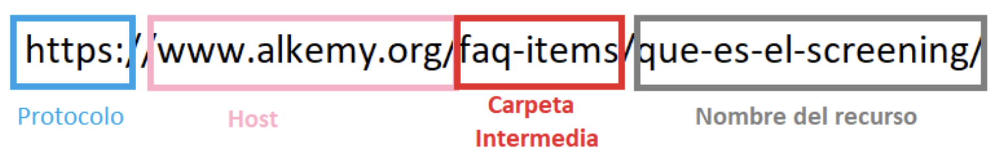

### Rutas Relativas

Las rutas relativas son las rutas más utilizadas en Web, y reciben ese nombre porque indican el camino para encontrar un elemento, pero basándonos en el directorio (carpeta) en donde nos encontramos posicionados. Omiten la parte del protocolo, nombre del host e incluso parte o toda la ruta del recurso enlazado para hacerlas más breves. Como se trata de rutas incompletas, necesitamos información adicional para llegar al recurso enlazado.

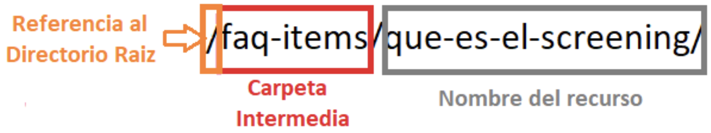

La principal ventaja que ofrece este tipo de rutas es que facilita mucho el mantenimiento de una web, permitiendo mover el contenido de un host a otro sin tener que hacer ningún cambio en las rutas. En el caso de las absolutas, cambiar de host conlleva tener que modificar todas las rutas absolutas para indicarle el nombre del nuevo host.

### Cómo usar rutas relativas:

Dependiendo de hacia dónde queramos enlazar, vamos a tener que escribir nuestra ruta relativa de manera distinta. Para que se entienda mejor, vamos a crear un "árbol de directorios" , y nos vamos a referir a sus componentes.

```html
🗂️ Raiz
├── 📄 index.html
├── 🗂️ Tienda
|   ├── 📄 tienda.html
|   ├── 📄 pedido.html
|   └── 🗂️ Clientes
|       └── 📄 registro.html
└── 🗂️ Tienda
    └── 📄 producto.html
```

### Paso a paso:

1. Enlace hacia un archivo que está en el mismo directorio Si estamos dentro de la carpeta "tienda" la ruta al pedido es directamente "pedido.html".
2. Crear un enlace hacia un archivo que está en una subcarpeta del mismo nivel. Si estamos dentro de la carpeta "tienda" y queremos acceder al archivo "registro.html" que se encuentra en una carpeta diferente, la ruta relativa sería "clientes/registro.html". Utilizamos la barra diagonal (/) para separar las carpetas. 
3. Enlazar hacia un archivo que se encuentra en un nivel superior Si estamos dentro de la carpeta "tienda" y queremos acceder al "index.html" la ruta sería " ../index.html". El uso de dos puntos y una barra oblicua (../) nos permite subir un nivel en la jerarquía de carpetas. Si tuviéramos que subir varios niveles, se
podría utilizar la estructura "../" tantas veces como nos hiciera falta, por ejemplo subir dos niveles sería "../../index.html".
4. Enlazar hacia un archivo que se encuentra en una subcarpeta distinta Si estamos dentro de la carpeta "tienda" y queremos acceder a producto.html, lo que hacemos es utilizar "../" para subir un nivel, para después hacer uso de "productos/" para entrar dentro de la carpeta donde se encuentra el archivo
"producto.html". La ruta relativa sería: "../productos/producto.html" Rutas relativas a la raíz del sitio.
5. Indica la ruta completa desde la raíz de un sitio web hasta el archivo que queremos enlazar. Las rutas relativas de este tipo siempre comenzarán con una barra (/) que hace referencia al directorio raíz del sitio. Por ejemplo, "/tienda/clientes/registro.html" es un enlace relativo a la raíz del sitio, ya que
como podemos ver, empieza con una barra y recorre todas las carpetas y subcarpetas del árbol hasta llegar al recurso en cuestión.

### Navegación a documentos externos

### Atributo href:
Para que el vínculo funcione es necesario informarle a dónde queremos que nos lleve al hacerle clic. Esto se hace con el atributo href. Si se trata de un enlace a un sitio web externo debemos escribir la dirección completa con la cual deseamos que nos comunique.

```html
<a href=”https://www.google.com”>Google</a>
```

Si queremos ir a otro documento dentro de la misma carpeta de nuestro documento principal, alcanza con poner el nombre del documento y su extensión:

```html
<a href=”pagina2.html”>Página 2</a>
```

#### Atributo target:

Los links poseen además otro atributo muy útil llamado target. Este atributo nos ayuda a definir (mediante diferentes valores que podemos darle) en dónde queremos que se abra el documento vinculado. Por defecto, el valor que posee es "_self", esto significa que los vínculos se van a abrir siempre en la misma pestaña en la que nos encontramos:

```html
<a href=”pagina2.html” “target=”_self”>Página 2</a>
```

Si queremos que el documento o el sitio externo se abra en una nueva pestaña, podemos utilizar "_blank":

```html
<a href="https://www.google.com" target="_blank">Google</a>
```

## Imágenes 📸

Los documentos html no tienen por qué basarse solamente en contenido de texto, tenemos también opciones de elementos multimedia como, por ejemplo, imágenes, video y audio.

Existen diferentes tipos de archivos de imágenes que cumplen el mismo objetivo: mostrar una foto o imagen.

Los archivos JPG (o JPEG), PNG y GIF suelen ser los más habituales en diseño web y los que vas a ver más seguido, pero existen otros formatos, como el SVG, y cada uno tiene sus fortalezas y debilidades.

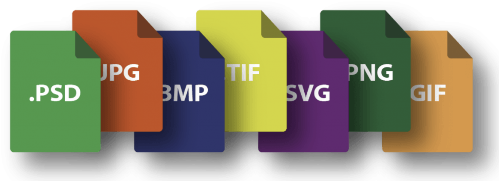

### Agregar imágenes externas

Para agregar imágenes externas tenemos que copiar el hipervínculo directo de la imagen. Si estoy, por ejemplo, tratando de obtenerlas desde Google Images, tengo que hacer clic derecho en la imagen y seleccionar "Abrir imagen en nueva pestaña" para poder copiar luego esa dirección.

El elemento que utilizamos para imágenes es el `` que no requiere etiqueta de cierre. Indicamos la dirección a la imagen en el atributo src.

```html

```

### Los atributos de la etiqueta ``:
- alt = Es el valor que hay que agregar es una descripción de la imagen.
- src = Se utiliza para agregar la ubicación de la imagen.


### Agregar imágenes internas
Si la imagen se encuentra en la misma carpeta que tu archivo HTML, se puede utilizar simplemente el nombre de archivo (incluyendo la extensión) en el atributo src de la etiqueta ``.

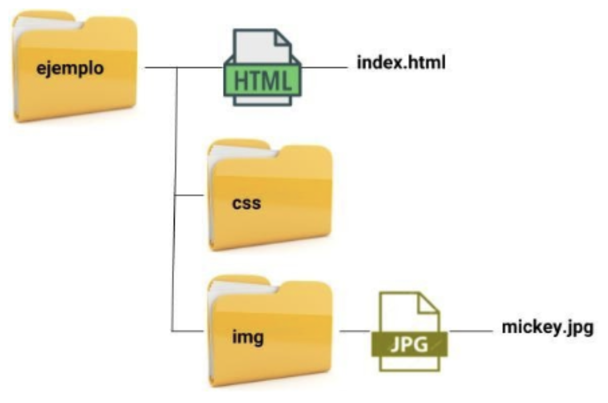

```html

```

## Incluir elementos externos 📹

El elemento `<iframe>` se utiliza para insertar y mostrar contenido interactivo de otros sitios web dentro de una página HTML. Podemos utilizarlo para incrustar videos, mapas, aplicaciones o cualquier otro tipo de recurso web dentro de tu propia página.

El `<iframe>` crea un espacio dentro de tu documento HTML en el que se carga el contenido externo de forma independiente. Esto significa que el contenido incrustado tiene sus propios estilos, funcionalidades y comportamiento. Incluso si el contenido dentro del `<iframe>` contiene enlaces o scripts, se mostrarán y ejecutarán dentro de ese espacio del `<iframe>`.

Es una forma común de integrar contenido de otros sitios web en tu propia página, como mostrar videos de YouTube, mapas de Google Maps, widgets de redes sociales o aplicaciones externas. Esto te permite enriquecer tu página con contenido interactivo y funcionalidades adicionales provenientes de diversas fuentes en línea.

Si queremos incrustar un video de YouTube en nuestra página HTML utilizando un `<iframe>`, hay que seguir estos pasos:
1. Ir a la página del video de YouTube que deseas incrustar.
2. Haz clic en el botón "Compartir" debajo del video.
3. Selecciona la opción "Incrustar" en el menú desplegable.
4. A continuación, se mostrará el código de incrustación del video. Copia el código proporcionado y pégalo en tu página HTML donde deseas que aparezca el video. En este caso, estamos embebiendo un video de YouTube.

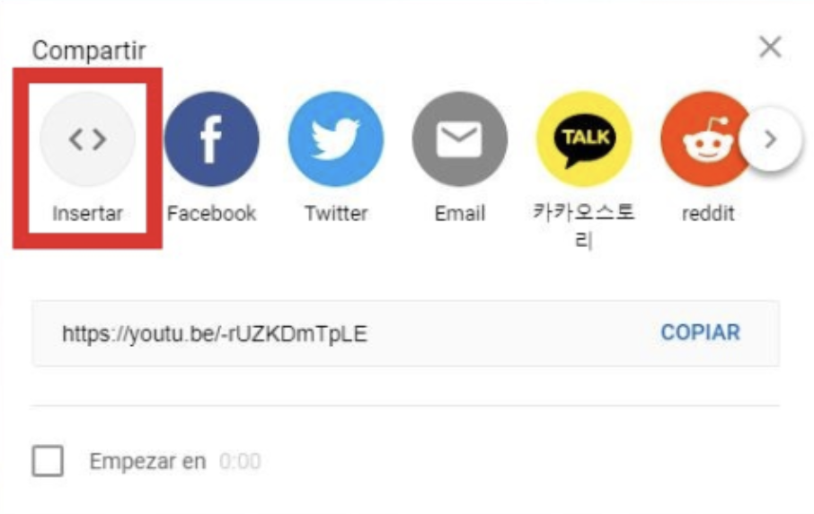

```html
<iframe width="560" height="315" src="https://www.youtube.com/embed/-rUZKDmTpLE" frameborder="0" allow="accelerometer; autoplay; clipboard-write; encrypted-media; gyroscope; picture-in-picture" allowfullscreen></iframe>
```

### Utilizando un `<iframe>` para embeber mapas 🗺

Ya conocimos el elemento `<iframe>`, y lo usamos para insertar videos de YouTube en nuestro sitio. De manera similar, podemos utilizarlo para agregar mapas. Al igual que con los videos, el proceso es sencillo. Aquí están los pasos necesarios:
1. Lo primero que debemos hacer es acceder a Google Maps. Elegimos la dirección que queremos mostrar en el mapa y ajustamos el zoom.
2. En la esquina superior izquierda hacemos clic sobre el menú hamburguesa (las tres líneas horizontales paralelas). Ahí seleccionamos la opción "Compartir o insertar el mapa".
3. Se abrirá una ventana en la que aparece el enlace para compartir. Vamos a elegir la opción "Insertar mapa". Ahí podemos definir el tamaño que mejor se adapte a nuestro sitio (pequeño, mediano, grande o tamaño
personalizado).
4. Una vez elegido el tamaño, copiamos el código del `<iframe>`. Nuevamente, el último paso es pegarlo en nuestro documento HTML, y probarlo en el navegador.

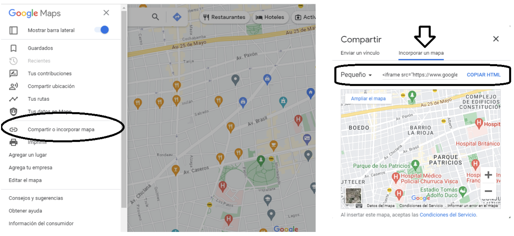

## Tablas 🉑

La etiqueta `<table>` se utiliza para crear la tabla en sí. Las tablas son un conjunto de celdas organizadas, dentro de las cuales es posible alojar distintos contenidos. HTML dispone de una gran variedad de etiquetas y atributos para crear tablas. Sirven para representar información tabulada, en filas y
columnas.

Algunos puntos clave sobre las tablas en HTML son:

### Estructura de filas y columnas:

Las tablas se componen de filas (`<tr>`) y columnas (`<th>` y `<td>`). Las filas representan conjuntos de celdas que se encuentran en la misma línea horizontal, mientras que las columnas se definen mediante celdas en cada fila.

### Etiquetas `<th>` y `<td>`:

La etiqueta `<th>` se utiliza para definir celdas de encabezado, que generalmente se encuentran en la primera fila de la tabla y describen el contenido de las columnas. La etiqueta `<td>` se utiliza para las celdas de datos, que contienen el contenido real de la tabla.

### Atributos adicionales:

HTML proporciona varios atributos para personalizar las tablas, como el ancho de la tabla (width), el espaciado entre las celdas (cellspacing), el relleno interno de las celdas (cellpadding), el alineamiento de las celdas (align), entre otros.

### Estilización con CSS:

Las tablas pueden ser estilizadas y personalizadas utilizando CSS. Esto permite cambiar el aspecto visual de la tabla, como los colores, fuentes, bordes y estilos de las celdas, entre otros.

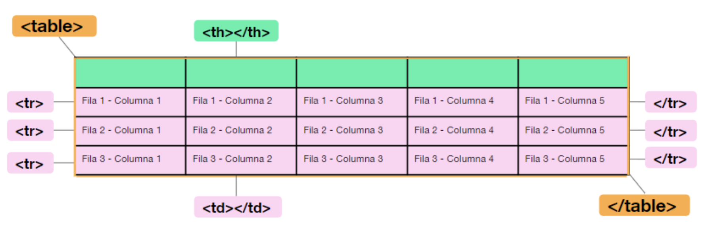

La estructura de de etiquetas sería de esta manera:

```html
<table>
    <tr><!-- inicio de fila-->
        <td>Fila 1 - Columna 1</td>
        <td>Fila 1 - Columna 2</td>
        <td>Fila 1 - Columna 3</td>
    </tr><!-- cierre de fila -->
    <tr><!-- inicio de otra fila-->
        <td>Fila 2 - Columna 1</td>
        <td>Fila 2 - Columna 2</td>
        <td>Fila 2 - Columna 3</td>
    </tr><!-- cierre de la segunda fila -->
</table>
```

Y el resultado obtenido sería el siguiente:
<table>
    <tr><!-- inicio de fila-->
        <td>Fila 1 - Columna 1</td>
        <td>Fila 1 - Columna 2</td>
        <td>Fila 1 - Columna 3</td>
    </tr><!-- cierre de fila -->
    <tr><!-- inicio de otra fila-->
        <td>Fila 2 - Columna 1</td>
        <td>Fila 2 - Columna 2</td>
        <td>Fila 2 - Columna 3</td>
    </tr><!-- cierre de la segunda fila -->
</table>

Para que nuestra tabla empiece a tomar estilo no nos olvidemos que la tabla acepta 3 atributos de “diseño”:

- Border: bordes de la tabla.
- Cellpadding: especifica el espacio, en píxeles, entre la pared de la celda y su contenido.
- Cellspacing: indica la distancia entre las celdas y el margen exterior de la tabla.

## Formularios🗒

Los formularios en HTML son elementos que permiten recopilar y enviar datos ingresados por los usuarios. Son etiquetas donde el usuario ingresará o seleccionará valores, que serán enviados a un archivo encargado de procesar la información.

Para insertar un formulario se usa la etiqueta `<form>`, que dentro lleva todos los controles que vayan al mismo destino. Un formulario requiere 3 atributos para funcionar:

- Action: documento que se encarga de recibir los datos y procesarlos.
- Method: la forma en que será enviada la información. Existen dos métodos de envío, que son GET y POST.
- Enctype: cómo se codificarán los contenidos.

```html
<form action="/procesar-formulario" method="post">

</form>
```

action=”” es el este atributo se indicará cuál es el archivo que recibe y procesa los datos. Debe ser de un lenguaje de los llamados “del lado del servidor” (PHP / ASP / JSP). Si no se indica un valor, el Action será por defecto el mismo archivo donde está el formulario.

method=”” es la forma en la que se recopilan y envían los datos. Existen dos métodos comunes en el HTML:

- GET: la información viajará por la barra de direcciones a continuación del nombre del archivo.
- POST: la información viajará junto a los encabezados del HTML (será “invisible”).

Si el method no se indica, por defecto será GET.

Cuando el valor del atributo method es post, el mismo es el tipo MIME del contenido, que es usado para enviar el formulario al servidor. Los posibles valores son:

- application/x-www-form-urlencoded: será el valor por defecto si un atributo no está especificado.
- multipart/form-data: usar este valor si se está usando el elemento input con el atributo type ajustado a "file" .
- text/plain (HTML5)

Normalmente se utiliza para permitir el envío de archivos a través de un formulario.

Existen tres controles generales para el ingreso de texto:

- Cajas de texto de una sola línea (no acepta el uso de la tecla Enter).
- Cajas para el ingreso de contraseñas (el contenido no será visible).
- Cajas para contenido multilínea. Puede ser una o muchas líneas de texto.

Atributo “name”
- Control de formulario: `<input>`: Text, Email, Password.
- Control de formulario: `<textarea></textarea>`

Los botones disparan las acciones del formulario. Hay 3 tipos:
- El que envía los datos al archivo indicado como Action.
- El que vacía todo lo ingresado y resetea los campos.
- El que “no hace nada”, pensado para usarse con Javascript.

Todos los botones son etiquetas `<input>`, con distintos tipos de “Type”. El botón debe de estar dentro del `<form>` que afectará.
El atributo value representa la etiqueta del botón `<button>`, la cual es normalmente mostrada por los navegadores dentro de éste.

- Input de tipo “submit”: envía el formulario.
- Input de tipo “reset”: resetea el formulario.
- Input de tipo “button”: no tiene acciones por defecto.

```html
<form>
    <input type="submit" value="Enviar formulario"/>
    <input type="reset" value="Limpiar formulario"/>
    <input type="button" value="Sin acciones"/>
</form>
```

Los controles de selección solo se utilizan si queremos que el usuario no pueda ingresar libremente un texto, sino que el programador le da una lista predefinida.
El dato que llega al elegir una opción se define desde el atributo “value”. Existen 3 grupos de controles de selección:

- Botones de radio: solo se puede elegir una opción.

```html
<form>
    <div>hombre</div>
    <input type="radio" name="sexo" value="hombre" />
    <div>mujer</div>
    <input type="radio" name="sexo" value="mujer" />
</form>
```

- Casillas de chequeo: de toda la lista de opciones, el usuario puede optar por una, todas o ninguna opción.

```html
<form>
    <div>Acepta términos y condiciones</div>
    <input type="checkbox" name="acepta" value="1" />
</form>
```

- Menú desplegable: solo es posible seleccionar una opción.

La etiqueta `<label>` define formalmente a cada elemento de un formulario. Esta etiqueta es de mucha ayuda para generar un formulario accesible.

Su principal atributo es “for”, que va a referenciar a “label” con su elemento del formulario. El valor del atributo “for” debe ser igual al valor del atributo “id” o “name” del elemento.

```html
<form>
    <label for="nombre_apellido">Nombre:</label>
    <input type="text" name="nombre_apellido" />
</form>
```

Para crear un menú desplegable, generalmente llamado combo-box, selector o menú. El cual, de toda la lista, se puede elegir una opción (aunque tiene un atributo que permite cambiarlo). Lo ideal es que sean al menos dos elementos distintos. Para esto se utiliza la etiqueta `<select>` y la etiqueta `<option>`

```html
<form>
    <select name="talles">
        <option value="L">Large</option>
        <option value="M">Medium</option>
        <option value="S">Small</option>
    </select>
</form>
```

Las etiquetas `<fieldset>` y `<legend>` se utilizan en conjunto. La primera, tiene como objetivo crear grupos de elementos del formulario que posean un mismo propósito; mientras que la segunda, define formalmente el propósito del elemento fieldset. Se estructuran de la siguiente manera:

```html
<form>
    <fieldset>
        <legend>Talle de remera</legend>
        <!-- Aquí irán los elementos de formulario -->
    </fieldset>
</form>
```

Utilizando las etiquetas mencionadas, nuestro formulario quedaría de la siguiente manera:

```html
<form action="/procesar-formulario" method="post">
    <label for="nombre">Nombre:</label>
    <input type="text" id="nombre" name="nombre" placeholder="Ingrese su nombre" required>
    <br>
    <label for="email">Email:</label>
    <input type="email" id="email" name="email" placeholder="Ingrese su email" required>
    <br>
    <label for="edad">Edad:</label>
    <input type="number" id="edad" name="edad" min="18" max="99" required>
    <br>
    <label for="pais">País:</label>
    <select id="pais" name="pais" required>
        <option value="">Seleccione su país</option>
        <option value="1">Argentina</option>
        <option value="2">Brasil</option>
        <option value="3">México</option>
    </select>
    <br>
    <label>Género:</label>
    <input type="radio" id="genero-m" name="genero" value="masculino" required>
    <label for="genero-m">Masculino</label>
    <input type="radio" id="genero-f" name="genero" value="femenino" required>
    <label for="genero-f">Femenino</label>
    <br>
    <button type="submit">Enviar</button>
    <button type="reset">Limpiar</button>
</form>
```

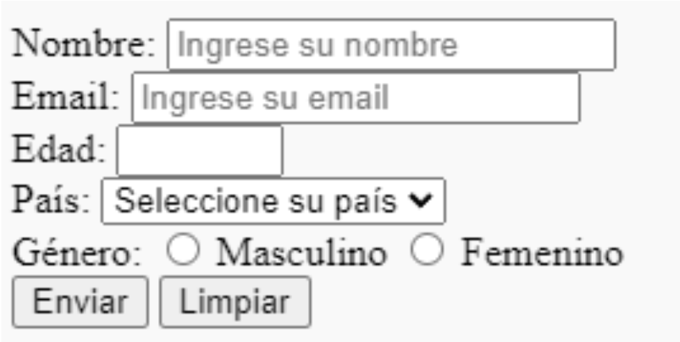

## Elemento DIV 🗂

### Mirada general y específica

Cuando estructuramos nuestro sitio ya sabemos que tenemos disponibles las etiquetas semánticas, sin embargo, pasa que muchas veces necesitamos distintos contenedores para poder armar estructuras más complejas.

Imaginemos un sitio desde una mirada genérica: tiene cabecera, contenido principal, tal vez contenido secundario y un footer, algo así:

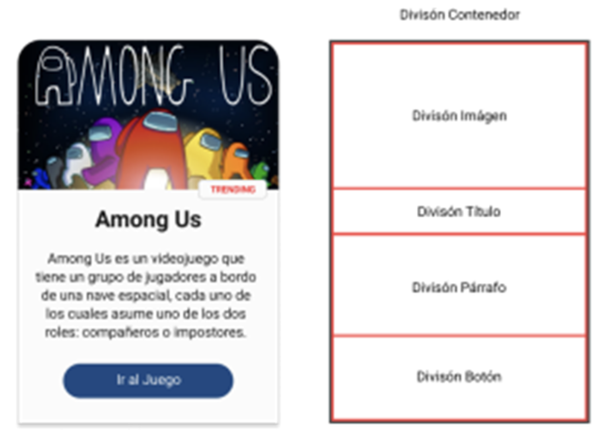

Esto lo podemos resolver sin problemas gracias a las etiquetas semánticas que conocemos.
Pensemos ahora en ir un poco al detalle e imaginamos que la sección principal (el `<main>`) se ve así:

Si observamos, podemos ver que la etiqueta `<main>` contiene la información principal la cual esta dividida por `<section>` y en su interior hay tres “cards” y estas tienen un contenedor, una imagen, un título, texto y un botón. Podemos pensar en divisiones dentro de la card:
1. La división de la imagen
2. La división del título
3. La división de la información
4. La división del botón

Estas divisiones no son semánticas. Entonces, pensando a groso modo tenemos las etiquetas semánticas que nos permiten entender qué es una cabecera, contenido principal, secciones, pie de páginas, etc.

Pero cuando pensamos más en detalle, vemos que hay muchas divisiones más, que no necesariamente son semánticas, son divisiones que nos ayudan a estructurar nuestro sitio. Para esto, entra la etiqueta `<div>` (etiqueta que NO es semántica).

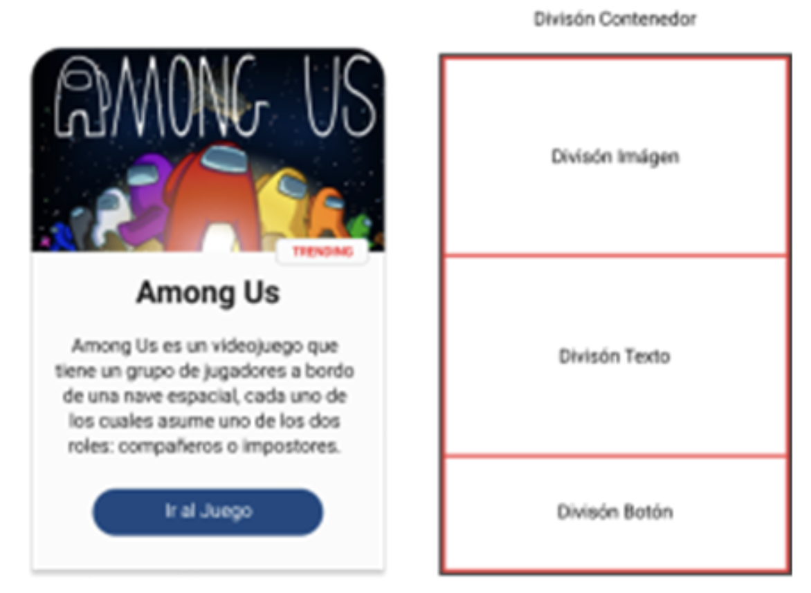

La etiqueta `<div>` sirve para crear secciones o agrupar contenido. Cuando vimos en detalle la sección del main descubrimos que se componía por cards y que estas tenían distintas divisiones. Si analizamos todo un poco más en detalle podríamos armar distintas maneras de agrupar el contenido de las cards.

A la hora de agrupar contenido existen muchas maneras de verlo y es muy probable que todas sean válidas. Con el tiempo el desafío es entender que hay ciertos contenedores que solemos crear que se pueden evitar, pero eso es algo que vendrá con el día a día de desarrollo.

### La importancia de agrupar contenido

La pregunta es… ¿Y para qué me sirve agrupar contenido? Y la respuesta a esto tiene que ver con tres cosas principales:
1. Crear código legible
2. Crear una estructura escalable que pueda cambiar con el tiempo
3. Generar secciones que tendrán estilos particulares

Respecto de las primeras dos, mientras mejor estructuremos los elementos html que creamos, más simple será mantenerlos y cambiarlos en el futuro. Respecto de la última, lo podemos analizar simplemente pensando en el padding de CSS.
A continuación vemos en amarillo el padding de una de las divisiones de la card:

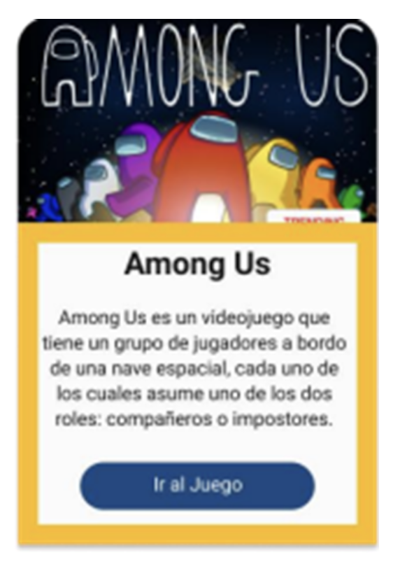

Viendo esta card, nos damos cuenta que hay un padding en común a todas las  divisiones que no son la imagen, entonces podemos pensar en una estructura que tenga:
1. Un `<div>` contenedor de toda la card
2. Un `<div>` contenedor de la imagen
3. Un `<div>` contenedor de la información (este será el div que tenga el padding)
4. Si consideramos necesario, un div para el título y el párrafo (los grupos que contienen solo texto)
5. Un div contenedor del botón (que nos servirá para centrar al botón)

Como podemos ver, la manera de dividir la card pensando en el padding, es distinta a las primeras propuestas de divisiones. Esta que recién mencionamos se vería algo así:

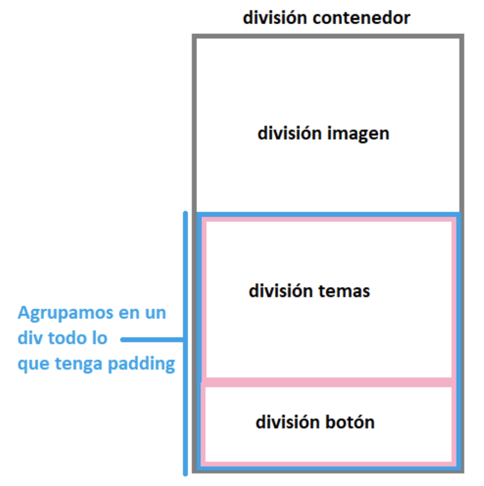

### Características de un `<div>`
- Es una etiqueta de bloque, es decir que va a ocupar el 100% de la fila que ocupa.
- Si no tiene contenido, no se ve dado que no tiene alto (height)
- No tiene márgenes ni padding, si queremos que tengan debemos agregarlo al CSS.

### Introducción del `<span>`
El `<span>` es la etiqueta hermana del `<div>`. En vez de agrupar todo tipo de contenido, lo vamos a pensar como el contenedor de etiquetas o elementos de línea.

Para entenderlo pensemos en este ejemplo concreto: imaginemos un texto que tiene una frase de otro color

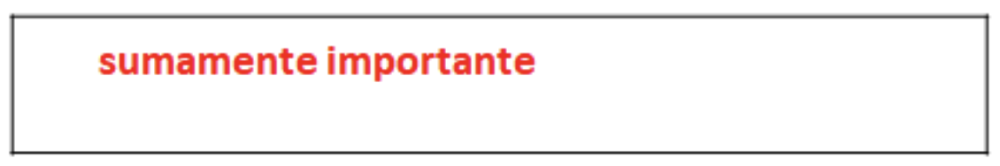

#### ¿Cómo lograríamos esto?

Cómo estamos cambiando el color, sabemos que vamos a tener que usar CSS en algún momento, y lo que hacemos en “envolver” en un `<span>` el texto que queremos resaltar, y le cambiamos los estilos mediante CSS.

```html
<p>Es <span> sumamente importante </span> que complete su DNI sin espacios </p>
```

La diferencia radical de estas etiquetas tan similares, es que el `<div>` acepta dentro suyo cualquier etiqueta mientras que el `<span>` solo acepta etiquetas o elementos de línea (por ejemplo una etiqueta `<a>` o simplemente texto).
La otra gran diferencia es que el `<div>` es una etiqueta de bloque que ocupará el 100% de la fila que ocupa, empujando las etiquetas siguientes hacia abajo mientras que el `<span>` es de línea y ocupa solamente lo que su contenido ocupe, sin empujar ningún elemento hacia abajo.

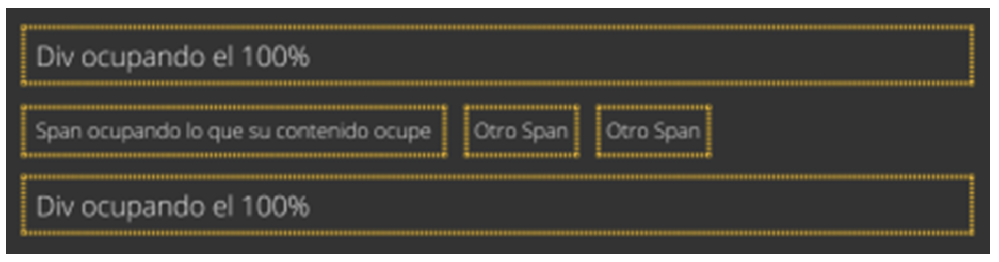


