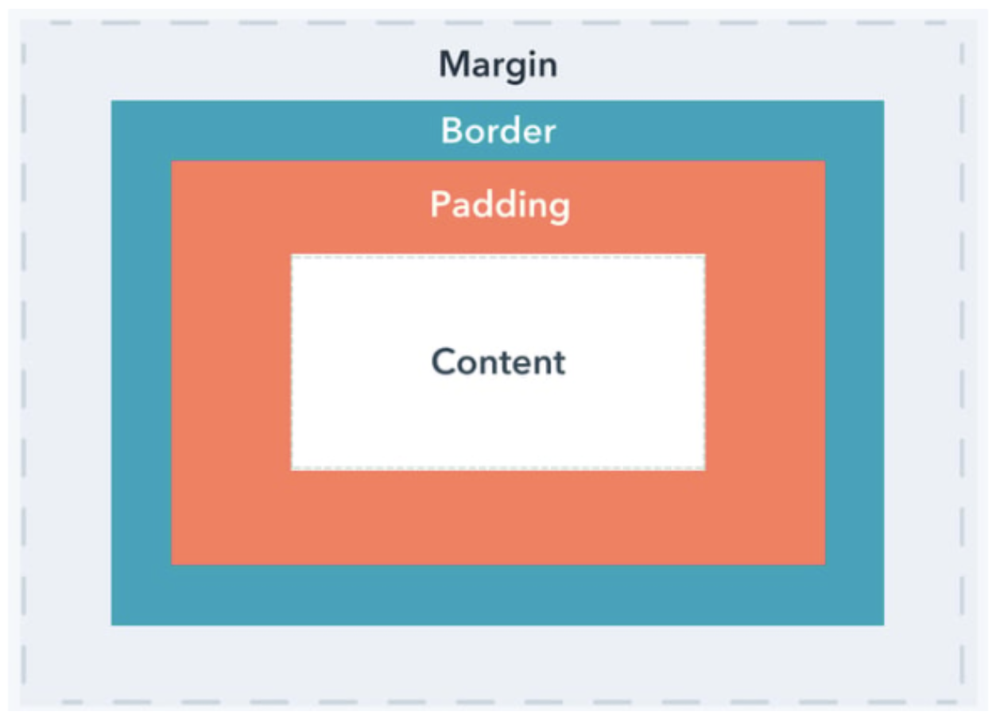
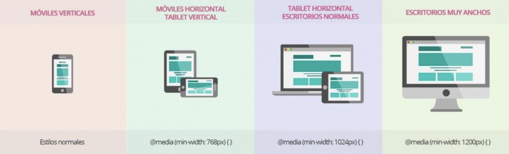
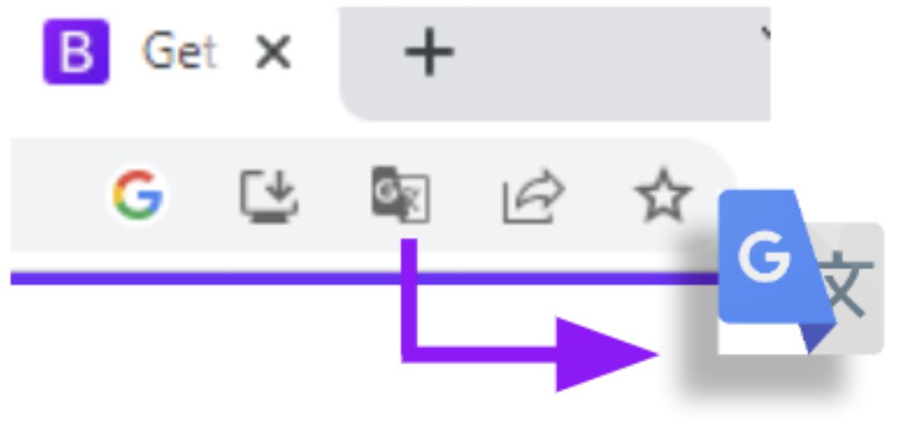
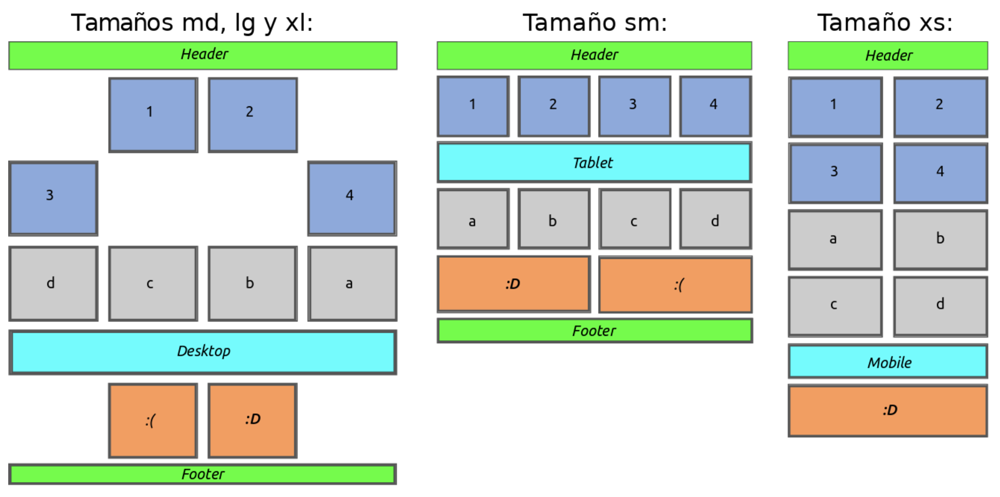
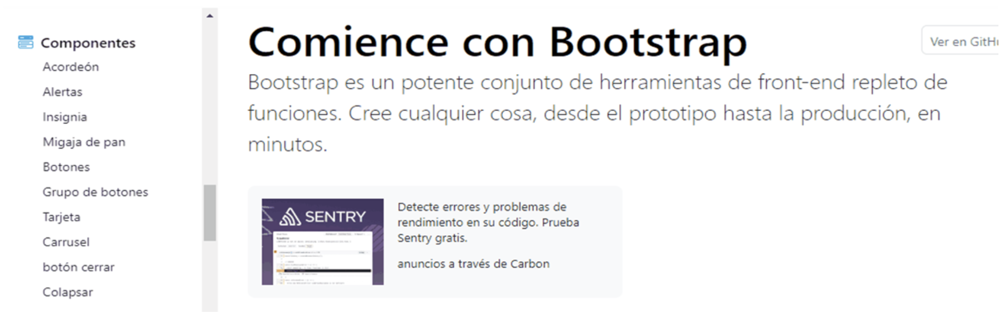
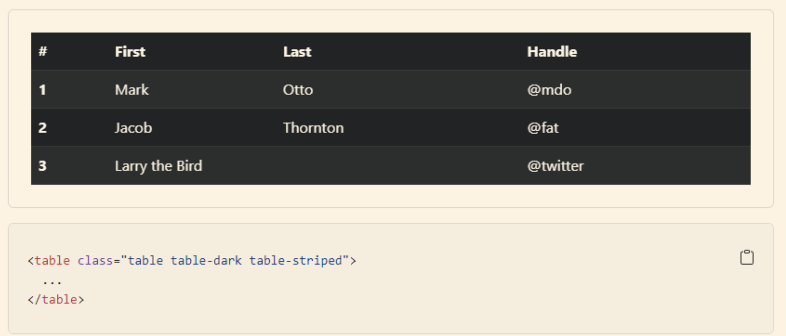
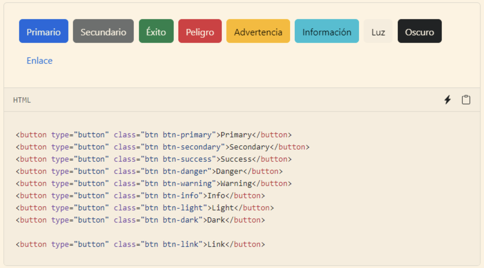
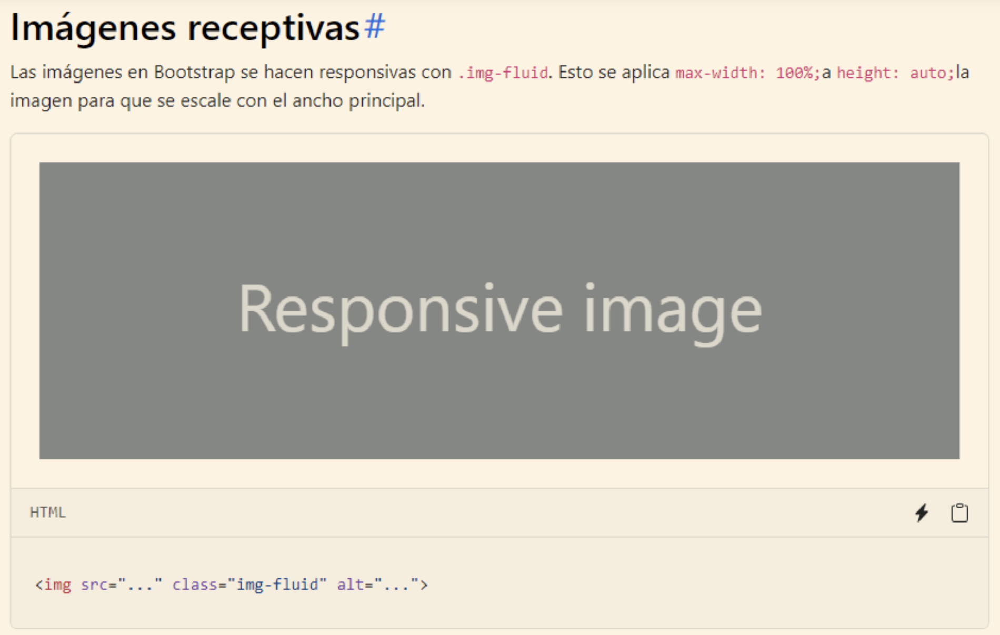
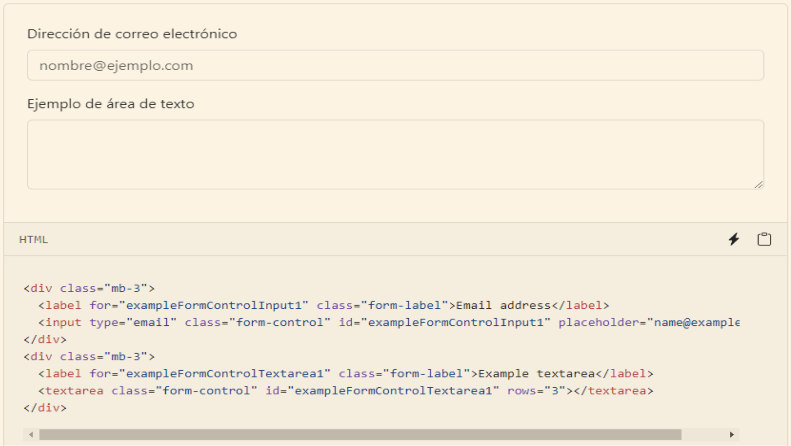
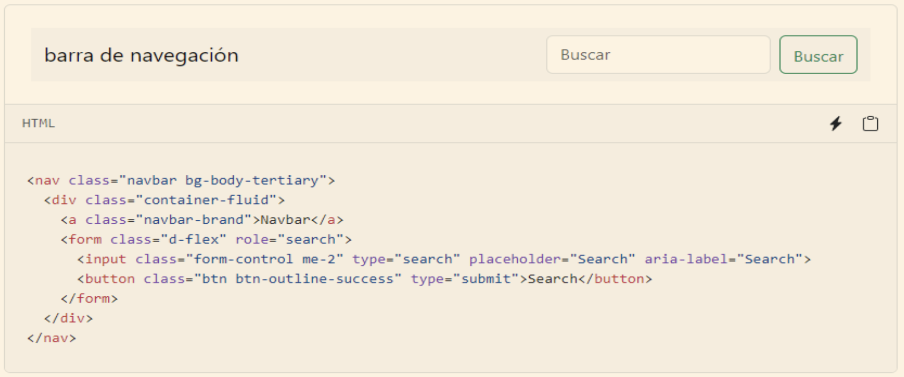

# 1. Aspectos principales del desarrollo en web
---

## El desarrollo Web 🌐

Para el diseño y desarrollo web existen diferentes lenguajes que nos permiten llevar el diseño en papel (Sketch) a una estructura que pueda interpretar un computador.

El desarrollo web es un proceso de crear, construir y mantener sitios web y aplicaciones web. Para poder llevar a cabo este proceso se utilizan tecnologías, lenguajes de programación y herramientas para diseñar, desarrollar y desplegar sitios web funcionales y atractivos.

El desarrollo web implica una amplia gama de tecnologías, lenguajes y conceptos. Para esto, el trabajo se divide en roles específicos permitiendo a los profesionales especializarse en áreas particulares y desarrollar experiencia en ese campo. Los desarrolladores Front-End se enfocan en la interfaz de usuario y la experiencia del usuario, mientras que los desarrolladores Back-End se especializan en la lógica del servidor y la gestión de datos. Esta especialización les permite perfeccionar sus habilidades y conocimientos en áreas específicas. Al tener roles especializados, cada aspecto del desarrollo puede recibir atención y cuidado adecuados. Esto conduce a un producto final de mejor calidad y facilita el mantenimiento a largo plazo de la aplicación web o el sitio web.

## Qué se entiende por desarrollo web

El desarrollo de web abarca varias áreas:
- **Diseño web:** es toda la parte de creación de la estructura, el diseño visual y la experiencia del usuario.
- **Programación web:** involucra la escritura de código para construir la página/sitio web. Para la estructura y la estética, se utilizan lenguajes de marcado como HTML y CSS, y para programar la interactividad, la gestión de datos y operaciones del lado del servidor se utilizan lenguajes de programación como Javascript, PHP, Python, entre otros.
- **Desarrollo front-end:** se enfoca en la parte del desarrollo web que tiene que ver con la implementación de la interfaz de usuario y la interacción de los usuarios con un sitio web o una aplicación web. Los desarrolladores front-end trabajan con tecnologías como HTML, CSS y JavaScript para crear la parte visual y funcional de un sitio web.
- **Desarrollo back-end:** se ocupa de la lógica y el funcionamiento detrás de escena de un sitio web o una aplicación web. Los desarrolladores back-end trabajan en la parte del servidor y se centran en la gestión de datos, el procesamiento de solicitudes y la implementación de la lógica de negocio.
- **Bases de datos:** las aplicaciones web suelen requerir el almacenamiento y recuperación de datos. Los desarrolladores web utilizan sistemas de gestión de bases de datos (SGBD) para diseñar y administrar la estructura de datos, realizar consultas y garantizar la integridad de la información.
- **Despliegue y mantenimiento:** una vez que el sitio web o aplicación web está desarrollado, debe ser implementado en un servidor para que esté accesible en Internet. Los desarrolladores web se encargan
de la configuración del servidor, el despliegue de los archivos y la gestión del mantenimiento y las actualizaciones del sitio web.

## Diferencias entre Front-End, Back-End y Fullstack 🛠

Front-End, Back-End y Fullstack son términos que se utilizan para describir diferentes roles y enfoques dentro del desarrollo web. **Cada uno de estos roles se enfoca en aspectos específicos del proceso de desarrollo y requiere habilidades y conocimientos especializados.** Algunos desarrolladores pueden especializarse en un área específica, mientras que otros pueden tener habilidades en ambos y desempeñar roles Fullstack.

La separación entre el desarrollo Front-End y Back-End existe debido a la naturaleza y las necesidades del desarrollo web, esto simplifica a la hora de crear y desarrollar un sitio o aplicación web.

### Funcionalidades 👨🏻‍💻

#### Front-End ⤴️

El Front-End se ocupa de todo lo que los usuarios ven y con lo que interactúan en un sitio web o aplicación. Esto incluye la estructura y el diseño de la página, la presentación visual utilizando HTML, CSS y JavaScript, la interacción con los elementos de la interfaz, y la optimización de la experiencia del usuario.

#### Back-end ⤵️

El Back-End se encarga de las funcionalidades y procesos detrás de la escena que permiten que un sitio web o aplicación funcione correctamente. Esto incluye la gestión de la base de datos, la comunicación con otros sistemas o servicios, el procesamiento de datos, la seguridad, la autenticación y la lógica del servidor.

### Roles 👨🏻‍💻

#### Front-end 🔼

Los **desarrolladores Front-End** se ocupan de la implementación del diseño, la estructura y la experiencia del usuario en el navegador. Utilizan tecnologías como HTML, CSS y JavaScript para crear y dar estilo a la interfaz de usuario, gestionar la interactividad y mejorar la usabilidad. Su objetivo principal es lograr una interfaz atractiva y fácil de usar para los usuarios finales.
Además de implementar la UI, el Front-End es responsable de la **experiencia de usuario (UX)** en el navegador, de **coordinar con Back-End la integración de APIs/servicios** (definiendo contratos y manejo de errores/estados) y de **garantizar accesibilidad, compatibilidad y rendimiento** (p. ej., criterios WCAG, soporte multi-dispositivo y optimización de carga). En el **proceso de desarrollo**, participa desde diseño (componentes y criterios de accesibilidad) hasta pruebas y despliegue (optimización y monitoreo del cliente).

#### Back-end 🔼

Los **desarrolladores Back-End** se encargan de construir y mantener la lógica del servidor, la base de datos y otros componentes que permiten el funcionamiento de una aplicación web. Utilizan lenguajes de programación como PHP, Python, Ruby, Java, entre otros, y se preocupan por la seguridad, el rendimiento, la
escalabilidad y la integridad de los datos.

Su enfoque principal es la implementación de la funcionalidad y la manipulación de los datos en el servidor.
Además de la lógica de negocio y datos, el Back-End es responsable de **diseñar y exponer APIs** consumidas por Front-End y terceros, **asegurar integridad, seguridad y rendimiento** (autenticación/autorización, protección OWASP, caching, escalabilidad) y **coordinar la integración** con Front-End y otros servicios.
En el **proceso de desarrollo**, define el modelo de dominio y contratos, implementa y prueba servicios, y monitorea en operación (logs, métricas, incidentes).

#### Fullstack 🔄

Un **desarrollador Fullstack** tiene habilidades tanto en el Front-End como en el Back-End, lo que les permite trabajar en todas las capas de una aplicación web. Son capaces de diseñar, desarrollar e implementar tanto la interfaz de usuario como la lógica del servidor. 

Los desarrolladores Fullstack pueden encargarse de todas las etapas del ciclo de desarrollo, desde la planificación y el diseño hasta la implementación y el despliegue. Tienen un conocimiento más amplio y una comprensión integral de todo el proceso de desarrollo web.

El Fullstack asume una **visión end-to-end: conecta Front-End y Back-End**, vela por la **coherencia de los contratos de API** y el cumplimiento de **requisitos no funcionales** (accesibilidad, compatibilidad, rendimiento y seguridad), y **coordina** entre diseño, desarrollo y operación para reducir fricciones. En el **proceso de desarrollo**, interviene en todas las fases, desde el descubrimiento y diseño técnico hasta pruebas integrales y despliegue.

## Qué es el lenguaje de marcación de hipertexto (HTML) *️⃣

**HTML** (HyperText Markup Language) es un **lenguaje de marcado utilizado paraestructurar y presentar el contenido de las páginas web**. Permite definir laestructura y el significado semántico de los elementos en una página webutilizando etiquetas.

HTML es el l**enguaje fundamental para la creación de páginas web** y permiteestructurar el contenido de manera semántica. Con el uso adecuado de etiquetasy elementos HTML, se pueden crear sitios web bien organizados, accesibles ycompatibles con múltiples dispositivos y navegadores.

Si imaginamos que nuestra página es una persona, HTML sería el esqueleto, y cada etiqueta, un hueso. HTML utiliza las etiquetas para crear elementos, como párrafos, títulos, etc. El conjunto de elementos HTML guardados en un mismo documento con extensión .html es una página. Y un conjunto de páginas relacionadas forman un sitio web.

**HTML se combina con CSS** (Cascading Style Sheets) para definir el aspecto y la presentación visual de una página web, y con JavaScript para agregar interactividad y funcionalidad dinámica.

Como la mayoría de los lenguajes, HTML ha ido evolucionando desde su creación en 1991, y existen diferentes versiones. La última versión (y la que usaremos nosotros) es HTML5. Es una versión muy eficiente y compatible con distintos navegadores y plataformas (PC de escritorio, portátiles, teléfonos inteligentes,
tabletas, etc.).

### Características y puntos importantes sobre HTML:

- HTML es un lenguaje de marcado, lo que significa que utiliza etiquetas para definir la estructura y el significado de los elementos en una página web. Cada etiqueta tiene un propósito específico y se utiliza para envolver el contenido y darle formato.
- HTML se utiliza para definir la estructura básica de una página web, como encabezados, párrafos, listas, tablas, formularios, imágenes y enlaces. Cada elemento se representa mediante una etiqueta HTML
correspondiente.

## El rol del Navegador 🖥

### Internet

Internet **es una red de computadoras que se encuentran interconectadas a nivel mundial para compartir información**. Se trata de una red de equipos de cálculo que se relacionan entre sí a través de la utilización de un lenguaje universal.

El concepto Internet tiene sus raíces en el idioma inglés y se encuentra conformado por el vocablo inter (que significa “entre”) y net (proveniente de network que quiere decir “red electrónica”). Es un término que siempre debe ser escrito en mayúscula ya que hace referencia a “La Red” (que conecta a las computadoras mundialmente mediante el protocolo TCP/IP) y sin un artículo que lo acompañe (el/la) para hacerle referencia.

### Navegador Web
El navegador web o navegador de internet es el **instrumento que permite a los usuarios de internet navegar o surfear entre las distintas páginas de sus sitios webs preferidos**. Se trata de un software que posee una interfaz gráfica compuesta básicamente de: botones de navegación, una barra de dirección, una
barra de estado (generalmente, en la parte inferior de la ventana) y la mayor parte, en el centro, que sirve para mostrar las páginas web a las que se accede.

Los principales navegadores web del mercado son:
- Microsoft Internet Explorer (actualmente Microsoft Edge)
- Firefox
- Google Chrome
- Opera
- Safari.

### Buscadores Web

Son los **programas dentro de un sitio o página web**, los cuales al ingresar palabras clave, operan dentro de la base de datos del mismo buscador y recopilan todas las páginas posibles, que contengan información relacionada con lo que se esté buscando.

Estos motores de búsqueda funcionan mediante el envío de “arañas” , las cuales son pequeños robots que se dedican a rastrear todos los sitios web a lo largo y ancho de Internet. Otro programa, llamado un indexador, a continuación, lee estos documentos y crea un índice basado en las palabras contenidas en cada documento. Cada motor de búsqueda utiliza un algoritmo propietario para crear sus índices tales que, idealmente, sólo los resultados significativos se devuelven para cada consulta.

## Qué es la W3C 🙋🏻‍♂️

Tim Berners-Lee, es el creador de la **World Wide Web (www)**, estableció el **Consortium World Wide Web (W3C)** en 1994 con el objetivo de asegurar el crecimiento continuo y a largo plazo de la Web.

Desde sus inicios, el **W3C** ha sido una comunidad internacional que incluye a diversas partes interesadas, como organizaciones miembros, personal dedicado a tiempo completo y el público en general. Todos ellos trabajan juntos para desarrollar **estándares web abiertos**.

El W3C es liderado por un director ejecutivo interino llamado Ralph Swick y cuenta con una junta directiva. La misión principal del Consorcio es llevar la web a su máximo potencial.

El **World Wide Web Consortium (W3C)** desarrolla estándares y pautas para ayudar a todos a construir una web basada en los **principios de accesibilidad, internacionalización, privacidad y seguridad**.

El **W3C** también se preocupa por **promover** la adopción de estos **estándares a nivel global**, trabajando con gobiernos, organizaciones y la comunidad en general para fomentar su implementación. Además, el Consorcio se dedica a la investigación y la educación, brindando recursos y documentación para ayudar a las personas a comprender y utilizar eficazmente los estándares web.

Algunos de los estándares más conocidos y ampliamente utilizados incluyen:

- **HTML (HyperText Markup Language):** Es el lenguaje de marcado estándar utilizado para crear páginas web. Define la estructura y el contenido de una página web.
- **CSS (Cascading Style Sheets):** Es un lenguaje utilizado para describir la presentación visual de una página web, como el diseño, los colores, las fuentes y otros aspectos de estilo.
- **XML (eXtensible Markup Language):** Es un lenguaje de marcado utilizado para almacenar y transportar datos estructurados. Se utiliza ampliamente en aplicaciones web y en la interoperabilidad de sistemas.
- **HTTP (Hypertext Transfer Protocol):** Es el protocolo utilizado para la comunicación entre clientes y servidores en la Web. Define cómo se solicitan y se entregan los recursos web.
- **SVG (Scalable Vector Graphics):** Es un formato de archivo basado en XML utilizado para describir gráficos vectoriales. Permite la creación de gráficos escalables y de alta calidad en la Web.
- **WCAG (Web Content Accessibility Guidelines):** Son pautas desarrolladas por el W3C para hacer que el contenido web sea accesible para personas con discapacidades. Proporciona directrices para crear sitios web que sean comprensibles y utilizables por todos.

## Evolución del html hacia el html5 📍

- HTML 1 y 2 (1991): Elementos de texto e imágenes.
- HTML 3 (1995): Basado en Tablas. No había un estándar: Cada browser interpretaba lo que quería.
- HTML 4 (1998): Aparece CSS, primer estándar oficial.
- XHTML 1.0 (2000): Es de la W3C, basado en XML.
- TRANSITIONAL: Punto medio entre HTML4 y XHTML
- STRICT: Más restrictivo (por ende más complejo).
- HTML5 (2004): Primer borrador creado por la WHATWG.
- (2008) Pasa a la W3C. Aún lo consideran experimental.

**HTML5** es la última versión de HTML y ha introducido nuevas características y mejoras. Proporciona un conjunto más amplio de etiquetas y elementos para trabajar, como el uso de elementos semánticos (como `<header>`, `<nav>`, `<section>`, `<article>`, etc.) que brindan un significado más claro y ayudan en la
accesibilidad y optimización para motores de búsqueda.

**HTML5** es ampliamente compatible con los navegadores modernos y se ha convertido en el estándar de facto para el desarrollo de sitios web. Sin embargo, es importante tener en cuenta las diferencias en la implementación y el soporte de características específicas entre los diferentes navegadores.

Características y mejoras que HTML5 introdujo:

- **Nuevas etiquetas semánticas:** HTML5 introduce una serie de etiquetas semánticas que permiten describir con mayor precisión el contenido de una página web. Algunas de estas etiquetas incluyen `<header>`, `<nav>`,
`<section>`, `<article>`, `<footer>`, entre otras. Esto facilita la comprensión del contenido y mejora el SEO.
- **Soporte multimedia:** HTML5 ofrece una integración nativa de audio y video, eliminando la necesidad de plugins como Flash. Ahora es posible incrustar elementos de audio y video utilizando las etiquetas `<audio>` y `<video>`, lo que proporciona una reproducción más fluida y una mejor compatibilidad en diferentes dispositivos.
- **Gráficos y animaciones:** HTML5 incluye el elemento `<canvas>`, que permite crear gráficos dinámicos y animaciones utilizando JavaScript. También se introdujo la **API SVG** (Scalable Vector Graphics) para la creación de gráficos vectoriales escalables en la web.
- **Formularios mejorados:** HTML5 introduce nuevos tipos de entrada de formulario, como **email, tel, date, number,** entre otros. Además, ofrece validación de formularios en el lado del cliente sin necesidad de JavaScript adicional.
- **Almacenamiento local:** HTML5 proporciona **dos nuevas API** para almacenar datos en el navegador del usuario: **LocalStorage** y **SessionStorage**. Estas API permiten a las aplicaciones web almacenar datos de forma persistente o temporal en el navegador, lo que brinda una experiencia más rápida y sin conexión.
- **Geolocalización:** HTML5 incluye una **API de geolocalización** que permite a las aplicaciones web acceder a la ubicación geográfica del usuario, siempre que se le haya dado permiso.

## La triada html, css y javascript ✍🏻

### ¿Qué es el HTML?

Es un **"lenguaje" de marcado** (de etiquetas) para crear documentos para web. Permite indicar dónde queremos cada elemento (párrafos, negritas, itálicas, imágenes, etc.). Sólo se encarga de lo estructural, no del diseño (colores y tamaños son responsabilidad de CSS). Ha sido estandarizado por la W3C (www.w3.org). Existen varias "versiones" (html4, xhtml, html5).
HTML se centra en el contenido y proporciona la estructura básica de una página web.

- **Etiqueta:** Como bien su palabra lo indica, es una palabra que hace referencia o “etiqueta” algo, ese algo es una oración, bloque de texto, imagen o lo que se desee mostrar.
- **Atributo:** Es una característica especial que se le dará a una etiqueta.
- **Estructura:** Es la organización que tendrá todo el lenguaje para llevar un orden y un paso a paso de lo que debe realizar.

### ¿Qué es el CSS?

El CSS, en español «Hojas de estilo en cascada», está definido como un **lenguaje de diseño gráfico para definir y crear la presentación de un documento estructurado escrito en un lenguaje de marcado**. Con CSS, se pueden definir reglas y estilos que afectan la apariencia de los elementos HTML. Esto incluye propiedades como colores, fuentes, tamaños, márgenes, posicionamiento y efectos visuales. CSS separa el diseño y la presentación del contenido, lo que permite crear diseños atractivos y consistentes en todo el sitio web.

- **Estilo:** Atributos que se le asignan al HTML para darle un estilo particular.
- **Reglas:** Características que deben cumplir las sentencias a la hora de crear la hoja de estilos.
- **Medidas:** Valores que se le asignan a cada atributo para que tomen un tamaño.
- **Fuente:** Tipos de letras.

### ¿Qué es el JavaScript?

JavaScript es un lenguaje de programación de alto nivel, interpretado y orientado a objetos, que se utiliza principalmente en el desarrollo web. Fue creado para agregar interactividad y comportamiento dinámico a las páginas web. Permite realizar acciones y responder a eventos, como hacer cambios dinámicos en el contenido, validar formularios, crear animaciones, manipular elementos HTML y establecer comunicación con servidores. JavaScript complementa HTML y CSS al permitir la creación de experiencias interactivas y funcionales en el navegador del usuario.

- **Interactividad:** JavaScript permite interactuar con los elementos de una página web y responder a las acciones del usuario, como hacer clic en un botón, mover el cursor o enviar un formulario.
- **Manipulación del DOM:** JavaScript permite acceder y manipular el Document Object Model (DOM) para representar la estructura de una página web como un árbol de objetos. para modificar dinámicamente el contenido, los estilos y la estructura de una página.
- **Programación basada en eventos:** JavaScript se basa en el modelo de programación basado en eventos, donde se definen funciones que se ejecutan en respuesta a eventos específicos.
- **Funciones y variables:** JavaScript permite definir funciones y variables para organizar y reutilizar el código.
- **Comunicación con el servidor:** JavaScript facilita la comunicación con un servidor web para enviar y recibir datos en segundo plano. Esto se puede lograr mediante la tecnología AJAX (Asynchronous JavaScript and XML) o utilizando las API de Fetch y XMLHttpRequest para realizar solicitudes HTTP asincrónicas.

## El Entorno de Desarrollo 💻

### Editor de Texto

Son programas que nos **permite realizar o escribir código fuente de nuestros proyectos**, al ser dinámicos son idóneos para cuando se desarrolla un proyecto con varios lenguajes de programación, permitiendo que se codifican todos en un mismo lado, como por ejemplo: en el caso de diseño web se puede usar, HTML, CSS, JavaScript o PHP, con el editor de texto se puede manejar cualquier lenguaje y no causar ningún conflicto entre archivos.

**El código en sí no es más que texto, que será interpretado como código cuando se ejecute en el contexto adecuado**. La diferencia es que los editores de texto nos ayudan con la tarea de verificar dicho código, autocompletando funciones o palabras claves propias del lenguaje de programación.

Es de suma importancia aclarar que **Microsoft Word u OpenOffice, no son editores de texto** por más que manejen textos planos.

Entre los editores más conocidos se tiene:

- Sublime Text.
- Atom.
- Brackets.
- Visual Studio Code.
- PHPStorm.

### ¿Qué es Visual Studio Code?

En 2015, Microsoft lanzó una nueva herramienta llamada Visual Studio Code, abreviado como VS Code. Es un editor de código fuente moderno que ofrece numerosas características útiles para trabajar con código.

Visual Studio Code (VS Code) no se limita a los lenguajes de programación propios de Microsoft, como C# y VB. En cambio, admite una amplia gama de lenguajes de programación, incluyendo Java, Go, C, C++, Ruby, Python, PHP, Perl, JavaScript, Groovy, Swift, PowerShell, Rust, DockerFile, CSS, HTML, XML, JSON, Lua, F#, Batch, SQL, Objective-C, y muchos más.

Una de las ventajas de VS Code es su compatibilidad con los tres sistemas operativos más utilizados: Windows, Linux y macOS. Simplemente tienes que visitar el sitio web oficial y descargar los binarios correspondientes para tu sistema operativo preferido. Además, VS Code se actualiza regularmente, lo que te permite disfrutar de nuevas funciones y mejoras.

Es importante destacar que VS Code no debe confundirse con Visual Studio. Visual Studio es un entorno de desarrollo integrado (IDE) más completo y potente, mientras que VS Code es un editor de código fuente. Sin embargo, ambos ofrecen una gran productividad y se pueden complementar en diferentes escenarios de desarrollo.

Además, VS Code proporciona integración con Microsoft Azure, lo que te permite trabajar con servicios en la nube y desplegar proyectos directamente desde el editor.

#### Características

- **Intellisense:** Visual Studio Code ofrece una función llamada Intellisense, que es capaz de predecir y autocompletar instrucciones mientras escribes código. Esto aumenta la productividad al evitar tener que escribir todo el código manualmente y reduce la posibilidad de cometer errores de sintaxis.
- **Open Source:** Visual Studio Code es un software de código abierto y está disponible en la plataforma de desarrollo colaborativo GitHub. Esto significa que se puede descargar, examinar su código fuente, realizar modificaciones y enviar contribuciones mediante el uso de Git. Esta naturaleza de código abierto permite a la comunidad de desarrolladores personalizar y mejorar el editor según sus necesidades.
- **Depuración:** Si bien Visual Studio Code es un editor de código poderoso, tiene ciertas limitaciones en comparación con un entorno de desarrollo integrado (IDE) completo como Visual Studio. Una de las limitaciones es la capacidad de depuración. En VS Code, se puede ver y modificar el código de un proyecto, pero no se puede ejecutar para ver las ventanas o interfaces en tiempo de ejecución ni inspeccionar los valores de los objetos mientras se ejecuta el programa.
- **Compilación:** Visual Studio Code está diseñado principalmente como un editor de código y, por lo tanto, no incluye un compilador integrado. Esto significa que se puede editar y crear código en VS Code, pero necesitarás utilizar herramientas externas o integrar el editor con un compilador específico para compilar y ejecutar tu código.

#### Instalar Visual Studio Code

1. Abrir el navegador web e ingresa a la página oficial de Visual Studio Code: https://code.visualstudio.com/
2. Visual Studio Code es compatible con los sistemas operativos Windows, macOS y Linux. En la página principal, encontrarás información sobre sus características, extensiones y documentación.
3. En la página principal, se verá un botón de descarga grande y destacado. Haz clic en él para comenzar la descarga. Asegúrate de seleccionar la versión adecuada para tu sistema operativo. Por ejemplo, si usas
Windows, deberías descargar el instalador para Windows.
4. Una vez completada la descarga, localiza el archivo de instalación en tu computadora. En la mayoría de los casos, se encontrará en la carpeta "Descargas". Haz doble clic en el archivo para ejecutarlo y comenzar la instalación.
5. Acepta los términos de licencia y elige las configuraciones predeterminadas.
6. Durante la instalación, se te pedirá que aceptes los términos de licencia. Lee los términos y, si estás de acuerdo, marca la casilla correspondiente. Luego, elige las configuraciones predeterminadas o personaliza las opciones según tus preferencias. Por lo general, las opciones predeterminadas son adecuadas para la mayoría de los usuarios.

Una vez que hayas configurado las opciones de instalación, haz clic en el botón "Instalar" o "Siguiente" para comenzar el proceso de instalación. El instalador copiará los archivos necesarios y configurarlo a Visual Studio Code en tu sistema. Una vez que la instalación esté completa, encontrarás el icono de Visual Studio Code en tu escritorio o en el menú de inicio (en Windows). Haz clic en el icono para iniciar el editor.

## Conociendo el inspector de elementos en un navegador 🔎

Es una herramienta que se encuentra en la mayoría de los navegadores web modernos y permite a los desarrolladores inspeccionar y analizar el código HTML, CSS y JavaScript de una página web en tiempo real. Proporciona una forma interactiva de examinar la estructura y los estilos de los elementos de una página, así como de depurar problemas y realizar cambios en el código.

### Características clave del inspector de elementos:

- **Inspección de elementos:** Se puede seleccionar y examinar cualquier elemento de una página web, ya sea un párrafo, una imagen, un botón u otro elemento HTML. Esto te permite ver su estructura HTML, sus atributos, estilos aplicados y otros detalles relevantes.
- **Edición en vivo:** Se puede realizar cambios en el código HTML y CSS de una página directamente en el inspector de elementos y ver los resultados en tiempo real. Esto es útil para experimentar con diferentes estilos o realizar ajustes rápidos sin tener que modificar los archivos originales.
- **Depuración de JavaScript:** El inspector de elementos también ofrece herramientas de depuración para el código JavaScript. Se pueden establecer puntos de interrupción, examinar el estado de las variables, seguir la ejecución del código paso a paso y realizar un seguimiento de los
errores y excepciones.
- **Estilos y diseño:** Se puede ver y modificar los estilos CSS aplicados a los elementos de una página, lo que te permite experimentar con diferentes estilos, ajustar márgenes y dimensiones, cambiar colores y fuentes, entre otros.
- **Análisis de rendimiento:** El inspector de elementos proporciona información detallada sobre el rendimiento de la página, como tiempos de carga, uso de recursos y rendimiento de scripts. Esto te permite identificar cuellos de botella y optimizar el rendimiento de la página.

### ¿Cómo funciona el inspector web?

Para usar el inspector web, sigamos estos pasos:

1. Abre la herramienta del inspector web en tu navegador. Para esto dirígete a los tres puntos en el borde superior derecho, opción más herramientas, herramienta para inspectores o Ctrl + Shift + I
2. Ingresa "google.com" en la barra de búsqueda y presiona Enter.
3. En la sección de "Network" o "Red", verás una lista de elementos clasificados por nombre, estado, tipo, iniciador y tamaño.
4. Haz clic en la primera petición, llamada "google.com", para ver sus detalles.
5. En la sección de "Headers" o "Cabeceras", encontrarás información como el método de petición (GET), la URL solicitada y el código de estado (301).
6. También encontrarás dos tipos de cabeceras: cabeceras de petición (request headers) y cabeceras de respuesta (response headers).
7. Las cabeceras de petición viajan del navegador al servidor, mientras que las cabeceras de respuesta viajan del servidor al navegador.
8. Algunos ejemplos de cabeceras comunes son "User-Agent", que identifica el navegador, y "Content-Length", que indica el tamaño de la respuesta del servidor.
9. En la categoría de "Response" o "Respuesta", podes ver el estado de la respuesta y su código.
10. La categoría de "Preview" o "Previsualización" muestra cómo el navegador interpreta el código de la respuesta.
11. Podes encontrar diferentes tipos de interpretaciones en la previsualización, como texto, imágenes o archivos SVG.
12. Explora las distintas peticiones y categorías disponibles en el inspector web para obtener más información sobre cómo funciona.

### Herramientas que nos permiten inspeccionar

Usar herramientas para inspeccionar es un plus. Esto nos permite hacer de la vida del desarrollado más fácil. Chrome DevTools es un conjunto de herramientas para desarrolladores web integrado en el navegador Google Chrome. Con estas herramientas se puede inspeccionar el HTML renderizado (DOM) y la actividad de
red de sus páginas. Se puede utilizar DevTools para solucionar problemas relacionados con el servicio de anuncios.

Link: [DevTools](https://support.google.com/adsense/answer/10858959?hl=es#:~:text=Chrome%20DevTools%20es%20un%20conjunto,con%20el%20servicio%20de%20anuncios.)


# 2. El lenguaje HTML
---

## Características de html5 🌐

HTML5 es la quinta versión del lenguaje de marcado utilizado para estructurar y presentar contenido en la web. A diferencia de las versiones anteriores, HTML5 presenta una serie de características y mejoras significativas que han revolucionado el desarrollo web.

### Características y puntos importantes sobre HTML:

- **Semántica mejorada:** HTML5 introduce nuevos elementos semánticos que permiten describir con mayor precisión la estructura y el significado del contenido. Estos elementos incluyen `<header>`, `<nav>`, `<section>`, `<article>`, `<aside>`, `<footer>` y muchos más.
- **Audio y video nativos:** HTML5 incluye elementos nativos `<audio>` y `<video>` que permiten la reproducción de contenido multimedia sin necesidad de complementos como Flash.
- **Multimedia mejorada:** Además del soporte nativo para audio y video, HTML5 ofrece API para el control y manipulación de medios, como el elemento `<audio>` y `<video>`. Esto incluye la capacidad de controlar la reproducción, obtener metadatos de medios y aplicar efectos y filtros en tiempo real.
- **Gráficos y animaciones:** HTML5 introduce el elemento `<canvas>`, que permite la creación de gráficos, animaciones y visualizaciones interactivas utilizando JavaScript. Además, se ha incorporado el soporte para SVG (Scalable Vector Graphics), lo que permite la utilización de gráficos vectoriales escalables y de alta calidad en las páginas web.
- **Mejoras en formularios:** HTML5 ofrece nuevas opciones de entrada de datos en formularios, como campos de fecha, hora, correo electrónico, número y búsqueda.
- **Almacenamiento local:** HTML5 proporciona API para el almacenamiento local de datos en el navegador, como el almacenamiento en caché, el almacenamiento web y la base de datos de indexación.
- **Compatibilidad con dispositivos móviles:** HTML5 ha sido diseñado pensando en la compatibilidad con dispositivos móviles. Introduce nuevas características y API que facilitan el desarrollo de aplicaciones y sitios web responsivos, adaptados a diferentes tamaños de pantalla y capacidades táctiles.
- **Mejoras en rendimiento y eficiencia:** HTML5 incluye mejoras en términos de rendimiento y eficiencia, como la carga asíncrona de scripts, la optimización del procesamiento de JavaScript y el uso de almacenamiento en caché.
- **Drag and Drop:** HTML5 facilita la implementación de la funcionalidad de arrastrar y soltar elementos en una página web. Esto permite a los usuarios interactuar de forma intuitiva con los elementos y simplifica la creación de interfaces de usuario interactivas.

## Elementos, etiquetas y atributos 🔄

En HTML, los elementos, etiquetas y atributos son componentes fundamentales para estructurar y dar formato a un documento web. Aquí tienes una breve descripción de cada uno:

Elementos: En HTML, un elemento es una parte o sección de un documento que se delimita mediante etiquetas. Los elementos pueden contener texto, otros elementos o ambos.

Las etiquetas HTML están delimitadas por un inicio y un final de cada elemento. Lo que se encuentra dentro de la etiqueta (el contenido) es lo que estamos formateado. Toda etiqueta es un juego de pares: Una etiqueta abre, otra etiqueta cierra.

```html
<etiqueta>
Contenido
</etiqueta>
```

Etiquetas: Las etiquetas son símbolos o palabras clave que se utilizan para marcar y delimitar los elementos en un documento HTML. Las etiquetas están compuestas por un nombre de etiqueta encerrado entre los símbolos de mayor que (<) y menor que (>).

Atributos: Los atributos proporcionan información adicional sobre un elemento y se especifican dentro de las etiquetas. Los atributos consisten en un nombre y un valor, separados por un signo igual (=). Los atributos se utilizan para configurar propiedades o características específicas de un elemento. Todas las etiquetas aceptan atributos. Un atributo es cualquier característica que puede ser diferente entre una etiqueta y la otra.

```html
<etiqueta atributo=”valor”>
Contenido
</etiqueta>
```

El valor que tendrá va entre comillas. Una etiqueta puede tener más de un atributo, separados por espacios entre sí. Los atributos sólo van en la etiqueta de apertura.

### Sintaxis del código

Al HTML no le importa si las etiquetas las escribís una al lado de la otra o una debajo de la otra. Los “Enter”, espacios (de la barra espaciadora) y tabulaciones no afectan la salida en el navegador. Este “espacio en blanco” se usa solo para formatear el código de manera cómoda para el programador. Es una buena práctica que usen enter y tabulaciones para poder entender (de un primer vistazo) cómo está armada la estructura del sitio.

### Existen etiquetas cerradas y abiertas:

Las cerradas encierran un contenido, por lo general texto. Las abiertas no encierran contenido, y sirven, entre otras cosas, para incluir elementos como imágenes, líneas, etc.

```html
<p>Este es un párrafo con texto en su interior</p>
<hr/>
```

En el ejemplo tenemos una etiqueta cerrada llamada Párrafo que engloba un texto y una etiqueta abierta para incluir una línea horizontal. El signo “/” se utiliza para las etiquetas de cierre; en las etiquetas cerradas se pone a continuación del signo “<” , en las abiertas se pone delante del signo “>”.

En HTML5, ya no es una obligación tener que poner el signo “ / “, p `` funcionará correctamente, lo mismo con `<br>`, `<hr>`, los meta tag.

## Estructura básica de un documento

Todos los documentos de HTML parten de la misma estructura básica que es necesaria para que funcione correctamente. Vamos a ir desglosando las etiquetas, para entender qué hace cada una.

Primero, debemos informar al navegador sobre el tipo de documento y la versión de HTML que estamos utilizando. Con la siguiente etiqueta establecemos que ésta será la versión 5 de HTML.

```html
<!DOCTYPE html>
```

Debemos incluir las etiquetas de apertura y cierre. Dentro de ellas se desarrollará el contenido.

```html
<html>
<!-- Aqui va el contenido del documento -->
</html>
```

Dentro de `<html>` existen dos partes principales del documento: la cabeza (`<head>`) y el cuerpo (`<body>`).
En el sector head del documento, vamos a especificar información relacionada al navegador, importar archivos de estilos y, también, escribir el título de la página, etc.
En el cuerpo pondremos todo lo que el usuario verá reflejado en la pantalla. La mayoría de nuestro trabajo ocurrirá en el body.

```html
<html>
    <head>
    <!-- Aqui va el contenido de head-->
    </head>

    <body>
    <!-- Aqui va el contenido del cuerpo de nuestro documento -->
    </body>
</html>
```

Ahora, para completar el esqueleto básico de una página web, sólo faltan dos elementos que van dentro de la etiqueta `<head>`: el título y el tipo de caracteres utilizados.
El título lo vamos a definir con una etiqueta `<title>` y vamos a poder verlo en la pestaña del navegador cuando entremos al sitio. Además lo vamos a ver en los resultados de búsqueda en sitios como Google, Yahoo, Bing.

```html
<html>
    <head>
        <title>Mi sitio web</title>
    </head>

    <body>
    <!-- Aqui va el contenido del cuerpo de nuestro documento -->
    </body>
</html>
```

El set de caracteres que vamos a utilizar por nuestro alfabeto es el llamado UTF-8 (que es, hoy en día, el más utilizado en Internet). Tenemos que identificarlo utilizando una etiqueta que se llama meta. La etiqueta meta contiene metadatos sobre nuestro sitio (como el autor, la descripción, etc.). En este caso, los caracteres son una propiedad. Otra novedad del elemento meta es que no puede
tener contenido, todos los datos adicionales que necesitemos adjuntarle podrán ser escritos como propiedades. Importante: Esta es la primera etiqueta que encontramos que tiene etiqueta de apertura pero no una de cierre.

```html
<html>
    <head>
        <meta charset="utf-8">
        <title>Mi sitio web</title>
    </head>

    <body>
    <!-- Aqui va el contenido del cuerpo de nuestro documento -->
    </body>
</html>
```

### Los comentarios

Un último detalle. Si bien no son elementos html per sé, en los ejemplos de código encontramos unas etiquetas que tienen este formato:

```html
<!-- Soy un comentario HTML -->
 ```

Esta estructura se repetirá en todos nuestros documentos ".html". Un detalle importante a tener en cuenta, es el nombre que le damos a nuestro documento principal. Por convención, se lo suele nombrar index.html, y es conveniente mantener esta convención para que más adelante, cuando subamos nuestro sitio a Internet, todo funcione como debe ser.

### Tipos de etiqueta Grupo General

Todas las etiquetas que van dentro del `<body></body>` se dividen en dos grupos:

- **Elementos de bloque:** Son los que –sin ser modificados por CSS–, ocupan el 100% del ancho de su contenedor y se mostrarán uno abajo del otro.

- **Elementos de línea:** Solo ocupan el ancho que diga su contenido y se verán uno al lado del otro.

## Estructura del cuerpo 📝

### Conceptos clave relacionados con la semántica en HTML:

- **Uso adecuado de elementos:** HTML proporciona una amplia variedad de elementos para etiquetar diferentes partes del contenido. Es importante utilizar los elementos apropiados según su significado y función.
- **Jerarquía de contenido:** La estructura del contenido debe reflejar su jerarquía lógica. Los elementos de nivel superior, como `<header>`, `<main>` y `<footer>`, deben utilizarse para definir secciones principales de una página, mientras que los elementos de nivel inferior, como `<section>`, `<article>` y `<div>`, se utilizan para dividir y organizar el contenido dentro de esas secciones.

No desarrollar un sitio de manera semántica tiene sus repercusiones en SEO y Accesibilidad por lo cual desarrollarlo bien es nuestro deber como desarrolladores y desarrolladoras para no solo lograr que nuestro sitio esté mejor posicionado, sino que sea accesible a todas las personas sin importar si tiene o no una
discapacidad.

### Etiquetas semánticas más comunes:

- `<header>`: La cabecera del sitio. Contiene por lo general la barra de navegación.
- `<nav>`: Barra de navegación. Puede estar en múltiples lugares dependiendo el diseño de la página.
- `<main>`: Especifica el contenido principal de la página. Contiene contenido que resulta único para la página y no se replica en otras páginas (como el section, header, footer, etc). Solo se debe usar una sola etiqueta main en un mismo archivo. Una etiqueta main acepta múltiples sections.
- `<section>`: Agrupa secciones dentro de una web. Todos los elementos dentro de la sección están relacionados. Pueden existir múltiples etiquetas section en un mismo archivo.
- `<aside>`: Contiene información relacionada con el contenido principal, pero no es el contenido en sí mismo. Agrega información como por ejemplo links relacionados, información del autor,
publicidades relacionadas, etc.
- `<article>`: Contiene información individual. Esta etiqueta se piensa como un bloque que funciona en sí mismo y podríamos integrarlo a cualquier web. Tiene un contexto propio. Algunos
ejemplos son posteos de un blog, noticias, e información que funciona en sí misma.
- `<footer>`: El pié de página del sitio. Contiene por lo general información de contacto, el mapa del sitio y una barra de navegación del sitio entero.
- `<address>`: Contiene información de contacto relacionado con la etiqueta que lo contenga.
- `<figure>`: Se utiliza para representar contenido independiente, como imágenes, gráficos, ilustraciones, etc., junto con una leyenda utilizando la etiqueta `<figcaption>`.
- `<figcaption>`: Define la leyenda o descripción de una figura definida con la etiqueta `<figure>`.
- `<time>`: Se utiliza para representar fechas y horarios. Puede tener atributos adicionales como datetime para proporcionar información en un formato específico.

A la hora de armar un sitio web (siempre existe la excepción a la regla) pero deberían estructurarse de una manera similar:

```html
<!DOCTYPE html>
<html lang="es">
    <head>
        <meta charset="UTF-8">
        <meta name="viewport" content="width=device-width, initial-scale=1.0">
        <title>Mi Sitio Web</title>
    </head>

    <body>
        <header>
            <nav>
                <!-- Barra de navegación -->
            </nav>
        </header>

        <main>
            <section>
                <h1>Título de la sección principal</h1>
                <!-- Contenido de la sección principal -->
            </section>

            <section>
                <h2>Subtítulo de otra sección</h2>
                <!-- Contenido de otra sección -->
            </section>
        </main>

        <aside>
            <!-- Contenido adicional relacionado -->
        </aside>

        <footer>
            <!-- Pie de página -->
        </footer>
    </body>
</html>
```

### Beneficios del HTML Semántico

Al escribir HTML semántico obtenemos varios beneficios:

1. Accesibilidad:
- Aseguramos que personas que tienen distintas discapacidades (ya sea visual, auditiva, motriz, etc.) puedan navegar nuestro sitio web sin problemas. Además, también beneficia a aquellos que utilizan teclados u otros dispositivos de asistencia para navegar por el sitio.
2. Código legible, estructurado y mantenible.
El uso de etiquetas semánticas y una estructura clara en el HTML hace que el código sea más fácil de leer y entender tanto para los desarrolladores como para otros miembros del equipo. Esto facilita el mantenimiento y las futuras actualizaciones del sitio, ya que es más sencillo localizar y modificar el contenido y la estructura.
3. SEO:
Si nuestro sitio es accesible y está bien desarrollado, es más probable que nuestro sitio quede mejor posicionado en los resultados de los buscadores (Google, por ejemplo).

## Encabezados 🙋🏻‍♂️

Los títulos en HTML son distintos a la etiqueta `<title>` de la que hablamos antes, porque title es el título del sitio web y los encabezados son títulos dentro del contenido de nuestro sitio. Estos últimos son definidos con la letra h (heading, en inglés) e identificados por números del 1 al 6. El `<h1>` es el encabezado más importante y grande del sitio, por el contrario, el `<h6>` es el menos importante y más pequeño. Estos niveles de encabezados no representan un texto en negrita más grande o más chico, detrás de estos “niveles” existe una jerarquía. No debés tener un `<h3>` si antes no hubo un `<h2>`. Además están relacionados: Cada `<h3>` debe ser un sub-nivel de contenido del `<h2>` inmediato-anterior. Y si dos títulos son igual de importantes, tienen el mismo nivel de encabezado. Y si el título no es igual al anterior (ni tampoco es un sub-nivel) se volverá al nivel de encabezado anterior.

```html
<h1> REINO ANIMAL </h1>
    <h2> Vertebrados </h2>
        <h3> Mamiferos </h3>
            <h4> Bipedos </h4>
            <h4> Cuadrúpedos </h4>
        <h3> Aves </h3>
            <h4> Voladoras </h4>
            <h4> No voladoras </h4>
        <h3> Reptiles </h3>
        <h3> Peces </h3>
        <h3> Anfibios </h3>
    <h2> Invertebrados </h2>
        <h3> Insectos </h3>
            <h4> Voladores </h4>
    <h4> No Voladores </h4>
```

Una aclaración importante es que el `<h1>` sólo debe ser usado una vez en cada documento HTML. Los demás (del `<h2>` al `<h6>`) pueden repetirse las veces que sea necesario. También debemos recordar que no debemos elegir cuál usar según su tamaño sino por la relevancia del título en sí. El tamaño puede cambiar
después.

### Los párrafos

Una vez que tenemos el título entonces podemos agregar texto. Eso lo hacemos con el elemento párrafo <p> (de bloque). Un párrafo es un texto formado por una o más oraciones, pero sólo debe encerrar texto. Se inserta con la etiqueta `<p></p>`. Dentro de un párrafo se pueden insertar otros elementos de texto (negritas, itálicas, acrónimos, abreviaturas, vínculos).
No puede haber un párrafo dentro de otro párrafo. Esto no existe en la literatura, y mucho menos en la estructura de un documento HTML.

```html
<p>Lorem ipsum dolor sit amet consectetur adipisicing elit. Quod ipsa pariatur sunt asperiores
rerum voluptates beatae quos quia voluptate in sint dolorum consectetur natus neque minima
temporibus accusantium, autem vero!</p>
```

Este tipo de texto falso se llama Lorem Ipsum por las palabras con las que comienza, y es utilizado en diseño desde hace décadas, cuando se necesita llenar un espacio de texto durante el diseño o desarrollo pero aún no se tiene el contenido final. En Internet pueden encontrarse muchísimos generadores de este tipo de texto, algunos de ellos con distintas temáticas.

### Destacando contenido importante

En ocasiones vamos a necesitar destacar nuestro contenido, marcarlo como importante o darle énfasis. Para eso contamos con varias etiquetas específicas, dependiendo del resultado que queramos lograr.

### ¿Texto destacado, o sólo en negrita?

- `<br>` (de bloque): Inserta un salto de línea simple. Para el HTML un Enter no significa nada. Para hacer un salto de línea se necesita una etiqueta. Ésta significa break y es para hacer un salto de línea dentro de un párrafo.
Importante: Son para separar oraciones, y no para separar un párrafo con otro. El `<br>` lleva la barra luego del nombre, dado que no existe la etiqueta `<br>`.
- `<b>` (de línea): Define el texto en Negrita. Por no ser semántica, HTML5 la eliminó)
- `<em>` (de línea): Es la abreviatura de énfasis. Por ser un texto con énfasis, se leerá con un cambio significativo en el tono de voz.
- `<i>` (de línea): Define el texto en Cursiva. (Por no ser semántica HTML5 la eliminó)
- `<strong>` (de línea): Se trata de un texto reforzado (más fuerte) que será leído remarcando la palabra pero sin afectar al tono de voz.

## Listas y listas anidadas 🛠

Las listas son un elemento muy común y muy útil para presentar información en una página web. A continuación veamos los tipos de listas que existen, para qué sirven y cómo crearlas.

### Las listas ordenadas
Usamos las listas ordenadas cuando necesitamos mostrar información para la cual el orden es importante. Por ejemplo, un ranking de éxitos musicales o un listado de posiciones de un torneo de fútbol. En estos casos cambiaría totalmente el sentido del listado si cambiáramos puestos de lugar. En la vista del navegador, este tipo de listado es acompañado de números mostrando el orden que elegimos.
Para crear la lista usamos la etiqueta `<ol>` y para separar cada ítem dentro de ella utilizamos las etiquetas `<li>`:

```html
<h2>Países más poblados del mundo</h2>
<ol>
    <li>China - 1.448.471.404 habitantes</li>
    <li>India - 1.406.631.781 habitantes</li>
    <li>Estados Unidos - 334.805.268 habitantes</li>
</ol>
```

Las listas desordenadas son iguales a las ordenadas, excepto que las usamos para listar ítems en las que el orden no es importante. Por ejemplo, una lista de supermercado. Se encierran en una etiqueta `<ul>`:

```html
<h2>Lista de compras</h2>
<ul>
    <li>Manzanas</li>
    <li>Leche</li>
    <li>Queso</li>
</ul>
```

## Enlaces o hipervínculos 🔗

Cada página, foto, video, audio, pdf, en fin, cada recurso que encontramos en Internet, tiene un nombre que lo identifica de manera única. Se trata de su URL, Identificador Único de Recursos (del inglés Uniform Resource Locator). Las URL tienen dos funciones. Por un lado, como ya dijimos, identifican de forma única a cada recurso en Internet. Además, también le brindan a los navegadores la información necesaria para poder llegar hasta ese recurso: son la ruta del recurso.

Por otro lado, las URL también proporcionan información necesaria para que los navegadores puedan encontrar y acceder al recurso en cuestión. La URL contiene la ruta del recurso, es decir, la dirección precisa en la que se encuentra almacenado o ubicado. Esta ruta puede incluir el protocolo de comunicación utilizado (como HTTP o HTTPS), el dominio del sitio web (como "google.com"), directorios o carpetas específicos dentro del sitio, y el nombre del archivo o recurso en sí.

Al ingresar una URL en el navegador web, este utiliza la información proporcionada en la URL para establecer una conexión con el servidor donde se encuentra alojado el recurso deseado. El servidor envía luego los datos del recurso de vuelta al navegador, que los interpreta y muestra al usuario en forma
de página web, imagen, vídeo u otro tipo de contenido.

https://www.alkemy.org/faq-items/que-es-el-screening/

Las partes que componen la URL son:
- Protocolo (https://): el mecanismo que debe utilizar el navegador para acceder a ese recurso. Todas las páginas web seguras utilizan https://.
- Host (www.alkemy.org): es el servidor donde se encuentra guardada la página a la que queremos acceder. Los navegadores son capaces de obtener la dirección de cada host a partir de su nombre.
- Ruta (/faq-items/que-es-el-screening/): Es el camino de carpetas que se debe seguir, una vez que llegamos al servidor, para localizar el recurso específico que queremos acceder.

### Rutas Absolutas

Las rutas absolutas incluyen todas las partes de la URL (protocolo, servidor y ruta) por lo que no se necesita más información para obtener el recurso enlazado. Se utilizan cuando queremos enlazar algún recurso que se encuentra hospedado en otro sitio web.

En formato HTML se escribiría de la siguiente forma:

```html
<a href=”https://www.alkemy.org/faq-items/que-es-el-screening/”>¿Qué es el screening?</a>
```


### Rutas Relativas

Las rutas relativas son las rutas más utilizadas en Web, y reciben ese nombre porque indican el camino para encontrar un elemento, pero basándonos en el directorio (carpeta) en donde nos encontramos posicionados. Omiten la parte del protocolo, nombre del host e incluso parte o toda la ruta del recurso enlazado para hacerlas más breves. Como se trata de rutas incompletas, necesitamos información adicional para llegar al recurso enlazado.


La principal ventaja que ofrece este tipo de rutas es que facilita mucho el mantenimiento de una web, permitiendo mover el contenido de un host a otro sin tener que hacer ningún cambio en las rutas. En el caso de las absolutas, cambiar de host conlleva tener que modificar todas las rutas absolutas para indicarle el nombre del nuevo host.

### Cómo usar rutas relativas:

Dependiendo de hacia dónde queramos enlazar, vamos a tener que escribir nuestra ruta relativa de manera distinta. Para que se entienda mejor, vamos a crear un "árbol de directorios" , y nos vamos a referir a sus componentes.

```html
🗂️ Raiz
├── 📄 index.html
├── 🗂️ Tienda
|   ├── 📄 tienda.html
|   ├── 📄 pedido.html
|   └── 🗂️ Clientes
|       └── 📄 registro.html
└── 🗂️ Tienda
    └── 📄 producto.html
```

### Paso a paso:

1. Enlace hacia un archivo que está en el mismo directorio Si estamos dentro de la carpeta "tienda" la ruta al pedido es directamente "pedido.html".
2. Crear un enlace hacia un archivo que está en una subcarpeta del mismo nivel. Si estamos dentro de la carpeta "tienda" y queremos acceder al archivo "registro.html" que se encuentra en una carpeta diferente, la ruta relativa sería "clientes/registro.html". Utilizamos la barra diagonal (/) para separar las carpetas. 
3. Enlazar hacia un archivo que se encuentra en un nivel superior Si estamos dentro de la carpeta "tienda" y queremos acceder al "index.html" la ruta sería " ../index.html". El uso de dos puntos y una barra oblicua (../) nos permite subir un nivel en la jerarquía de carpetas. Si tuviéramos que subir varios niveles, se
podría utilizar la estructura "../" tantas veces como nos hiciera falta, por ejemplo subir dos niveles sería "../../index.html".
4. Enlazar hacia un archivo que se encuentra en una subcarpeta distinta Si estamos dentro de la carpeta "tienda" y queremos acceder a producto.html, lo que hacemos es utilizar "../" para subir un nivel, para después hacer uso de "productos/" para entrar dentro de la carpeta donde se encuentra el archivo
"producto.html". La ruta relativa sería: "../productos/producto.html" Rutas relativas a la raíz del sitio.
5. Indica la ruta completa desde la raíz de un sitio web hasta el archivo que queremos enlazar. Las rutas relativas de este tipo siempre comenzarán con una barra (/) que hace referencia al directorio raíz del sitio. Por ejemplo, "/tienda/clientes/registro.html" es un enlace relativo a la raíz del sitio, ya que
como podemos ver, empieza con una barra y recorre todas las carpetas y subcarpetas del árbol hasta llegar al recurso en cuestión.

### Navegación a documentos externos

### Atributo href:
Para que el vínculo funcione es necesario informarle a dónde queremos que nos lleve al hacerle clic. Esto se hace con el atributo href. Si se trata de un enlace a un sitio web externo debemos escribir la dirección completa con la cual deseamos que nos comunique.

```html
<a href=”https://www.google.com”>Google</a>
```

Si queremos ir a otro documento dentro de la misma carpeta de nuestro documento principal, alcanza con poner el nombre del documento y su extensión:

```html
<a href=”pagina2.html”>Página 2</a>
```

#### Atributo target:

Los links poseen además otro atributo muy útil llamado target. Este atributo nos ayuda a definir (mediante diferentes valores que podemos darle) en dónde queremos que se abra el documento vinculado. Por defecto, el valor que posee es "_self", esto significa que los vínculos se van a abrir siempre en la misma pestaña en la que nos encontramos:

```html
<a href=”pagina2.html” “target=”_self”>Página 2</a>
```

Si queremos que el documento o el sitio externo se abra en una nueva pestaña, podemos utilizar "_blank":

```html
<a href="https://www.google.com" target="_blank">Google</a>
```

## Imágenes 📸

Los documentos html no tienen por qué basarse solamente en contenido de texto, tenemos también opciones de elementos multimedia como, por ejemplo, imágenes, video y audio.

Existen diferentes tipos de archivos de imágenes que cumplen el mismo objetivo: mostrar una foto o imagen.

Los archivos JPG (o JPEG), PNG y GIF suelen ser los más habituales en diseño web y los que vas a ver más seguido, pero existen otros formatos, como el SVG, y cada uno tiene sus fortalezas y debilidades.


### Agregar imágenes externas

Para agregar imágenes externas tenemos que copiar el hipervínculo directo de la imagen. Si estoy, por ejemplo, tratando de obtenerlas desde Google Images, tengo que hacer clic derecho en la imagen y seleccionar "Abrir imagen en nueva pestaña" para poder copiar luego esa dirección.

El elemento que utilizamos para imágenes es el `` que no requiere etiqueta de cierre. Indicamos la dirección a la imagen en el atributo src.

```html

```

### Los atributos de la etiqueta ``:
- alt = Es el valor que hay que agregar es una descripción de la imagen.
- src = Se utiliza para agregar la ubicación de la imagen.


### Agregar imágenes internas
Si la imagen se encuentra en la misma carpeta que tu archivo HTML, se puede utilizar simplemente el nombre de archivo (incluyendo la extensión) en el atributo src de la etiqueta ``.


```html

```

## Incluir elementos externos 📹

El elemento `<iframe>` se utiliza para insertar y mostrar contenido interactivo de otros sitios web dentro de una página HTML. Podemos utilizarlo para incrustar videos, mapas, aplicaciones o cualquier otro tipo de recurso web dentro de tu propia página.

El `<iframe>` crea un espacio dentro de tu documento HTML en el que se carga el contenido externo de forma independiente. Esto significa que el contenido incrustado tiene sus propios estilos, funcionalidades y comportamiento. Incluso si el contenido dentro del `<iframe>` contiene enlaces o scripts, se mostrarán y ejecutarán dentro de ese espacio del `<iframe>`.

Es una forma común de integrar contenido de otros sitios web en tu propia página, como mostrar videos de YouTube, mapas de Google Maps, widgets de redes sociales o aplicaciones externas. Esto te permite enriquecer tu página con contenido interactivo y funcionalidades adicionales provenientes de diversas fuentes en línea.

Si queremos incrustar un video de YouTube en nuestra página HTML utilizando un `<iframe>`, hay que seguir estos pasos:
1. Ir a la página del video de YouTube que deseas incrustar.
2. Haz clic en el botón "Compartir" debajo del video.
3. Selecciona la opción "Incrustar" en el menú desplegable.
4. A continuación, se mostrará el código de incrustación del video. Copia el código proporcionado y pégalo en tu página HTML donde deseas que aparezca el video. En este caso, estamos embebiendo un video de YouTube.

<div align="center">

</div>

```html
<iframe width="560" height="315" src="https://www.youtube.com/embed/-rUZKDmTpLE" frameborder="0" allow="accelerometer; autoplay; clipboard-write; encrypted-media; gyroscope; picture-in-picture" allowfullscreen></iframe>
```

### Utilizando un `<iframe>` para embeber mapas 🗺

Ya conocimos el elemento `<iframe>`, y lo usamos para insertar videos de YouTube en nuestro sitio. De manera similar, podemos utilizarlo para agregar mapas. Al igual que con los videos, el proceso es sencillo. Aquí están los pasos necesarios:
1. Lo primero que debemos hacer es acceder a Google Maps. Elegimos la dirección que queremos mostrar en el mapa y ajustamos el zoom.
2. En la esquina superior izquierda hacemos clic sobre el menú hamburguesa (las tres líneas horizontales paralelas). Ahí seleccionamos la opción "Compartir o insertar el mapa".
3. Se abrirá una ventana en la que aparece el enlace para compartir. Vamos a elegir la opción "Insertar mapa". Ahí podemos definir el tamaño que mejor se adapte a nuestro sitio (pequeño, mediano, grande o tamaño
personalizado).
4. Una vez elegido el tamaño, copiamos el código del `<iframe>`. Nuevamente, el último paso es pegarlo en nuestro documento HTML, y probarlo en el navegador.


## Tablas 🉑

La etiqueta `<table>` se utiliza para crear la tabla en sí. Las tablas son un conjunto de celdas organizadas, dentro de las cuales es posible alojar distintos contenidos. HTML dispone de una gran variedad de etiquetas y atributos para crear tablas. Sirven para representar información tabulada, en filas y
columnas.

Algunos puntos clave sobre las tablas en HTML son:

### Estructura de filas y columnas:

Las tablas se componen de filas (`<tr>`) y columnas (`<th>` y `<td>`). Las filas representan conjuntos de celdas que se encuentran en la misma línea horizontal, mientras que las columnas se definen mediante celdas en cada fila.

### Etiquetas `<th>` y `<td>`:

La etiqueta `<th>` se utiliza para definir celdas de encabezado, que generalmente se encuentran en la primera fila de la tabla y describen el contenido de las columnas. La etiqueta `<td>` se utiliza para las celdas de datos, que contienen el contenido real de la tabla.

### Atributos adicionales:

HTML proporciona varios atributos para personalizar las tablas, como el ancho de la tabla (width), el espaciado entre las celdas (cellspacing), el relleno interno de las celdas (cellpadding), el alineamiento de las celdas (align), entre otros.

### Estilización con CSS:

Las tablas pueden ser estilizadas y personalizadas utilizando CSS. Esto permite cambiar el aspecto visual de la tabla, como los colores, fuentes, bordes y estilos de las celdas, entre otros.


La estructura de de etiquetas sería de esta manera:

```html
<table>
    <tr><!-- inicio de fila-->
        <td>Fila 1 - Columna 1</td>
        <td>Fila 1 - Columna 2</td>
        <td>Fila 1 - Columna 3</td>
    </tr><!-- cierre de fila -->
    <tr><!-- inicio de otra fila-->
        <td>Fila 2 - Columna 1</td>
        <td>Fila 2 - Columna 2</td>
        <td>Fila 2 - Columna 3</td>
    </tr><!-- cierre de la segunda fila -->
</table>
```

Y el resultado obtenido sería el siguiente:
<table>
    <tr><!-- inicio de fila-->
        <td>Fila 1 - Columna 1</td>
        <td>Fila 1 - Columna 2</td>
        <td>Fila 1 - Columna 3</td>
    </tr><!-- cierre de fila -->
    <tr><!-- inicio de otra fila-->
        <td>Fila 2 - Columna 1</td>
        <td>Fila 2 - Columna 2</td>
        <td>Fila 2 - Columna 3</td>
    </tr><!-- cierre de la segunda fila -->
</table>

Para que nuestra tabla empiece a tomar estilo no nos olvidemos que la tabla acepta 3 atributos de “diseño”:

- Border: bordes de la tabla.
- Cellpadding: especifica el espacio, en píxeles, entre la pared de la celda y su contenido.
- Cellspacing: indica la distancia entre las celdas y el margen exterior de la tabla.

## Formularios🗒

Los formularios en HTML son elementos que permiten recopilar y enviar datos ingresados por los usuarios. Son etiquetas donde el usuario ingresará o seleccionará valores, que serán enviados a un archivo encargado de procesar la información.

Para insertar un formulario se usa la etiqueta `<form>`, que dentro lleva todos los controles que vayan al mismo destino. Un formulario requiere 3 atributos para funcionar:

- Action: documento que se encarga de recibir los datos y procesarlos.
- Method: la forma en que será enviada la información. Existen dos métodos de envío, que son GET y POST.
- Enctype: cómo se codificarán los contenidos.

```html
<form action="/procesar-formulario" method="post">

</form>
```

action=”” es el este atributo se indicará cuál es el archivo que recibe y procesa los datos. Debe ser de un lenguaje de los llamados “del lado del servidor” (PHP / ASP / JSP). Si no se indica un valor, el Action será por defecto el mismo archivo donde está el formulario.

method=”” es la forma en la que se recopilan y envían los datos. Existen dos métodos comunes en el HTML:

- GET: la información viajará por la barra de direcciones a continuación del nombre del archivo.
- POST: la información viajará junto a los encabezados del HTML (será “invisible”).

Si el method no se indica, por defecto será GET.

Cuando el valor del atributo method es post, el mismo es el tipo MIME del contenido, que es usado para enviar el formulario al servidor. Los posibles valores son:

- application/x-www-form-urlencoded: será el valor por defecto si un atributo no está especificado.
- multipart/form-data: usar este valor si se está usando el elemento input con el atributo type ajustado a "file" .
- text/plain (HTML5)

Normalmente se utiliza para permitir el envío de archivos a través de un formulario.

Existen tres controles generales para el ingreso de texto:

- Cajas de texto de una sola línea (no acepta el uso de la tecla Enter).
- Cajas para el ingreso de contraseñas (el contenido no será visible).
- Cajas para contenido multilínea. Puede ser una o muchas líneas de texto.

Atributo “name”
- Control de formulario: `<input>`: Text, Email, Password.
- Control de formulario: `<textarea></textarea>`

Los botones disparan las acciones del formulario. Hay 3 tipos:
- El que envía los datos al archivo indicado como Action.
- El que vacía todo lo ingresado y resetea los campos.
- El que “no hace nada”, pensado para usarse con Javascript.

Todos los botones son etiquetas `<input>`, con distintos tipos de “Type”. El botón debe de estar dentro del `<form>` que afectará.
El atributo value representa la etiqueta del botón `<button>`, la cual es normalmente mostrada por los navegadores dentro de éste.

- Input de tipo “submit”: envía el formulario.
- Input de tipo “reset”: resetea el formulario.
- Input de tipo “button”: no tiene acciones por defecto.

```html
<form>
    <input type="submit" value="Enviar formulario"/>
    <input type="reset" value="Limpiar formulario"/>
    <input type="button" value="Sin acciones"/>
</form>
```

Los controles de selección solo se utilizan si queremos que el usuario no pueda ingresar libremente un texto, sino que el programador le da una lista predefinida.
El dato que llega al elegir una opción se define desde el atributo “value”. Existen 3 grupos de controles de selección:

- Botones de radio: solo se puede elegir una opción.

```html
<form>
    <div>hombre</div>
    <input type="radio" name="sexo" value="hombre" />
    <div>mujer</div>
    <input type="radio" name="sexo" value="mujer" />
</form>
```

- Casillas de chequeo: de toda la lista de opciones, el usuario puede optar por una, todas o ninguna opción.

```html
<form>
    <div>Acepta términos y condiciones</div>
    <input type="checkbox" name="acepta" value="1" />
</form>
```

- Menú desplegable: solo es posible seleccionar una opción.

La etiqueta `<label>` define formalmente a cada elemento de un formulario. Esta etiqueta es de mucha ayuda para generar un formulario accesible.

Su principal atributo es “for”, que va a referenciar a “label” con su elemento del formulario. El valor del atributo “for” debe ser igual al valor del atributo “id” o “name” del elemento.

```html
<form>
    <label for="nombre_apellido">Nombre:</label>
    <input type="text" name="nombre_apellido" />
</form>
```

Para crear un menú desplegable, generalmente llamado combo-box, selector o menú. El cual, de toda la lista, se puede elegir una opción (aunque tiene un atributo que permite cambiarlo). Lo ideal es que sean al menos dos elementos distintos. Para esto se utiliza la etiqueta `<select>` y la etiqueta `<option>`

```html
<form>
    <select name="talles">
        <option value="L">Large</option>
        <option value="M">Medium</option>
        <option value="S">Small</option>
    </select>
</form>
```

Las etiquetas `<fieldset>` y `<legend>` se utilizan en conjunto. La primera, tiene como objetivo crear grupos de elementos del formulario que posean un mismo propósito; mientras que la segunda, define formalmente el propósito del elemento fieldset. Se estructuran de la siguiente manera:

```html
<form>
    <fieldset>
        <legend>Talle de remera</legend>
        <!-- Aquí irán los elementos de formulario -->
    </fieldset>
</form>
```

Utilizando las etiquetas mencionadas, nuestro formulario quedaría de la siguiente manera:

```html
<form action="/procesar-formulario" method="post">
    <label for="nombre">Nombre:</label>
    <input type="text" id="nombre" name="nombre" placeholder="Ingrese su nombre" required>
    <br>
    <label for="email">Email:</label>
    <input type="email" id="email" name="email" placeholder="Ingrese su email" required>
    <br>
    <label for="edad">Edad:</label>
    <input type="number" id="edad" name="edad" min="18" max="99" required>
    <br>
    <label for="pais">País:</label>
    <select id="pais" name="pais" required>
        <option value="">Seleccione su país</option>
        <option value="1">Argentina</option>
        <option value="2">Brasil</option>
        <option value="3">México</option>
    </select>
    <br>
    <label>Género:</label>
    <input type="radio" id="genero-m" name="genero" value="masculino" required>
    <label for="genero-m">Masculino</label>
    <input type="radio" id="genero-f" name="genero" value="femenino" required>
    <label for="genero-f">Femenino</label>
    <br>
    <button type="submit">Enviar</button>
    <button type="reset">Limpiar</button>
</form>
```

<div align="center">

</div>

## Elemento DIV 🗂

### Mirada general y específica

Cuando estructuramos nuestro sitio ya sabemos que tenemos disponibles las etiquetas semánticas, sin embargo, pasa que muchas veces necesitamos distintos contenedores para poder armar estructuras más complejas.

Imaginemos un sitio desde una mirada genérica: tiene cabecera, contenido principal, tal vez contenido secundario y un footer, algo así:

<div align="center">

</div>

Esto lo podemos resolver sin problemas gracias a las etiquetas semánticas que conocemos.
Pensemos ahora en ir un poco al detalle e imaginamos que la sección principal (el `<main>`) se ve así:

Si observamos, podemos ver que la etiqueta `<main>` contiene la información principal la cual esta dividida por `<section>` y en su interior hay tres “cards” y estas tienen un contenedor, una imagen, un título, texto y un botón. Podemos pensar en divisiones dentro de la card:
1. La división de la imagen
2. La división del título
3. La división de la información
4. La división del botón

Estas divisiones no son semánticas. Entonces, pensando a groso modo tenemos las etiquetas semánticas que nos permiten entender qué es una cabecera, contenido principal, secciones, pie de páginas, etc.

Pero cuando pensamos más en detalle, vemos que hay muchas divisiones más, que no necesariamente son semánticas, son divisiones que nos ayudan a estructurar nuestro sitio. Para esto, entra la etiqueta `<div>` (etiqueta que NO es semántica).

<div align="center">

</div>

La etiqueta `<div>` sirve para crear secciones o agrupar contenido. Cuando vimos en detalle la sección del main descubrimos que se componía por cards y que estas tenían distintas divisiones. Si analizamos todo un poco más en detalle podríamos armar distintas maneras de agrupar el contenido de las cards.

A la hora de agrupar contenido existen muchas maneras de verlo y es muy probable que todas sean válidas. Con el tiempo el desafío es entender que hay ciertos contenedores que solemos crear que se pueden evitar, pero eso es algo que vendrá con el día a día de desarrollo.

### La importancia de agrupar contenido

La pregunta es… ¿Y para qué me sirve agrupar contenido? Y la respuesta a esto tiene que ver con tres cosas principales:
1. Crear código legible
2. Crear una estructura escalable que pueda cambiar con el tiempo
3. Generar secciones que tendrán estilos particulares

Respecto de las primeras dos, mientras mejor estructuremos los elementos html que creamos, más simple será mantenerlos y cambiarlos en el futuro. Respecto de la última, lo podemos analizar simplemente pensando en el padding de CSS.
A continuación vemos en amarillo el padding de una de las divisiones de la card:

<div align="center">

</div>

Viendo esta card, nos damos cuenta que hay un padding en común a todas las  divisiones que no son la imagen, entonces podemos pensar en una estructura que tenga:
1. Un `<div>` contenedor de toda la card
2. Un `<div>` contenedor de la imagen
3. Un `<div>` contenedor de la información (este será el div que tenga el padding)
4. Si consideramos necesario, un div para el título y el párrafo (los grupos que contienen solo texto)
5. Un div contenedor del botón (que nos servirá para centrar al botón)

Como podemos ver, la manera de dividir la card pensando en el padding, es distinta a las primeras propuestas de divisiones. Esta que recién mencionamos se vería algo así:

<div align="center">

</div>

### Características de un `<div>`
- Es una etiqueta de bloque, es decir que va a ocupar el 100% de la fila que ocupa.
- Si no tiene contenido, no se ve dado que no tiene alto (height)
- No tiene márgenes ni padding, si queremos que tengan debemos agregarlo al CSS.

### Introducción del `<span>`
El `<span>` es la etiqueta hermana del `<div>`. En vez de agrupar todo tipo de contenido, lo vamos a pensar como el contenedor de etiquetas o elementos de línea.

Para entenderlo pensemos en este ejemplo concreto: imaginemos un texto que tiene una frase de otro color

<div align="center">

</div>

#### ¿Cómo lograríamos esto?

Cómo estamos cambiando el color, sabemos que vamos a tener que usar CSS en algún momento, y lo que hacemos en “envolver” en un `<span>` el texto que queremos resaltar, y le cambiamos los estilos mediante CSS.

```html
<p>Es <span> sumamente importante </span> que complete su DNI sin espacios </p>
```

La diferencia radical de estas etiquetas tan similares, es que el `<div>` acepta dentro suyo cualquier etiqueta mientras que el `<span>` solo acepta etiquetas o elementos de línea (por ejemplo una etiqueta `<a>` o simplemente texto).
La otra gran diferencia es que el `<div>` es una etiqueta de bloque que ocupará el 100% de la fila que ocupa, empujando las etiquetas siguientes hacia abajo mientras que el `<span>` es de línea y ocupa solamente lo que su contenido ocupe, sin empujar ningún elemento hacia abajo.

<div align="center">

</div>

# 3. Aplicación de estilos y responsividad

## Hoja de estilos CSS

Las hojas de estilo CSS (Cascade Style Sheets) son un componente esencial en el desarrollo de sitios web modernos. Estas hojas de estilo, escritas en lenguaje CSS, son utilizadas para definir y controlar la apariencia visual de un sitio web, incluyendo elementos como colores, fuentes, márgenes, tamaños y diseños. La cascada en el nombre "Cascade Style Sheets" se refiere al modo en que se aplican los estilos en CSS. Cuando un navegador lee un archivo HTML, también busca y lee las hojas de estilo CSS asociadas. Si hay varias reglas CSS que afectan a un mismo elemento HTML, se produce un proceso de cascada donde se aplican diferentes estilos según su relevancia y jerarquía.

Las hojas de estilo CSS permiten tener un control preciso sobre la apariencia de un sitio web, ya que se pueden definir estilos de forma global para afectar a todos los elementos de una página, o bien establecer reglas específicas para elementos individuales o grupos de elementos. Además, CSS ofrece numerosas ventajas a los desarrolladores y diseñadores web. Permite separar la presentación visual del contenido estructural, lo que facilita la mantenibilidad y la actualización de un sitio web. También proporciona flexibilidad y adaptabilidad, ya que se pueden crear diseños responsivos que se ajustan automáticamente a diferentes tamaños de pantalla y dispositivos.

Con el uso de hojas de estilo CSS, es posible crear diseños atractivos, coherentes y profesionales, mejorar la legibilidad del contenido, optimizar la usabilidad y la accesibilidad, y brindar una experiencia visualmente agradable a los visitantes del sitio.

### Características de las Hojas de Estilo🌐

El manejo de hojas de estilo CSS implica una serie de características clave que te permiten diseñar y controlar la apariencia de un sitio web de manera efectiva.

Algunas de estas características son:
- Separación de la presentación del contenido: CSS permite separar el diseño y la presentación visual del contenido estructural de un sitio web. Esto significa que puedes mantener el HTML limpio y centrado en la estructura y el significado del contenido, mientras que los estilos CSS se
encargan de definir cómo se ve ese contenido.
- Reglas y selectores: En CSS, se puede utilizar reglas y selectores para aplicar estilos a elementos específicos de una página web. Los selectores te permiten identificar los elementos HTML a los que deseas aplicar un estilo, y las reglas definen los estilos que deseas aplicar a esos elementos.
- Cascada y herencia: CSS sigue un modelo de cascada, lo que significa que los estilos pueden heredarse de elementos padre a elementos hijos. Esto te permite establecer estilos generales en un nivel superior y luego anular o agregar estilos específicos en niveles inferiores. Además, se puede utilizar la propiedad "inherit" para heredar explícitamente estilos de un elemento padre.
- Propiedades y valores: CSS ofrece una amplia gama de propiedades y valores que se pueden utilizar para controlar aspectos visuales como colores, fuentes, tamaños, márgenes, rellenos, bordes, alineaciones y diseños. Cada propiedad tiene un conjunto específico de valores que determinan cómo se aplicará ese estilo.
- Unidades de medida: CSS proporciona diferentes unidades de medida que puedes utilizar para especificar tamaños y dimensiones. Algunas unidades comunes incluyen píxeles (px), porcentajes (%), em, rem, vh y vw. Estas unidades te permiten adaptar los estilos a diferentes tamaños de pantalla
y dispositivos.
- Media queries: Las media queries son una característica clave de CSS que te permite crear diseños responsivos y adaptativos. Con las media queries, se puede definir estilos específicos que se aplicarán según el tamaño de la pantalla o el dispositivo en el que se visualiza el sitio web. Esto te permite optimizar la experiencia del usuario en diferentes dispositivos.
-  Estilos en línea, incrustados y externos: CSS se puede utilizar de diferentes formas. Se puede aplicar estilos directamente en línea dentro de los elementos HTML, utilizar estilos incrustados en la sección `<style>` del HTML o enlazar un archivo CSS externo utilizando la etiqueta `<link>`. Cada enfoque tiene sus ventajas y se elige según las necesidades y preferencias del proyecto.

## CSS, fundamentos y utilidad 🔄

CSS (Cascading Style Sheets) es un lenguaje de estilo utilizado para controlar y definir la apariencia visual de los documentos HTML y XML. Es un estándar web ampliamente utilizado y una parte fundamental en el desarrollo de sitios web modernos. Los fundamentos de CSS se centran en la separación de la presentación visual del contenido estructural. Mientras que HTML se utiliza para marcar y estructurar el contenido de una página web, CSS se encarga de definir cómo se ve ese contenido. Esto permite una clara separación de preocupaciones, lo que facilita el mantenimiento y la actualización del sitio web.

CSS funciona aplicando reglas de estilo a los elementos HTML mediante selectores. Un selector selecciona los elementos específicos a los que se aplicará un estilo y las reglas definen cómo se verán esos elementos. Por ejemplo, se puede utilizar un selector de clase para seleccionar todos los elementos con una clase determinada y aplicarles un estilo específico. Las reglas CSS están compuestas por propiedades y valores. Las propiedades representan los aspectos visuales que deseas controlar, como el color, la fuente o el tamaño del texto, los márgenes, los bordes, entre otros. Los valores, por su parte, especifican cómo se aplicará esa propiedad en particular.

CSS también tiene un modelo de cascada, lo que significa que los estilos se aplican en función de su relevancia y jerarquía. Si hay varias reglas que afectan a un mismo elemento, se aplicará la regla más específica y prioritaria. Esto permite tener un mayor control y flexibilidad en la aplicación de estilos.

## CSS y HTML

CSS (Cascading Style Sheets) y HTML (HyperText Markup Language) son dos lenguajes fundamentales para el desarrollo de sitios web. Aunque son diferentes en su naturaleza y propósito, trabajan en conjunto para crear una experiencia web completa.

HTML es un lenguaje de marcado utilizado para estructurar y organizar el contenido de una página web. Con HTML, se definen los elementos como encabezados, párrafos, listas, imágenes, enlaces y más. Estos elementos proporcionan la base estructural del sitio web y determinan cómo se presenta y se relaciona el contenido.

Por otro lado, CSS es un lenguaje de estilo utilizado para controlar la apariencia visual de los elementos HTML. Mientras que HTML se enfoca en la estructura y el significado del contenido, CSS se encarga de definir cómo se verá ese contenido en el navegador. Con CSS, se pueden establecer estilos como colores, fuentes, tamaños de texto, márgenes, espaciados y diseños para los elementos HTML.

La relación entre CSS y HTML es muy estrecha. HTML proporciona la estructura y el contenido del sitio web, mientras que CSS se encarga de la presentación y el estilo de ese contenido. Juntos, permiten crear páginas web visualmente atractivas y funcionales.

En términos prácticos, la forma de utilizar CSS y HTML en conjunto es a través de la vinculación de archivos. Se crea un archivo HTML que contiene la estructura del sitio web, y se enlaza un archivo CSS separado que contiene las reglas de estilo. La etiqueta `<link>` se utiliza para establecer la conexión entre el archivo HTML y el archivo CSS.

## Estilos en línea, embebidos, archivos externos 📝

En CSS, existen tres formas principales de incluir estilos en un documento HTML: estilos en línea, estilos embebidos y estilos en archivos externos.

Estilos en línea: Los estilos en línea se aplican directamente a los elementos HTML mediante el uso del atributo style. Por ejemplo, puedes aplicar estilos en línea a un párrafo de la siguiente manera:

```html
<p style="color: red; font-size: 16px;">Este es un párrafo
con estilos en línea.</p>
```

En este caso, el color del texto se establece como rojo y el tamaño de la fuente como 16 píxeles.

Los estilos en línea se aplican directamente al elemento y tienen prioridad sobre otros estilos definidos en estilos embebidos o archivos externos. Sin embargo, pueden volverse difíciles de mantener si se aplican a varios elementos o si se necesita realizar cambios frecuentes.

Estilos embebidos: Los estilos embebidos se definen dentro de la sección `<style>` en el encabezado del documento HTML. Esta técnica permite agrupar los estilos relacionados en un solo lugar. Por ejemplo:

```html
<!DOCTYPE html>
<html>
    <head>
        <style>
        p {
            color: blue;
            font-size: 18px;
        }
        </style>
    </head>

    <body>
        <p>Este es un párrafo con estilos embebidos.</p>
    </body>
</html>
```

En este ejemplo, los estilos para los párrafos se definen dentro de la etiqueta `<style>`. Los estilos se aplicarán a todos los elementos `<p>` en el documento.

Los estilos embebidos tienen precedencia sobre los estilos definidos en archivos externos, pero los estilos en línea tienen prioridad sobre los estilos embebidos.

Archivos externos de CSS: Esta es la forma más común y recomendada de incluir estilos en un documento HTML. En lugar de definir los estilos directamente en el documento HTML, se crean archivos CSS separados con reglas de estilo y luego se enlazan al documento HTML utilizando la etiqueta `<link>`.

En el archivo styles.css:

```css
p {
    color: green;
    font-size: 20px;
}
```

En el archivo index.html:

```html
<!DOCTYPE html>
<html>
    <head>
        <link rel="stylesheet" href="styles.css">
    </head>
    <body>
        <p>Este es un párrafo con estilos desde un archivo externo de CSS.</p>
    </body>
</html>
```

En este último, los estilos se definen en el archivo styles.css y se vinculan al documento HTML utilizando la etiqueta `<link>`. Los estilos se aplicarán a todos los elementos `<p>` del documento.

Los archivos externos de CSS proporcionan una mayor organización y mantenibilidad, ya que los estilos se pueden reutilizar en múltiples páginas HTML y se pueden actualizar fácilmente sin tener que editar cada archivo HTML individualmente.

Es SUPER importante poder dividir los lenguajes: tener el html en un archivo, y el css en otro archivo. De esta manera todo queda más limpio y ordenado. La relación es “stylesheet” que quiere decir “hoja de estilos”.

### Referencias y selectores, por clase, por id 📭

Los selectores en CSS son utilizados para seleccionar elementos específicos dentro de un documento HTML y aplicar estilos a esos elementos. Los selectores son fundamentales en CSS, ya que permiten dirigir los estilos a elementos específicos en una página web, lo que brinda un mayor control sobre el diseño y la apariencia de los elementos.

Los selectores funcionan mediante la especificación de un patrón que coincide con uno o varios elementos en el documento HTML. Una vez que se seleccionan los elementos, se pueden aplicar reglas de estilo para cambiar la apariencia de esos elementos, como el color, el tamaño de fuente, el margen, el relleno, etc.

El selector por etiqueta: El selector de etiqueta en CSS es uno de los selectores más simples y básicos. Permite seleccionar todos los elementos de un tipo específico dentro de un documento HTML y aplicar estilos a esos elementos.

El selector de etiqueta utiliza el nombre de la etiqueta HTML como selector. Por ejemplo, para seleccionar todos los elementos de párrafo `<p>` en un documento HTML, simplemente se utiliza el selector "p".

```css
p {
    color: blue;
    font-size: 16px;
}
```

En este caso, se seleccionarán todos los elementos de párrafo `<p>` en el documento y se aplicarán los estilos definidos. En este ejemplo, los párrafos se mostrarán en color azul y con un tamaño de fuente de 16 píxeles.

El selector de etiqueta es muy útil cuando se desea aplicar estilos a todos los elementos de un tipo específico de manera uniforme. Por ejemplo, si deseas aplicar estilos a todos los encabezados `<h1>` en tu página, simplemente puedes
utilizar el selector "h1".

Si necesitamos ser un poco más específicos, podemos preguntar por elementos dentro de otros elementos. Esto se hace dejando un espacio entre los nombres de ambos. Eso significa que el de la derecha está dentro de la izquierda. 

No hay límite en este encapsulamiento. Si quisiéramos seleccionar todos los párrafos, pero sólo del elemento "div", podríamos hacer lo siguiente:

```css
div p {
    color: blue;
    font-size: 16px;
}
```

### Las Clases y los ID

Una clase es un atributo de un elemento html y su valor será el nombre que nosotros definamos para ella. Es importante recordar que es conveniente elegir un nombre que nos oriente acerca de lo que hace dicha clase. Por ejemplo, si quisiéramos definir un estilo para centrar diferentes elementos, podríamos llamar a esa clase "center".

Estos atributos son acumulables, por lo que puedo ponerle todas las clases que quiera a un mismo elemento. Además, son reutilizables, ya que puedo usarlas en distintos elementos. Las clases se aplican a cualquier elemento HTML, mediante
el atributo class. Debemos seguir ciertas normas al elegir el nombre: que no contengan espacios y que el primer carácter no sea un número o un caracter especial.

```html
<p class="ejemplo">Lorem ipsum dolor sit amet.</p>
```

Selector por clase: Para seleccionar elementos por clase, se debe utilizar el símbolo de punto (.) seguido del nombre de la clase. Por ejemplo, si tienes elementos con la clase "ejemplo" , el selector sería ".ejemplo". Asegúrate de incluir el punto antes del nombre de la clase.

Para aplicar estilos a los elementos seleccionados por clase, simplemente define las reglas CSS correspondientes para el selector.

```css
.ejemplo {
    color: blue;
    font-size: 16px;
}
```

En este caso, todos los elementos con la clase "ejemplo" tendrán el color de texto azul y un tamaño de fuente de 16 píxeles.

Por otro lado, además de las clases, tenemos otro atributo en HTML que nos permite identificar elementos: el ID. Mientras que el atributo class nos permite identificar grupos, el ID nos permite nombrar objetos únicos. Ningún ID se puede repetir en un mismo sitio y, en general, reservamos su uso para algún ítem muy importante dentro de la página web o para elementos a los que queramos poder acceder con un vínculo, ya que el ID nos permite vincular a éstos.

Para agregar un ID, seguimos las mismas reglas que para la clase:

```html
<header id="miElemento">
    <h1>Bienvenidos</h1>
</header>
```

Selector por ID: para seleccionar un elemento específico por su ID, se debe utilizar el símbolo de almohadilla (#) seguido del nombre del ID. Por ejemplo, si tienes un elemento con el ID "miElemento", el selector sería "#miElemento".
Asegúrate de incluir el almohadilla antes del nombre del ID.

Al igual que con los selectores por clase, puedes aplicar estilos al elemento seleccionado por ID definiendo las reglas CSS correspondientes para el selector.

```css
.miElemento {
    color: blue;
    font-size: 16px;
}
```

Si bien es posible, no es recomendable utilizar la selección por ID a menos que sea absolutamente necesario. Los ID se deben utilizar para facilitar la navegación, dentro de las etiquetas `<a>`. Si solamente necesitamos agregar un estilo de CSS, en lugar de usar un ID se recomienda aplicar una clase única a ese elemento.

### El modelo de Cajas 🗂

El modelo de cajas es uno de los conceptos fundamentales en CSS que describe cómo se representa y se estructura visualmente un elemento HTML en una página web. Cada elemento HTML se considera una "caja" que tiene varias propiedades, como el contenido, el relleno, el borde y el margen.

Las diferentes partes del modelo de cajas son:
- Contenido (Content): Es el área que contiene el contenido real del elemento, como texto, imágenes, videos u otros elementos HTML.
- Relleno (Padding): Es el espacio entre el contenido y el borde del elemento. El relleno proporciona un espacio adicional dentro del elemento, lo que afecta la distancia entre el contenido y el borde.
- Borde (Border): Es una línea que rodea el contenido y el relleno del elemento. El borde puede tener diferentes estilos, anchos y colores.
- Margen (Margin): Es el espacio exterior al elemento, que separa al elemento de otros elementos en la página. El margen crea un espacio vacío alrededor del elemento.

<div align="center">
    
</div>

El modelo de cajas en CSS permite aplicar estilos y controlar el tamaño, la posición y el espaciado de los elementos en una página web. Al utilizar propiedades como el ancho, la altura, el relleno, el borde y el margen, puedes ajustar y personalizar la apariencia de los elementos.

Es importante tener en cuenta que el tamaño total de un elemento en la página web se calcula sumando el ancho del contenido, el relleno, el borde y el margen. Por lo tanto, al establecer estas propiedades, debes considerar el tamaño total que deseas que ocupe el elemento en el diseño de tu página.

El modelo de cajas es esencial para el diseño y la maquetación en CSS, ya que proporciona una forma de controlar y organizar el diseño de los elementos en una página web.

#### Márgenes (margin):

Los márgenes son una propiedad de CSS que sirven para separar los elementos HTML entre sí y del borde exterior del contenedor que los rodea. Los márgenes proporcionan espacio adicional alrededor de un elemento y se utilizan para crear espacios en blanco o separación visual entre los elementos.

Existen diferentes formas de especificar los márgenes en CSS:

- Margen individual: Se puede especificar márgenes individualmente para cada lado del elemento utilizando las propiedades margin-top, margin-right, margin-bottom y margin-left.

```css
.elemento {
    margin-top: 10px;
    margin-right: 20px;
    margin-bottom: 10px;
    margin-left: 20px;
}
```

En este caso, se establecen márgenes de 10 píxeles en la parte superior e inferior, y márgenes de 20 píxeles en los lados derecho e izquierdo del elemento.
- Margen abreviado: También se puede utilizar la propiedad margin para especificar los márgenes de manera abreviada. puedes proporcionar uno, dos, tres o cuatro valores separados por espacios. Los valores se aplicarán en el orden
de arriba, derecha, abajo e izquierda.

```css
.elemento {
    margin: 10px 20px 10px 20px; //arriba, derecha, abajo e izquierda
}
.elemento {
    margin: 10px 20px; //arriba y abajo, derecha e izquierda
}
.elemento {
    margin: 10px; //en todos los puntos por igual
}
```

- Margen automático: Utilizar margin: auto permite centrar horizontalmente un elemento dentro de su contenedor. Esto ajustará automáticamente los márgenes laterales para que el elemento esté centrado.
Los márgenes también pueden tener valores negativos, lo que permite que los elementos se superpongan entre sí o se ajusten a un diseño específico. Es importante tener en cuenta que los márgenes se acumulan entre elementos adyacentes. Esto significa que si hay varios elementos uno al lado del otro, los márgenes se sumarán, lo que puede afectar el espacio total entre ellos.
Los márgenes son una herramienta útil en CSS para controlar la separación entre elementos y lograr el diseño deseado en una página web. Al utilizar los márgenes de manera efectiva, puedes crear espacios claros y organizados en tu diseño.

#### Relleno (Padding):

El padding es otra propiedad de CSS que se utiliza para agregar espacio adicional dentro de los límites de un elemento HTML. A diferencia de los márgenes que proporcionan espacio externo, el padding crea espacio interno alrededor del contenido de un elemento.

El padding se utiliza para separar el contenido del borde del elemento y se aplica a los cuatro lados: superior, derecho, inferior e izquierdo. Al igual que con los márgenes, hay diferentes formas de especificar el padding en  CSS:

- Padding individual: Se puede especificar el padding individualmente para cada lado del elemento utilizando las propiedades padding-top, padding-right, padding-bottom y padding-left.

```css
.elemento {
    padding-top: 10px;
    padding-right: 20px;
    padding-bottom: 10px;
    padding-left: 20px;
}
```

En este caso, se establece un padding de 10 píxeles en la parte superior e inferior, y un padding de 20 píxeles en los lados derecho e izquierdo del elemento.
- Padding abreviado: También se puede utilizar la propiedad padding para especificar el padding de manera abreviada. Al igual que con los márgenes abreviados, puedes proporcionar uno, dos, tres o cuatro valores separados por espacios, que se aplicarán en el orden de arriba, derecha, abajo e izquierda.

```css
.elemento {
    padding: 10px 20px 10px 20px; //arriba, derecha, abajo e izquierda
}
.elemento {
    padding: 10px 20px; //arriba y abajo, derecha e izquierda
}
.elemento {
    padding: 10px; //en todos los puntos por igual
}
```

El padding es útil para crear espacios internos alrededor del contenido de un elemento y puede ayudar a mejorar la legibilidad y el diseño de una página web.
Al utilizar el padding de manera efectiva, se puede ajustar el espaciado y la separación dentro de los elementos para lograr el aspecto deseado en tu diseño.

#### Bordes (Border)

La propiedad border en CSS se utiliza para establecer el borde alrededor de un elemento HTML. El borde puede ser una línea sólida, punteada, en relieve, con bordes redondeados u otras variaciones dependiendo de las propiedades que se le apliquen.

Existen varias propiedades relacionadas con el borde que se pueden utilizar:

- border-width: Establece el ancho del borde. Se puede especificar un valor en píxeles, puntos, porcentaje o utilizando palabras clave como "thin", "medium" o "thick".
- border-style: Define el estilo del borde, como "solid" (sólido), "dashed" (guiones), "double" (doble línea), "dotted" (punteado), "groove" (grabado), "ridge" (relieve) y otros.
- border-color: Establece el color del borde. puedes utilizar un valor de color en formato hexadecimal, de palabras clave o de otros formatos.

Estas tres propiedades se pueden combinar en la propiedad abreviada border, donde se especifica el ancho, el estilo y el color del borde en ese orden.

```css
.elemento {
    border: 10px solid red;
    }
```

Este código establecería un borde de 2 píxeles de ancho, sólido y de color rojo alrededor del elemento con la clase .elemento.

Además de estas propiedades básicas, también puedes controlar los bordes individuales utilizando propiedades más específicas:
- border-top, border-right, border-bottom, border-left: Permiten establecer el estilo, ancho y color de cada borde de forma individual.
- border-radius: Se utiliza para especificar el radio de los bordes redondeados. Puedes establecer un valor en píxeles o porcentaje para definir la curvatura de los bordes.

```css
.elemento {
    border: 10px solid red;
    border-radius: 10px;
}
```

El uso de la propiedad border y sus propiedades relacionadas te permite personalizar y dar estilo a los bordes de los elementos HTML en tu página web. Esto puede ayudar a resaltar y dar estructura visual a los elementos en tu diseño.

```css
.elemento {
    border: 10px solid red;
    border-bottom-right-radius: 20px;
    border-radius: 10px;
}
```

En este caso, se establece un borde sólido de 2 píxeles de ancho con color negro al elemento .elemento. El radio de borde de 10 píxeles se aplica a la esquina superior izquierda, mientras que el radio de borde de 20 píxeles se aplica a la esquina inferior derecha del elemento.

## Estilos más utilizados (fuentes, líneas, cajas, etc…)

La tipografía es un elemento importante en el diseño de una página web, ya que puede influir en la legibilidad, el estilo y la apariencia general del contenido textual. En CSS, hay varias propiedades que se utilizan para aplicar estilos a la tipografía. Aquí tienes algunas propiedades comunes relacionadas con la tipografía:
1. font-family: Esta propiedad se utiliza para especificar el tipo de fuente que se utilizará para el texto. Se puede utilizar nombres de fuentes específicos o una lista de fuentes genéricas, como "Arial", "Helvetica", "Times New Roman", etc. También es posible definir múltiples fuentes en caso de que una no esté disponible en el dispositivo del usuario.
2. font-size: Permite establecer el tamaño de la fuente. Se puede utilizar unidades de píxeles, puntos, porcentaje, em o rem para especificar el tamaño. Al elegir un tamaño de fuente, es importante considerar la legibilidad en diferentes dispositivos y tamaños de pantalla.
3. font-weight: Esta propiedad controla el grosor o la negrita del texto. Se puede utilizar valores como "normal",
"bold", "bolder", etc. para establecer diferentes niveles de peso en la fuente.
4. line-height: Se utiliza para establecer la altura de línea, es decir, el espacio vertical entre líneas de texto. Un valor adecuado para line-height puede mejorar la legibilidad y el flujo visual del texto.
5. text-align: Esta propiedad se utiliza para alinear el texto dentro de su contenedor. Se puede alinear el texto al centro, a la izquierda, a la derecha o justificarlo.

Además de estas propiedades, existen otras que pueden afectar la tipografía, como text-decoration para agregar decoraciones al texto (subrayado, tachado, etc.), text-transform para cambiar el caso del texto (mayúsculas, minúsculas, etc.), y letter-spacing para ajustar el espaciado entre caracteres.

Es importante elegir una combinación de fuentes, tamaños y estilos de tipografía que se adapte al estilo y propósito de tu sitio web, y que proporcione una experiencia de lectura cómoda y agradable para los usuarios. También se puede utilizar fuentes personalizadas mediante la integración de fuentes web, como Google Fonts, para añadir un toque único a tu diseño tipográfico.

### Agregar tipografías de Google fonts

Todos los navegadores cuentan con fuentes por defecto, pero seguramente vamos querer personalizar nuestra página eligiendo las fuentes que más nos gusten. Además, debemos asegurarnos de que, en todos los navegadores, nuestra página se vea con esa misma fuente que seleccionamos. Una solución para esto es utilizar Google Fonts, que es una herramienta gratuita. Vamos a ver cómo añadirla a nuestra página.

Si buscás una fuente específica y tenés una idea de su  nombre, puedes usar la barra de búsqueda (Search 🔍) de la parte superior izquierda y escribir allí el nombre, y una vez que la encontraste, puedes seleccionarla haciendo clic.

Se abrirá una nueva ventana con toda la familia de esa fuente, donde vas a poder elegir qué tipografía se ajusta mejor a tu diseño. Cuando ya te decidiste, puedes hacer clic en el signo "+" de la derecha, donde dice "Select this style".

Se va a abrir un pop-up con la información de la fuente. Para embeber la fuente tenés que:
- Copiar el link de la fuente en el "head" de tu html.
- Copiar la regla CSS y pegarla dentro de tu archivo CSS.

### Box-shadow
La propiedad box-shadow en CSS permite agregar sombras a los elementos de tu página web. Puedes utilizar esta propiedad para crear efectos de profundidad y resaltar visualmente los elementos en tu diseño. La sintaxis de box-shadow es la siguiente:

```bash
box-shadow: [desplazamiento horizontal] [desplazamiento vertical]
```

```css
[desenfoque] [extensión] [color];
//ejemplo:
.elemento {
    box-shadow: 2px 2px 4px 2px rgba(0, 0, 0, 0.3);
}
```

- Desplazamiento horizontal: Especifica la distancia horizontal desde el elemento donde se mostrará la sombra. Un valor positivo desplaza la sombra hacia la derecha, mientras que un valor negativo la desplaza hacia la izquierda.
- Desplazamiento vertical: Indica la distancia vertical desde el elemento donde se mostrará la sombra. Un valor positivo desplaza la sombra hacia abajo, mientras que un valor negativo la desplaza hacia arriba.
- Desenfoque (opcional): Controla el nivel de borrosidad de la sombra. Un valor mayor crea una sombra más difuminada, mientras que un valor de 0px produce una sombra nítida y definida.
- Extensión (opcional): Permite ampliar o reducir el tamaño de la sombra. Un valor mayor aumenta el tamaño de la sombra, mientras que un valor menor la reduce.
- Color (opcional): Especifica el color de la sombra. puedes utilizar valores de color en formato hexadecimal, RGB o nombres de colores predefinidos.

### Flexbox 📦

Flexbox es un módulo de diseño en CSS que proporciona una forma flexible y eficiente de organizar y distribuir elementos en un contenedor. Con Flexbox, puedes crear diseños de cajas flexibles y receptivos que se adaptan automáticamente a diferentes tamaños de pantalla y orientaciones.

El modelo de caja flexible se basa en dos conceptos clave: el contenedor flex (flex container) y los elementos flexibles (flex items).

Para utilizar Flexbox, debes seguir estos pasos:

#### Establecer el contenedor flex:

- Aplica la propiedad display: flex; al contenedor que deseas convertir en un contenedor flex. Esto define un nuevo contexto de formato flexible para sus elementos secundarios.

#### Configurar la dirección y el flujo:

- Utiliza la propiedad flex-direction para establecer la dirección de los elementos secundarios dentro del contenedor flex. Puede ser row (horizontal), column (vertical), row-reverse o column-reverse.
- Utiliza la propiedad flex-wrap para permitir que los elementos secundarios se envuelvan en múltiples líneas si no caben en una sola línea.

#### Controlar la distribución y el espacio:

- Utiliza la propiedad justify-content para alinear los elementos secundarios a lo largo del eje principal del contenedor flex. Puede ser flex-start, flex-end, center, space-between, space-around o space-evenly.
- Utiliza la propiedad align-items para a linear los elementos secundarios a lo largo del eje transversal del contenedor flex. Puede ser flex-start, flex-end, center, stretch o baseline.
- Utiliza la propiedad align-content para controlar el espacio entre las líneas de elementos secundarios si hay varias líneas dentro del contenedor flex.

#### Estilizar los elementos secundarios:

- Aplica propiedades específicas a los elementos secundarios, como flex-grow, flex-shrink y flex-basis, para controlar cómo se distribuye el espacio disponible entre ellos.
- Utiliza la propiedad order para cambiar el orden de los elementos secundarios dentro del contenedor flex.

Flexbox ofrece una forma poderosa y eficiente de crear diseños flexibles y receptivos sin depender tanto de floats, posicionamiento absoluto o hacks de diseño. Permite una mayor facilidad en el diseño de interfaces, alineación de elementos y control del espacio dentro de un contenedor.

## Buenas prácticas al construir una hoja de estilos 🙌

Al construir una hoja de estilos (CSS), es importante seguir algunas buenas prácticas para mantener el código organizado, legible y fácil de mantener. Aquí tienes algunas recomendaciones:

```css
/* Comentarios para documentación */
/* Estilos globales */
body {
    font-family: Arial, sans-serif;
    background-color: #f2f2f2;
}
/* Nomenclatura consistente y descriptiva */
.header {
    background-color: #333;
    color: #fff; padding: 10px;
}
/* Evitar selectores demasiado específicos */
.container {
    width: 960px;
    margin: 0 auto;
}
/* Mantener la especificidad bajo control */
.section-title {
    font-size: 24px;
}
/* Reutilización de estilos */
.button {
    display: inline-block;
    padding: 8px 12px;
    background-color: #007bff;
    color: #fff;
    text-decoration: none;
}
/* Agrupar estilos relacionados */
.nav {
    list-style: none;
    padding: 0;
    margin: 0;
}
.nav li {
    display: inline-block;
    margin-right: 10px;
}
/* Mantener el archivo CSS ordenado */
/* Estilos paraespecíficos una página o componente */
```

1. Utilizar comentarios: Agrega comentarios en tu código CSS para explicar su propósito y proporcionar documentación. Esto ayuda a otros desarrolladores (y a ti mismo en el futuro) a comprender rápidamente el propósito de ciertas reglas y facilita la tarea de hacer cambios o modificaciones.
2. Nomenclatura consistente: Utiliza una nomenclatura coherente y descriptiva para nombrar tus clases y selectores. Esto ayuda a comprender el propósito y el contexto de cada estilo. puedes utilizar convenciones como BEM (Block Element Modifier) o SMACSS (Scalable and Modular Architecture for CSS) para estructurar y nombrar tus estilos de manera consistente.
3. Evitar selectores demasiado específicos: Evita el uso de selectores demasiado específicos y anidados excesivamente. Esto puede complicar el mantenimiento y la comprensión del código. Opta por selectores más generales y utiliza la cascada de CSS para aplicar estilos específicos según sea necesario.
4. Mantener la especificidad bajo control: Controla la especificidad de tus estilos para evitar conflictos y dificultades en la aplicación de estilos. Evita el uso excesivo de selectores de ID y trata de utilizar clases y selectores de tipo en su lugar.
5. Reutilizar estilos: Busca oportunidades para reutilizar estilos en lugar de duplicar código. Utiliza clases y selectores comunes para aplicar estilos similares a varios elementos en lugar de escribir reglas separadas para cada uno.
6. Agrupar estilos relacionados: Agrupa estilos relacionados o similares para una mayor legibilidad y organización. Esto facilita la identificación de estilos relacionados y su mantenimiento posterior.
7. Mantener el archivo CSS ordenado: Organiza tu archivo CSS de manera lógica y estructurada. puedes dividirlo en secciones basadas en componentes, características o páginas específicas. Además, mantén una estructura de carpeta ordenada para tus archivos CSS si tienes un proyecto más grande.
8. Utilizar herramientas de construcción y preprocesadores: Considera el uso de herramientas de construcción, como Gulp o Grunt, y preprocesadores de CSS, como Sass o Less, para optimizar y organizar tu flujo de trabajo de desarrollo CSS. Estas herramientas te permiten automatizar tareas repetitivas y facilitan la escritura de código más eficiente y modular.

Al seguir estas buenas prácticas, podrás crear hojas de estilos CSS más mantenibles, escalables y fáciles de trabajar, lo que facilitará el desarrollo y el mantenimiento de tu proyecto a largo plazo.

## Manejo de assets e imágenes. Conociendo rutas absolutas y relativas.

Cuando trabajas con assets e imágenes en una página web, es importante comprender el manejo de rutas absolutas y relativas para acceder y mostrar correctamente los archivos. Aquí tienes una explicación sobre estos conceptos:

### Rutas absolutas

Las rutas absolutas especifican la ubicación completa del archivo desde la raíz del sistema de archivos o el dominio. Por ejemplo, una ruta absoluta para una imagen en un sitio web podría ser: /img/logo.png. Esta ruta comienza desde la raíz del dominio o la estructura de archivos y se utiliza para acceder al archivo desde cualquier ubicación en el sitio web.

Las rutas absolutas son útiles cuando necesitas hacer referencia a recursos que se encuentran en ubicaciones fijas y permanentes en el servidor, como imágenes, archivos CSS o scripts.

Si tu sitio web está en el dominio https://www.example.com, puedes hacer referencia a las imágenes utilizando rutas absolutas desde la raíz del dominio

```html

```

Estas rutas funcionarán correctamente desde cualquier ubicación en tu sitio web, ya que comienzan desde la raíz del dominio.

### Rutas relativas

Las rutas relativas se definen en relación con la ubicación del archivo HTML actual. En lugar de especificar la ruta completa desde la raíz, las rutas relativas utilizan referencias relativas a la ubicación actual del archivo HTML.

Hay dos tipos comunes de rutas relativas:

Rutas relativas a la misma carpeta: Por ejemplo, si tienes una imagen llamada imagen.jpg en la misma carpeta que tu archivo HTML, puedes hacer referencia a ella utilizando imagen.jpg o ./imagen.jpg.

Rutas relativas a una carpeta padre: Si tienes una estructura de carpetas y necesitas hacer referencia a un archivo que se encuentra en una carpeta padre, puedes utilizar ../ para navegar hacia arriba en la estructura de carpetas. Por ejemplo, si el archivo HTML está en una carpeta "sitio" y la imagen está en una carpeta "img" en el mismo nivel que "sitio", puedes hacer referencia a la imagen
utilizando ../img/imagen.jpg.

Supongamos que el archivo index.html está en la raíz del proyecto. puedes hacer referencia a las imágenes utilizando rutas relativas a la ubicación actual del archivo HTML:

```html


```

Estas rutas relativas funcionarán correctamente porque se refieren a los archivos logo.png y background.jpg que se encuentran en la carpeta img en el mismo nivel que el archivo index.html

Es importante considerar el contexto y la ubicación del archivo HTML al especificar rutas relativas. Esto te permite acceder a los assets e imágenes de forma correcta independientemente de la ubicación del archivo HTML. Asegúrate de utilizar las rutas adecuadas en los atributos src o href de tus elementos ``, `<link>`, `<script>`, etc.

Recuerda que las rutas absolutas y relativas son conceptos relativos al servidor o al sistema de archivos en el que se encuentra tu sitio web. Por lo tanto, es fundamental comprender la estructura de tu proyecto y utilizar las rutas adecuadas para acceder a los assets e imágenes de manera correcta y consistente en tu página web.

## Orden jerárquico de aplicación de reglas CSS y el peso asociado a las reglas. 📍

El orden jerárquico de aplicación de las reglas CSS y el peso asociado a las reglas son conceptos importantes para comprender cómo se aplican y priorizan los estilos en una página web.

1. Orden jerárquico de aplicación de las reglas CSS:
    - Las reglas CSS se aplican siguiendo un orden jerárquico basado en la especificidad de los selectores y la cascada de estilos.
    - En general, las reglas más específicas tienen prioridad sobre las reglas menos específicas. Esto significa que una regla definida con un selector más específico tendrá más peso que una regla definida con un selector más general.
    - El orden de aparición de las reglas en el archivo CSS también juega un papel importante. Si tienes reglas conflictivas con el mismo nivel de especificidad, la última regla definida en el archivo CSS prevalecerá y se aplicará.
2. Peso asociado a las reglas CSS:
    - Cada regla CSS tiene un peso asociado que determina su prioridad y cómo se aplicará en caso de conflictos.
    - Los diferentes tipos de selectores tienen diferentes niveles de peso. Aquí hay una lista general de los selectores ordenados de menor a mayor peso:
        - Selectores de tipo y pseudoelementos (p, div, ::before, ::after, etc.).
        - Selectores de clase, atributo y pseudoclases (.clase, `[atributo]`, :hover, etc.).
        - Selectores de ID (#id).
        - Selectores de estilo en línea (atributo style dentro del elemento HTML).
    - En caso de que haya conflictos entre reglas con el mismo nivel de especificidad, la regla con un selector más pesado prevalecerá y se aplicará.

Asegúrate de utilizar selectores apropiados y específicos cuando sea necesario y evita la sobrespecificación excesiva. Además, organiza tu CSS de manera coherente y comprensible, colocando las reglas en un orden lógico y asegurándote de que las reglas más específicas aparezcan después de las reglas más generales.

El concepto de cascada, especificidad y herencia son elementos fundamentales en CSS que determinan cómo se aplican y propagan los estilos a los elementos HTML.

### Cascada (Cascading):

La cascada se refiere al proceso de aplicar y combinar los estilos CSS a los elementos HTML. Cuando se carga una página web, el navegador lee las reglas CSS y las aplica en un orden específico siguiendo las reglas de cascada.

La cascada sigue una serie de reglas para determinar qué estilo prevalece en caso de conflictos. Estas reglas se basan en el orden de aparición de las reglas, la especificidad de los selectores y el peso asociado a las reglas.

La cascada permite que los estilos se combinen y se apliquen de manera controlada y predecible, permitiendo la separación de la estructura HTML y la presentación visual de una página web.

### Especificidad (Specificity):

La especificidad es un concepto que determina qué estilo tiene prioridad cuando hay reglas conflictivas que se aplican a un mismo elemento.

Cada selector CSS tiene un nivel de especificidad que se calcula en función de los selectores utilizados en la regla.

En caso de conflictos, la regla con la especificidad más alta prevalecerá y se aplicará. La especificidad se calcula asignando un valor numérico a cada tipo de selector (ID, clase, tipo) y sumando estos valores para obtener la especificidad total.

### Herencia (Inheritance):

La herencia es el mecanismo por el cual los estilos se propagan desde un elemento padre a sus elementos hijos.

Algunas propiedades CSS son heredadas por defecto, lo que significa que los estilos aplicados a un elemento se transmiten automáticamente a sus elementos hijos, a menos que se especifique lo contrario.

Esto permite establecer estilos generales en elementos de nivel superior y afectar a todos sus descendientes sin tener que aplicar explícitamente los estilos en cada elemento hijo.

El entendimiento de estos conceptos es esencial para escribir estilos CSS eficientes y comprensibles. La cascada, la especificidad y la herencia trabajan en conjunto para determinar cómo se aplican y propagan los estilos en una página web, permitiendo una gestión y control adecuados de la presentación visual.

## Inspeccionando estilos con las herramientas para desarrolladores en el navegador 💬

Las herramientas para desarrolladores en los navegadores web son una herramienta poderosa para inspeccionar y modificar los estilos de una página web en tiempo real. Estas herramientas te permiten visualizar y analizar los estilos aplicados a los elementos, identificar conflictos, probar cambios y depurar problemas relacionados con el diseño y la apariencia.

Para abrir las herramientas para desarrolladores en la mayoría de los navegadores, simplemente haz clic derecho en cualquier parte de la página y selecciona "Inspeccionar" o "Inspeccionar elemento". También puedes acceder a ellas a través de las opciones de desarrollador en el menú del navegador.

Una vez abiertas las herramientas para desarrolladores, encontrarás una interfaz que muestra el HTML de la página y los estilos aplicados a cada elemento.

Puedes navegar por el árbol HTML y seleccionar elementos específicos para ver sus estilos en la pestaña "Styles" o "Estilos".

En la pestaña de estilos, puedes ver las reglas CSS aplicadas a un elemento, incluyendo los selectores, las propiedades y los valores. También puedes editar los estilos directamente en las herramientas para ver los cambios en tiempo real en la página.

Además de inspeccionar los estilos, las herramientas para desarrolladores ofrecen funcionalidades adicionales como la capacidad de desactivar estilos, modificar el contenido de la página, simular diferentes tamaños de pantalla y dispositivos, y mucho más. Estas características son útiles para probar y depurar la apariencia de una página web en diferentes escenarios.

### Responsividad🧾

La responsividad se refiere a la capacidad de una página web para adaptarse y verse bien en diferentes dispositivos y tamaños de pantalla. Con el aumento de la diversidad de dispositivos móviles y la proliferación de pantallas de diferentes resoluciones, es fundamental que los sitios web sean responsivos para brindar una experiencia de usuario óptima.

En CSS, puedes lograr la responsividad utilizando técnicas como media queries y unidades de medida relativas. Las media queries te permiten aplicar estilos específicos según las características del dispositivo o el tamaño de la pantalla. Puedes definir reglas CSS que se activarán o desactivarán dependiendo de las condiciones establecidas en la media query.

<div align="center">
    
</div>

## El concepto de responsividad 🛎

La responsividad, también conocida como diseño web adaptable o responsive design en inglés, es el enfoque de diseño y desarrollo web que busca crear sitios web que se adapten y respondan a diferentes dispositivos y tamaños de pantalla. El objetivo de la responsividad es brindar una experiencia de usuario óptima, independientemente del dispositivo que se esté utilizando para acceder al sitio web.

En un sitio web responsivo, los elementos y el diseño se ajustan automáticamente según el tamaño y las características del dispositivo. Esto incluye factores como el ancho de la pantalla, la resolución, la orientación (vertical u horizontal) y la capacidad táctil del dispositivo.

La responsividad se logra mediante el uso de técnicas como media queries, unidades de medida relativas (porcentajes, unidades de vista) y diseño fluido. Estas técnicas permiten que los elementos del sitio web se redimensionen y reorganicen de manera inteligente para adaptarse al espacio disponible en la pantalla del dispositivo.

Algunos aspectos clave de la responsividad incluyen:
1. Diseño adaptable: Los diseños responsivos se ajustan a diferentes tamaños y resoluciones de pantalla. Esto implica reorganizar los elementos, ajustar el tamaño de fuente y las imágenes, y ocultar o mostrar contenido según sea necesario.
2. Navegación intuitiva: Los sitios web responsivos suelen tener una navegación simplificada y fácil de usar en dispositivos móviles, como menús desplegables o hamburguesas. Esto permite a los usuarios acceder fácilmente al contenido sin tener que hacer zoom o desplazarse demasiado.
3. Optimización del rendimiento: Los sitios web responsivos también tienen en cuenta el rendimiento, optimizando el tamaño y la carga de los recursos para adaptarse a diferentes conexiones y velocidades de Internet. Esto ayuda a mejorar la velocidad de carga y la experiencia del usuario.
4. Pruebas multiplataforma: Es fundamental realizar pruebas exhaustivas en diferentes dispositivos y tamaños de pantalla para asegurarse de que el sitio web se vea y funcione correctamente en todas las plataformas. Esto incluye dispositivos móviles, tablets y diferentes navegadores web.

La responsividad es esencial en el mundo actual, donde el acceso a Internet se realiza a través de una amplia variedad de dispositivos con diferentes tamaños y capacidades. Al crear sitios web responsivos, se proporciona una experiencia de usuario consistente y agradable, independientemente del dispositivo utilizado, lo que mejora la usabilidad y la satisfacción del usuario.

## Tipos de dispositivos y orientaciones 📲

En el contexto de la responsividad en diseño web, existen diversos tipos de dispositivos y orientaciones a tener en cuenta. Aquí hay una descripción de algunos de ellos:
- Dispositivos de escritorio: Son computadoras de escritorio o portátiles que generalmente tienen pantallas más grandes y orientación horizontal. Estos dispositivos suelen ser utilizados con teclado y mouse.
- Dispositivos móviles: Incluyen teléfonos inteligentes y tabletas. Tienen pantallas más pequeñas y se utilizan principalmente en orientación vertical, aunque algunos dispositivos permiten la rotación de la pantalla para adaptarse a la orientación horizontal.
- Tablet: Es un dispositivo con pantalla táctil más grande que un teléfono inteligente pero más pequeño que una computadora portátil. Puede tener diferentes orientaciones, pero la más común es la vertical.
- Teléfono inteligente: Es un dispositivo portátil con capacidades de comunicación, navegación por Internet y diversas aplicaciones. Tiene una pantalla más pequeña y se utiliza principalmente en orientación vertical.
- Orientación vertical: Es cuando el dispositivo se encuentra en posición vertical, con la altura siendo mayor que el ancho. Es la orientación más común en dispositivos móviles y se utiliza principalmente para leer contenido largo.
- Orientación horizontal: Es cuando el dispositivo se encuentra en posición horizontal, con el ancho siendo mayor que la altura. Esta orientación se utiliza a menudo para visualizar contenido amplio, como imágenes, videos y juegos.

### Breakpoint

Es importante considerar estos diferentes tipos de dispositivos y orientaciones al diseñar y desarrollar un sitio web responsivo. El objetivo es garantizar que el contenido y el diseño se adapten y sean óptimos en cada situación, proporcionando una experiencia de usuario adecuada y atractiva en todos los dispositivos y orientaciones posibles.

Un breakpoint (punto de quiebre) es un punto específico en el diseño responsivo de un sitio web en el que se aplica un conjunto de estilos diferentes según el tamaño de la pantalla del dispositivo. Los breakpoints se definen mediante
media queries y se utilizan para adaptar el diseño y el contenido a diferentes rangos de tamaño de pantalla.

Cuando se alcanza un breakpoint en la visualización de un sitio web, se activan los estilos específicos definidos en la media query correspondiente. Esto permite ajustar el diseño, el tamaño de fuente, la disposición de los elementos y otras propiedades para que se vean y funcionen de manera óptima en dispositivos de diferentes tamaños.

Breakpoints:
- Para dispositivos móviles: Se pueden establecer breakpoints para pantallas pequeñas, como teléfonos inteligentes, con una media query que se active para anchos de pantalla menores o iguales a 480 píxeles, por ejemplo. En este punto, se pueden aplicar estilos que optimicen la legibilidad y el espacio de los elementos.
- Para tabletas: Se pueden definir breakpoints para pantallas de tabletas con una media query que se active para anchos de pantalla entre 481 y 1024 píxeles. En este punto, se pueden ajustar los estilos para aprovechar el espacio adicional y mostrar más contenido en paralelo.
- Para pantallas de escritorio: Se pueden establecer breakpoints para pantallas de escritorio o portátiles con una media query que se active para anchos de pantalla mayores a 1024 píxeles. Aquí, se pueden aplicar estilos que aprovechen el espacio extra disponible y mejoren la disposición de los elementos en una pantalla más amplia.

## El concepto Mobile First 💻

El concepto de Mobile First (primero móvil) es una filosofía de diseño y desarrollo web que se centra en priorizar y diseñar la experiencia del usuario para dispositivos móviles antes que para dispositivos de escritorio o pantallas más grandes.

En lugar de adaptar un diseño de escritorio para dispositivos móviles, el enfoque Mobile First busca crear una experiencia óptima para los usuarios que acceden al sitio web desde dispositivos móviles. Esto se debe a que el uso de dispositivos móviles para navegar por Internet ha aumentado significativamente en los últimos años.

### El enfoque Mobile First implica las siguientes prácticas:

- Diseño responsivo: El diseño se realiza de manera que el contenido y la estructura se adapten fluidamente a diferentes tamaños de pantalla, desde dispositivos móviles hasta pantallas de escritorio. Se utilizan media queries y otras técnicas para aplicar estilos específicos según las características del dispositivo.
- Simplificación del diseño: Al comenzar con un enfoque móvil, se promueve un diseño minimalista y centrado en el contenido esencial. Se prioriza la legibilidad, la usabilidad y la navegación intuitiva en pantallas pequeñas.
- Mejora progresiva: A medida que se amplía la resolución y el tamaño de la pantalla, se agregan gradualmente más elementos y funcionalidades al diseño. Esto asegura que los usuarios móviles tengan una experiencia fluida y eficiente,
sin cargarles con elementos innecesarios.
- Optimización de rendimiento: Se pone un fuerte énfasis en el rendimiento y la velocidad de carga en dispositivos móviles. Se utilizan técnicas de optimización, como la compresión de imágenes, la carga diferida de recursos y la minimización de solicitudes al servidor.

El enfoque Mobile First reconoce la importancia de ofrecer una experiencia de usuario fluida y de calidad en dispositivos móviles, teniendo en cuenta las limitaciones de pantalla más pequeñas, las conexiones de datos más lentas y los diferentes comportamientos de los usuarios en dispositivos móviles.

Al diseñar y desarrollar con el enfoque Mobile First, se crea un sitio web que se adapta a las necesidades y preferencias de los usuarios móviles, proporcionando una experiencia optimizada y satisfactoria. Luego, se puede ampliar y mejorar el diseño para dispositivos de mayor tamaño y funcionalidades adicionales.

Por ejemplo, puedes utilizar una media query para ajustar el tamaño de fuente en dispositivos móviles:

```css
@media (max-width: 768px) {
    body {
        font-size: 14px;
        }   
    }
```

En este caso, la regla se aplicará solo si el ancho de la pantalla es igual o menor a 768 píxeles.

Además de las media queries, también puedes utilizar unidades de medida relativas como porcentajes y unidades de vista (vw, vh) para adaptar el tamaño y la posición de los elementos en función del tamaño de la pantalla.

## Media Queries

Las media queries son una función de CSS que permite aplicar estilos específicos a una página web en función de las características del dispositivo o del entorno de visualización. Estas consultas de medios te permiten adaptar el diseño y los estilos de una página a diferentes tamaños de pantalla, resoluciones, orientaciones y capacidades del dispositivo.

La utilización de media queries es una técnica clave en el diseño responsivo para adaptar estilos y diseños según las características del dispositivo y el tamaño de la pantalla. A través de las media queries, puedes establecer reglas CSS específicas que se aplicarán sólo cuando se cumplan ciertas condiciones de los medios.

La sintaxis básica de una media query es la siguiente:

```css
@media tipo-y-condición {
/* Reglas CSS para aplicar en la consulta de medios */
}
```

- El "tipo" de la media query se refiere al medio o dispositivo en el que se aplicarán los estilos. Algunos ejemplos comunes son "screen" (pantallas), "print" (impresión) y "all" (todos los medios).
- La "condición" de la media query establece los criterios específicos para que se apliquen los estilos. Puedes utilizar diferentes características como el ancho de la pantalla (width), la orientación (orientation), la densidad de píxeles (resolution) y muchas más.

Puedes combinar múltiples condiciones en una media query utilizando operadores lógicos como and y or. Por ejemplo:

```css
@media (min-width: 768px) and (max-width: 1024px){
/* Reglas CSS para aplicar en dispositivos de ancho entre 768px y 1024px
*/
}
```

En este caso, las reglas se aplicarán solo si el ancho de la pantalla está entre 768 y 1024 píxeles.

Las media queries te permiten crear diseños y estilos responsivos que se adapten a diferentes dispositivos y tamaños de pantalla. puedes utilizarlas para modificar el diseño, cambiar el tamaño de fuente, ocultar o mostrar elementos y realizar otras adaptaciones según las necesidades de visualización.

Para probar cómo se visualiza un sitio web en distintos dispositivos, existen varias opciones que puedes considerar:
- Utiliza herramientas de desarrollo del navegador: Los navegadores modernos como Google Chrome, Mozilla Firefox y Safari ofrecen herramientas de desarrollo que permiten emular diferentes dispositivos y tamaños de pantalla. Estas
herramientas te permiten ver cómo se verá y se comportará tu sitio web en diferentes entornos.
- Prueba en dispositivos reales: Si tienes acceso a diferentes dispositivos como teléfonos inteligentes, tabletas y computadoras con pantallas de diferentes tamaños, puedes cargar tu sitio web en cada uno de ellos para ver cómo se adapta y se ve. Esto te dará una idea más precisa de la experiencia real del usuario en cada dispositivo.
- Emuladores y simuladores de dispositivos: Existen herramientas de software y servicios en línea que ofrecen emuladores y simuladores de dispositivos. Estas herramientas te permiten probar tu sitio web en diferentes dispositivos virtuales, lo que puede ser útil si no tienes acceso a una amplia.

Es importante recordar que, además del tamaño de la pantalla, también debes considerar otros aspectos como la velocidad de conexión, las capacidades táctiles y las limitaciones de los navegadores en cada dispositivo. Realizar pruebas en múltiples dispositivos y escenarios te ayudará a asegurar que tu sitio web se vea y funcione de manera óptima en todas las plataformas.

# 4. El framework Bootstrap

## El framework de Bootstrap

### ¿Qué es un framework?⬇

Un framework es un marco de trabajo que trae un conjunto de librerías y “sub-frameworks” que consiguen que el desarrollo de una aplicación sea más rápido. Algunos ejemplos conocidos: Django en Python, Symfony en PHP y Spring en Java. En este caso, Bootstrap trabajaría como un framework de CSS y como él hay muchos otros conocidos y disponibles en el mercado.

Dato importante: Un framework puede estar conformado por una o varias librerias.

### ¿Qué es Bootstrap?⬇

Bootstrap es un framework o marco de trabajo de código abierto para diseño de sitios y aplicaciones web más populares actualmente en el mundo del desarrollo. Bootstrap es esencialmente un conjunto de archivos CSS, JavaScript y fuentes que se utilizan para aplicar estilos, diseño y funcionalidad a los elementos de una página web. Proporciona una amplia gama de componentes predefinidos, como botones, barras de navegación, formularios, cuadros modales y mucho
más, que pueden ser utilizados y personalizados fácilmente. Además, Bootstrap ofrece un uso flexible que permite crear diseños responsivos de manera rápida y sencilla.

### Características y beneficios de su uso:
1. Responsividad: Bootstrap se basa en una grilla flexible que se adapta automáticamente a diferentes tamaños de pantalla, lo que facilita la creación de sitios web responsivos y amigables para dispositivos móviles.
2. Componentes predefinidos: Bootstrap proporciona una amplia gama de componentes pre-estilizados listos para usar, como botones, barras de navegación, carruseles, formularios, modales y muchos más. Esto permite a los desarrolladores ahorrar tiempo y esfuerzo al utilizar componentes confiables y bien diseñados.
3. Personalización sencilla: Aunque Bootstrap ofrece componentes predefinidos, también permite la personalización y adaptación a las necesidades del proyecto. Los desarrolladores pueden modificar fácilmente el estilo y el comportamiento de los componentes mediante clases y opciones de configuración.
4. Compatibilidad con navegadores: Bootstrap se ha diseñado para ser compatible con los principales navegadores web modernos, lo que garantiza que los sitios web construidos con Bootstrap se vean y funcionen de manera consistente en diferentes entornos de navegación.
5. Documentación completa: Bootstrap cuenta con una documentación detallada y exhaustiva que explica todos los componentes, clases y características disponibles. Esta documentación facilita el aprendizaje y la referencia rápida para los desarrolladores que trabajan con el framework.

### Dónde obtenerlo y cómo incorporarlo a un proyecto html🌐

Cuando creamos un archivo CSS lo integramos mediante la etiqueta `<link>` dentro del `<head>`. Integrar Bootstrap funciona de la misma manera:
1. Hay que incorporar un `<link>` dentro del `<head>`
2. Hay que incorporar un `<scripts>` dentro del `<body>`

¿Por qué es eso? Como dijimos antes, Bootstrap es una librería que ofrece un archivo CSS así como un archivo JavaScript.

Para obtener Bootstrap, vamos a visitar el sitio web oficial de Bootstrap en https://getbootstrap.com/. Desde allí, vamos a incorporarlo a tu proyecto HTML de la siguientes manera:
- CDN (Content Delivery Network): Vamos a utilizar los enlaces de CDN proporcionados por Bootstrap. Esto te permite enlazar los archivos CSS y JavaScript directamente desde los servidores de Bootstrap. Solo necesitas agregar los siguientes enlaces en la sección head de tu archivo HTML:

```html
<!DOCTYPE html>
<html>
    <head>
        <link rel="stylesheet" href="https://cdn.jsdelivr.net/npm/bootstrap@5.0.2/dist/css/bootstrap.min.css">
    </head>
    <body>
        <!-- Contenido de tu página -->
        <script src="https://cdn.jsdelivr.net/npm/bootstrap@5.0.2/dist/js/bootstrap.min.js">
        </script>
    </body>
</html>
```

### Documentación básica de bootstrap 🔄

Una vez que tenemos linkeado el archivo CSS y JavaScript proporcionado por Bootstrap, es momento de ir a buscar los componentes que nos serán útiles en la construcción de nuestro sitio. Verás que, como se mencionó anteriormente, todo está predeterminado. Los colores, la tipografía, los márgenes y espacios, las medidas. Pero a no decepcionarse porque estos componentes se pueden modificar a gusto y necesidad de cada proyecto, Es decir, los atributos que ya
vienen hechos se pueden sobrescribir con un archivo CSS creado por nosotros mismos.

Una vez que tenemos integrada la librería a nuestro proyecto, nos queda comenzar a buscar en la documentación de cómo utilizarla. Si observamos la página de Bootstrap, vamos a ver en la barra de navegación un link que dice “Docs”. Si hacemos click ahí, nos llevará a la página de la documentación de la librería.

Como verás, la página está en inglés. Si manejás inglés no hay problema pero si no, siempre existe la opción de traducir el sitio gracias al traductor de Google:

<div align="center">
    
</div>

A fines prácticos el lenguaje de la guía va a seguir con la traducida al español.

En la documentación vamos a encontrar toda la información para utilizar la librería. Mientras más leamos, mejor vamos a poder utilizar y conocer la librería. Es super importante leer la documentación de todas las librerías que vayamos
integrando a nuestro proyecto.

¿Hay que leer todo antes de utilizarla?

No. Si bien está bueno tener un amplio conocimiento de la librería, muchas veces se puede aprender a demanda. Cuando nos encontramos con algo que queremos hacer, leemos y buscamos a ver si encontramos una solución.

### Elementos y estilos básicos de bootstrap: Containers & Grillas🗒

Bootstrap cuenta con algo que se llama sistema de grillas y sirve para acomodar elementos y armar layouts de todo tipo. Bootstrap proporciona una serie de elementos y estilos básicos que pueden ser utilizados para crear y estructurar el contenido de tu página web. Algunos de estos elementos y estilos básicos incluyen los contenedores y las grillas.

#### Containers (Contenedores):

Los contenedores son elementos que se utilizan para envolver y limitar el contenido de una página web dentro de un ancho predefinido. Bootstrap ofrece tres tipos de contenedores: .container, .container-fluid y .container-xl.
- .container: Es un contenedor con un ancho fijo y centrado en la página. Se adapta automáticamente a diferentes tamaños de pantalla.

```html
<div class="container">
<!-- Contenido de tu página -->
</div>
```

- .container-fluid: Es un contenedor de ancho completo que se extiende a lo largo de toda la ventana del navegador.

```html
<div class="container-fluid">
<!-- Contenido de tu página -->
</div>
```

- .container-xl: Es similar a .container, pero proporciona un ancho máximo más amplio, lo que puede ser útil en pantallas grandes.

```html
<div class= "container-xl">
<!-- Contenido de tu página -->
</div>
```

#### Tamaño de las pantallas:

Bootstrap utiliza un sistema responsivo basado en contenedores, filas y columnas, que permite adaptar automáticamente el diseño según el tamaño del dispositivo.

Este comportamiento se logra a través de breakpoints predefinidos que representan distintos tamaños de pantalla.

#### 🏗 Contenedores en Bootstrap

Los contenedores son la base de cualquier layout en Bootstrap. Controlan el ancho máximo del contenido y definen cómo se comporta el diseño en cada dispositivo.

- .container: Se adapta automáticamente a todos los tamaños de pantalla (sm, md, lg, xl, xxl), aplicando anchos máximos diferentes según el breakpoint. Es el contenedor más utilizado y sirve para la mayoría de los casos.
- .container-{breakpoint}: Define un contenedor fluido (100% de ancho) por debajo del breakpoint indicado y fijo a partir de él. Ejemplo: .container-sm será fluido en pantallas extra pequeñas (XS), pero tendrá ancho máximo fijo desde SM en adelante.
- .container-fluid: Ocupa siempre el 100% del ancho disponible, sin importar el tamaño del dispositivo. Se usa en diseños que deben expandirse de borde a borde.

#### 🧱 El sistema de grillas (Grid System)

Bootstrap organiza el contenido mediante una rejilla de 12 columnas. Las filas (.row) agrupan columnas (.col-) que se ajustan automáticamente según el tamaño de pantalla.

Cada columna puede definirse con clases responsivas:

| Breakpoint | Tamaño mínimo | Clase de columna | Ejemplo |
|---|---|---|---|
| XS | <576px | .col- | .col-12 |
| SM | ≥576px | .col-sm- | .col-sm-6 |
| MD | ≥768px | .col-md- | .col-md-4 |
| LG | ≥992px | .col-lg- | .col-lg-3 |
| XL | ≥1200px | .col-xl- | .col-xl-2 |
| XXL | ≥1400px | .col-xxl- | .col-xxl-1 |

👉 La suma de columnas por fila no debe superar 12.

💻 Ejemplo práctico:

```html
<div class="container">
    <div class="row">
        <div class="col-sm-6 col-lg-4">Columna 1</div>
        <div class="col-sm-6 col-lg-4">Columna 2</div>
        <div class="col-sm-6 col-lg-4">Columna 3</div>
    </div>
</div>        
```

- En pantallas SM (tablet), cada columna ocupa 6 columnas (2 por fila).
- En LG (desktop), cada una ocupa 4 columnas (3 por fila).
- En XS (móvil), automáticamente se apilan (12 columnas por fila).

#### 📱 Visualización responsiva:

La siguiente imagen ilustra cómo el mismo código se adapta automáticamente a distintos tamaños de pantalla:
- 🖥 MD, LG, XL (Desktop) → Diseño en varias columnas.
- 📊 SM (Tablet) → Columnas agrupadas de a dos.
- 📱 XS (Mobile) → Columnas apiladas verticalmente.

<div align="center">
    
</div>

### Componentes

Una vez que hicimos clic en “Docs”, estamos en la sección de la documentación. A la izquierda hay una barra de navegación que nos muestra todos los temas, algo así como un índice.

Cada sección vale la pena ser explorada y vamos a encontrar con que hay secciones más complicadas y otras más fáciles. Por ahora nos vamos a enfocar en la sección de “Componentes”.

<div align="center">
    
</div>

Los componentes de Bootstrap son código HTML que ya vienen con las clases adecuadas para que se muestren de una forma particular.

El paso siguiente es copiar estos códigos y pegarlos en nuestro proyecto, y ya vamos a tener los componentes funcionando.

Existen muchos componentes y vamos a poder verlos cuando hacemos click sobre “Componentes”.

La lógica con los componentes, es siempre la misma:
1. Hacemos clic en el componente que nos interesa.
2. Leemos la información / documentación.
3. Buscamos el modelo del componente que nos sirva.
4. Copiamos el código.
5. Lo pegamos en nuestro proyecto.

No olvidemos tener linkeado el CSS y el JS de Bootstrap para que puedan funcionar los componentes que queremos incorporar.

Una vez que encontremos el componente que nos guste y resuelva la necesidad que tenemos, simplemente lo pegamos en nuestro proyecto.

### Tablas 🛹

Bootstrap proporciona estilos y clases útiles para trabajar con tablas y mejorar su apariencia. Puedes utilizar estas clases para resaltar, dar estilo y hacer que las tablas sean más interactivas. Aquí hay algunos ejemplos:

<div align="center">
    
</div>

- Agregar clases básicas: Puedes utilizar la clase .table en un elemento `<table>` para aplicar los estilos básicos de Bootstrap a una tabla.

```html
<table class="table">
<!-- Contenido de la tabla -->
</table>
```

- Estilos de encabezado: Bootstrap ofrece la clase .table-dark para darle a la tabla un fondo oscuro en el
encabezado.

```html
<table class="table table-dark">
    <thead>
        <tr>
            <th scope="col">Encabezado 1</th>
            <th scope="col">Encabezado 2</th>
        </tr>
    </thead>
    <tbody>
        <!-- Contenido de la tabla -->
    </tbody>
</table>
```

- Resaltar filas y columnas: Puedes utilizar las clases .table-primary, .table-secondary, .table-success, .table-info, .table-warning y .table-danger en las filas `<tr>` o en las columnas `<td>` para resaltar visualmente elementos específicos de la tabla.

```html
<table class="table">
    <tbody>
        <tr class="table-primary">
            <td>Dato 1</td>
            <td>Dato 2</td>
        </tr>
        <tr>
            <td class="table-danger">Dato 3</td>
            <td>Dato 4</td>
        </tr>
    </tbody>
</table>
```

- Tablas responsivas: Bootstrap también ofrece una clase para hacer que las tablas sean responsivas en dispositivos móviles. Puedes agregar la clase .table-responsive al contenedor de la tabla para permitir que se desplace horizontalmente en pantallas más pequeñas.

```html
<div class="table-responsive">
    <table class="table">
    <!-- Contenido de la tabla -->
    </table>
</div>
```

### Alertas 🚨

Las alertas son componentes de Bootstrap que se utilizan para mostrar mensajes breves y destacados a los usuarios. Estos mensajes pueden ser informativos, de advertencia, éxito o error.

#### Estructura básica de una alerta

Para crear una alerta, utiliza la clase .alert en un elemento `<div>`. A continuación, puedes agregar una clase de color específico para indicar el tipo de alerta, como .alert-primary, .alert-secondary, .alert-success, .alert-danger, .alert-warning, .alert-info, etc.

```html
<div class="alert alert-primary" role="alert">
    Este es un mensaje de alerta.
</div>
```

- Agregar contenido adicional: Puedes incluir contenido adicional dentro de la alerta, como un título, texto descriptivo o incluso botones. Utiliza las clases .alert-heading para el título y .alert-link para los enlaces dentro de la alerta.

```html
<div class="alert alert-success" role="alert">
    <h4 class="alert-heading">Título de la Alerta</h4>
    <p>Este es un mensaje de alerta con contenido adicional</p>
    <a href="#" class="alert-link">Enlace de ejemplo</a>
</div>
```

- Alertas con cierre: Si deseas permitir que los usuarios cierren la alerta, puedes agregar un botón de cierre dentro de la alerta utilizando la clase .alert-dismissible y el botón `<button>` con la clase .close. También puedes incluir un atributo data-dismiss="alert" en el botón de cierre para que la alerta se cierre cuando se hace clic en él.

```html
<div class= "alert alert-warning alert-dismissible fade show" role= "alert">
    Este es un mensaje de alerta que se puede cerrar.
    <button type="button" class="btn-close" data-dismiss="alert" aria-label="Cerrar"></button>
</div>
```

- Alertas animadas: Bootstrap proporciona animaciones de desvanecimiento suave para las alertas. Puedes agregar la clase .fade y .show para hacer que la alerta aparezca y desaparezca con una animación.

```html
<div class="alert alert-info alert-dismissible fade show" role="alert">
    Esta es una alerta animada que se desvanece.
    <button type="button" class="btn-close" data-dismiss="alert" aria-label="Cerrar"></button>
</div>
```

Estos son solo algunos ejemplos de cómo puedes utilizar las alertas en Bootstrap para mostrar mensajes importantes a los usuarios. puedes personalizar el estilo de las alertas y combinarlas con otras clases de Bootstrap para adaptarlas a tus necesidades específicas.

### Botones

Los botones son elementos fundamentales en cualquier interfaz web y Bootstrap ofrece una amplia gama de estilos y opciones para trabajar con ellos.

<div align="center">
    
</div>

- Botones básicos: Puedes utilizar la clase .btn para crear un botón básico de Bootstrap. Además, puedes aplicar una clase de color específico para resaltar el botón, como .btn-primary, .btn-secondary, .btn-success, .btn-danger, .btn-warning, .btn-info, etc.

```html
<button type="button" class="btn btn-primary">Botón Primario</button>
<button type="button" class="btn btn-secondary">Botón Secundario</button>
```

- Botones con estilos adicionales: Bootstrap proporciona estilos adicionales para los botones, como botones de contorno, botones de tamaño pequeño o grande, y botones de estado activo o deshabilitado.

```html
<button type="button" class="btn btn-outline-primary">Botón de Contorno</button>
<button type="button" class="btn btn-sm btn-danger">Botón Pequeño</button>
<button type="button" class="btn btn-lg btn-success">Botón Grande</button>
<button type="button" class="btn btn-primary active">Botón Activo</button>
<button type="button" class="btn btn-secondary" disabled>Botón Deshabilitado</button>
```

- Botones de enlace: Puedes utilizar la clase .btn en un elemento `<a>` para convertirlo en un botón de enlace.

```html
<a href="#" class="btn btn-primary">Botón de Enlace</a>
```

- Grupos de botones: Bootstrap permite agrupar botones juntos utilizando la clase .btn-group. Puedes agruparlos horizontalmente o verticalmente utilizando las clases .btn-group y .btn-group-vertical respectivamente.

```html
<div class="btn-group" role="group" aria-label="Grupo de Botones">
    <button type="button" class="btn btn-primary">Botón 1</button>
    <button type="button" class="btn btn-secondary">Botón 2</button>
    <button type="button" class="btn btn-success">Botón 3</button>
</div>
```

Estos son solo algunos ejemplos de cómo puedes utilizar los botones de Bootstrap en tu página web. Puedes combinarlos con otras clases y componentes de Bootstrap para lograr el estilo y comportamiento deseado.

Recuerda consultar la documentación de Bootstrap para obtener más información sobre las opciones y personalizaciones disponibles para los botones.

### Imágenes

Las imágenes son elementos visuales importantes en una página web y Bootstrap proporciona clases y estilos para trabajar con ellas de manera flexible.

<div align="center">
    
</div>

- Agregar una imagen básica: Puedes utilizar la etiqueta `` de HTML para agregar una imagen a tu página web. Para darle estilo a la imagen con Bootstrap, puedes agregar la clase .img-fluid, que permite que la imagen se ajuste de manera responsiva al contenedor que la rodea.

```html

```

- Alineación de imágenes: Puedes utilizar las clases .float-start y .float-end para alinear una imagen a la izquierda o a la derecha del contenido que la rodea.

```html

```

- Imágenes redondeadas: Bootstrap ofrece la clase .rounded para darle a una imagen bordes redondeados.

```html

```

- Imágenes en forma de círculo: Si deseas que la imagen tenga forma de círculo, puedes utilizar la clase .rounded-circle.

```html

```

- Imágenes con bordes: Puedes agregar bordes a una imagen utilizando las clases .border y .rounded combinadas con diferentes colores de borde, como .border-primary, .border-secondary, etc.

```html

```

Recuerda reemplazar "ruta/a/la/imagen.jpg" con la ruta real de la imagen que deseas utilizar.

Estos son solo algunos ejemplos de cómo puedes utilizar imágenes con Bootstrap y aplicar estilos y clases para mejorar su apariencia. Puedes combinar estas clases con otras características de Bootstrap para personalizar aún más tus imágenes según tus necesidades.

### Form 📝

Bootstrap proporciona estilos y componentes predefinidos para trabajar con formularios en tu página web. Estos estilos facilitan la creación de formularios visualmente atractivos y responsivos.

<div align="center">
    
</div>

#### Estructura básica de un formulario

Para crear un formulario básico, utiliza la etiqueta `<form>` de HTML. puedes agregar la clase .row para crear una fila y luego utilizar la clase .col para dividir el formulario en columnas.

```html
<form>
    <div class="row">
        <div class="col">
            <!-- Contenido del primer campo -->
        </div>
        <div class="col">
        <!-- Contenido del segundo campo -->
        </div>
    </div>
</form>
```

- Campos de entrada de texto: Bootstrap proporciona clases específicas para estilizar campos de entrada de texto. Utiliza la clase .form-control en un elemento `<input>` para aplicar el estilo de Bootstrap a un campo de texto.

```html
<input type="text" class="form-control" placeholder="Ingrese su nombre">
```

- Área de texto: Puedes utilizar la etiqueta `<textarea>` con la clase .form-control para crear un área de texto estilizada.

```html
<textarea class="form-control" placeholder="Ingrese su mensaje"></textarea>
```

- Selección de opciones: Para crear una lista desplegable o un campo de selección, utiliza la etiqueta `<select>` y agrega la clase .form-control para aplicar el estilo de Bootstrap.

```html
<select class="form-control">
    <option>Opción 1</option>
    <option>Opción 2</option>
    <option>Opción 3</option>
</select>
```

- Botones de envío: Puedes agregar un botón de envío a tu formulario utilizando la clase .btn en un elemento `<button>` o `<input type="submit">`.

```html
<button type="submit" class="btn btn-primary">Enviar</button>
```

- Agrupación de campos: Bootstrap proporciona clases para agrupar campos relacionados. Utiliza la clase .form-group para envolver un grupo de campos y la clase .form-check para agrupar opciones de selección.

```html
<div class="form-group">
    <label for="nombre">Nombre:</label>
    <input type="text" class="form-control" id="nombre">
</div>
<div class="form-check">
    <input class="form-check-input" type="checkbox" id="opción1">
    <label class="form-check-label" for="opción1">Opción 1</label>
</div>
```

Estos son solo algunos de los ejemplos de cómo puedes utilizar formularios en Bootstrap. Puedes combinar estos elementos y clases con otras características de Bootstrap, como la validación de formularios, para crear formularios más
avanzados y personalizados. Recuerda consultar la documentación oficial de Bootstrap para obtener más información y opciones sobre cómo trabajar con formularios.

### Barra de navegación/ Navbar🌐

La barra de navegación, también conocida como navbar, es un componente esencial en muchas páginas web y Bootstrap proporciona una manera fácil de crearla y personalizarla.

<div align="center">
    
</div>

- Estructura básica: Para crear una barra de navegación simple, utiliza la clase .navbar en un elemento `<nav>`. Dentro de este elemento, puedes colocar elementos de navegación como enlaces o botones.
- Colapsar en dispositivos pequeños: Bootstrap proporciona una funcionalidad de colapso para la barra de navegación en dispositivos móviles y pantallas estrechas. Para habilitar esto, debes agregar un botón de alternancia (navbar-toggler) y un contenedor (navbar-collapse) que envuelva los elementos de navegación.
- Personalización y estilos: Puedes personalizar la barra de navegación agregando clases de color (por ejemplo, navbar-light para un fondo claro o navbar-dark para un fondo oscuro) y aplicando tu propio CSS adicional para estilos personalizados.
- Modificando la barra de navegación / navbar: Una vez que detectamos cada elemento en su línea de código traída desde Bootstrap, es leer sus clases. Veamos el siguiente ejemplo de un elemento `<ul>` del navbar anterior:

```html
<ul class="navbar-nav me-auto mb-2 mb-lg-0">
```

Como podemos ver en este ejemplo el elemento `<ul>` trajo clases ya asignadas desde la librería. Para saber más sobre el significado de estas clases podemos ver el instructivo de cada una de ellas que nos ofrece Bootstrap.

Podemos inventar nuestras propias clases y aplicarlas. Veamos un ejemplo:

```html
<nav class="navbar navbar-expand-lg navbar-light bg-light">
    <a class="navbar-brand" href="#">Logo</a>
    <button class="navbar-toggler" type="button" data-bs-toggle="collapse" data-bs-target="#navbarNav" aria-controls="navbarNav" aria-expanded="false" aria-label="Toggle navigation">
        <span class="navbar-toggler-icon"></span>
    </button>
    <div class="collapse navbar-collapse" id="navbarNav">
        <ul class="navbar-nav">
            <li class="nav-item">
                <a class="nav-link" href="#">Inicio</a>
            </li>
            <li class="nav-item">
                <a class="nav-link" href="#">Acerca</a>
            </li>
            <li class="nav-item">
                <a class="nav-link" href="#">Servicios</a>
            </li>
            <li class="nav-item">
                <a class="nav-link" href="#">Contacto</a>
            </li>
        </ul>
    </div>
</nav>
```

También puedes agregar elementos adicionales a la barra de navegación, como un formulario de búsqueda, botones o elementos de menú desplegable. Bootstrap proporciona una amplia variedad de clases y componentes para personalizar y estilizar aún más la barra de navegación según tus necesidades.

# 5. Bases del lenguaje Javascript

## ¿Qué es JavaScript? 🧠

JavaScript es un lenguaje de programación que sirve para:
- Hacer páginas web interactivas
- Responder a acciones del usuario (clicks, escribir, etc.)
- Modificar lo que ves en pantalla sin recargar la página

👉 Ejemplo: Haces click en un botón → aparece un mensaje
Eso lo hace JavaScript.

## Variables (guardar información) 📦

Una variable es un espacio donde guardas datos.

👉 Ejemplo:

```javascript
let edad = 25;
```
donde, 
edad = nombre de la variable
25 = valor guardado en la variable

### Tipos de variables 🔑

- let (variable que puede cambiar). Se usa cuando el valor puede cambiar.

```javascript
let edad = 25;
edad = 30;
```

👉 Úsalo cuando el valor va a modificarse.

- const (constante): Se usa cuando el valor NO debe cambiar.

```javascript
const nombre = "Juan";
```
👉 No puedes hacer esto:

```javascript
nombre = "Pedro"; // ❌ error
```

👉 Regla importante:
- Usa const siempre que puedas.
- Usa let solo si necesitas cambiar el valor.
- Evita el uso de "var", es antiguo y puede causar errores.

## Operadores (hacer operaciones) ➕

Los operadores son símbolos que permiten trabajar con datos.

### Operadores matemáticos 🧮

Sirven para realizar cálculos:
```
+   // suma
-   // resta
*   // multiplicación
/   // división
%   // resto
**  // potencia
```

Ejemplo:

```javascript
let resultado = 10 + 5; // 15
```

### Operadores de comparación 🔍

Sirven para comparar valores → devuelven true o false

```
==   // igual (sin importar tipo)
===  // igual exacto (valor y tipo)
!=   // distinto
!==  // distinto exacto
>    // mayor que
<    // menor que
>=   // mayor o igual
<=   // menor o igual
```

Ejemplo:

```javascript
5 === 5   // true
5 === "5" // false
```

👉 Regla importante: Usa siempre ===

### Operadores lógicos 🔗

Sirven para combinar condiciones

```
&&  // AND (y)
||  // OR (o)
!   // NOT (negación)
```

Ejemplo:

```javascript
edad >= 18 && tieneLicencia
```

## Condicionales (tomar decisiones) 🔀

Sirven para que el programa decida qué hacer.

### if

```javascript
if (edad >= 18) {
  console.log("Eres mayor");
}
```

Se ejecuta solo si la condición indicada en el parentesis es verdadera.

### if / else

```javascript
if (edad >= 18) {
  console.log("Mayor");
} else {
  console.log("Menor");
}
```

Permite dos caminos, se ejecuta si la condición indicada en el parentesis es verdadera o no (el otro camino).

### else if (varias condiciones)

```javascript
if (nota >= 90) {
  console.log("Excelente");
} else if (nota >= 70) {
  console.log("Aprobado");
} else {
  console.log("Reprobado");
}
```

### Operador ternario (versión corta)

Permite asignar directamente un valor a una variable segun una condición dada, en una sola linea de código.

```javascript
let mensaje = edad >= 18 ? "Mayor" : "Menor";
```

### switch (muchos casos)

```javascript
switch (dia) {
  case "lunes":
    console.log("Inicio");
    break;
  default:
    console.log("Otro día");
}
```

## Funciones (bloques de código reutilizables) 🧩

Una función es un conjunto de instrucciones que puedes usar varias veces.

- Crear función

```javascript
function saludar() {
  console.log("Hola");
}
```

- Usarla

```javascript
saludar();
```

- Con parámetros (recibir datos)

```javascript
function saludar(nombre) {
  console.log("Hola " + nombre);
}
saludar("Juan");
```

- return (devolver resultado)

```javascript
function suma(a, b) {
  return a + b;
}
```

- Función flecha (forma moderna): Método para declara funciones de forma más corta y moderna.

```javascript
const suma = (a, b) => a + b;
```

## Arrays (listas de datos) 🧱

Sirven para guardar varios valores.

```javascript
let numeros = [1, 2, 3];
```

- Métodos importantes:

```javascript
numeros.push(4);   // agregar
numeros.pop();     // eliminar último
```

- Métodos avanzados:

```javascript
numeros.map(n => n * 2);     // transforma
numeros.filter(n => n > 2);  // filtra
```

## Objetos (datos con estructura) 🧠

```javascript
let persona = {
  nombre: "Juan",
  edad: 30
};
```

- Acceder a los atributos del objeto:

```javascript
persona.nombre
```

## DOM (modificar la página web) 🌐

El DOM representa la página HTML en JavaScript.

- Seleccionar elementos en el DOM:

```javascript
document.getElementById("id");
```

- Cambiar texto:

```javascript
element.innerText = "Nuevo texto";
```

- Cambiar HTML:

```javascript
element.innerHTML = "<p>Hola</p>";
```

## Eventos (interacción del usuario) 🎯

Permiten reaccionar a acciones dentro del DOM

```javascript
boton.addEventListener("click", () => {
  console.log("Click");
});
```

## Fetch (traer datos de internet) 🌍

```javascript
fetch("https://api.com")
  .then(res => res.json())
  .then(data => console.log(data));
```

## Async / Await ⏳

Es la forma moderna de trabajar con datos en Javascript:

```javascript
async function obtener() {
  let res = await fetch("https://api.com");
  let data = await res.json();
}
```

## Consola (debug) 🧪

```javascript
console.log("Hola");
```

La consola sirve para ver resultados y/o encontrar errores.

## Manejo de errores ⚠️

```javascript
try {
  let x = y;
} catch (error) {
  console.log("Error");
}
```

## Conceptos importantes 🧠

- Scope (alcance): Dónde se puede usar una variable.
- Closure: Función que recuerda valores internos.
- this: Referencia al objeto actual.

## Cómo funciona todo junto 🧠

```javascript
boton.addEventListener("click", () => {
  let numero = 10;
  console.log(numero);
});
```

- Flujo de operación:
    - Usuario hace click
    - Se ejecuta función
    - Se modifica algo

# 6. Conociendo la librería JQuery

## Conociendo la librería JQuery

### Por qué y cuándo usar Jquery 🌐

La biblioteca jQuery ha sido una de las herramientas más populares en el desarrollo web durante muchos años. Surgió en 2006 como una solución para simplificar y unificar la manipulación del DOM y la interacción con JavaScript en diferentes navegadores. A lo largo del tiempo, ha evolucionado y se ha mantenido relevante, aunque en la actualidad hay otras alternativas y enfoques en el desarrollo web.

Las principales razones para usar jQuery son las siguientes:
- Facilidad de uso: Una de las principales ventajas de jQuery es su facilidad de uso y su sintaxis intuitiva. Permite a los desarrolladores seleccionar y manipular elementos del DOM utilizando una sintaxis similar a la de CSS, lo que reduce la cantidad de código necesario para lograr un efecto o acción deseada.
- Compatibilidad con navegadores: jQuery abstrae las complejidades y diferencias entre navegadores, lo que garantiza que las interacciones y manipulaciones del DOM funcionen de manera consistente en diferentes entornos. Esto ha sido especialmente útil en el pasado, cuando había más
discrepancias entre los navegadores.
- Amplia comunidad y documentación: jQuery ha tenido una gran
comunidad de desarrolladores durante muchos años, lo que ha resultado en una amplia cantidad de plugins, extensiones y recursos disponibles. La documentación es extensa y está bien mantenida, lo que facilita el aprendizaje y la resolución de problemas.
- Retrocompatibilidad: Aunque la web ha evolucionado y las nuevas versiones de JavaScript han introducido muchas características, jQuery ha mantenido una fuerte retrocompatibilidad con versiones anteriores. Esto ha permitido a los desarrolladores seguir utilizando código heredado sin problemas, incluso si no están utilizando las últimas características de JavaScript.

### Obtener JQuery: Incluir y usarlo en un sitio 🔄

Para obtener jQuery, hay varias opciones disponibles:

- Descarga directa: Podes descargar la última versión de jQuery desde su sitio web oficial en https://jquery.com/. Simplemente busca el enlace de descarga y descarga el archivo "jquery.min.js". Este archivo contiene la versión comprimida y optimizada de jQuery.
- CDN (Red de entrega de contenido): Una forma más rápida y común de incluir jQuery en tu sitio web es a través de un CDN. Los CDNs son servidores distribuidos en todo el mundo que alojan archivos comunes, como bibliotecas y frameworks, y entregan esos archivos a los usuarios desde el servidor más cercano geográficamente. Acá tienes un ejemplo del enlace a la última versión de jQuery a través del CDN de Google:

```html
<!-- jQuery a través del CDN de Google -->
<script src="https://ajax.googleapis.com/ajax/libs/jquery/3.5.1/jquery.min.js"></script>
```

Una vez que hayas obtenido jQuery, para incluirlo en tu sitio, sigue estos pasos:
1. Crear una estructura básica HTML: Comienza creando un archivo HTML y asegúrate de tener una estructura básica como esta:

```html
<!DOCTYPE html>
<html lang="es">
    <head>
        <meta charset="UTF-8">
        <meta name="viewport" content="width=device-width, initial-scale=1.0">
        <title>Mi sitio web con jQuery</title>
    </head>
    <body>
        <!-- Contenido del sitio web -->
        <!-- Incluye jQuery aquí -->
    </body>
</html>
```
2. Incluir jQuery: Coloca el enlace a la biblioteca jQuery antes de la etiqueta de cierre del cuerpo (`</body>`):

```html
<!DOCTYPE html>
<html lang="es">
    <head>
        <meta charset="UTF-8">
        <meta name="viewport" content="width=device-width, initial-scale=1.0">
        <title>Mi sitio web con jQuery</title>
    </head>
    <body>
        <!-- Contenido del sitio web -->
        <!-- Incluye jQuery aquí -->
        <script src="https://ajax.googleapis.com/ajax/libs/jquery/3.5.1/jquery.min.js"></script>
    </body>
</html>
```

3. Usar jQuery: Ahora que jQuery está incluido en tu sitio, podes comenzar a usarlo para interactuar con el DOM y agregar interactividad a tus elementos.

### Bootstrap y JQuery

Bootstrap y jQuery son dos herramientas poderosas y ampliamente utilizadas en el desarrollo web. Aunque son tecnologías independientes, a menudo se utilizan juntas para mejorar la apariencia y la interactividad de un sitio web. A continuación, se explicará brevemente cada una de ellas y cómo se complementan entre sí:

#### Bootstrap

Bootstrap es un framework front-end de código abierto desarrollado por Twitter. Proporciona un conjunto de estilos predefinidos, componentes y diseños responsivos que facilitan la creación de sitios web y aplicaciones web modernas y atractivas. Bootstrap utiliza HTML, CSS y JavaScript para lograr este objetivo y ha ganado una gran popularidad debido a su enfoque en el diseño móvil y la
facilidad de uso.

Ventajas de Bootstrap:
- Diseño Responsivo: Los sitios creados con Bootstrap se adaptan de manera automática a diferentes tamaños de pantalla y dispositivos, brindando una experiencia óptima tanto en computadoras de escritorio como en dispositivos móviles.
- Componentes Reutilizables: Bootstrap ofrece una amplia variedad de componentes predefinidos, como barras de navegación, botones, carruseles, formularios y mucho más. Estos componentes pueden integrarse fácilmente en un sitio web y ahorrar tiempo en el desarrollo.
- Flexibilidad y Personalización: Aunque Bootstrap ofrece estilos y componentes predefinidos, también permite una alta personalización para adaptarse a las necesidades específicas de cada proyecto.
- Documentación y Comunidad: Bootstrap cuenta con una extensa
documentación y una activa comunidad de desarrolladores, lo que facilita el aprendizaje y la resolución de problemas.

#### jQuery

Como se mencionó anteriormente, jQuery es una biblioteca de JavaScript que simplifica la interacción con el DOM y proporciona una amplia gama de funciones para manipular HTML, CSS y eventos. jQuery ha sido una herramienta fundamental en el desarrollo web durante muchos años y ha sido utilizada ampliamente para crear efectos, animaciones, gestionar eventos y realizar peticiones AJAX de forma más sencilla.

Ventajas de jQuery:
- Selección y Manipulación del DOM: jQuery permite seleccionar elementos del DOM de manera más sencilla utilizando selectores similares a CSS y manipular su contenido y atributos de forma intuitiva.
- Eventos Simplificados: jQuery facilita la asignación y gestión de eventos en elementos HTML, lo que permite crear interactividad y respuestas a las acciones del usuario con menos código.
- Peticiones AJAX: Realizar peticiones AJAX se vuelve más sencillo con jQuery, lo que permite obtener y enviar datos de forma asíncrona a un servidor sin recargar la página.

#### Combinando Bootstrap y jQuery

Bootstrap y jQuery se complementan muy bien y son utilizados juntos en muchos proyectos web. Bootstrap utiliza jQuery internamente para ciertos componentes y funcionalidades, por lo que al incluir Bootstrap en un proyecto, también estás utilizando jQuery de forma indirecta.

Además, jQuery puede ser útil para mejorar aún más la funcionalidad y la interacción de los componentes de Bootstrap. Por ejemplo, puedes utilizar jQuery para mostrar y ocultar elementos, controlar el desplazamiento en una página, animar transiciones y más.

## Qué es el DOM. Manipulación de elementos del DOM con JQuery 📝

El DOM (Document Object Model) es una representación estructurada en forma de árbol de un documento HTML o XML que proporciona una interfaz programática para acceder y manipular los elementos y contenido de una página web. En otras palabras, el DOM es una forma en que el navegador organiza y presenta los elementos y contenido de una página web, permitiendo que los scripts y lenguajes de programación, como JavaScript y jQuery, interactúen con
ellos.

Cada elemento HTML en una página web se representa como un nodo en el árbol DOM, y estos nodos están organizados de manera jerárquica, reflejando la estructura del documento HTML. Cada nodo del DOM puede ser accedido y modificado utilizando métodos y propiedades proporcionados por JavaScript o jQuery, lo que permite realizar cambios dinámicos en la página web sin necesidad de recargarla.

La manipulación del DOM, como vimos anteriormente, es un proceso esencial en el desarrollo web moderno, ya que permite crear interactividad, cambiar el contenido, aplicar estilos dinámicos y responder a las acciones del usuario en tiempo real.

JQuery provee varias funciones y herramientas para poder incorporar animación y transiciones a los elementos del DOM.

El objetivo es combinar las diferentes variantes entre sí para darle a una web o app dinamismo y movimiento.

La función show() muestra un elemento del DOM. Suponiendo que se encuentre oculto mediante css (display:none), al seleccionarlo con JQuery y ejecutar show(), el elemento aparecerá en la pantalla.

```javascript
$("button").click(function(){
    $("p.texto").show();
});
// hacemos que cuando el usuario haga click en el botón, se muestre un <p> con la clase .texto
```

La función hide() es la inversa a show. Suponiendo que se encuentre visible mediante css, al seleccionarlo con JQuery y ejecutar hide(), el elemento desaparecerá de la pantalla.

```javascript
$("button").click(function(){
    $("p.texto").hide();
});
// hacemos que cuando el usuario haga click en el botón, se oculte un <p> con la clase .texto
```

La función fadeIn() tiene el mismo fin que la función show, solo que en este caso, el elemento aparece con una transición.

```javascript
$("button").click(function(){
    $("p.texto").fadeIn();
});
// hacemos que cuando el usuario haga click en el botón, el <p> con la clase .texto aparezca con fade
```

La función fadeOut() tiene el mismo fin que la función hide, solo que en este caso, el elemento desaparece con una transición.

```javascript
$("button").click(function(){
    $("p.texto").fadeOut();
});
// hacemos que cuando el usuario haga click en el botón, el <p> con la clase .texto desaparezca con fade
```

Tanto para fadeOut() como fadeIn() se le puede enviar un parámetro opcional para indicar la velocidad el fade. Se puede usar la palabra "slow" o "fast", o también un número en milisegundos que indique la duración total.

Ejemplo de cómo manipular elementos del DOM con jQuery:
HTML:

```html
<!DOCTYPE html>
<html>
    <head>
        <title>Manipulación del DOM con jQuery</title>
    </head>
    <body>
        <h1>Mi Página</h1>
        <p>Este es un párrafo.</p>
        <ul>
            <li>Elemento 1</li>
            <li>Elemento 2</li>
            <li>Elemento 3</li>
        </ul>
        <script src="https://ajax.googleapis.com/ajax/libs/jquery/3.5.1/jquery.min.js"></script>
        <script src="app.js"></script>
    </body>
</html>
```

JS:

```javascript
// Seleccionar elementos por etiqueta
let paragraphs = $('p');
let listItems = $('li');

// Seleccionar elementos por clase
let elementsWithClass = $('.mi-clase');

// Seleccionar elementos por ID
let elementWithId = $('#mi-id');
```

Cambiar contenido y estilos:

```html
<!DOCTYPE html>
<html>
    <head>
        <title>Manipulación del DOM con jQuery</title>
    </head>
    <body>
        <h1>Mi Página</h1>
        <p id="mi-parrafo">Este es un párrafo.</p>
        <button onclick="cambiarContenido()">CambiarContenido</button>
        <script src="https://ajax.googleapis.com/ajax/libs/jquery/3.5.1/jquery.min.js"></script>
        <script src="app.js"></script>
    </body>
</html>
```
```javascript
function cambiarContenido() {
    // Cambiar el contenido del párrafo
    $('#mi-parrafo').text('¡Nuevo contenido!');
    // Cambiar el color de fondo del párrafo
    $('#mi-parrafo').css('background-color', 'yellow');
}
```

JQuery provee una función para aplicar cambios directos sobre el css del elemento. Llamando a la función css()le podemos indicar qué propiedad modificar de css, y qué valor asignar.

La sintaxis funciona así: selector.css("propiedad-css" "valor");

```javascript
$("p").css("background-color", "yellow");
$(".titulo").css("color", "black");
$("h1").css("font-size", "40px");
$("p").css("width", "50%");
```

### Callback

Tanto para fadeOut() como fadeIn() se le puede enviar un segundo parámetro opcional para indicar una función que se ejecutará cuando la animación termine.

```javascript
$("button").click(function(){
    $("p.texto").fadeOut(
        2000, 
        function(){ alert('terminó la animación'); }
    ); //al terminar, se ejecuta la función
});
```

La función slideDown() hace aparecer al elemento haciendo una transición hacia abajo. Es una alternativa al fadeIn(). Le aplican los mismos parámetros de velocidad y callback que a las funciones fadeIn y fadeOut

```javascript
$("button").click(function(){
    $("p.texto").slideDown(1000, function() { alert ('Terminó');
    });
});
// hacemos que cuando el usuario haga click en el botón, el <p> con la clase .texto aparezca desplazándose hacia abajo.
```

La función slideUp() hace desaparecer al elemento haciendo una transición hacia arriba. Es una alternativa al fadeOut. Le aplican los mismos parámetros de velocidad y callback que a las funciones fadeIn y fadeOut

```javascript
$("button").click(function(){
    $("p.texto").slideUp(1000, function() { alert('Terminó');
    });
});
// hacemos que cuando el usuario haga click en el botón, el <p> con la clase .texto desaparezca desplazándose hacia arriba.
```

La función slideToggle() hace aparecer o desaparecer al elemento mediante slide. En función de que el elemento esté visible o no, ejecuta slideUp, o slideDown.

```javascript
$("button").click(function(){
    $("p.texto").slideToggle(1000, function() { alert('Terminó'); });
});
// hacemos que cuando el usuario haga click en el botón, el <p> con la clase .texto desaparezca o aparezca mediante slide.
```

### Scroll a un elemento

JQuery provee una función para desplazar el scroll automaticamente hasta una posición Y en la pantalla. Esta función es muy utilizada en landing-pages donde el usuario va clickeando en el menú, y se va desplazando entre secciones de la misma página.

Lo primero que debemos hacer es asignar en HTML un id al elemento que queremos usar como punto de destino para desplazar el scroll.

```html
<a>Ir a contacto</a>
...
<div id="seccionContacto"> // se puede scrollear a cualquier elemento
...
</div>
```

Luego, en Javascript vamos a programar la animación mediante la función animate. Por ejemplo, lo asociamos al evento de click de un `<a>`.

```javascript
$('a').click( function(e) { // asociamos la animacion al click en un elemento <a>
    $('html, body').animate({ scrollTop: $("#seccionContacto").offset().top }, 2000);
} );
// Llamamos al método animate, sobre el body, y le pasamos 
// como parámetro scrollTop, la posición del scroll donde 
// está el elemento #seccionContacto. Asi jQuery sabe hasta 
// donde scrollear la pantalla. El segundo parámetro de 
// animate, es el tiempo de duración: en este caso 2000 ms 
// (2 segundos)
```

## Eventos, tipos de evento, cómo interactuar con ellos 📭

Los eventos son acciones que ocurren en una página web y que pueden ser detectadas y manejadas por el código JavaScript o jQuery. Estas acciones pueden ser generadas por el usuario (como hacer clic en un botón o mover el mouse sobre un elemento) o pueden ser eventos generados por el navegador o la página misma (como cargar completamente la página o enviar un formulario). Los eventos permiten que el código responda a las acciones del usuario o cambios en la página, lo que proporciona interactividad y dinamismo.

En jQuery, podemos interactuar con los eventos mediante el uso de métodos que nos permiten asignar manejadores de eventos y ejecutar funciones cuando ocurra un evento específico. A continuación, se presentan algunos ejemplos de
cómo interactuar con eventos en jQuery:

### Asignar un manejador de eventos a un elemento:

```html
<!DOCTYPE html>
<html>
    <head>
        <title>Eventos con jQuery</title>
    </head>
    <body>
        <button id="miBoton">Haz clic aquí</button>
        <script src="https://ajax.googleapis.com/ajax/libs/jquery/3.5.1/jquery.min.js"></script>
        <script src="app.js"></script>
        </body>
</html>
```
```javascript
// Asignar un manejador de eventos para el clic en el botón
$('#miBoton').click(function() {
    alert('Has hecho clic en el botón.');
});
```

### Tipos de eventos comunes:

Existen numerosos tipos de eventos que se pueden manejar en jQuery. Algunos de los eventos más comunes son:
- Click: Ocurre cuando se hace clic en un elemento.
- dblclick: Ocurre cuando se hace doble clic en un elemento.
- mouseenter y mouseleave: Ocurren cuando el cursor del mouse entra o sale de un elemento.
- keydown, keyup y keypress: Ocurren cuando se presiona una tecla, se suelta o se mantiene presionada en un elemento.
- submit: Ocurre cuando se envía un formulario.
- change: Ocurre cuando el valor de un elemento cambia (por ejemplo, un elemento input o select).
- load: Ocurre cuando una imagen u otro recurso se carga completamente.

```html
<!DOCTYPE html>
<html>
    <head>
        <title>Eventos con jQuery</title>
    </head>
    <body>
        <button id="miBoton">Haz clic aquí</button>
        <input type="text" id="miInput">
        <script src="https://ajax.googleapis.com/ajax/libs/jquery/3.5.1/jquery.min.js"></script>
        <script src="app.js"></script>
    </body>
</html>
```
```javascript
// Manejar el evento click en el botón
$('#miBoton').click(function() {
    alert('Has hecho clic en el botón.');
});
```

## Plugins Bootstrap-jQuery

### ¿Qué es y cuándo usar un plugin?

Un plugin es una pieza de código que extiende o agrega funcionalidad a una biblioteca, framework o aplicación existente. En el contexto de Bootstrap y jQuery, los plugins son scripts que se integran con estas tecnologías para agregar características adicionales y componentes a un sitio web o aplicación. Los plugins son creados por desarrolladores de la comunidad y permiten que otros usuarios aprovechen funcionalidades específicas sin tener que escribir todo el código desde cero.

Un plugin puede ser útil en diversas situaciones, como:
1. Funcionalidades avanzadas: Los plugins permiten agregar
funcionalidades más avanzadas a un sitio web sin tener que desarrollarlas completamente desde cero. Por ejemplo, un plugin de carrusel, galería de imágenes o calendario.
2. Optimización del tiempo de desarrollo: Utilizar un plugin bien establecido puede ahorrar tiempo y esfuerzo, especialmente para tareas comunes y repetitivas.
3. Personalización y diseño: Los plugins a menudo vienen con opciones de personalización que permiten ajustar su apariencia y comportamiento para que se adapte a los requisitos específicos de un proyecto.
4. Compatibilidad y rendimiento: Los plugins desarrollados por la comunidad suelen estar bien probados y optimizados para su uso con la biblioteca o framework base, lo que garantiza la compatibilidad y un rendimiento adecuado.
5. Actualizaciones y soporte: Los plugins populares y activamente mantenidos recibirán actualizaciones y soporte, lo que ayuda a mantener la funcionalidad en proyectos a largo plazo.

### Incorporar un plugin bootstrap-jQuery a la página web

Para incorporar un plugin de bootstrap-jQuery en una página web, primero debes asegurarte de incluir las bibliotecas de Bootstrap y jQuery en tu documento HTML. Podes hacerlo a través de un CDN o descargando los archivos e incluyéndolos localmente. A continuación, necesitarás descargar el archivo del plugin que desees utilizar y agregarlo después de las bibliotecas de Bootstrap y jQuery.

Ejemplo de cómo incorporar un plugin de carrusel (carousel) en tu página web:

```html
<!DOCTYPE html>
<html lang="es">
    <head>
        <meta charset="UTF-8">
        <meta name="viewport" content="width=device-width, initial-scale=1.0">
        <title>Mi sitio web con un plugin de Bootstrap-jQuery</title>
        <!-- Incluye Bootstrap -->
        <link rel="stylesheet" href="https://stackpath.bootstrapcdn.com/bootstrap/4.5.2/css/bootstrap.min.css">
    </head>
    <body>
        <div class="container">
            <div id="miCarrusel" class="carousel slide" data-ride="carousel">
                <div class="carousel-inner">
                    <div class="carousel-item active">
                        
                    </div>
                    <div class="carousel-item">
                        
                    </div>
                    <div class="carousel-item">
                        
                    </div>
                </div>
                <a class="carousel-control-prev" href="#miCarrusel" role="button" data-slide="prev">
                    <span class="carousel-control-prev-icon" aria-hidden="true"></span>
                    <span class="sr-only">Anterior</span>
                </a>
                <a class="carousel-control-next" href="#miCarrusel" role="button" data-slide="next">
                    <span class="carousel-control-next-icon" aria-hidden="true"></span>
                    <span class="sr-only">Siguiente</span>
                </a>
            </div>
        </div>
        <!-- Incluye jQuery -->
        <script src="https://code.jquery.com/jquery-3.5.1.slim.min.js"></script>
        <!-- Incluye Bootstrap JS -->
        <script src="https://stackpath.bootstrapcdn.com/bootstrap/4.5.2/js/bootstrap.min.js"></script>
    </body>
</html>
```

En este ejemplo, hemos incorporado el plugin de carrusel de Bootstrap, que es parte del framework de Bootstrap. Se utiliza la clase carousel y se configura el carrusel con imágenes y controles de navegación.

### Ejemplos de plugins bootstrap-jQuery más comunes

Existen muchos plugins útiles que se pueden utilizar con Bootstrap y jQuery. Algunos de los más comunes incluyen:
- Carrusel (Carousel): Permite crear presentaciones de imágenes o contenido deslizante.
- Modal: Crea ventanas emergentes (modales) para mostrar contenido adicional o formularios.
- Navegación con pestañas (Tabs): Facilita la creación de pestañas para organizar el contenido.
- Desplegables (Dropdowns): Crea menús desplegables para mostrar opciones adicionales.
- Formularios avanzados: Mejora y personaliza los elementos de los formularios.
- Datepicker: Permite seleccionar fechas de un calendario emergente.
- Tooltip: Agrega información emergente al pasar el mouse sobre elementos.

Estos son solo algunos ejemplos de los muchos plugins disponibles. Podes encontrar una variedad de plugins de Bootstrap y jQuery en la web, y podes elegir aquellos que se adapten mejor a tus necesidades y mejoren la funcionalidad de tu sitio web.

# 7. Fundamentos de Git y GitHub

## Fundamentos de GIT 🔧

Es un sistema de control de versiones distribuido que permite a los desarrolladores gestionar y colaborar en proyectos de software de manera eficiente, manteniendo un historial completo de los cambios realizados en los archivos del proyecto.

Se utiliza a través de la línea de comandos, pero también existen interfaces gráficas y herramientas de terceros que facilitan su uso. Algunas de las plataformas populares que aprovechan Git para la gestión de proyectos son GitHub, GitLab y Bitbucket.

## GitHub⬇

GitHub es una plataforma web basada en Git que facilita la colaboración y el almacenamiento de proyectos de desarrollo de software. Es uno de los servicios más populares para alojar repositorios Git y proporciona herramientas adicionales para la gestión de proyectos y la colaboración en equipo.

Algunas de las características clave de GitHub incluyen:
- Control de versiones: GitHub aprovecha la potencia de Git para proporcionar un historial completo de cambios en los archivos de un proyecto, así como la capacidad de crear ramas, fusionar cambios y revertir revisiones.
- Colaboración: Los desarrolladores pueden colaborar en proyectos compartiendo sus repositorios con otros y permitiendo la contribución de código a través de solicitudes de extracción (pull requests). Esto facilita el trabajo en equipo y la revisión de cambios antes de fusionarlos en el proyecto principal.
- Problemas y seguimiento de tareas: GitHub permite la creación de problemas (issues) para realizar un seguimiento de errores, solicitudes de nuevas características y otras tareas relacionadas con el proyecto. Los problemas pueden asignarse a miembros del equipo, etiquetarse y comentarse para facilitar la comunicación.
- Integración continua: GitHub proporciona integración con herramientas de integración continua (CI) como Travis CI, CircleCI o Jenkins. Esto permite automatizar la ejecución de pruebas, compilación de código y otras tareas durante el desarrollo del proyecto.
- Despliegue: Con las funcionalidades de GitHub Actions, se pueden automatizar también las tareas de despliegue del software en diferentes entornos, como servidores de producción o plataformas de servicios en la nube.

GitHub es una plataforma de alojamiento de repositorios basados en Git que fomenta la colaboración y proporciona herramientas adicionales para la gestión de proyectos de desarrollo de software. Es ampliamente utilizado por la comunidad de desarrolladores para compartir, colaborar y mantener el control de versiones de sus proyectos.

## Necesidad de un repositorio de código fuente📙

Un repositorio de código fuente es una herramienta fundamental para el desarrollo de aplicaciones por varias razones:

- Control de versiones: Un repositorio de código fuente, como Git (que puede estar alojado en plataformas como GitHub), permite realizar un seguimiento de los cambios realizados en el código fuente de la aplicación a lo largo del tiempo. Esto es importante para mantener un historial completo de revisiones, facilitar la colaboración en equipo y revertir cambios si es necesario.
- Respaldo y seguridad: Al utilizar un repositorio de código fuente, se mantiene una copia segura y respaldada de todo el código fuente de la aplicación. Esto protege contra la pérdida de datos en caso de fallos en los equipos locales, ya que el código se encuentra almacenado en un servidor remoto. Además, se pueden configurar copias de seguridad periódicas y almacenamiento en la nube para mayor seguridad.
- Despliegue y versionado: Un repositorio de código fuente permite etiquetar versiones específicas del código fuente de la aplicación, lo que facilita el despliegue y la distribución de versiones estables. También se pueden configurar flujos de trabajo automatizados, como integración continua (CI) y entrega continua (CD), para automatizar tareas como la compilación, las pruebas y el despliegue de la aplicación.
- Colaboración abierta y comunidad: Utilizar un repositorio de código fuente público, como GitHub, fomenta la colaboración abierta y la participación de la comunidad. Permite compartir el código fuente de la aplicación con otros desarrolladores, recibir aportes, comentarios y mejoras, así como contribuir a proyectos de código abierto.

Para concluir, un repositorio de código fuente es esencial en Android Studio para gestionar de manera eficiente el desarrollo de la aplicación, facilitar la colaboración en equipo, mantener un historial de cambios, garantizar la seguridad y respaldo del código, y aprovechar herramientas de despliegue y automatización.

## Instalación, configuración y comandos básicos⚙

Para poder vincular un repositorio de GitHub, comencemos creando uno:
1. Primero Inicia sesión en tu cuenta de GitHub o crea una nueva si no tienes una. Haz clic en el botón "New" o "Nuevo" para crear un nuevo repositorio.
2. Ahora, asigna un nombre al repositorio, opcionalmente añade una descripción y elige si quieres que sea público o privado.
3. Haz clic en "Create repository" o "Crear repositorio" para crearlo.

### Instalación de GIT:

1. Descargar el instalador de Git Bash: Ve al sitio web oficial de Git (https://git-scm.com/) y busca el botón de descarga. Git es compatible con diferentes sistemas operativos, así que asegúrate de seleccionar la versión correcta para tu sistema.
2. Ejecutar el instalador: Una vez que hayas descargado el instalador, ábrelo haciendo doble clic en el archivo descargado.
3. Configurar el instalador: Aparecerá un asistente de configuración para la instalación de Git. Asegúrate de leer y aceptar los términos de licencia.
4. Seleccionar componentes: En esta etapa, podes elegir los componentes que deseas instalar. Asegúrate de seleccionar "Git Bash Here" o "Git Bash Here & GUI" para asegurarte de que Git Bash esté disponible en el menú contextual del Explorador de archivos (Windows).
5. Elegir la ubicación de instalación: Elige la ubicación donde deseas instalar Git. La configuración predeterminada suele ser adecuada para la mayoría de los usuarios.
6. Seleccionar el editor de texto (opcional): El instalador puede pedirte que elijas un editor de texto para usar con Git Bash. Puedes seleccionar el que prefieras o dejar el predeterminado.
7. Añadir Git al PATH: Esta opción permitirá que puedas acceder a Git desde la línea de comandos (cmd) o desde otras aplicaciones sin tener que especificar la ruta completa. Es recomendable seleccionar "Git from the command line and also from 3rd-party software".
8. Configurar la terminal predeterminada: Podes elegir la terminal que prefieras utilizar con Git Bash. Si tienes Visual Studio Code instalado, podes seleccionar "Use Windows' default console window" o "Use MinTTY" para utilizar una terminal más avanzada.
9. Configuración adicional: En esta etapa, se te pedirá que configures el comportamiento de finalización de línea. La configuración predeterminada suele ser adecuada para la mayoría de los usuarios.
10. Instalación: Una vez que hayas revisado todas las configuraciones, haz clic en "Install" para iniciar la instalación.
11. Finalizar la instalación: Una vez que se haya completado la instalación, haz clic en "Finish" para cerrar el asistente de configuración.

Ya tenemos nuestro repositorio, ahora ya podemos configurar Git en nuestra consola de GIT BASH. Para abrir Git Bash, sigue estos pasos:

En Windows:
1. Ve al menú Inicio o a la pantalla de inicio de Windows.
2. Busca "Git Bash" en el cuadro de búsqueda.
3. Haz clic en el icono "Git Bash" que aparece en los resultados de búsqueda.

En macOS:
1. Abre Finder.
2. Navega a la carpeta "Aplicaciones" (Applications).
3. Busca la carpeta "Utilities" y ábrela.
4. Busca el programa "Terminal" y ábrelo.
5. Una vez que la Terminal esté abierta, Git Bash debería estar disponible si ya has instalado Git.

Una vez que hayas abierto Git Bash, verás una ventana de línea de comandos similar a la terminal. A partir de este punto, podes comenzar a utilizar Git Bash para interactuar con Git y GitHub a través de la línea de comandos.

Pasos iniciales que puedes seguir:
1. Verificar la instalación de Git: Para asegurarte de que Git se haya instalado correctamente, podes ejecutar el siguiente comando en Git Bash:

```bash
git --version
```

Si la instalación es exitosa, verás la versión de Git que tienes instalada.

2. Configurar tu nombre de usuario y dirección de correo electrónico: Es importante configurar tu nombre de usuario y dirección de correo electrónico en Git para que tus commits reflejen correctamente tu identidad. Utiliza los siguientes comandos, reemplazando "Tu Nombre" y "tu@email.com" con tus datos reales:

```bash
git config --global user.name "Tu Nombre"
git config --global user.email "tu@email.com"
```

3. Clonar un repositorio desde GitHub: Puedes clonar un repositorio existente desde GitHub en tu computadora utilizando Git Bash. Ve a la página del repositorio en GitHub y copia la URL del repositorio. Luego, en Git Bash, navega a la ubicación donde deseas clonar el repositorio y ejecuta el siguiente comando, reemplazando "URL_del_repositorio" con la URL que copiaste:

```bash
git clone URL_del_repositorio
```

4. Crear un nuevo repositorio desde cero: Si deseas crear un nuevo repositorio en tu computadora desde cero, simplemente navega a la ubicación donde deseas que se encuentre el repositorio y ejecuta los siguientes comandos:

```bash
git init
```

5. Realizar el primer commit: Para lograrlo, añade todos los archivos modificados y nuevos al área de preparación con el siguiente comando:

```bash
git add .
```

Realiza el commit con el siguiente comando:

```bash
git commit -m "Primer commit"
```

6. Subir los cambios al repositorio remoto: Es hora de subir tus cambios al repositorio remoto en GitHub con el siguiente comando:

```bash
git push -u origin master
```

Esto enviará la rama master a tu repositorio remoto. Si estás utilizando una rama diferente, reemplaza “master” con el nombre de tu rama.

## Commits y restauración de archivos⬇

Los commits en Git son utilizados para guardar y registrar los cambios realizados en el repositorio. Te mostraré cómo realizar commits y restaurar archivos en Git. Veamos los pasos para realizar un commits

1. Verificar el estado de los archivos: Antes de realizar un commit, puedes utilizar el siguiente comando para ver los cambios realizados en los archivos del repositorio:

```bash
git status
```

2. Agregar los archivos modificados al área de preparación: Utiliza el siguiente comando para agregar los archivos modificados al área de preparación (staging area):

```bash
git add nombre_de_tu_archivo
```

3. Realizar el commit: Una vez que los archivos están en el área de preparación, podes realizar el commit con el siguiente comando: (Cambia “tu descripción” Por una muy breve de los cambios realizados)

```bash
git commit -m "Tu descripción"
```

### Veamos ahora cómo restaurar archivos ⛏

1. Deshacer cambios en el directorio de trabajo: Si deseas deshacer los cambios realizados en un archivo y volver a la versión anterior almacenada en el último commit, utiliza el siguiente comando:

```bash
git checkout -- nombre_de_tu_archivo
```

2. Restaurar archivos desde el área de preparación: Si deseas quitar los archivos del área de preparación y restaurarlos a su estado anterior, utiliza el siguiente comando:

```bash
git reset HEAD nombre_de_tu_archivo
```

3. Restaurar un commit anterior: Si necesitas deshacer un commit y restaurar los archivos a una versión anterior, puedes utilizar el siguiente comando:

```bash
git revert hash_del_commit
```

Por último, reemplaza hash_del_commit con el identificador único (hash) del commit al que deseas regresar. Esto creará un nuevo commit que deshace los cambios introducidos por el commit especificado.

## Cambios de nombres

Uno de los cambios que podemos hacer desde git, es hacer un cambio de nombres en los archivos. Para eso, seguiremos los siguientes pasos:
- Verificar el estado actual de los archivos, con el siguiente comando:

```bash
git status
```

- Renombrar el archivo utilizando el comando git mv seguido del nombre actual del archivo y el nuevo nombre que deseas asignarle. Por ejemplo, si quieres cambiar el nombre de "archivo_viejo.txt" a "archivo_nuevo.txt", ejecuta el siguiente comando:

```bash
git mv archivo_antiguo.txt archivo_nuevo.txt
```

Puedes verificar los cambios realizados utilizando nuevamente el comando git status para verificar los cambios realizados:

```bash
git status
```

- Realizar un commit para agregar los cambios al área de preparación, y entre las comillas agrega una descripción del mismo:

```bash
git add .
git commit -m "mje descriptivo para el commit"
```

Después de seguir estos pasos, el archivo se habrá renombrado en tu repositorio Git. Hay que tener en cuenta que el cambio de nombre se verá reflejado en todos los commits posteriores y en las versiones futuras del archivo.

## Ignorando archivos🙅

Otra acción disponible en Git, es la de ignorar archivos, ya que algunos pueden no ser necesarios para el proyecto.

Para ignorar archivos en Git, puedes crear un archivo llamado .gitignore en el directorio raíz de tu repositorio y agregar los patrones de archivos que deseas ignorar. Estos patrones ayudan a especificar los archivos o tipos de archivos que no deseas que se rastreen o incluyan en el control de versiones.

Veamos cuales son los pasos para ignorar archivos en Git:
1. Crea un archivo .gitignore en el directorio de tu proyecto. Podes hacerlo a través de la línea de comandos o utilizando el explorador de archivos del sistema operativo.
2. Abre el archivo .gitignore en un editor de texto y agrega los patrones de archivos que deseas ignorar. Cada uno de estos patrones se colocan en una línea separada. Puedes utilizar comodines y reglas específicas para los
patrones.
Por ejemplo, si deseas ignorar todos los archivos .txt y el directorio logs, puedes agregar estas líneas al archivo .gitignore:

```bash
*.txt
logs/
```

Esto evitará que se rastreen todos los archivos con extensión .txt y el directorio logs.

3. Guarda el archivo .gitignore y ciérralo. Asegúrate de no haber realizado el seguimiento de los archivos o directorios que deseas ignorar antes de agregar el archivo .gitignore. Puedes utilizar el siguiente comando para verificar el estado actual de los archivos:

```bash
git status
```

4. Realiza un commit que incluya el archivo .gitignore:

```bash
git add .gitignore
git commit -m "Agregado archivo .gitignore"
```

Una vez completos estos pasos, Git comenzará a ignorar los archivos y directorios especificados en el archivo .gitignore. Estos archivos no serán rastreados y no se incluirán en los commits futuros.

## Ramas, uniones, conflictos y tags⬇

Las ramas “branches” , las fusiones “merges” , los conflictos y las etiquetas “tags” son conceptos importantes en Git para administrar el flujo de trabajo y organizar los commits. Veamos cada uno de ellos:

### Ramas (branches)
Las ramas en Git son líneas de desarrollo independientes que permiten trabajar en diferentes características o solucionar problemas sin afectar la rama principal, la cual, mayormente se nombra como master.

Cada rama tiene su historial de commits y cambios específicos, lo que facilita el desarrollo paralelo y la organización del trabajo en equipo.

Para crear una rama en git:
- Comenzaremos llamando a la nueva rama, en nuestro caso se llama “nombre-rama”:

```bash
git branch nombre-rama
```

- Ahora, nos movemos hacia la nueva rama:

```bash
git checkout nombre-rama
```

- Haz los cambios necesarios en los archivos de tu proyecto mientras te encuentras en la rama "nueva-rama". Por ejemplo, podes agregar un nuevo archivo o modificar el código existente.
- Realiza un commit en a nueva rama creada:

```bash
git add .
git commit -m "Agregado archivo y cambios en la nueva rama"
```

- Vuelve a la rama principal (por ejemplo, "master"):

```bash
git checkout master
```

- Por último, es momento de fusionar la rama "nombre-rama" en la rama principal:

```bash
git merge nombre-rama
```
### Fusiones (merges):

Las fusiones se utilizan para combinar los cambios de una rama en otra rama, generalmente para unir una rama de desarrollo a la rama principal.

Puedes notar, que en el ejemplo anterior, utilizamos una fusión en el último paso, fusionando la nueva rama creada con el menú principal. Por lo que ya tienes la demostración del funcionamiento.

### Conflictos

Los conflictos ocurren cuando Git no puede combinar automáticamente los cambios de dos ramas debido a modificaciones conflictivas en las mismas líneas de código.

Git indicará los archivos con conflictos y te mostrará los cambios en conflicto.Debes resolver los conflictos manualmente editando los archivos afectados y eligiendo qué cambios mantener.

Una vez que se resuelven los conflictos, debes realizar un commit para finalizar la fusión.

### Etiquetas (tags):

Las etiquetas son punteros inmutables a un commit específico en la historia del repositorio. Los cuales se utilizan para marcar versiones o hitos importantes. Y son muy útiles para marcar versiones estables de tu proyecto.

Veamos con un ejemplo, el modo de trabajar con etiquetas:

Antes que nada, debemos verificar los commits existentes. Para eso utiliza el siguiente comando para ver el historial de commits en tu repositorio:

```bash
git log --oneline
```

Esto mostrará una lista de commits con sus identificadores únicos “hash” y mensajes descriptivos.

Es momento de crear una etiqueta ligera (lightweight tag):

Puedes crear una etiqueta ligera en un commit específico utilizando el siguiente comando:

```bash
git tag nombre_etiqueta commit_hash
```

Cambia “nombre_etiqueta” por el nombre que quieras usar y agrega commit_hash con el identificador único del commit al que deseas etiquetar.

```bash
git tag v1.0 abcdef123456
```

Esto creará una etiqueta llamada "v1.0" en el commit con el identificado "abcdef123456".

Encontrarás más tipos de etiquetas, y recuerda que son muy útiles para marcar versiones o hitos importantes en tu proyecto. Puedes utilizar comandos adicionales para eliminar etiquetas, compartirlas en un repositorio remoto y realizar otras operaciones relacionadas con las etiquetas según tus necesidades.

## Repositorios remotos, Push y Pull Fetch v/s Pull📖

Los repositorios remotos, y los comandos push, pull, fetch y pull son conceptos y comandos importantes en Git y GitHub para colaborar con otros desarrolladores y mantener sincronizados los cambios en un proyecto. Veamos un poco de cada uno:

- Repositorios remotos: Un repositorio remoto no es más que una copia del repositorio Git en un servidor remoto, como GitHub, GitLab o Bitbucket. El cual permite colaborar con otros desarrolladores, compartir el código y realizar un seguimiento de los cambios en un proyecto de manera centralizada.
Una gran ventaja es que se puede clonar un repositorio remoto en tu máquina local utilizando el comando git clone. Por ejemplo:

```bash
git clone https://github.com/usuario/turepo.git
```

Recuerda que debes cambiar https://github.com/usuario/turepo.git por la url de tu proyecto.

Después de clonar, tendrás una copia local del repositorio y podrás realizar cambios y commits en tu máquina.

### push: 

El comando push se utiliza para enviar los commits locales al repositorio remoto. Lo que permite compartir tus cambios con otros desarrolladores y mantener sincronizado el repositorio remoto con tus últimas modificaciones.

Utiliza el comando git push seguido del nombre de la rama y el repositorio remoto al que deseas enviar los cambios.
Por ejemplo, git push origin master enviará los commits de la rama "master" al repositorio remoto llamado "origin".

Siguiendo el ejemplo que arrancamos clonando nuestro repositorio, utilizaremos push para que los cambios realizados se guarden en el repositorio remoto. Pero ahora, además de clonar, vamos a crearle algunos cambios, para que sean guardados utilizando push.

- Ya tenemos esto, del paso anterior:

```bash
git clone <URL_de_tu_repositorio>
```

- Puedes realizar cambios en el archivo: Navega al directorio del repositorio clonado y realiza los cambios deseados en un archivo específico utilizando el editor de texto o el IDE de tu elección.
- Verificar el estado de los cambios: Utiliza el comando git status para verificar el estado de los cambios en tu repositorio local. Deberías ver el archivo modificado listado como un archivo sin seguimiento.
- Agregar los cambios al área de preparación: Utiliza el comando git add seguido del nombre del archivo modificado para agregar los cambios al área de preparación (staging area). Por ejemplo:

```bash
git add nombre_del_archivo_modificado
```

- Realizar el commit: Realiza un commit para guardar los cambios en el repositorio local. Utiliza el comando git commit -m seguido de un mensaje descriptivo para el commit. Por ejemplo:

```bash
git commit -m "Agregados cambios en el archivo"
```

- Realizar el push: Utiliza el comando git push seguido del nombre del repositorio remoto y la rama a la que deseas enviar tus cambios. Por ejemplo:

```bash
git push origin master
```

Reemplaza origin con el nombre del repositorio remoto (generalmente es origin si clonaste el repositorio) y master con el nombre de la rama en la que deseas realizar el push.

Opcional: Si es la primera vez que haces un push en esta rama, es posible que necesites agregar la opción -u para establecer la rama upstream:

```bash
git push -u origin master
```

- Proporciona tus credenciales: Si es la primera vez que realizas un push a este repositorio remoto o si se requiere autenticación, se te solicitará ingresar tus credenciales de GitHub (nombre de usuario y contraseña o token de acceso personal).
- Espera a que finalice el push: Git enviará tus cambios al repositorio remoto en GitHub. Una vez que el push se complete, verás un mensaje indicando que los cambios se han enviado correctamente.

Ahora ya podrás ver que tus cambios locales se han enviado al repositorio remoto en GitHub. Otros colaboradores también podrán ver tus modificaciones y trabajar con ellas. Recuerda realizar push cada vez que desees compartir tus cambios y mantener sincronizado el repositorio remoto con tus últimas
modificaciones.

### pull:

El comando pull se utiliza para recuperar los cambios del repositorio remoto y fusionarlos con tu copia local. Este comando se combina con el comando fetch (lo veremos a continuación) que es para recuperar y con el comando merge que es para fusionar (este ya lo trabajamos anteriormente) en un solo paso.

Utiliza el comando git pull seguido del nombre de la rama y el repositorio remoto desde donde deseas obtener los cambios. Por ejemplo, git pull origin master recuperará los cambios de la rama "master" del repositorio remoto llamado "origin" y los fusionará automáticamente en tu rama local actual.

Aquí tienes un ejemplo de cómo realizar un pull para obtener los últimos cambios de un repositorio remoto y fusionarlos con tu repositorio local:

- Verificar el estado de tus cambios locales: Antes de realizar un pull, es recomendable verificar el estado de tus cambios locales. Utiliza el comando git status para asegurarte de que no tengas cambios sin confirmar.
- Realizar un pull desde el repositorio remoto: Utiliza el comando git pull seguido del nombre del repositorio remoto y la rama de la cual deseas obtener los cambios. Por ejemplo:

```bash
git pull origin master
```

Reemplaza origin con el nombre del repositorio remoto (generalmente es origin si clonamos el repositorio) y master con el nombre de la rama desde la cual deseas obtener los cambios.
- Proporcionar sus credenciales: Si se requiere autenticación para acceder al repositorio remoto, es posible que se te solicite ingresar tus credenciales de GitHub (nombre de usuario y contraseña o token de acceso personal).
- Esperar a que finalice el pull: Git recuperará los últimos cambios del repositorio remoto y los fusionará automáticamente en tu rama local. Si no hay conflictos, el pull se completará sin problemas.
En caso de que haya conflictos, Git te notificará y mostrará los archivos afectados. Deberás resolver los conflictos manualmente editando los archivos en conflicto y luego hacer un commit para finalizar la fusión.

## fetch vs pull en GitHub⬇

En GitHub, fetch se utiliza para obtener los cambios del repositorio remoto sin fusionar automáticamente los cambios en tu rama local.

Con fetch, los cambios se descargan a tu repositorio local, pero no se fusionan automáticamente, lo que te permite revisar los cambios antes de incorporarlos.

Para fusionar los cambios después de realizar fetch, puedes utilizar el comando git merge o git rebase para combinar los cambios descargados con tu rama local.

Por otro lado, pull en GitHub es similar a fetch pero automáticamente fusiona los cambios descargados en tu rama local sin necesidad de ejecutar un comando de fusión adicional.

Si estás trabajando en un proyecto en solitario o en una rama dedicada, pull puede ser conveniente. Sin embargo, si estás colaborando con otros desarrolladores y deseas revisar los cambios antes de fusionarlos, podes optar por fetch y luego realizar la fusión manualmente.

Recuerda que estos comandos son esenciales para colaborar y mantener sincronizado tu repositorio local con el repositorio remoto en GitHub u otras plataformas de alojamiento de repositorios. Utiliza los comandos adecuados según tus necesidades y el flujo de trabajo de tu proyecto.

## Administrando Pull Request 📙

### ¿Qué es un pull request?

Un pull request o solicitud de extracción es una función clave en plataformas de alojamiento de repositorios como GitHub. Es un mecanismo que permite a los desarrolladores colaborar y revisar los cambios realizados en un repositorio antes de que sean fusionados en la rama principal o en otra rama.

Podemos verlo como una solicitud que un desarrollador envía al propietario o colaboradores del repositorio para que revisen y consideren los cambios propuestos.

El flujo típico de trabajo con pull requests es el siguiente:
- Un desarrollador crea una rama separada en el repositorio para trabajar en una nueva función, solucionar un error o realizar cualquier otro tipo de modificación.
- Después de realizar los cambios y realizar los commits en su rama, el desarrollador envía un pull request al repositorio principal o a la rama base a la que desea fusionar sus cambios.
- Otros colaboradores pueden revisar el pull request, ver los cambios realizados, hacer comentarios y sugerencias, y solicitar modificaciones adicionales si es necesario.
- El autor del pull request puede realizar las modificaciones solicitadas, agregar más commits a su rama y actualizar automáticamente el pull request para que los revisores vean los cambios actualizados.
- Una vez que los cambios en el pull request han sido aprobados y revisados adecuadamente, el propietario del repositorio o un colaborador con permisos suficientes puede fusionar los cambios en la rama base.

Los pull requests son valiosos en entornos colaborativos, ya que permiten una revisión de código más rigurosa y fomentan la colaboración abierta entre los miembros del equipo. También facilitan el seguimiento de los cambios realizados, proporcionan una plataforma para discusiones y permiten una integración más controlada y organizada de los cambios en un proyecto.

### Administrar un Pull Request📕

Administrar Pull Requests es una parte fundamental del flujo de trabajo colaborativo en GitHub. Aquí tienes algunos pasos básicos para administrar Pull Requests:

#### Crear un Pull Request:

1. Desde la página principal del repositorio en GitHub, haz clic en el botón "New pull request" (Nuevo pull request).
2. Selecciona la rama de la cual deseas fusionar los cambios (rama base) y la rama que contiene los cambios que deseas fusionar (rama comparada).
3. Proporciona un título descriptivo y una descripción detallada de los cambios realizados en la rama comparada.
4. Revisa los cambios y, si es necesario, agrega comentarios o realiza modificaciones adicionales.
5. Finalmente, haz clic en el botón "Create pull request" (Crear pull request) para enviar el Pull Request.

#### Revisar y comentar en el Pull Request:

Otros colaboradores pueden revisar tus cambios y dejar comentarios en el Pull Request.

Puedes responder a los comentarios, hacer modificaciones adicionales o discutir los cambios propuestos antes de que se fusionen.

#### Fusionar el Pull Request:

Una vez que los cambios en el Pull Request hayan sido revisados y aprobados, puedes fusionarlos en la rama base.
1. En la página del Pull Request, haz clic en el botón "Merge pull request" (Fusionar pull request) para incorporar los cambios a la rama base.
2. Podes seleccionar opciones adicionales, como "Squash and merge" (Fusionar y comprimir) o "Rebase and merge" (Fusionar y rebase), dependiendo del flujo de trabajo preferido.
3. Confirma la fusión del Pull Request.
4. Cerrar el Pull Request

Después de fusionar los cambios, puedes cerrar el Pull Request para indicar que se ha completado.

En la página del Pull Request, haz clic en el botón "Close pull request" (Cerrar pull request) para cerrarlo.

Estos son los pasos básicos para administrar Pull Requests en GitHub. Recuerda que el flujo de trabajo puede variar según las preferencias y políticas del equipo. Además, GitHub proporciona características adicionales, como la posibilidad de asignar revisores, integración continua y otras opciones avanzadas para mejorar la colaboración en el desarrollo de proyectos.

## Configuración de los editores de código ⚙

### ¿Por qué es importante configurar el VCS?

Configurar el sistema de control de versiones (VCS), como Git, es importante por varias razones:
1. Gestión de versiones: El VCS te permite realizar un seguimiento de los cambios realizados en tu proyecto a lo largo del tiempo. Podes ver el historial de cambios, quién hizo cada cambio y revertir a versiones anteriores si es necesario. Esto es útil para mantener un registro de las modificaciones y facilitar la colaboración en equipos
de desarrollo.
2. Colaboración en equipo: Configurar el VCS en los editores de código te permite colaborar eficientemente con otros desarrolladores en un proyecto. Puedes trabajar en paralelo en diferentes ramas, fusionar cambios y resolver conflictos de manera efectiva.
Además, puedes revisar y comentar los cambios propuestos por otros miembros del equipo antes de fusionarlos en la rama principal.
3. Seguridad y respaldo: Al utilizar un VCS, como Git, tus cambios se almacenan de forma segura en el repositorio remoto. Esto proporciona un respaldo para tu código y evita la pérdida de trabajo en caso de fallos o errores. Además, puedes configurar reglas de acceso y permisos para proteger tu repositorio y controlar quién puede realizar cambios y revisiones.
4. Gestión de ramas y características: El VCS te permite crear ramas separadas para trabajar en nuevas características, solucionar errores o experimentar con cambios. Puedes trabajar en una rama sin afectar directamente la rama principal y fusionar los cambios cuando estén listos. Esto facilita la gestión de diferentes versiones de tu proyecto y te permite probar y desarrollar nuevas funcionalidades de forma aislada.
5. Historial y análisis de cambio: Configurar el VCS te permite analizar el historial de cambios en tu proyecto, lo que puede ser útil para comprender cómo ha evolucionado tu código, identificar y solucionar problemas, y realizar análisis de rendimiento. Puedes ver quién hizo cada cambio, cuándo y por qué, lo que facilita el seguimiento de la evolución del proyecto.

Para finalizar este apartado, entendemos que configurar el VCS en los editores de código es importante para una gestión eficiente de versiones, una colaboración efectiva en equipo, la seguridad de tu código y la capacidad de realizar un seguimiento de los cambios y realizar análisis en tu proyecto. Facilita un flujo de trabajo ordenado y mejora la productividad en el desarrollo de software.

### ¿Cómo configurarlo?

La configuración del sistema de control de versiones (VCS, por sus siglas en inglés) en los editores de código te permite integrar y utilizar Git para gestionar tu proyecto.
Acá tienes los pasos básicos para configurar el VCS en los editores de código:

#### Iniciar un repositorio usando Visual Studio Code🤳

Para configurar Git y GitHub en Visual Studio Code, sigue estos pasos:
1. Instalar Visual Studio Code:
Si no tienes Visual Studio Code, puedes descargarlo e instalarlo desde el sitio oficial: https://code.visualstudio.com/
2. Abrir Visual Studio Code: Una vez que hayas instalado Visual Studio Code, ábrelo en tu computadora.
3. Instalar la extensión de Git en Visual Studio Code: Haz clic en el ícono de "Extensions" (cuarta opción en la barra lateral vertical, o simplemente usa el atajo Ctrl + Shift + X). Busca "Git" en el cuadro de búsqueda y selecciona "Git" de la lista de resultados. Luego, haz clic en el botón "Install" para instalar la extensión.
4. Configurar Git en Visual Studio Code: Asegúrate de que Visual Studio Code esté configurado para usar Git correctamente. Para ello, sigue estos pasos:
    - Abre Visual Studio Code y navega a "View" (Vista) en la barra de menú.
    - Selecciona "Command Palette..." (Paleta de comandos) o usa el atajo Ctrl + Shift + P.
    - Escribe "Git: Set Global Git Configuration" en el cuadro de búsqueda y selecciona la opción.
    - Se te pedirá que ingreses tu nombre de usuario de GitHub y tu dirección de correo electrónico. Esto configurará Git globalmente en tu computadora.
5. Clonar un repositorio desde GitHub:
    - Ve a la página del repositorio en GitHub que deseas clonar en Visual Studio Code.
    - Haz clic en el botón verde "Code" y copia la URL del repositorio.
    - Vuelve a Visual Studio Code y selecciona "View" (Vista) en la barra de menú.
    - Elige "Command Palette..." (Paleta de comandos) o usa el atajo Ctrl + Shift + P.
    - Escribe "Git: Clone" en el cuadro de búsqueda y selecciona la opción.
    - Pega la URL del repositorio que copiaste previamente y selecciona una ubicación para clonar el repositorio en tu computadora.
6. Configurar GitHub en Visual Studio Code: Para que puedas trabajar con GitHub directamente desde Visual Studio Code, necesitarás configurar la integración de GitHub. Sigue estos pasos:
    - Ve a "View" (Vista) en la barra de menú de Visual Studio Code.
    - Selecciona "Command Palette..." (Paleta de comandos) o usa el atajo Ctrl + Shift + P.
    - Escribe "Sign in to GitHub" en el cuadro de búsqueda y selecciona la opción.
    - Se abrirá una ventana emergente solicitando tu autorización para acceder a GitHub. Haz clic en "Sign in with your browser" (Iniciar sesión con tu navegador) y sigue las instrucciones para iniciar sesión en tu cuenta de GitHub.
    - Una vez que hayas iniciado sesión, recibirás un código de autorización. Copia el código y pégalo en la ventana emergente de Visual Studio Code.
7. ¡Listo para usar!: Ahora que has configurado Git y GitHub en Visual Studio Code, podrás clonar, crear, editar y gestionar tus repositorios directamente desde el entorno de
desarrollo.

### Iniciar un repositorio usando CodeIntelliJ IDEA🤳

En IntelliJ IDEA, también puedes configurar Git y GitHub para gestionar tus repositorios y colaborar en proyectos. A continuación, te mostraré cómo hacerlo:
1. Instalar IntelliJ IDEA: Si aún no tienes IntelliJ IDEA, descárgalo e instálalo desde el sitio oficial: https://www.jetbrains.com/idea/
2. Configurar Git en IntelliJ IDEA: Una vez que tengas Git instalado, sigue estos pasos para configurarlo en IntelliJ
IDEA:
    - Abre IntelliJ IDEA en tu computadora.
    - Ve a "File" (Archivo) en la barra de menú y selecciona "Settings" (Configuración) o usa el atajo Ctrl + Alt + S.
    - En la ventana de configuración, busca "Version Control" (Control de versiones) en el panel izquierdo y selecciona "Git" en la lista desplegable.
    - Asegúrate de que el campo "Path to Git executable" (Ruta al ejecutable de Git) apunte al archivo ejecutable de Git en tu computadora. Si Git se instaló correctamente, IntelliJ IDEA debería detectar automáticamente la ruta. Si no, deberás proporcionar la ruta manualmente.
3. Configurar GitHub en IntelliJ IDEA: Para configurar GitHub en IntelliJ IDEA y trabajar con repositorios remotos, sigue estos pasos:
    - Ve a "File" (Archivo) en la barra de menú y selecciona "Settings" (Configuración) o usa el atajo Ctrl + Alt + S.
    - En la ventana de configuración, busca "Version Control" (Control de versiones) en el panel izquierdo y selecciona "GitHub" en la lista desplegable.
    - Haz clic en "Configure GitHub" y sigue las instrucciones para iniciar sesión en tu cuenta de GitHub y autorizar IntelliJ IDEA para acceder a tus repositorios.
4. Clonar un repositorio desde GitHub: Para clonar un repositorio desde GitHub en IntelliJ IDEA, sigue estos pasos:
    - Ve a "VCS" en la barra de menú y selecciona "Get from Version Control" (Obtener desde el control de versiones) o usa el atajo Ctrl + Alt + V.
    - Pega la URL del repositorio de GitHub en el campo "URL" y elige la ubicación donde deseas clonar el repositorio en tu computadora.
    - Haz clic en "Clone" para clonar el repositorio.
5. Crear, editar y gestionar archivos: Una vez que hayas clonado el repositorio, podrás crear, editar y gestionar archivos en IntelliJ IDEA. Los cambios que realices se reflejarán en tu repositorio local.
6. Hacer commits y Push: Para hacer commits de tus cambios y enviarlos al repositorio remoto en GitHub, sigue estos pasos:
    - Haz clic derecho en el archivo o en la carpeta que deseas commitear y selecciona "Git" en el menú contextual.
    - Elige "Commit File" para commitear un archivo específico o "Commit Directory" para commitear todos los cambios en una carpeta.
    - Escribe un mensaje de commit descriptivo y haz clic en "Commit".
    - Luego, para enviar tus commits al repositorio remoto en GitHub, ve a  "VCS" en la barra de menú y selecciona "Git" > "Push" o usa el atajo Ctrl + Shift + K.

¡Listo! Ahora has configurado Git y GitHub en IntelliJ IDEA y estás listo para gestionar tus repositorios y colaborar en proyectos desde el entorno de desarrollo. Disfruta de tu experiencia de desarrollo con IntelliJ IDEA y Git/GitHub.
