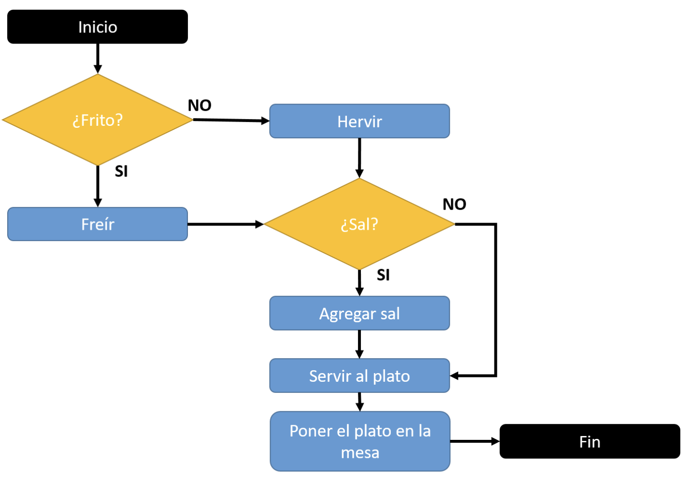
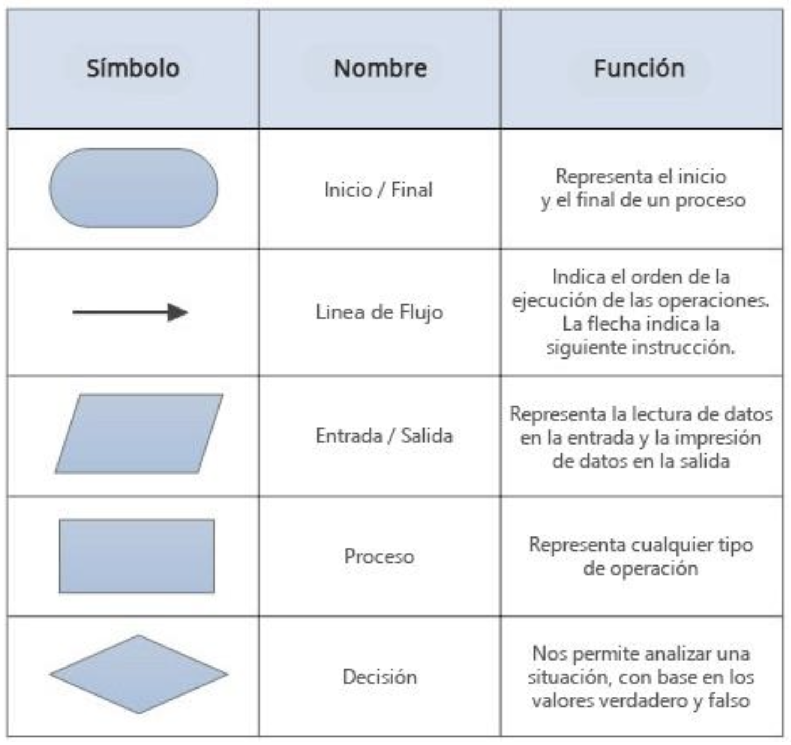

# 1. El entorno de programación python

## El entorno de programación python

Python es un lenguaje de propósito general que se destaca por su facilidad de uso y su sintaxis intuitiva. A diferencia de otros lenguajes, no requiere de una compilación previa, ya que es interpretado, lo que facilita la depuración y el desarrollo rápido de software. Su naturaleza multiparadigma permite la programación orientada a objetos, funcional e imperativa, brindando flexibilidad para diferentes estilos de desarrollo.

Uno de los sectores donde Python ha ganado gran relevancia es en el desarrollo de sitios web. Gracias a frameworks como Django y Flask, los desarrolladores pueden crear aplicaciones web de manera eficiente y escalable. Django, en particular, es un framework que sigue el principio de "baterías incluidas", proporcionando herramientas para la gestión de bases de datos, autenticación de usuarios y seguridad, entre otras funcionalidades esenciales.

Otra característica clave de Python es su compatibilidad multiplataforma. Un código escrito en Python puede ejecutarse sin modificaciones en Windows, macOS y Linux, lo que permite desarrollar aplicaciones portables y reutilizables. Esto, junto con su tipado dinámico y la facilidad de lectura de su código, lo convierte en una opción atractiva para proyectos de diversa índole.

Además, Python cuenta con una amplia biblioteca estándar y un ecosistema robusto de paquetes externos que amplían sus capacidades. Desde herramientas para análisis de datos y machine learning hasta bibliotecas para el manejo de imágenes y procesamiento de textos, Python ofrece soluciones para una gran variedad de campos y necesidades tecnológicas.

## Instalación y configuración de python

Para comenzar a programar en Python, es necesario instalar el intérprete del lenguaje en el sistema. Python está disponible para múltiples plataformas, incluyendo Windows, macOS y Linux. Se recomienda descargar la última versión estable desde el sitio web oficial de Python (https://www.python.org/), donde se encuentran los instaladores correspondientes para cada sistema operativo.

En sistemas Windows, el proceso de instalación incluye un asistente que permite configurar Python fácilmente, es importante seleccionar la opción "Add Python to PATH" para facilitar el acceso desde la línea de comandos. En macOS y Linux, Python generalmente viene preinstalado, pero en caso de necesitar una versión específica, se pueden utilizar gestores de paquetes como brew en macOS o apt
en distribuciones de Linux basadas en Debian.

Una vez instalado, se puede verificar su correcta instalación abriendo una terminal y ejecutando el comando `python --version` o `python3 --version`, dependiendo de la configuración del sistema. Esto mostrará la versión instalada de Python, confirmando que el intérprete está funcionando correctamente.

Además, es recomendable instalar pip, el gestor de paquetes de Python, que facilita la instalación de bibliotecas externas. En la mayoría de las instalaciones modernas, pip ya viene incluido con Python. Se puede verificar su disponibilidad ejecutando pip --version y, en caso de ser necesario, actualizarlo con `pip install --upgrade pip`. Contar con pip permite ampliar las funcionalidades del lenguaje mediante la instalación de paquetes adicionales según las necesidades del proyecto.

## La consola de comandos y el entorno interactivo

Python ofrece una interfaz interactiva que permite ejecutar comandos directamente desde la línea de comandos, facilitando la prueba y el desarrollo de código. Esta funcionalidad permite a los programadores experimentar con instrucciones y obtener resultados de inmediato, lo que resulta útil para depuración y aprendizaje.

Para acceder al entorno interactivo en Windows, macOS o Linux, basta con abrir una terminal y escribir `python` o `python3`, según la versión instalada. Una vez dentro, se pueden ejecutar comandos y ver su resultado en tiempo real. Para salir del intérprete interactivo, se puede utilizar el comando `exit()` o la combinación de teclas Ctrl + D en sistemas Unix y Ctrl + Z en Windows.

El entorno interactivo también permite acceder a documentación y explorar funcionalidades mediante el uso de la función help(), que muestra información detallada sobre módulos, funciones y objetos. Además, comandos como dir() permiten listar los atributos de un objeto, y type() ayuda a conocer el tipo de una variable o expresión.

Existen alternativas avanzadas al intérprete interactivo estándar, como IPython y Jupyter Notebook. IPython proporciona una experiencia mejorada con características como autocompletado y resaltado de sintaxis, mientras que Jupyter Notebook permite combinar código, texto y gráficos en una misma interfaz, siendo especialmente útil en el análisis de datos y la ciencia de datos.

## Archivos .py y .pyw: escritura y ejecución de scripts en python

Python permite la escritura y ejecución de programas en archivos con extensión .py, los cuales contienen código fuente del lenguaje. Estos archivos pueden ser ejecutados directamente desde la línea de comandos o importados como módulos en otros programas. Su uso es fundamental en el desarrollo de software, ya que, permite organizar el código en scripts reutilizables y estructurados.

Para ejecutar un archivo .py, se debe utilizar la terminal o línea de comandos e ingresar python nombre_del_archivo.py , esto iniciará la ejecución del código contenido en el archivo. Es importante asegurarse de que el intérprete de Python
esté correctamente instalado y configurado en el sistema, para evitar errores durante la ejecución.

Por otro lado, los archivos con extensión .pyw son similares a los .py, pero están diseñados para ejecutarse sin abrir una ventana de consola en sistemas Windows. Esto es particularmente útil cuando se desarrollan aplicaciones con interfaces gráficas, ya que, evita la aparición innecesaria de la terminal durante la ejecución del programa.

El uso adecuado de archivos .py y .pyw permite a los desarrolladores crear programas organizados y modulares, mejorando la legibilidad y mantenimiento del código. Además, facilita la integración de scripts en proyectos más grandes permitiendo la reutilización de código, y el desarrollo de soluciones escalables y eficientes.

## Sincronía de la ejecución en python

Python ejecuta el código de manera secuencial, línea por línea, lo que implica que cada instrucción debe completarse antes de pasar a la siguiente. Este comportamiento secuencial es característico de los lenguajes de programación interpretados, lo que facilita la depuración y el seguimiento de errores en el flujo de ejecución del programa.

En ciertos casos, puede ser necesario manejar tareas que requieren múltiples procesos en ejecución simultáneamente. Python ofrece herramientas para gestionar la sincronización de tareas mediante el uso de hilos (threading), procesos (multiprocessing) y la programación asíncrona (asyncio). Estas técnicas permiten optimizar el rendimiento de las aplicaciones cuando se necesita ejecutar
tareas en paralelo.

El módulo threading permite ejecutar múltiples hilos dentro del mismo proceso, facilitando la ejecución de tareas en segundo plano. Sin embargo, debido a la presencia del Global Interpreter Lock (GIL), los hilos no pueden ejecutar múltiples instrucciones de Python al mismo tiempo en procesadores multinúcleo, lo que puede ser una limitación en ciertos escenarios.

Por otro lado, la programación asíncrona en Python, basada en el módulo `asyncio`, permite la ejecución de múltiples tareas sin bloquear la ejecución del programa. Este enfoque es útil en aplicaciones que dependen de operaciones de entrada y salida (I/O), como el acceso a bases de datos o solicitudes a servidores web, mejorando la eficiencia y reduciendo los tiempos de espera.

## El administrador de paquetes PIP

PIP (Python Package Installer) es la herramienta oficial para la gestión de paquetes en Python. Permite instalar, actualizar y eliminar bibliotecas de terceros que amplían las funcionalidades del lenguaje. PIP trabaja en conjunto con el repositorio PyPI (Python Package Index), donde se encuentran miles de paquetes disponibles para distintas aplicaciones.

El uso de PIP facilita el desarrollo de proyectos al permitir la integración de módulos externos sin necesidad de implementarlos desde cero. Con un simple comando, los desarrolladores pueden instalar paquetes que brindan funcionalidades como manipulación de datos, aprendizaje automático, desarrollo web y más. Gracias a su sencillez, PIP es una herramienta esencial en el ecosistema de Python.

Además de la instalación de paquetes individuales, PIP permite la gestión de dependencias mediante archivos de requisitos (requirements.txt). Estos archivos contienen una lista de paquetes y sus versiones específicas, lo que asegura la coherencia del entorno de desarrollo en diferentes sistemas. Esto resulta especialmente útil en entornos colaborativos y en el despliegue de aplicaciones.

PIP también cuenta con opciones avanzadas para la gestión de paquetes, como la instalación desde archivos locales, la creación de entornos virtuales y la actualización masiva de bibliotecas. Su versatilidad y facilidad de uso lo convierten en una herramienta imprescindible para cualquier desarrollador de Python, permitiendo mejorar la eficiencia y productividad en el desarrollo de software.

## Conceptos básicos de python

Python es un lenguaje de programación de alto nivel con una sintaxis sencilla y legible, lo que facilita su aprendizaje y uso. Su estructura se basa en bloques de código organizados por indentación, lo que mejora la claridad del código y reduce
la posibilidad de errores sintácticos.

Uno de los conceptos fundamentales en Python es la instrucción `print()`, que permite mostrar información en la salida estándar. Esta función es ampliamente utilizada para depuración y visualización de resultados en programas. Junto con `print()`, las operaciones aritméticas básicas como suma, resta, multiplicación y división son esenciales para cualquier programa, permitiendo realizar cálculos de
manera eficiente.

La sintaxis de Python también incluye la declaración y uso de variables, que pueden almacenar diferentes tipos de datos sin necesidad de especificar su tipo explícitamente. Esto se debe a que Python es un lenguaje de tipado dinámico, lo que significa que el tipo de una variable se determina en tiempo de ejecución. Además, Python cuenta con métodos predefinidos que facilitan la manipulación de datos y estructuras.

Otro aspecto clave de Python es su sistema de comentarios, que permite documentar el código mediante el uso del carácter #. Los comentarios ayudan a mejorar la legibilidad del código y facilitan su mantenimiento, especialmente en proyectos de gran escala. La combinación de estas características hace de Python un lenguaje accesible y poderoso para una amplia variedad de aplicaciones.

## Sintaxis básica en python

La sintaxis de Python está diseñada para ser clara y concisa, lo que facilita su aprendizaje y uso. A diferencia de otros lenguajes de programación, Python utiliza la indentación para definir bloques de código, en lugar de llaves {} o palabras clave específicas. Esto obliga a los programadores a mantener un código bien estructurado y legible.

Las variables en Python no requieren una declaración previa ni especificar su tipo de dato, ya que el lenguaje maneja el tipado dinámico. Esto significa que el tipo de una variable se determina en tiempo de ejecución según el valor que se le asigne. Python admite múltiples tipos de datos como enteros, flotantes, cadenas de texto y booleanos, los cuales pueden manipularse con métodos predefinidos.

Otro aspecto fundamental de la sintaxis de Python es la identificación de métodos y funciones, que siguen un esquema de nombres en minúscula
separados por guiones bajos (snake_case). Además, el lenguaje permite el uso de comentarios mediante el símbolo #, lo que facilita la documentación del código sin afectar su ejecución.

Python también ofrece estructuras de control como if, for y while, que permiten la toma de decisiones y la ejecución repetitiva de instrucciones. Estas estructuras se escriben de manera clara y legible, eliminando la necesidad de caracteres adicionales para su delimitación. La simplicidad de la sintaxis de Python lo convierte en una opción ideal para el desarrollo de software en diversos ámbitos. 

## Nombres de variables en python

En Python, los nombres de las variables deben seguir ciertas reglas y convenciones para garantizar la claridad y la compatibilidad del código. Las variables deben comenzar con una letra o un guión bajo (_), y pueden contener letras, números y guiones bajos, pero no pueden iniciar con un número ni contener espacios o caracteres especiales.

Python distingue entre mayúsculas y minúsculas en los nombres de las variables, lo que significa que variable y Variable son diferentes. Se recomienda utilizar nombres descriptivos y seguir la convención snake_case, donde las palabras se separan con guiones bajos para mejorar la legibilidad.

El lenguaje también cuenta con palabras reservadas que no pueden utilizarse como nombres de variables, como if, for, while, return, entre otras. Estas palabras tienen un significado especial dentro del lenguaje y su uso incorrecto puede
generar errores de sintaxis.

El uso adecuado de los nombres de variables no solo mejora la legibilidad del código, sino que también facilita la colaboración en proyectos de equipo. Mantener una nomenclatura clara y coherente permite que otros programadores comprendan rápidamente la funcionalidad de cada variable dentro del programa.

## Métodos en python

En Python, un método es una función que está asociada a un objeto y que puede ser invocada para operar sobre ese objeto. Los métodos se definen dentro de clases y pueden acceder a los atributos y otras funciones del objeto al que pertenecen.

Existen dos tipos principales de métodos en Python: los métodos de instancia y los métodos de clase. Los métodos de instancia son aquellos que operan sobre una instancia específica de una clase y requieren el uso de self como primer argumento. Por otro lado, los métodos de clase utilizan el decorador `@classmethod` y trabajan con la clase en sí en lugar de una instancia específica.

Python también permite la creación de métodos estáticos mediante el decorador `@staticmethod`. Estos métodos no dependen ni de la instancia ni de la clase, por lo que pueden utilizarse como funciones independientes dentro de una clase sin modificar su estado interno.

El uso adecuado de métodos en Python facilita la reutilización y estructuración  del código, promoviendo la encapsulación y la modularidad. Definir métodos claros y bien organizados es fundamental para la creación de programas eficientes y fáciles de mantener.

## Identación en python

La identación en Python es un aspecto fundamental de su sintaxis, ya que se utiliza para definir la estructura del código en lugar de llaves {} o palabras clave específicas. Cada bloque de código dentro de estructuras como funciones, bucles y condiciones debe estar correctamente indentado para que el intérprete pueda interpretar la jerarquía de instrucciones.

Python recomienda el uso de cuatro espacios por nivel de identación, aunque también se puede utilizar un tabulador. Es importante ser consistente en su uso dentro de un mismo programa, ya que mezclar espacios y tabulaciones puede generar errores de sintaxis.

La identación no solo mejora la claridad y legibilidad del código, sino que también evita errores en la ejecución. Si una línea de código no está correctamente indentada dentro de un bloque, el intérprete generará un error y detendrá la ejecución del programa.

En comparación con otros lenguajes que utilizan llaves para definir bloques de código, la identación en Python obliga a los programadores a seguir buenas prácticas de escritura, promoviendo una estructura clara y fácil de mantener en el desarrollo de software.

## Comentarios en python

Los comentarios en Python son líneas de texto dentro del código que no se ejecutan y sirven para documentar y explicar su funcionamiento. Son fundamentales para mejorar la legibilidad y facilitar el mantenimiento del código, especialmente en proyectos colaborativos o de gran tamaño.

En Python, los comentarios de una sola línea se indican con el símbolo #. Todo lo que se escriba después de este símbolo en la misma línea será ignorado por el intérprete. También es posible escribir comentarios multilínea utilizando comillas triples (''' o """), aunque estas se suelen emplear más comúnmente para documentar funciones y clases.

El uso adecuado de comentarios permite aclarar la lógica detrás de secciones complejas del código, lo que facilita su comprensión por otros programadores o por el mismo autor en el futuro. Sin embargo, se recomienda no abusar de los comentarios en exceso y escribir código autoexplicativo siempre que sea posible.

Python también emplea los comentarios como una herramienta para deshabilitar temporalmente líneas de código sin eliminarlas. Esto es útil durante la depuración y el desarrollo, ya que permite probar distintas soluciones sin modificar permanentemente el código original.

## Manejo de módulos en python

Los módulos en Python son archivos que contienen definiciones y funciones reutilizables, lo que permite organizar mejor el código y evitar la repetición innecesaria. Un módulo puede incluir variables, funciones y clases, y puede ser importado en otros programas para su uso.
Para utilizar un módulo en Python, se emplea la instrucción import seguida del nombre del módulo. Python proporciona una extensa biblioteca estándar con módulos incorporados, como math para operaciones matemáticas, datetime para manejo de fechas y os para interactuar con el sistema operativo.

También es posible importar sólo partes específicas de un módulo utilizando la sintaxis from módulo import función. Esto permite acceder directamente a funciones o variables sin necesidad de hacer referencia al nombre del módulo en cada llamada.

Además de los módulos incorporados, los usuarios pueden crear sus propios módulos y organizarlos en paquetes, que son carpetas que contienen múltiples módulos. Esta estructura facilita la modularidad y escalabilidad de los programas, permitiendo desarrollar aplicaciones más organizadas y fáciles de mantener.

## Módulos como scripts en python

En Python, un módulo no solo puede ser utilizado para definir funciones y variables reutilizables, sino que también puede ejecutarse como un script independiente. Esto permite que un archivo .py tenga una doble funcionalidad: ser importado como un módulo en otros programas o ejecutarse por sí mismo.

Para diferenciar cuándo un módulo está siendo importado y cuándo está siendo ejecutado directamente, se utiliza la construcción if `__name__ == "__main__"`:. Este bloque de código permite que ciertas instrucciones se ejecuten sólo si el archivo se ejecuta de manera independiente y no cuando es importado en otro script.

El uso de módulos como scripts es útil para pruebas y desarrollo de código, ya que permite verificar el funcionamiento de funciones y clases antes de integrarlas en un proyecto mayor. Además, esta práctica ayuda a la organización del código, manteniendo funciones reutilizables separadas de la lógica de ejecución principal.

Python también permite definir módulos ejecutables que reciben argumentos desde la línea de comandos mediante la biblioteca sys. Esto facilita la creación de herramientas personalizadas que pueden aceptar parámetros al ser ejecutadas, mejorando la versatilidad y utilidad de los programas desarrollados en Python.

## Ruta de búsqueda de módulos en python

Cuando se importa un módulo en Python, el intérprete sigue un proceso de búsqueda para localizar el archivo correspondiente. Esta búsqueda se realiza en una secuencia predefinida de ubicaciones, comenzando con el directorio del script en ejecución, seguido de los directorios especificados en la variable de entorno PYTHONPATH y finalmente la biblioteca estándar de Python.

Python almacena la ruta de búsqueda de módulos en la lista `sys.path`, que puede ser consultada y modificada utilizando el módulo `sys`. Esto permite agregar directorios personalizados a la búsqueda de módulos, facilitando la importación de archivos ubicados fuera del directorio del script principal.

Si un módulo no es encontrado en las rutas predefinidas, Python genera un error de importación (`ModuleNotFoundError`). Para evitar este problema, es recomendable asegurarse de que el módulo se encuentra en una ubicación accesible y correctamente estructurada dentro del proyecto.

El conocimiento de la ruta de búsqueda de módulos es esencial para el desarrollo de aplicaciones modulares y escalables en Python. Comprender cómo el intérprete localiza e importa archivos permite organizar el código de manera eficiente y evitar conflictos en la gestión de dependencias.

## Archivos compilados en python

Cuando un módulo de Python es importado por primera vez, el intérprete lo compila automáticamente en un archivo de código de bytes con extensión `.pyc`. Estos archivos contienen una versión optimizada del código fuente, que puede ejecutarse más rápidamente en futuras importaciones. Los archivos `.pyc` se almacenan dentro de un directorio especial llamado `__pycache__`.

La compilación de módulos en Python ayuda a mejorar el rendimiento al evitar que el código fuente sea interpretado nuevamente en cada ejecución. Si el código fuente del módulo cambia, Python detectará la modificación y recompilará automáticamente el archivo `.pyc` correspondiente.

Además de los archivos `.pyc`, Python permite la distribución de módulos en forma de archivos `.pyo` y `.pyz`, que contienen versiones optimizadas del código para su ejecución eficiente. Estos archivos se utilizan comúnmente en entornos de producción donde se busca minimizar el tiempo de carga de los módulos.

Es importante comprender el proceso de compilación en Python, ya que puede influir en la distribución y el desempeño de aplicaciones. Mantener organizados los archivos compilados y conocer su propósito facilita la gestión de dependencias y la optimización del tiempo de ejecución del programa.

## La función DIR() en python

La función `dir()` en Python es una herramienta que permite inspeccionar los atributos y métodos disponibles dentro de un objeto, módulo o clase. Se utiliza comúnmente para explorar los elementos internos de una estructura y comprender su funcionalidad sin necesidad de consultar documentación externa.

Cuando `dir()` se usa sin argumentos, devuelve una lista con los nombres de los identificadores actualmente disponibles en el entorno global del programa. Esto permite conocer las variables, funciones y módulos cargados en memoria en un
momento determinado.

Si `dir()` se aplica a un objeto específico, como un módulo o una instancia de clase, devuelve una lista de los métodos y atributos que dicho objeto contiene. Esto es útil para analizar la estructura de módulos externos, facilitando su uso sin necesidad de acceder a la documentación oficial.

El uso de `dir()` en Python es especialmente beneficioso en entornos interactivos y de desarrollo, ya que permite explorar la funcionalidad de objetos de manera rápida y eficiente. Comprender esta herramienta ayuda a los programadores a optimizar su flujo de trabajo y a aprovechar mejor las capacidades del lenguaje.

## Manejo de paquetes en python

En Python, un paquete es una forma de organizar múltiples módulos en una estructura de carpetas. Los paquetes permiten una mejor modularidad y escalabilidad en el desarrollo de software, facilitando la reutilización del código y
su mantenimiento.

Para que un directorio sea reconocido como un paquete en Python, debe contener un archivo especial llamado `__init__.py`. Este archivo puede estar vacío o contener código de inicialización para el paquete, como la importación de submódulos o configuraciones predeterminadas.
Los paquetes pueden ser importados de la misma manera que los módulos individuales utilizando la instrucción import paquete. También es posible importar submódulos o funciones específicas mediante la sintaxis `from paquete import modulo`. Esto permite acceder únicamente a las partes necesarias del paquete sin cargar elementos innecesarios en la memoria.

El manejo adecuado de paquetes en Python es crucial en proyectos de gran escala, ya que ayuda a mantener una organización clara y eficiente del código. Además, facilita la distribución de bibliotecas y herramientas desarrolladas por terceros, permitiendo su instalación y uso mediante gestores de paquetes como `pip`.

## Importación y referencias internas en paquetes

En Python, la importación de módulos dentro de un paquete permite la estructuración eficiente del código, facilitando su reutilización y organización. Un paquete puede contener múltiples módulos, y estos pueden ser referenciados entre sí mediante importaciones internas.

Para importar un módulo dentro del mismo paquete, se puede utilizar una importación relativa con la sintaxis `from . import modulo` o `from .subpaquete import modulo`. Esto es útil para evitar conflictos con otros módulos externos que puedan tener el mismo nombre y mantener la cohesión dentro del paquete.

Las importaciones absolutas, en cambio, se realizan especificando el nombre completo del paquete y el módulo deseado. Por ejemplo, `import paquete.modulo` asegura que se está accediendo a un módulo específico dentro de un paquete sin depender de la estructura relativa del directorio.

El uso adecuado de las referencias internas en paquetes permite mantener la modularidad y escalabilidad del código. Siguiendo buenas prácticas en la organización de importaciones, se evita la redundancia y se optimiza el acceso a las funcionalidades definidas dentro de un paquete.

## Paquetes en múltiples directorios

En Python, un paquete puede estar distribuido en múltiples directorios, permitiendo una mejor organización y escalabilidad en proyectos de gran tamaño. Esta estructura facilita la separación de componentes y evita la sobrecarga de archivos en un solo directorio.

Para que un paquete distribuido en varios directorios funcione correctamente, es necesario mantener un archivo `__init__.py` en cada subdirectorio del paquete. Este archivo puede estar vacío o contener inicializaciones específicas para el módulo, permitiendo una importación coherente de los elementos dentro del paquete.

Los paquetes distribuidos en múltiples directorios pueden ser gestionados mediante variables de entorno o utilizando la lista sys.path. Al agregar directorios adicionales a `sys.path`, es posible acceder a módulos ubicados fuera del directorio base del proyecto, asegurando su disponibilidad para la importación en cualquier parte del código.

El uso de paquetes distribuidos en múltiples directorios es una práctica común en el desarrollo de aplicaciones complejas, ya que permite mantener el código modular y reutilizable. Al estructurar adecuadamente los archivos y definir correctamente las rutas de importación, se facilita la gestión y el mantenimiento del proyecto a largo plazo.

# 2. Tipos de datos y sentencias básicas

## Manejo de Python

### Tipos de datos y sentencias básicas

1. Números

Python maneja varios tipos numéricos, incluyendo:
- Enteros (int): Representan números sin decimales.
- Flotantes (float): Permiten manejar valores con decimales.
- Números complejos (complex): Contienen una parte real e imaginaria.

Los números en Python pueden utilizarse para realizar operaciones matemáticas básicas y avanzadas. También es posible trabajar con módulos como `math` y `random` para realizar cálculos más complejos y generar valores aleatorios.

Además, Python admite la conversión entre tipos numéricos. Por ejemplo, un número entero puede convertirse en flotante o viceversa utilizando `float()` y `int()` respectivamente. Esta flexibilidad es útil en cálculos precisos.

Las operaciones matemáticas incluyen suma (+), resta (-), multiplicación (*), división (/), división entera (//), módulo (%) y exponenciación (**). Estas permiten manipular los valores numéricos eficientemente.

El uso de operadores matemáticos en Python también incluye el uso de funciones avanzadas con la librería math, que proporciona métodos para realizar cálculos trigonométricos, logarítmicos y exponenciales.

Python maneja la precisión en cálculos decimales mediante la biblioteca decimal, lo que permite un control más preciso de los números con decimales y evitar errores de redondeo en cálculos financieros o científicos.

Ejemplo Práctico:

```python
import math

num1 = 10
num2 = 3.14
num3 = 2 + 3j

print(type(num1), type(num2), type(num3))
print(math.sqrt(16)) #Raíz cuadrada
print(math.pi) #Valor de pi
```

2. Cadenas de Caracteres (str)

Las cadenas representan secuencias de caracteres y se pueden definir con comillas simples o dobles.

Las cadenas en Python permiten múltiples operaciones, como la concatenación, la repetición, la búsqueda de caracteres y la conversión de mayúsculas a minúsculas. Además, Python ofrece la interpolación de cadenas mediante f-strings y el método `.format()`.

Las cadenas en Python son inmutables, lo que significa que una vez creadas, su contenido no puede modificarse. Sin embargo, se pueden crear nuevas cadenas basadas en operaciones con cadenas existentes.

Python proporciona varios métodos de manipulación de cadenas, como `strip()`, `replace()`, `find()`, y `split()`, que facilitan el manejo de texto en diferentes contextos, desde análisis de datos hasta procesamiento de lenguaje natural.

Además, las cadenas pueden contener caracteres especiales y secuencias de escape, como `\n` para nueva línea o `\t` para tabulación, permitiendo la estructuración adecuada de textos.

Python también admite cadenas multilínea mediante el uso de triples comillas (''' o """), lo que permite almacenar grandes cantidades de texto sin necesidad de concatenar múltiples líneas.

Ejemplo Práctico:

```python
cadena = "Hola, Python"
print(cadena.lower())
print(cadena.upper())
print(cadena.split(,))
nombre = "Carlos"
edad = 30
print(f'Mi nombre es {nombre} y tengo {edad} años.')
```

## 3. Listas (list)

Las listas en Python son estructuras de datos ordenadas y mutables que pueden contener diferentes tipos de elementos. Se crean utilizando corchetes [] y pueden modificarse agregando o eliminando elementos según sea necesario.

Una característica importante de las listas es su flexibilidad. Se pueden utilizar para almacenar una variedad de datos, incluyendo números, cadenas e incluso otras listas. También permiten acceder a elementos individuales mediante
índices, comenzando desde 0.

Las listas admiten diversas operaciones, como la concatenación, la repetición y la modificación de elementos. Además, Python ofrece múltiples métodos para manipular listas, como `append()`, `remove()`, `pop()`, `sort()`, y `reverse()`, los cuales facilitan el trabajo con datos en estructuras dinámicas.

Python también permite el uso de comprensión de listas (list comprehension), lo que permite crear listas de manera eficiente a partir de otras iterables de manera concisa y rápida.

Ejemplo práctico:

```python
mi_lista = [1, 2, 3, "cuatro", True]
mi_lista.append(5) # Agregar 5 al final de la lista
mi_lista.remove(2) # Eliminar un elemento específico
print(mi_lista) # Imprimir lista modificada
print(mi_lista[1]) # Acceder al segundo elemento
```

## 4. Diccionarios (dict)

Los diccionarios en Python son estructuras de datos que almacenan pares clave-valor, lo que permite acceder rápidamente a valores mediante una clave específica. Se crean utilizando llaves {} y son altamente eficientes para buscar, actualizar y eliminar datos.

Un diccionario puede almacenar cualquier tipo de datos en sus valores, y las claves pueden ser de cualquier tipo inmutable, como cadenas, números o tuplas.

Los diccionarios son ampliamente utilizados para estructurar datos en aplicaciones prácticas.

Python ofrece métodos específicos para trabajar con diccionarios, como `keys()`, `values()`, `items()`, `get()`, y `update()`, permitiendo una fácil manipulación de la información almacenada.

Ejemplo práctico:

```python
mi_diccionario = {"nombnre" : "Python", "version" : 3.10}
mi_diccionario["año"] = 2024 # Agregar un nuevo par clave-valor
print(mi_diccionario["nombre"]) # Imprimir el valor de una clave
```

## 5. Tuplas (tuple)

Las tuplas en Python son similares a las listas, pero con la diferencia clave de que son inmutables, es decir, no pueden modificarse después de su creación. Se crean utilizando paréntesis () y son ideales cuando se necesita almacenar datos que no deben cambiar.

Las tuplas pueden almacenar cualquier tipo de dato y se pueden acceder a sus elementos mediante índices, al igual que las listas. Sin embargo, debido a su inmutabilidad, no permiten agregar ni eliminar elementos una vez definidas.

Python proporciona algunos métodos útiles para trabajar con tuplas, como `count()` y `index()`, que permiten obtener información sobre la cantidad de veces que aparece un elemento y su posición en la tupla.

Ejemplo práctico:

```python
mi_tupla = (10, 20, 30)
print(mi_tupla[1]) # Imprimir el segundo elemento
print(len(mi_tupla)) # Imprimir la longitud de la tupla
```

## 6. Conjuntos (set)

Los conjuntos en Python (set) son estructuras de datos desordenadas que almacenan elementos únicos, es decir, no permiten duplicados. Se crean utilizando llaves {} y son útiles para realizar operaciones matemáticas como uniones e intersecciones.

Los conjuntos son especialmente útiles cuando se necesita eliminar duplicados de una colección de datos y cuando se requiere realizar operaciones de teoría de conjuntos, como diferencias y verificaciones de pertenencia.

Python ofrece varios métodos para manipular conjuntos, como `add()`, `remove()`, `union()`, `intersection()`, y `difference()`, los cuales permiten realizar operaciones avanzadas de manera sencilla.

Ejemplo práctico:

```python
mi_conjunto = {1, 2, 3, 3, 4, 4, 5}
mi conjunto.add(6) # Agrega un nuevo elemento
mi conjunto.remove(3) # Elimina un elemento
print(mi_conjunto) # Imprime el conjunto sin duplicados
```

## 7. Booleanos (bool)

Los valores booleanos en Python representan True o False y son fundamentales para evaluar condiciones lógicas. Se utilizan principalmente en estructuras de control, como sentencias if, bucles y operadores lógicos.

Python interpreta ciertos valores como False, como 0, None, listas vacías y cadenas vacías, mientras que cualquier otro valor se evalúa como True. Esto permite utilizar booleanos implícitamente en muchas situaciones de programación.

Los operadores lógicos en Python incluyen and, or y not, que permiten combinar expresiones booleanas para realizar evaluaciones más complejas.

Ejemplo práctico:

```python
es_mayor = 10 > 5 # True
es_igual = 10 == 5 # False
print(es_mayor and es_igual) # Evaluación lógica
```

## 3. Operadores y comparaciones

### 1. Operadores Aritméticos

Los operadores aritméticos en Python permiten realizar operaciones matemáticas básicas, como suma, resta, multiplicación y división. Son esenciales para manipular valores numéricos en cálculos matemáticos y estructuras de control.

Los principales operadores aritméticos en Python incluyen:

```
+ Suma: Permite agregar valores numéricos.
- Resta: Se usa para sustraer valores numéricos.
* Multiplicación: Multiplica dos valores.
/ División: Devuelve un resultado flotante.
// División entera: Descarta los decimales.
% Módulo: Devuelve el residuo de una división.
** Potenciación: Eleva un número a una potencia.
```

### 2. Operadores de Comparación

Los operadores de comparación permiten evaluar relaciones entre valores y devuelven un valor booleano (True o False). Son fundamentales en estructuras condicionales y bucles.

Los principales operadores de comparación incluyen:
```
== Igualdad: Compara si dos valores son iguales.
!= Diferente: Verifica si dos valores no son iguales.
> Mayor que: Determina si un valor es mayor que otro.
< Menor que: Verifica si un valor es menor que otro.
>= Mayor o igual que: Determina si un valor es mayor o igual que otro.
<= Menor o igual que: Verifica si un valor es menor o igual que otro.
```

### 3. Operadores Lógicos

Los operadores lógicos permiten combinar expresiones booleanas y evaluar condiciones complejas. Se utilizan comúnmente en estructuras condicionales y bucles.

Los principales operadores lógicos incluyen:
```
and Devuelve True si ambas condiciones son verdaderas.
or Devuelve True si al menos una condición es verdadera.
not Invierte el valor de la expresión booleana.
```

### 4. Operadores de Asignación

Los operadores de asignación combinan operaciones aritméticas con la asignación de valores.

Los principales operadores de asignación incluyen:
```
= Asignación simple: Asigna un valor a una variable.
+= Suma y asignación: Incrementa el valor de la variable.
-= Resta y asignación: Decrementa el valor de la variable.
*= Multiplicación y asignación: Multiplica y asigna el resultado.
/= División y asignación: Divide y asigna el resultado.
//= División entera y asignación: Realiza división entera y asigna el resultado.
%= Módulo y asignación: Calcula el residuo y lo asigna.
**= Potenciación y asignación: Calcula la potencia y la asigna.
```

## 4. Estructuras de control

### 1. Sentencia if

La sentencia if permite ejecutar bloques de código de manera condicional, según si una expresión booleana es verdadera o falsa. Esto permite realizar evaluaciones y tomar decisiones dentro de un programa.
La estructura de una sentencia if en Python es la siguiente:

```python
if condicion:
    # Bloque de código que se ejecuta si la condición es verdadera
```

También se pueden agregar condiciones adicionales con elif y un bloque alternativo con else:
Ejemplo práctico:

```python
if condicion1:
    # Código si la condicion1 es verdadera
elif condicion2:
    # Código si la condicio1 es falsa y la condicion2 es verdadera
else:
    # Código si ninguna de las condiciones anteriores se cumple
```

### 2. Sentencia for

El bucle for se utiliza para iterar sobre elementos de una secuencia, como listas, cadenas o rangos numéricos. Es útil para recorrer datos y ejecutar bloques de código múltiples veces.
La estructura de un bucle for en Python es la siguiente:

```python
for variable in secuencia:
    # Bloque de codigo a ejecutar en cada iteración
```

### 3. Sentencia while

El bucle while ejecuta un bloque de código mientras una condición se mantenga verdadera. Se utiliza cuando el número de iteraciones no está definido de antemano.

La estructura de un bucle while en Python es:

```python
while condicion:
    # Bloque de código a ejecutar mientras la condicion sea verdadera
```

```python
contador = 0

while contador < 5:
    print(f'Contador: {contador}')
    contador += 1
```

### 4. Sentencias break y continue

Las sentencias break y continue permiten alterar el flujo de ejecución de un bucle.
- break: Termina el bucle inmediatamente.
- continue: Salta a la siguiente iteración sin ejecutar las líneas restantes del bucle.

Ejemplo práctico:
```python
for i in range(10):
    if i == 5:
        break # Se detiene en la ejecución del bucle cuando i es igual a 5
    print(i)

for i in range(10):
    if i % 2 == 0:
        continue # Se salta los números pares
    print(i)
```

### 5. Sentencia pass

La sentencia pass se utiliza cuando una estructura de control requiere un bloque de código, pero no se quiere ejecutar ninguna acción en ese momento. Se usa como marcador de posición.

Ejemplo práctico:

```python
for i in range(5):
    if i == 3:
        pass # No hace nada, pero evita errores de sintaxis
    else:
        print(i)
```

## 5. Creación y manipulación de objetos en python

Python es un lenguaje orientado a objetos, lo que significa que todo en Python es un objeto, desde números y cadenas hasta listas y funciones.

### 1. Creación de Objetos
Para crear un objeto en Python, se define una clase y luego se instancian objetos a partir de ella.

Ejemplo práctico:

```python
class Persona():
    def __init__(self, nombre, edad):
        self.nombre = nombre
        self.edad = edad

persona1 = Persona('Carlos', 30)
print(persona1.nombre) # Carlos
```

### 2. Manipulación de Atributos de un Objeto

Los atributos de un objeto pueden modificarse dinámicamente después de laccreación del objeto.

Ejemplo práctico:

```python
persona1.edad = 31 # Cambiamos el valor de un atributo
print(persona1.edad) # 31
```

También se pueden agregar atributos dinámicamente.

```python
persona1.apellido = 'Gómez'
print(persona1.apellido) # Gómez
```

# 3. Sentencias condicionales

## Introducción a condicionales

Las condicionales son una de las estructuras de control más importantes en la programación, ya que permiten que un programa tome decisiones basadas en condiciones específicas. A través de las condicionales, un programa puede ejecutar diferentes bloques de código según si una condición es verdadera o falsa, lo que permite una gran flexibilidad y adaptabilidad en el flujo de ejecución del software.

### ¿Qué son las condiciones?

Las condicionales permiten a los programas tomar decisiones y ejecutar diferentes acciones en función de ciertas condiciones. Estas condiciones se expresan en forma de expresiones booleanas que se evalúan como VERDADERO o FALSO. Dependiendo del resultado de esta evaluación, el programa puede seguir diferentes caminos de ejecución. Las estructuras condicionales más básicas son el if, el else y el else if, que se usan para definir qué se debe hacer en función de una o más condiciones.

### ¿Cómo funcionan las condicionales?

El funcionamiento de las condicionales se basa en la evaluación de expresiones booleanas. Cuando se encuentra una estructura condicional en el código, el programa evalúa la condición dentro del if y, si la condición es VERDADERO, ejecuta el bloque de código asociado. Si la condición es FALSO, el programa puede saltar al siguiente bloque de código, como un else o else if, si están presentes.

## Tipos de condicionales

- if: Ejecuta un bloque de código si una condición específica es VERDADERO.

Ejemplo en pseudocódigo:

```
SI (edad >= 18) ENTONCES
    ESCRIBIR "Eres mayor de edad"
FIN SI
```

Descripción: Aquí, el mensaje "Eres mayor de edad" se imprime solo si la condición edad >= 18 es VERDADERO.

Ejemplo en Python:

```python
edad = 18 # Puedes cambiar este valor para probar
if edad >= 18:
    print("Eres mayor de edad")
```

- else: Ejecuta un bloque de código si la condición en el if es FALSO.

Ejemplo en pseudocódigo:

```
SI (edad >= 18) ENTONCES
    ESCRIBIR "Eres mayor de edad"
SINO
    ESCRIBIR "Eres menor de edad"
FIN SI
```

Descripción: Si la condición edad >= 18 es FALSO, el programa
imprime "Eres menor de edad".

Ejemplo en Python:

```python
edad = 18 # Puedes cambiar este valor para probar
if edad >= 18:
    print("Eres mayor de edad")
else:
    print("Eres menor de edad")
```

- else if: Permite evaluar múltiples condiciones secuenciales. Si la condición del if es FALSO, se evalúa la condición del else if.

Ejemplo en pseudocódigo:

```
SI (nota >= 90) ENTONCES
    ESCRIBIR "Aprobado con distinción"
SINO SI (nota >= 60) ENTONCES
    ESCRIBIR "Aprobado"
SINO
    ESCRIBIR "Reprobado"
FIN SI
```

Descripción: Dependiendo del valor de nota, el programa imprime un mensaje diferente: "Aprobado con distinción","Aprobado", o "Reprobado".

Ejemplo en Python:

```python
nota = 85 # Puedes cambiar este valor para probar
if nota >= 90:
print("Aprobado con distinción")
elif nota >= 60:
print("Aprobado")
else:
print("Reprobado")
```

### Importancia de las Condicionales

Las condicionales son fundamentales porque permiten que los programas:
- Tomen decisiones dinámicas: Permiten al programa adaptarse a diferentes situaciones y datos en tiempo real.
- Dirijan el flujo de ejecución: Facilitan la ejecución de diferentes bloques de código según las condiciones evaluadas.
- Manejan escenarios complejos: Permiten manejar múltiples caminos en el flujo del programa, adaptándose a diversos casos y situaciones.

## Condicionales simples

Un condicional simple es una estructura básica de control en programación que permite que el programa ejecute un bloque de código sólo si se cumple una condición específica. Esta condición es una expresión booleana que se evalúa como VERDADERO o FALSO. Si la condición es VERDADERO, se ejecuta el código dentro del bloque del condicional; si es FALSO, se omite ese bloque y el programa continúa con la ejecución del siguiente código.

### ¿Qué es un Condicional Simple?

Un condicional simple permite la ejecución condicional de un solo bloque de código en base a una única condición. Es una de las estructuras de control más fundamentales en programación y se usa para determinar si una acción específica debe llevarse a cabo. La estructura básica de un condicional simple se compone de la palabra clave SI, seguida de una condición entre paréntesis y un bloque de código que se ejecuta si la condición se cumple.

#### Ejemplos de Condicionales Simples en Pseudocódigo

Ejemplo de condicional simple con mensaje de bienvenida

```
DEFINIR nombre COMO STRING ← "Ana"
SI (nombre = "Ana") ENTONCES
    ESCRIBIR "Hola, Ana! Bienvenida."
FIN SI
```

Descripción: Este condicional simple evalúa si la variable nombre es igual a "Ana". Si la condición es VERDADERO, el programa imprime "Hola, Ana! Bienvenida.". Si el nombre fuera diferente, el bloque de código dentro del SI no se ejecutaría.

Ejemplo en Python:

```python
nombre = "Ana" # Puedes cambiar este valor para probar
if nombre == "Ana":
    print("Hola, Ana! Bienvenida.")
```

Ejemplo de Condicional Simple con Verificación de Edad

```
DEFINIR edad COMO ENTERO ← 16
SI (edad >= 18) ENTONCES
    ESCRIBIR "Acceso permitido"
FIN SI
```

Descripción: En este caso, el condicional simple verifica si edad es mayor o igual a 18. Si la condición es VERDADERO, el programa imprimirá "Acceso permitido". Si edad es menor que 18, el bloque dentro del SI no se ejecutará.

Ejemplo en Python:

```python
edad = 16 # Puedes cambiar este valor para probar
if edad >= 18:
    print("Acceso permitido")
```

Ejemplo de Condicional Simple con Verificación de Temperatura

```
DEFINIR temperatura COMO ENTERO ← 30
SI (temperatura > 25) ENTONCES
    ESCRIBIR "Hace calor"
FIN SI
```

Descripción: Aquí, el condicional simple evalúa si la temperatura es mayor que 25. Si la condición es VERDADERO, el programa imprime "Hace calor". Si la temperatura es 25 o menor, el bloque dentro del SI no se ejecutará.

Ejemplo en Python: 

```python
temperatura = 30 # Puedes cambiar este valor para probar
if temperatura > 25:
    print("Hace calor")
```

### Importancia de los Condicionales Simples

- Facilitan la toma de decisiones: Permiten que el programa tome decisiones basadas en condiciones específicas, lo que ayuda a controlar el flujo de ejecución.
- Simplifican la lógica del programa: Al proporcionar una forma clara y directa de manejar decisiones simples, los condicionales simples ayudan a mantener el código limpio y comprensible.
- Son la base para estructuras más complejas: Son la base sobre la cual se construyen estructuras condicionales más complejas como else if, switch, y combinaciones de múltiples condiciones.

## Condicionales múltiples

Los condicionales múltiples son una extensión de los condicionales simples que permiten manejar más de una condición de forma secuencial o combinada. A diferencia de los condicionales simples, que solo evalúan una única condición, los condicionales múltiples permiten verificar varias condiciones y tomar decisiones basadas en múltiples criterios, lo que proporciona una mayor flexibilidad en el
flujo de ejecución del programa.

### ¿Qué son los condicionales múltiples?

Los condicionales múltiples permiten la evaluación de varias condiciones en una estructura de control de flujo. Estas estructuras permiten tomar decisiones más complejas al evaluar una condición principal y, si esa condición no se cumple, evaluar condiciones adicionales. Los condicionales múltiples suelen involucrar el uso de else if o sino si para manejar diversas alternativas, y else para una condición por defecto si ninguna de las anteriores es verdadera.

#### Ejemplos de Condicionales Múltiples en Pseudocódigo

Ejemplo de Condicionales Múltiples con Calificación

```
DEFINIR calificacion COMO ENTERO ← 75
SI (calificacion >= 90) ENTONCES
    ESCRIBIR "Calificación A"
SINO SI (calificacion >= 80) ENTONCES
    ESCRIBIR "Calificación B"
SINO SI (calificacion >= 70) ENTONCES
    ESCRIBIR "Calificación C"
SINO
    ESCRIBIR "Calificación D"
FIN SI
```

Descripción: En este ejemplo, el condicional múltiple evalúa la calificacion en una serie de pasos. Primero, verifica si la calificación es 90 o más para asignar "Calificación A". Si no es así, verifica si es 80 o más para asignar "Calificación B", y así sucesivamente. Si ninguna de las condiciones anteriores se cumple, se asigna "Calificación D" como resultado por defecto.

Ejemplo en Python:

```python
calificacion = 75 # Puedes cambiar este valor para probar
if calificacion >= 90:
    print("Calificación A")
elif calificacion >= 80:
    print("Calificación B")
elif calificacion >= 70:
    print("Calificación C")
else:
    print("Calificación D")
```

Ejemplo de Condicionales Múltiples con Estado del Usuario

```
DEFINIR edad COMO ENTERO ← 25
DEFINIR estado COMO STRING ← "Estudiante"
SI (edad < 18) ENTONCES
    ESCRIBIR "Menor de edad"
SINO SI (edad >= 18 Y edad <= 65) ENTONCES
    SI (estado = "Estudiante") ENTONCES
        ESCRIBIR "Adulto estudiante"
    SINO
        ESCRIBIR "Adulto no estudiante"
    FIN SI
SINO
    ESCRIBIR "Persona mayor"
FIN SI
```

Descripción: Este ejemplo muestra cómo combinar condiciones. Primero se evalúa si la edad es menor de 18 para determinar si la persona es un menor de edad. Luego, si la edad está entre 18 y 65, se evalúa si el estado es "Estudiante" para dar un mensaje más específico. Si ninguna de las condiciones anteriores es verdadera, se clasifica a la persona como "Persona mayor".

Ejemplo en Python:

```python
edad = 25 # Podes cambiar este valor para probar
estado = "Estudiante" # Podes cambiar este valor para probar
if edad < 18:
    print("Menor de edad")
elif 18 <= edad <= 65:
    if estado == "Estudiante":
        print("Adulto estudiante")
    else:
        print("Adulto no estudiante")
else:
    print("Persona mayor")
```

Ejemplo de Condicionales Múltiples con Verificación de Edad y Tipo de Membresía

```
DEFINIR edad COMO ENTERO ← 30
DEFINIR tipoMembresia COMO STRING ← "Premium"
SI (edad < 18) ENTONCES
    ESCRIBIR "Acceso restringido para menores"
SINO SI (tipoMembresia = "Premium") ENTONCES
    ESCRIBIR "Acceso completo"
SINO SI (tipoMembresia = "Básico") ENTONCES
    ESCRIBIR "Acceso limitado"
SINO
    ESCRIBIR "Acceso denegado"
FIN SI
```

Descripción: Aquí, el condicional múltiple primero verifica si la edad es menor de 18 para restringir el acceso. Luego, dependiendo del tipoMembresia, se otorgan diferentes niveles de acceso. Si el tipo de membresía no coincide con ninguna de las opciones especificadas, se deniega el acceso.

Ejemplo en Python:

```python
edad = 30 # Puedes cambiar este valor para probar
tipoMembresia = "Premium" # Puedes cambiar este valor para probar
if edad < 18:
    print("Acceso restringido para menores")
elif tipoMembresia == "Premium":
    print("Acceso completo")
elif tipoMembresia == "Básico":
    print("Acceso limitado")
else:
    print("Acceso denegado")
```

### Importancia de los Condicionales Múltiples
- Permiten decisiones complejas: Facilitan la evaluación de múltiples condiciones y la toma de decisiones basadas en una serie de criterios.
- Mejoran la claridad del código: Permiten manejar varias alternativas de manera organizada y clara, evitando el uso excesivo de estructuras anidadas complicadas.
- Facilitan el mantenimiento del código: Al estructurar las decisiones de forma modular y secuencial, los condicionales múltiples permiten hacer ajustes y actualizaciones de manera más sencilla.

## Diagramas de Flujo

La diagramación de algoritmos en programación es una técnica visual que nos permite representar paso a paso la secuencia lógica de un proceso. Es como un mapa que nos guía en la construcción de un programa.

Un Diagrama de flujo es un esquema para representar gráficamente un algoritmo. Se basan en la utilización de diversos símbolos para representar operaciones específicas, es decir, es la representación gráfica de las distintas operaciones que se tienen que realizar para resolver un problema, con indicación expresa del orden lógico en que deben realizarse.

Este se puede usar para explicar detalladamente la lógica detrás de un programa antes de empezar a codificar el proceso automatizado. Puede ayudar a organizar una perspectiva general y ofrecer una guía cuando llega el momento de codificar.

Más específicamente, los diagramas de flujo pueden:
- Demostrar cómo el código está organizado.
- Visualizar la ejecución de un código dentro de un programa.
- Mostrar la estructura de un sitio web o aplicación.
- Comprender cómo los usuarios navegan por un sitio web o programa.

A menudo, los programadores pueden escribir un pseudocódigo, una combinación de lenguaje natural y lenguaje informático que puede ser leído por personas. Esto puede permitir más detalle que el diagrama de flujo y servir como reemplazo del diagrama de flujo o como el próximo paso del código mismo.

Los diagramas relacionados que se emplean en el software informático incluyen:
- Lenguaje unificado de modelado (UML): este es el lenguaje de propósito general usado en la ingeniería de software para el modelado.
- Diagramas Nassi-Shneiderman (NSD): usados para la programación informática estructurada. Llevan el nombre de sus creadores: Isaac Nassi y Ben Shneiderman, quienes los desarrollaron en 1972 en la Universidad Estatal de Nueva York en Stony Brook. También se denominan "estructogramas".
- Diagramas DRAKON: DRAKON es un lenguaje de programación visual de algoritmos empleado para crear diagramas de flujo.

Se les llama diagramas de flujo porque los símbolos utilizados se conectan por medio de flechas para indicar la secuencia de operación.

### Simbología de los diagramas de flujo

Ejemplo de diagrama de flujo para la vida cotidiana:

<div align="center">
    
</div>

La diagramación de algoritmos nos brinda una visión clara y ordenada de cómo deben ejecutarse nuestras acciones, facilitando el análisis y la depuración de posibles errores. Es una parte esencial del proceso de programación que nos
ayuda a construir programas más eficientes y organizados.

<div align="center">
    
</div>

## Switch

La estructura switch es una forma de control de flujo en programación que permite manejar múltiples condiciones de manera más organizada y legible que con múltiples condicionales if-else. El switch evalúa una expresión y ejecuta el bloque de código correspondiente a un valor específico de esa expresión. Esta estructura es particularmente útil cuando se necesita comparar una sola variable contra una serie de posibles valores constantes.

### ¿Qué es un switch?

Un switch es una estructura de control que permite seleccionar uno entre varios bloques de código para ejecutar, basándose en el valor de una expresión. A diferencia de los condicionales if-else, que pueden volverse complejos y difíciles de leer con múltiples ramas, el switch proporciona una forma más clara y compacta de manejar múltiples opciones. Cada caso en el switch representa una
posible coincidencia con el valor de la expresión, y solo el bloque correspondiente al valor coincidente se ejecuta.

#### Ejemplos de switch en Pseudocódigo

Ejemplo de switch con Día de la Semana

```
DEFINIR dia COMO ENTERO ← 3
SEGÚN (dia) HACER
    CASO 1:
        ESCRIBIR "Lunes"
    CASO 2:
        ESCRIBIR "Martes"
    CASO 3:
        ESCRIBIR "Miércoles"
    CASO 4:
        ESCRIBIR "Jueves"
    CASO 5:
        ESCRIBIR "Viernes"
    CASO 6:
        ESCRIBIR "Sábado"
    CASO 7:
        ESCRIBIR "Domingo"
    POR DEFECTO:
        ESCRIBIR "Día inválido"
FIN SEGÚN
```

Descripción: En este ejemplo, la variable dia se compara contra varios valores posibles. Si dia es igual a 3, se imprime "Miércoles". Si dia no coincide con ningún caso especificado, se ejecuta el bloque POR DEFECTO, que maneja valores no válidos.

Ejemplo en Python:

```python
dia = 3 # Puedes cambiar este valor para probar
match dia:
    case 1:
        print("Lunes")
    case 2:
        print("Martes")
    case 3:
        print("Miércoles")
    case 4:
        print("Jueves")
    case 5:
        print("Viernes")
    case 6:
        print("Sábado")
    case 7:
        print("Domingo")
    case _:
        print("Día inválido")
```

Ejemplo de switch con Opciones de Menú

```
DEFINIR opcion COMO ENTERO ← 2
SEGÚN (opcion) HACER
    CASO 1:
        ESCRIBIR "Opción 1 seleccionada"
    CASO 2:
        ESCRIBIR "Opción 2 seleccionada"
    CASO 3:
        ESCRIBIR "Opción 3 seleccionada"
    POR DEFECTO:
        ESCRIBIR "Opción no válida"
FIN SEGÚN
```

Descripción: Aquí, la variable opcion se compara con varios valores posibles. Si opcion es igual a 2, se imprime "Opción 2 seleccionada". Si no coincide con ninguno de los casos, se ejecuta el bloque POR DEFECTO.

Ejemplo en Python:

```python
opcion = 2 # Puedes cambiar este valor para probar
match opcion:
    case 1:
        print("Opción 1 seleccionada")
    case 2:
        print("Opción 2 seleccionada")
    case 3:
        print("Opción 3 seleccionada")
    case _:
        print("Opción no válida")
```

Ejemplo de switch con Categorías de Productos:

```
DEFINIR categoria COMO STRING ← "Electrónica"
SEGÚN (categoria) HACER
    CASO "Electrónica": 
        ESCRIBIR "Categoría: Electrónica"
    CASO "Ropa":
        ESCRIBIR "Categoría: Ropa"
    CASO "Alimentos":
        ESCRIBIR "Categoría: Alimentos"
    POR DEFECTO:
        ESCRIBIR "Categoría desconocida"
FIN SEGÚN
```

Descripción: En este caso, la variable categoria se compara con cadenas de texto específicas. Si categoria es "Electrónica" , se imprime "Categoría: Electrónica". Si no coincide con ningún caso, se ejecuta el bloque POR DEFECTO.

Ejemplo en Python:

```python
categoria = "Electrónica" # Puedes cambiar este valor para probar
match categoria:
    case "Electrónica":
        print("Categoría: Electrónica")
    case "Ropa":
        print("Categoría: Ropa")
    case "Alimentos":
        print("Categoría: Alimentos")
    case _:
        print("Categoría desconocida")
```

### Importancia del switch

- Facilita la lectura y mantenimiento del código: Permite manejar múltiples condiciones de manera más clara y estructurada en comparación con una larga serie de condicionales if-else.
- Optimiza el rendimiento: En algunos lenguajes y compiladores, el switch puede ser optimizado de manera más eficiente que una serie de if-else, especialmente cuando se compara con un gran número de valores.
- Estructura las decisiones de manera organizada: Proporciona una forma de organizar el código cuando se manejan múltiples alternativas basadas en el valor de una sola expresión.

## Uso de Convenciones de Nombres en Variables (snake_case)

En la programación, el uso de convenciones de nombres en variables es fundamental para mejorar la legibilidad del código y facilitar su mantenimiento. Una de las convenciones más utilizadas es snake_case, que consiste en escribir los nombres de las variables en minúsculas, separando las palabras con un guion bajo (_). Esta convención es común en lenguajes como Python, donde se recomienda seguir esta norma en variables y funciones para mejorar la coherencia del código.

Por ejemplo, en Python, una variable que almacena la edad de un usuario debería declararse de la siguiente manera:

```python
edad_usuario = 25
nombre_completo = "Carlos Pérez"
```

El uso de snake_case evita confusiones con otras convenciones, como camelCase (usada en JavaScript y Java), y garantiza que el código sea más fácil de leer y entender.

### Beneficios del Uso de snake_case

El uso de snake_case en variables tiene múltiples ventajas, entre ellas:
1. Legibilidad mejorada: Facilita la comprensión del código, especialmente en proyectos colaborativos.
2. Estándar recomendado: En lenguajes como Python, la convención oficial PEP 8 sugiere el uso de snake_case en nombres de variables y funciones.
3. Evita errores de interpretación: En comparación con camelCase o PascalCase, el uso de guiones bajos mejora la claridad de los nombres largos.

Por ejemplo, si queremos almacenar la dirección de correo de un usuario, la mejor práctica en Python sería:

```python
correo_electronico = "usuario@email.com"
```

Si se usara camelCase, el código podría no seguir el estándar del lenguaje:

```python
correoElectronico = "usuario@email.com" # No recomendado en Python
```

### Aplicación Práctica en Código

Supongamos que estamos desarrollando un sistema de gestión de empleados y necesitamos definir varias variables. Utilizando snake_case, podemos estructurar el código de la siguiente manera:

```python
nombre_empleado = "Ana Gómez"
salario_mensual = 3500.50
fecha_ingreso = "2024-02-16"
```

Esto facilita la comprensión y el mantenimiento del código, ya que los nombres de las variables describen claramente su propósito sin ambigüedades.

### Diferencias Entre Convenciones de Nombres

Es importante conocer las diferencias entre las principales convenciones de nombres utilizadas en programación:
- snake_case → Usado en Python y bases de datos (nombre_variable).
- camelCase → Usado en JavaScript y Java (nombreVariable).
- PascalCase → Usado en nombres de clases (NombreVariable).
- kebab-case → Usado en nombres de archivos y URLs (nombre-variable).

Cada convención tiene su aplicación específica dependiendo del lenguaje de programación y del contexto. Sin embargo, para definir variables en Python, snake_case es la mejor opción.

### Conclusión

El uso adecuado de snake_case en variables contribuye a la legibilidad, coherencia y mantenibilidad del código, especialmente en lenguajes como Python. Adoptar esta convención desde el inicio de un proyecto facilita la colaboración entre programadores y previene errores. Siguiendo esta norma, se pueden escribir códigos más organizados, comprensibles y profesionales, asegurando así mejores prácticas en el desarrollo de software.

# 4. Control de flujo en python

## Introducción a los ciclos

En programación, un ciclo (también conocido como bucle) es una estructura que permite repetir un bloque de código varias veces. Los ciclos son fundamentales porque nos permiten automatizar tareas repetitivas, haciendo que el código sea más eficiente y fácil de mantener.

## ¿Por qué son importantes los ciclos? 🤔

Imagina que necesitas imprimir los números del 1 al 100. Sin ciclos, tendrías que escribir una línea de código para cada número, lo cual sería tedioso y propenso a errores. Con un ciclo, puedes lograr esto con solo unas pocas líneas de código.

## Tipos de ciclos
Existen varios tipos de ciclos, pero los más comunes son:

### Ciclo for

Se utiliza cuando sabes cuántas veces quieres repetir una acción. Por ejemplo, para imprimir los números del 1 al 10:

Pseudocódigo
```
PARA i DESDE 1 HASTA 10 HACER
    IMPRIMIR(i)
FIN PARA
```

Python
```python
for i in range(1, 11):
    print(i)
```

### Ciclo while

Se utiliza cuando no sabes exactamente cuántas veces se repetirá la acción, pero tienes una condición que debe cumplirse para continuar. Por ejemplo, para imprimir números hasta que una variable alcance un valor específico:

Pseudocódigo
```
i = 1
MIENTRAS i <= 10 HACER
    IMPRIMIR(i)
    i = i + 1
FIN MIENTRAS
```

Python
```python
i = 1
while i <= 10:
    print(i)
    i = i + 1
```

### Ciclo do-while

Similar al ciclo while, pero la condición se evalúa después de ejecutar el bloque de código al menos una vez. Este tipo de ciclo no está disponible en todos los lenguajes de programación.
Supongamos que queremos sumar los números del 1 al 5. Podemos usar un ciclo for para hacerlo:

Pseudocódigo
```
suma = 0
PARA i DESDE 1 HASTA 5 HACER
    suma = suma + i
FIN PARA
IMPRIMIR("La suma es:", suma)
```

Python
```python
suma = 0
i = 1
while True:
    suma += i
    i += 1
    if i > 5:
        break
print("La suma es:", suma)
```

En este ejemplo, el ciclo for se ejecuta cinco veces, sumando cada número a la variable suma.

### Ciclo for

El ciclo for es una estructura de control que permite repetir un bloque de código un número específico de veces. Es especialmente útil cuando se conoce de antemano cuántas veces se debe ejecutar el ciclo. La estructura básica de un ciclo for incluye una variable de control, un valor inicial, un valor final y, opcionalmente, un incremento o decremento.

#### Estructura del Ciclo for

Pseudocódigo: La estructura general de un ciclo for en pseudocódigo es la siguiente:

```
PARA variable DESDE valor_inicial HASTA valor_final HACER
    // Bloque de código a repetir
FIN PARA
```

Python
```python
for variable in range(valor_inicial, valor_final + 1):
    # Bloque de código a repetir
```

📍Ejemplo 1: Imprimir números del 1 al 10

Este ejemplo muestra cómo imprimir los números del 1 al 10 utilizando un ciclo for.

Pseudocódigo
```
PARA i DESDE 1 HASTA 10 HACER
    IMPRIMIR(i)
FIN PARA
```

Python
```python
for i in range(1, 11):
    print(i)
```

En este caso, la variable i comienza en 1 y se incrementa en 1 hasta llegar a 10. En cada iteración, se imprime el valor de i.

📍Ejemplo 2: Sumar los números del 1 al 5

Este ejemplo muestra cómo sumar los números del 1 al 5 y mostrar el resultado.

Pseudocódigo
```
suma = 0
PARA i DESDE 1 HASTA 5 HACER
    suma = suma + i
FIN PARA
IMPRIMIR("La suma es:", suma)
```

Python
```python
suma = 0
for i in range(1, 6):
    suma += i
print("La suma es:", suma)
```

Aquí, la variable suma se utiliza para acumular la suma de los números del 1 al 5. En cada iteración, se añade el valor de i a suma.

📍Ejemplo 3: Calcular el factorial de un número

Este ejemplo muestra cómo calcular el factorial de un número dado. El factorial de un número n (denotado como n!) es el producto de todos los enteros positivos desde 1 hasta n.

Pseudocódigo
```
n = 5
factorial = 1
PARA i DESDE 1 HASTA n HACER
    factorial = factorial * i
FIN PARA
IMPRIMIR("El factorial de", n, "es:", factorial)
```

Python
```python
n = 5
factorial = 1
for i in range(1, n + 1):
    factorial *= i
print("El factorial de", n, "es:", factorial)
```

En este ejemplo, la variable factorial se inicializa en 1. En cada iteración, se multiplica por el valor de i, calculando así el factorial del número n.

### Ciclo while

El ciclo while es una estructura de control que permite repetir un bloque de código mientras se cumpla una condición específica. Es útil cuando no se sabe de antemano cuántas veces se debe ejecutar el ciclo, pero se tiene una condición que debe ser verdadera para continuar.

#### Estructura del Ciclo while
La estructura general de un ciclo while en pseudocódigo es la siguiente:

Pseudocódigo
```
MIENTRAS condición HACER
    // Bloque de código a repetir
FIN MIENTRAS
```

Python
```python
while condition:
    # Bloque de código a repetir
```

📍Ejemplo 1: Imprimir números del 1 al 10

Este ejemplo muestra cómo imprimir los números del 1 al 10 utilizando un ciclo while.

Pseudocódigo
```
i = 1
MIENTRAS i <= 10 HACER
    IMPRIMIR(i)
    i = i + 1
FIN MIENTRAS
```

Python
```python
i = 1
while i <= 10:
    print(i)
    i += 1
```

En este caso, la variable i comienza en 1 y se incrementa en 1 en cada iteración hasta que i sea mayor que 10.

📍Ejemplo 2: Sumar los números del 1 al 5

Este ejemplo muestra cómo sumar los números del 1 al 5 y mostrar el resultado.

Pseudocódigo
```
suma = 0
i = 1
MIENTRAS i <= 5 HACER
    suma = suma + i
    i = i + 1
FIN MIENTRAS
IMPRIMIR("La suma es:", suma)
```

Python
```python
suma = 0
i = 1
while i <= 5:
    suma += i
    i += 1
print("La suma es:", suma)
```

Aquí, la variable suma se utiliza para acumular la suma de los números del 1 al 5. En cada iteración, se añade el valor de i a suma.

📍Ejemplo 3: Leer números hasta que se ingrese un número negativo

Este ejemplo muestra cómo leer números ingresados por el usuario hasta que se ingrese un número negativo.

Pseudocódigo
```
IMPRIMIR("Ingrese un número:")
LEER(numero)
MIENTRAS numero >= 0 HACER
    IMPRIMIR("El número ingresado es:", numero)
    IMPRIMIR("Ingrese otro número:")
    LEER(numero)
FIN MIENTRAS
IMPRIMIR("Se ingresó un número negativo. Fin del ciclo.")
```

Python
```python
numero = int(input("Ingrese un número: "))
while numero >= 0:
    print("El número ingresado es:", numero)
    numero = int(input("Ingrese otro número: "))
    print("Se ingresó un número negativo. Fin del ciclo.")
```

En este ejemplo, el ciclo continúa solicitando números al usuario y los imprime hasta que se ingresa un número negativo, momento en el cual el ciclo termina.

### Ciclo do-while

El ciclo do-while es una estructura de control que permite repetir un bloque de código al menos una vez, y luego verifica una condición para decidir si continuar o salir del ciclo. A diferencia del ciclo while, la condición se evalúa después de ejecutar el bloque de código, lo que garantiza que el bloque se ejecute al menos una vez.

#### Estructura del Ciclo do-while
La estructura general de un ciclo do-while en pseudocódigo es la siguiente:

Pseudocódigo
```
HACER
    // Bloque de código a repetir
MIENTRAS condición
```

Python
```python
while True:
    # Bloque de código a repetir
    if not condición:
        break
```

📍Ejemplo 1: Imprimir números del 1 al 10

Este ejemplo muestra cómo imprimir los números del 1 al 10 utilizando un ciclo do-while.

Pseudocódigo
```
i = 1
HACER
    IMPRIMIR(i)
    i = i + 1
MIENTRAS i <= 10
```

Python
```python
i = 1
while True:
    print(i)
    i = i + 1
    if i > 10:
        break
```

En este caso, la variable i comienza en 1 y se incrementa en 1 en cada iteración hasta que i sea mayor que 10.

📍Ejemplo 2: Sumar los números del 1 al 5

Este ejemplo muestra cómo sumar los números del 1 al 5 y mostrar el resultado.

Pseudocódigo
```
suma = 0
i = 1
HACER
    suma = suma + i
    i = i + 1
MIENTRAS i <= 5
IMPRIMIR("La suma es:", suma)
```

Python
```python
suma = 0
i = 1
while True:
    suma = suma + i
    i = i + 1
    if i > 5:
        break
print("La suma es:", suma)
```

Aquí, la variable suma se utiliza para acumular la suma de los números del 1 al 5. En cada iteración, se añade el valor de i a suma.

📍Ejemplo 3: Leer números hasta que se ingrese un número negativo

Este ejemplo muestra cómo leer números ingresados por el usuario hasta que se ingrese un número negativo.

Pseudocódigo
```
HACER
    IMPRIMIR("Ingrese un número:")
    LEER(numero)
    SI numero >= 0 ENTONCES
        IMPRIMIR("El número ingresado es:", numero)
    FIN SI
MIENTRAS numero >= 0
IMPRIMIR("Se ingresó un número negativo. Fin del ciclo.")
```

Python
```python
while True:
    numero = int(input("Ingrese un número: "))
    if numero >= 0:
        print("El número ingresado es:", numero)
    else:
        break
print("Se ingresó un número negativo. Fin del ciclo.")
```

En este ejemplo, el ciclo continúa solicitando números al usuario y los imprime hasta que se ingresa un número negativo, momento en el cual el ciclo termina.

# 5. Estructuras de datos en python

## Estructuras de Datos en Python

### 1. Listas (list)

Las listas en Python son una estructura de datos versátil que permite almacenar una colección de elementos en un orden específico. Son mutables, lo que significa que se pueden modificar después de su creación.

#### 1.1. Creación de listas

Se pueden crear listas en Python utilizando corchetes [] o la función `list()`, y pueden contener cualquier tipo de dato, incluyendo números, cadenas, otras listas y objetos.

Crear listas en Python:
```python
lista_vacia = []
lista_numeros = [1, 2, 3, 4, 5]
lista_mixta = [1, "Hola", 3.14, True]
lista_anidada = [[1, 2], [3, 4]]
```

#### 1.2. Acceder a elementos de una lista

Podemos acceder a elementos de una lista utilizando índices, donde el primer elemento tiene índice 0 y el último tiene índice -1.

```python
lista = ["Python", "Java", "C++", "JavaScript"]
print(lista[0]) # Python
print(lista[-1]) # JavaScript
```

#### 1.3. Modificar elementos de una lista

Podemos modificar los elementos de una lista asignando nuevos valores a posiciones específicas.

```python
lista = [10, 20, 30]
lista[1] = 50 # Cambia el segundo elemento
print(lista) # [10, 50, 30]
```

#### 1.4. Métodos útiles de listas

Python proporciona varios métodos para manipular listas:
```python
numeros = [1, 2, 3]
numeros.append(4) # Agrega un elemento al final
numeros.insert(1, 10) # Inserta 10 en la posición 1
numeros.remove(2) # Elimina el primer 2 encontrado
ultimo = numeros.pop() # Elimina y retorna el último elemento
print(numeros) # [1, 10, 3]
```

#### 1.5. Iterar sobre una lista

Podemos recorrer una lista utilizando bucles for o while.
```python
frutas = ["manzana", "banana", "cereza"]
for fruta in frutas:
    print(fruta)
```

#### 1.6. Comprensión de listas

La comprensión de listas permite generar listas de manera concisa.

### 2. Tuplas (tuple)

Las tuplas en Python son similares a las listas, pero tienen la característica de ser inmutables, lo que significa que no pueden modificarse después de su creación.

#### 2.1. Creación de tuplas

Se pueden crear tuplas utilizando paréntesis () o la función `tuple()`.

Crear tuplas en Python:
```python
tupla_vacia = ()
tupla_numeros = (1, 2, 3, 4, 5)
tupla_mixta = (1, "Hola", 3.14, True)
tupla_anidada = ((1, 2), (3, 4))
```

#### 2.2. Acceder a elementos de una tupla

Podemos acceder a los elementos de una tupla de la misma manera que en las listas, utilizando índices.
```python
tupla = ("Python", "Java","C++", "JavaScript")
print(tupla[0]) # Python
print(tupla[-1]) # JavaScript
```

#### 2.3. Métodos útiles de tuplas

Las tuplas tienen menos métodos que las listas, ya que son inmutables. Sin embargo, los más utilizados son:
```python
tupla = (1, 2, 3, 1, 4, 1)
print(tupla.count(1)) # Cuenta cuántas veces aparece el número 1
print(tupla.index(3)) # Devuelve el índice donde aparece el número 3
```

#### 2.4. Iterar sobre una tupla

Podemos recorrer una tupla con un bucle for.
```python
for elemento in tupla:
    print(elemento)
```

### 3. Conjuntos (set)

Los conjuntos en Python son estructuras de datos que almacenan elementos únicos y desordenados. Son útiles cuando se necesita eliminar duplicados o realizar operaciones matemáticas como intersección y diferencia.

#### 3.1. Creación de conjuntos

Se pueden crear conjuntos utilizando llaves {} o la función `set()`.

Crear conjuntos en Python:
```python
conjunto_vacio = set()
conjunto_numeros = {1, 2, 3, 4, 5}
conjunto_mixto = {1, "Hola", 3.14, True}
```

#### 3.2. Acceder a elementos de un conjunto

Dado que los conjuntos no tienen un orden específico, no se puede acceder a elementos mediante índices. Sin embargo, se puede recorrer un conjunto usando un bucle for.
```python
conjunto = {"Python","Java","C++","JavaScript"}
for elemento in conjunto:
    print(elemento)
```

#### 3.3. Métodos útiles de conjuntos

Python ofrece varios métodos para manipular conjuntos:
```python
numeros = {1, 2, 3}
numeros.add(4) # Agrega un elemento al conjunto
numeros.remove(2) # Elimina el elemento 2 (da error si no existe)
numeros.discard(5) # Intenta eliminar 5 (no da error si no existe)
numeros.clear() # Elimina todos los elementos
print(numeros) # set()
```

#### 3.4. Operaciones de conjuntos

Los conjuntos permiten realizar operaciones matemáticas como intersección, unión y diferencia:
```python
A = {1, 2, 3, 4}
B = {3, 4, 5, 6}
print(A | B) # Unión: {1, 2, 3, 4, 5, 6}
print(A & B) # Intersección: {3, 4}
print(A - B) # Diferencia: {1, 2}
print(A ^ B) # Diferencia simétrica: {1, 2, 5, 6}
```

#### 3.5. Iterar sobre un conjunto

Podemos recorrer un conjunto con un bucle for.
```python
conjunto = {"rojo" ,"verde", "azul"}
for color in conjunto:
    print(color)
```

### 4. Diccionarios (dict)

Los diccionarios en Python son estructuras de datos que almacenan pares clave-valor. Son útiles cuando se necesita acceder a datos de manera rápida y eficiente utilizando una clave en lugar de un índice.

#### 4.1. Creación de diccionarios

Se pueden crear diccionarios utilizando llaves {} o la función `dict()`.

Crear diccionarios en Python:
```python
diccionario_vacio = {}
diccionario_numeros = {1: "uno", 2: "dos", 3: "tres"}
diccionario_mixto = {"nombre": "Ana", "edad": 25, "altura": 1.68}
```

#### 4.2. Acceder a elementos de un diccionario

Podemos acceder a los valores de un diccionario utilizando sus claves.
```python
diccionario = {"nombre": "Carlos", "edad": 30, "ciudad": "Madrid"}
print(diccionario["nombre"]) # Carlos
print(diccionario.get("edad")) # 30
```

#### 4.3. Modificar y agregar elementos

Podemos modificar los valores existentes o agregar nuevas claves y valores.
```python
diccionario["edad"] = 35 # Modificar un valor
diccionario["país"] = "España" # Agregar un nuevo par clave-valor
print(diccionario)
```

#### 4.4. Eliminar elementos de un diccionario

Python proporciona varios métodos para eliminar elementos de un diccionario:
```python
del diccionario["ciudad"] # Eliminar un elemento específico
valor = diccionario.pop("edad") # Elimina y devuelve el valor de la clave
print(diccionario)
```

#### 4.5. Métodos útiles de diccionarios
```python
diccionario = {"a": 1, "b": 2, "c": 3}
print(diccionario.keys()) # Devuelve todas las claves
print(diccionario.values()) # Devuelve todos los valores
print(diccionario.items()) # Devuelve los pares clave-valor
```

#### 4.6. Iterar sobre un diccionario

Podemos recorrer un diccionario con un bucle for.
```python
for clave, valor in diccionario.items():
    print(f"{clave}: {valor}")
```

## Comparación y selección de estructuras de datos

Python ofrece múltiples estructuras de datos, cada una con características y ventajas específicas. La elección de la estructura adecuada depende del tipo de datos que se manejen y las operaciones que se necesiten realizar.

### Comparación de listas, tuplas, conjuntos y diccionarios

| Estructura | Mutable | Indexada | Permite Duplicados | Claves Únicas | Rendimiento |
| --- | --- | --- | --- | --- | --- |
| Lista (list) | Sí | Sí | Sí | No | Acceso rápido por índice, pero puede ser lento en búsquedas |
| Tupla (tuple) | No | Sí | Sí | No | Más eficiente que la lista en términos de memoria y velocidad |
| Conjunto (set) | Sí | No | No | No | Ideal para eliminar duplicados y realizar operaciones matemáticas |
| Diccionario (dict) | Sí | No | No | Sí | Muy eficiente para búsquedas y almacenamiento de datos clave-valor |

### Cuándo usar cada estructura
- Listas: Cuando se necesita una secuencia ordenada de elementos con acceso y modificación de valores de forma flexible.
- Tuplas: Cuando los datos son inmutables y se requiere una estructura más eficiente en términos de memoria.
- Conjuntos: Para eliminar duplicados y realizar operaciones como intersección, unión y diferencia.
- Diccionarios: Cuando se necesita almacenar datos asociados a claves únicas y acceder rápidamente a los valores.

### Ejemplo de selección de estructura
```python
# Almacenar nombres de estudiantes en una lista
nombres = ["Ana", "Carlos", "Luis", "Ana"] # Lista permite duplicados

# Almacenar coordenadas de un punto en una tupla
coordenadas = (10.5, 20.3) # Inmutable

# Almacenar conjunto de valores únicos

numeros_unicos = {1, 2, 3, 3, 4} # Eliminación de duplicados automática

# Relacionar nombres con edades en un diccionario
edades = {"Ana": 25, "Carlos": 30, "Luis": 27}
```

## Ejemplos prácticos y aplicaciones

Para comprender mejor el uso de las estructuras de datos en Python, exploraremos diversos ejemplos prácticos y aplicaciones en problemas reales.

### Uso de listas en aplicaciones reales

#### Gestión de tareas pendientes

Las listas son útiles para administrar colecciones de datos en secuencia, como una lista de tareas pendientes.
```python
# Lista de tareas pendientes
tareas = ["Comprar leche", "Enviar correo", "Terminar informe"]

# Agregar una nueva tarea
tareas.append("Revisar el código")

# Marcar la primera tarea como completada
tareas.pop(0)

print(tareas) # ['Enviar correo', 'Terminar informe', 'Revisar el código']
```

#### Procesamiento de datos en serie

Las listas pueden almacenar grandes volúmenes de datos en aplicaciones como análisis de registros.
```python
# Simulación de registros de temperatura
temperaturas = [20.1, 22.5, 19.8, 21.0, 23.2]
promedio = sum(temperaturas) / len(temperaturas)
print(f"Temperatura promedio: {promedio:.2f}°C")
```

### Uso de tuplas en aplicaciones reales

#### Coordenadas geográficas

Las tuplas son ideales para representar valores inmutables, como coordenadas geográficas.
```python
# Simulación de registros de temperatura
temperaturas = [20.1, 22.5, 19.8, 21.0, 23.2]
promedio = sum(temperaturas) / len(temperaturas)
print(f"Temperatura promedio: {promedio:.2f}°C")
```

#### Configuraciones predeterminadas

Las tuplas pueden usarse para almacenar configuraciones constantes en una aplicación.
```python
# Configuración de colores RGB
COLORES = ((255, 0, 0), (0, 255, 0), (0, 0, 255))
print("Color rojo en RGB:", COLORES[0])
```

### Uso de conjuntos en aplicaciones reales

#### Eliminación de duplicados

Los conjuntos permiten eliminar elementos duplicados en listas.
```python
# Lista con elementos repetidos
datos = [1, 2, 2, 3, 4, 4, 5]
datos_unicos = set(datos)
print(datos_unicos) # {1, 2, 3, 4, 5}
```

#### Operaciones matemáticas

Los conjuntos facilitan operaciones como intersección y unión en bases de datos.
```python
# Conjuntos de usuarios en dos plataformas
usuarios_A = {"Ana", "Carlos", "Luis"}
usuarios_B = {"Luis", "María", "Pedro"}
print("Usuarios en ambas plataformas:", usuarios_A & usuarios_B)
```

### Uso de diccionarios en aplicaciones reales

#### Almacenamiento de datos estructurados

Los diccionarios permiten almacenar información estructurada de forma eficiente.
```python
# Información de un usuario
usuario = {"nombre": "Ana", "edad": 25, "email": "ana@email.com"}
print(usuario["nombre"], usuario["email"])
```

#### Conteo de frecuencia

Los diccionarios pueden contar la frecuencia de elementos en un conjunto de datos.
```python
# Contar la frecuencia de palabras en una frase
frase = "Python es genial y Python es poderoso"
palabras = frase.split()
frecuencia = {}
for palabra in palabras:
    frecuencia[palabra] = frecuencia.get(palabra, 0) + 1
print(frecuencia)
```

## Buenas Prácticas y Optimización en el Uso de Estructuras de Datos

El uso eficiente de estructuras de datos en Python no solo mejora el rendimiento de los programas, sino que también facilita su mantenimiento y legibilidad. A continuación, se presentan algunas buenas prácticas y estrategias de optimización.

### Elección de la estructura adecuada

Elegir la estructura de datos correcta puede hacer una gran diferencia en términos de eficiencia y consumo de memoria. A continuación, se presentan algunas reglas generales:
- Listas: Útiles para secuencias ordenadas de elementos donde se requiere acceso y modificación frecuente.
- Tuplas: Adecuadas para datos inmutables y más eficientes en términos de rendimiento.
- Conjuntos: Útiles cuando se necesitan valores únicos y operaciones rápidas de pertenencia o diferencia.
- Diccionarios: Ideales para almacenar datos clave-valor y acceder rápidamente a la información.

### Uso de generadores para ahorrar memoria

Los generadores permiten manejar grandes volúmenes de datos sin cargar todo en memoria.
```python
# Uso de un generador para generar números en lugar de almacenarlos en una lista
def generador_numeros(n):
    for i in range(n):
        yield i
for numero in generador_numeros(5):
    print(numero)
```

### Comprensiones de listas y diccionarios

Las comprensiones de listas y diccionarios permiten crear estructuras de datos de manera concisa y eficiente.
```python
# Creación eficiente de una lista de cuadrados
cuadrados = [x**2 for x in range(10)]
print(cuadrados)

# Creación de un diccionario de pares clave-valor
pares = {x: x**2 for x in range(5)}
print(pares)
```

### Uso de defaultdict y counter en diccionarios

El módulo collections proporciona estructuras más eficientes para tareas comunes.
```python
from collections import defaultdict, Counter

# defaultdict evita errores de claves inexistentes
default = defaultdict(int)
default["clave"] += 1
print(default["clave"]) # 1

# Counter para contar frecuencias
datos = ["rojo", "azul", "rojo", "verde", "azul", "rojo"]
conteo = Counter(datos)
print(conteo)
```

### Evitar modificaciones innecesarias en estructuras

Modificar estructuras grandes puede ser costoso en términos de rendimiento. Siempre que sea posible, usar métodos optimizados.
```python
# Uso de `extend`
lista = [1, 2, 3]
lista.extend([4, 5, 6])
print(lista) # [1, 2, 3, 4, 5, 6]
```

# 6. Funciones en phyton

## Introducción funciones

Las funciones son bloques de código reutilizables que realizan una tarea específica dentro de un programa. Permiten dividir el código en partes más pequeñas, facilitando la organización, mantenimiento y legibilidad del código. En lugar de repetir el mismo conjunto de instrucciones varias veces en diferentes partes del programa, se puede definir una función que ejecute esas instrucciones y simplemente llamarla cuando sea necesario. Las funciones ayudan a evitar la redundancia, facilitan la depuración y permiten el uso de la misma lógica en diferentes contextos.

Una función puede aceptar argumentos (entradas) y puede retornar un valor (salida). Los argumentos son datos que se pasan a la función para que los utilice en su procesamiento. Por otro lado, una función puede devolver un valor que se
puede usar en otras partes del programa. Las funciones que no devuelven un valor se denominan "void" o "procedimientos" en algunos lenguajes.

### ¿Cómo se arman las funciones?

Para crear una función, se debe seguir una estructura básica que generalmente incluye:
1. Definición de la función: Se inicia con una palabra clave (por ejemplo, def en Python) seguida del nombre de la función.
2. Parámetros (opcional): Entre paréntesis, se indican los parámetros que la función aceptará como entrada. Estos son opcionales y pueden ser múltiples.
3. Cuerpo de la función: Es el bloque de código que se ejecutará cuando se llame a la función. Puede contener cualquier tipo de operación o lógica.
4. Valor de retorno (opcional): Utilizando una palabra clave como return, se puede devolver un valor al lugar donde se llamó la función.


#### Ejemplos de funciones en pseudocódigo y python

Ejemplo 1: Función de suma de dos números

Pseudocódigo:
```
FUNCION suma(a, b)
    DEFINIR resultado COMO ENTERO
    resultado ← a + b
    RETORNAR resultado
FIN FUNCION
ESCRIBIR suma(5, 3) // Salida: 8
```
Python:
```python
def suma(a, b):
    resultado = a + b
    return resultado
print(suma(5, 3)) # Salida: 8
```
Ejemplo 2: Función para calcular el factorial de un número

Pseudocódigo:
```
FUNCION factorial(n)
    SI n = 0 ENTONCES
        RETORNAR 1
    SINO
        RETORNAR n * factorial(n - 1)
    FIN SI
FIN FUNCION
ESCRIBIR factorial(5) // Salida: 120
```
Python:
```python
def factorial(n):
    if n == 0:
        return 1
    else:
        return n * factorial(n - 1)
print(factorial(5)) # Salida: 120
```
Ejemplo 3: Función para verificar si un número es par o impar

Pseudocódigo:
```
FUNCION es_par(numero)
    SI (numero MOD 2 = 0) ENTONCES
        RETORNAR "Es par"
    SINO
        RETORNAR "Es impar"
    FIN SI
FIN FUNCION
ESCRIBIR es_par(4) // Salida: "Es par"
ESCRIBIR es_par(5) // Salida: "Es impar"
```
Python:
```python
def es_par(numero):
    if numero % 2 == 0:
        return "Es par"
    else:
        return "Es impar"
print(es_par(4)) # Salida: "Es par"
print(es_par(5)) # Salida: "Es impar"
```

Las funciones son elementos fundamentales en la programación que permiten la reutilización de código y simplifican el desarrollo de software. Al estructurar el código en funciones, se puede lograr una mayor modularidad y claridad, facilitando su mantenimiento y evolución. Como se observa en los ejemplos tanto en pseudocódigo como en Python, las funciones permiten encapsular lógica específica que puede ser reutilizada en diferentes contextos dentro de un programa.

## Paso de parámetros

El paso de parámetros es el proceso mediante el cual se envían datos o argumentos a una función o procedimiento cuando estos son llamados. Los parámetros permiten que las funciones y procedimientos sean más flexibles y reutilizables, ya que pueden realizar operaciones diferentes dependiendo de los valores que se les pasen.

Existen dos formas principales de pasar parámetros en la mayoría de los lenguajes de programación:
1. Paso por valor: En este método, se pasa una copia del valor del argumento a la función. Esto significa que cualquier modificación realizada al parámetro dentro de la función no afecta el valor original fuera de la función. Es decir, los cambios se limitan al ámbito local de la función.
2. Paso por referencia: En este caso, se pasa una referencia al argumento en lugar de su valor. Esto significa que cualquier cambio realizado al parámetro dentro de la función afectará el valor original fuera de la función. El paso por referencia es útil cuando se necesita que la función modifique directamente el valor original del argumento.

### Ejemplos de paso de parámetros en pseudocódigo y python

Ejemplo 1: Paso por valor

En este ejemplo, una función que suma un número dado se demostrará con paso por valor.

Pseudocódigo:
```
PROCEDIMIENTO incrementar_por_valor(numero)
    numero ← numero + 1
    ESCRIBIR "Valor dentro del procedimiento: " + numero
FIN PROCEDIMIENTO
DEFINIR x COMO ENTERO ← 5
incrementar_por_valor(x)
ESCRIBIR "Valor fuera del procedimiento: " + x
```
Salida:
```
Valor dentro del procedimiento: 6
Valor fuera del procedimiento: 5
```

Python:
```python
def incrementar_por_valor(numero):
    numero += 1
    print("Valor dentro del procedimiento:" , numero)
x = 5
incrementar_por_valor(x)
print("Valor fuera del procedimiento:" , x)
```

Salida:
```
Valor dentro del procedimiento: 6
Valor fuera del procedimiento: 5
```

En este ejemplo, aunque el valor de número se incrementa dentro del procedimiento incrementar_por_valor, el valor de x fuera de la función permanece sin cambios. Esto muestra cómo funciona el paso por valor.

Ejemplo 2: Paso por referencia

En este ejemplo, una lista (que en muchos lenguajes, incluido Python, se pasa por referencia) se modifica dentro de un procedimiento.

Pseudocódigo:
```
PROCEDIMIENTO agregar_elemento_por_referencia(lista)
    AGREGAR 4 A lista
    ESCRIBIR "Lista dentro del procedimiento: " + lista
FIN PROCEDIMIENTO
DEFINIR numeros COMO LISTA ← [1, 2, 3]
agregar_elemento_por_referencia(numeros)
ESCRIBIR "Lista fuera del procedimiento: " + numeros
```
Salida:
```
Lista dentro del procedimiento: [1, 2, 3, 4]
Lista fuera del procedimiento: [1, 2, 3, 4]
```
Python:
```python
def agregar_elemento_por_referencia(lista):
    lista.append(4)
    print("Lista dentro del procedimiento:", lista)
numeros = [1, 2, 3]
agregar_elemento_por_referencia(numeros)
print("Lista fuera del procedimiento:", numeros)
```
Salida:
```
Lista dentro del procedimiento: [1, 2, 3, 4]
Lista fuera del procedimiento: [1, 2, 3, 4]
```
En este ejemplo, la lista números se modifica dentro de la función `agregar_elemento_por_referencia`. Dado que las listas se pasan por referencia, los cambios realizados dentro del procedimiento afectan la lista original fuera de
la función.

Ejemplo 3: Mezcla de paso por valor y referencia

En algunos lenguajes, puedes usar ambos tipos de paso de parámetros dependiendo del tipo de dato o del contexto.

Pseudocódigo:
```
PROCEDIMIENTO modificar_valores(valor, lista)
    valor ← valor + 10
    AGREGAR valor A lista
    ESCRIBIR "Valor dentro del procedimiento: " + valor
    ESCRIBIR "Lista dentro del procedimiento: " + lista
FIN PROCEDIMIENTO
DEFINIR x COMO ENTERO ← 5
DEFINIR numeros COMO LISTA ← [1, 2, 3]
modificar_valores(x, numeros)
ESCRIBIR "Valor fuera del procedimiento: " + x
ESCRIBIR "Lista fuera del procedimiento: " + numeros
```
Salida:
```
Valor dentro del procedimiento: 15
Lista dentro del procedimiento: [1, 2, 3, 15]
Valor fuera del procedimiento: 5
Lista fuera del procedimiento: [1, 2, 3, 15]
```
Python:
```python
def modificar_valores(valor, lista):
    valor += 10
    lista.append(valor)
    print("Valor dentro del procedimiento:", valor)
    print("Lista dentro del procedimiento:", lista)
x = 5
numeros = [1, 2, 3]
modificar_valores(x, numeros)
print("Valor fuera del procedimiento:", x)
print("Lista fuera del procedimiento:", numeros)
```
Salida:
```
Valor dentro del procedimiento: 15
Lista dentro del procedimiento: [1, 2, 3, 15]
Valor fuera del procedimiento: 5
Lista fuera del procedimiento: [1, 2, 3, 15]
```
En este ejemplo, el valor x se pasa por valor, por lo que no se modifica fuera del procedimiento, mientras que la lista números se pasa por referencia, permitiendo que los cambios realizados dentro del procedimiento sean visibles fuera del
mismo.

El paso de parámetros es una parte fundamental de la programación, ya que permite que las funciones y procedimientos trabajen con diferentes datos de entrada. Entender la diferencia entre el paso por valor y el paso por referencia es crucial para escribir programas eficientes y fáciles de entender, ya que cada uno tiene sus ventajas y desventajas en función del contexto del problema que se está resolviendo.

## Introducción procedimientos

Los procedimientos son un tipo de subprograma en la programación que agrupan un conjunto de instrucciones que realizan una tarea específica. A diferencia de las funciones, los procedimientos no devuelven un valor al ser llamados; simplemente ejecutan las instrucciones definidas dentro de ellos. Son útiles para organizar el código, mejorar la legibilidad y reutilizar secciones de código en diferentes partes de un programa.

Los procedimientos permiten reducir la redundancia y el desorden al encapsular tareas repetitivas en bloques de código independientes. Esto no solo facilita la lectura y el mantenimiento del código, sino que también promueve un desarrollo más eficiente, ya que cualquier cambio en la lógica de un procedimiento afecta a todas las llamadas a ese procedimiento.

### ¿Cómo se arman los procedimientos?

Para crear un procedimiento, se sigue una estructura básica que es similar a la de una función, pero con algunas diferencias clave:
1. Definición del procedimiento: Comienza con una palabra clave que indica que se está definiendo un procedimiento (por ejemplo, procedure en pseudocódigo o def en Python).
2. Parámetros (opcional): Dentro de paréntesis, se pueden definir parámetros que el procedimiento puede aceptar como entrada. Estos son opcionales y pueden ser múltiples.
3. Cuerpo del procedimiento: Es el conjunto de instrucciones que se ejecutarán cuando se llame al procedimiento. Puede incluir cualquier tipo de lógica o tareas que se deseen realizar.
4. No hay valor de retorno: A diferencia de las funciones, los procedimientos no devuelven un valor; sólo ejecutan las instrucciones definidas.

### Ejemplos de procedimientos en pseudocódigo y python

Ejemplo 1: Procedimiento para imprimir un saludo

Pseudocódigo:
```
PROCEDIMIENTO saludar(nombre)
    ESCRIBIR "Hola," + nombre + "!"
FIN PROCEDIMIENTO
// Llamar al procedimiento
saludar("Juan") // Salida: Hola, Juan!
```
Python:
```python
def saludar(nombre):
    print("Hola," + nombre + "!")

# Llamar al procedimiento
saludar("Juan") # Salida: Hola, Juan!
```

Ejemplo 2: Procedimiento para mostrar los números de una lista

Pseudocódigo:
```
PROCEDIMIENTO mostrar_numeros(lista)
    PARA CADA numero EN lista HACER
        ESCRIBIR numero
    FIN PARA
FIN PROCEDIMIENTO
// Llamar al procedimiento
mostrar_numeros([1, 2, 3, 4])
// Salida: 1 2 3 4
```
Python:
```python
def mostrar_numeros(lista):
    for numero in lista:
        print(numero)

# Llamar al procedimiento
mostrar_numeros([1, 2, 3, 4])
# Salida: 1 2 3 4
```
Ejemplo 3: Procedimiento para imprimir un mensaje varias veces

Pseudocódigo:
```
PROCEDIMIENTO repetir_mensaje(mensaje, veces)
    PARA i DESDE 1 HASTA veces HACER
        ESCRIBIR mensaje
    FIN PARA
FIN PROCEDIMIENTO
// Llamar al procedimiento
repetir_mensaje("Hola!", 3)
// Salida: Hola! Hola! Hola!
```
Python:
```python
def repetir_mensaje(mensaje, veces):
    for i in range(veces):
        print(mensaje)

# Llamar al procedimiento
repetir_mensaje("Hola!", 3)
# Salida: Hola! Hola! Hola!
```

Los procedimientos son bloques de código que encapsulan una serie de instrucciones para realizar tareas específicas dentro de un programa. Aunque son similares a las funciones, su diferencia principal es que no devuelven un valor, simplemente ejecutan su bloque de código. Los procedimientos son fundamentales para la modularidad, la reutilización del código, y para mantener un código más limpio y manejable. Los ejemplos presentados en pseudocódigo y Python ilustran cómo los procedimientos se pueden usar para realizar diferentes tareas sin necesidad de devolver un valor, lo cual es útil en diversos contextos de programación.

## Ámbitos de las variables

El ámbito de una variable (también conocido como "scope" en inglés) se refiere al contexto dentro del cual una variable está definida y es accesible. En otras palabras, el ámbito determina dónde se puede utilizar una variable en un programa. Existen dos tipos principales de ámbitos en la programación: el ámbito global y el ámbito local.
1. Ámbito global: Una variable con ámbito global es accesible desde cualquier parte del programa. Estas variables se definen fuera de cualquier función o bloque de código. Son útiles cuando se necesita mantener un valor o estado accesible en múltiples partes de un programa. Sin embargo, el uso excesivo de variables globales puede llevar a un código difícil de mantener y a errores impredecibles.
2. Ámbito local: Una variable con ámbito local sólo es accesible dentro del bloque de código o la función en la que se define. Esto significa que una vez que la ejecución del programa sale del bloque donde se declaró la variable, la variable deja de existir. Las variables locales ayudan a evitar conflictos de nombres y mantienen el código modular y fácil de entender.

### Ejemplos de ámbitos de variables en pseudocódigo y python

Ejemplo 1: Variable de ámbito global

Pseudocódigo:
```
DEFINIR x COMO ENTERO ← 10 // Variable global
PROCEDIMIENTO mostrar_valor_global()
    ESCRIBIR "El valor de x es: " + x
FIN PROCEDIMIENTO
mostrar_valor_global() // Salida: El valor de x es: 10
```
Python:
```python
x = 10 # Variable global
def mostrar_valor_global():
print("El valor de x es:", x)
mostrar_valor_global() # Salida: El valor de x es: 10
```

En este ejemplo, x es una variable global porque se define fuera de cualquier función. La función `mostrar_valor_global()` puede acceder y usar la variable x sin ningún problema.

Ejemplo 2: Variable de ámbito local

Pseudocódigo:
```
PROCEDIMIENTO calcular_suma()
    DEFINIR a COMO ENTERO ← 5 // Variable local
    DEFINIR b COMO ENTERO ← 3 // Variable local
    ESCRIBIR "La suma es: " + (a + b)
FIN PROCEDIMIENTO
calcular_suma() // Salida: La suma es: 8
ESCRIBIR a // Error: 'a' no está definido
```
Python:
```python
def calcular_suma():
a = 5 # Variable local
b = 3 # Variable local
print("La suma es:", a + b)
calcular_suma() # Salida: La suma es: 8
print(a) # Error: 'a' no está definido
```

En este ejemplo, las variables a y b son locales porque están definidas dentro de la función `calcular_suma()`. Intentar acceder a estas variables fuera de la función resultará en un error, ya que no están definidas en el ámbito global.

Ejemplo 3: Usando variables locales y globales juntas

Pseudocódigo:
```
DEFINIR mensaje COMO STRING ← "Hola desde el ámbito global" // Variable global
PROCEDIMIENTO mostrar_mensaje()
    DEFINIR mensaje COMO STRING ← Variable local
"Hola desde el ámbito local" //
    ESCRIBIR mensaje // Imprime el mensaje local
FIN PROCEDIMIENTO
mostrar_mensaje() // Salida: Hola desde el ámbito local
ESCRIBIR mensaje // Salida: Hola desde el ámbito global
```
Python:
```python
mensaje = "Hola desde el ámbito global" # Variable global
def mostrar_mensaje():
    mensaje = "Hola desde el ámbito local" # Variable local
    print(mensaje) # Imprime el mensaje local
mostrar_mensaje() # Salida: Hola desde el ámbito local
print(mensaje) # Salida: Hola desde el ámbito global
```

En este ejemplo, hay dos variables con el mismo nombre mensaje, una global y una local. Cuando se llama a `mostrar_mensaje()`, se utiliza la variable local. Sin embargo, fuera de la función, se utiliza la variable global.

El ámbito de una variable es fundamental para entender cómo se comportan las variables en diferentes partes de un programa. Las variables globales pueden ser accesibles desde cualquier parte del código, mientras que las variables locales están restringidas al bloque o función en la que se declaran. Esta distinción es esencial para escribir código limpio, modular y fácil de mantener, además de evitar errores y conflictos relacionados con el uso de nombres de variables.

## Recursividad

La recursividad es un concepto fundamental en la programación que se refiere a la técnica de definir una función o procedimiento en términos de sí misma. En otras palabras, una función es recursiva si se llama a sí misma dentro de su definición para resolver un problema más pequeño que es parte de un problema más grande. Este enfoque es especialmente útil para resolver problemas que se pueden descomponer en subproblemas similares, como el cálculo de factoriales, la búsqueda en estructuras de datos jerárquicas (como árboles), y la resolución de problemas matemáticos como la secuencia de Fibonacci.

Una función recursiva generalmente tiene dos partes importantes:
1. Caso base: Esta es la condición de terminación que detiene las llamadas recursivas. Sin un caso base, la función se llamaría indefinidamente, llevando a un desbordamiento de la pila (stack overflow).
2. Caso recursivo: Este es el caso en el que la función se llama a sí misma con un subconjunto del problema original. Con cada llamada recursiva, el problema se reduce hasta que se alcanza el caso base.

### Ejemplos de Recursividad en Pseudocódigo y Python

Ejemplo 1: Factorial de un número

El factorial de un número entero positivo n se define como el producto de todos los números enteros positivos desde 1 hasta n. El factorial de n (denotado como n!) se puede calcular recursivamente como:
- n! = n * (n-1)! para n > 0
- 0! = 1 (caso base)

Pseudocódigo:
```
FUNCION factorial(n)
    SI n = 0 ENTONCES
        RETORNAR 1 // Caso base
    FIN SI
    RETORNAR n * factorial(n - 1) // Caso recursivo
FIN FUNCION
ESCRIBIR "El factorial de 5 es: " + factorial(5)
```
Salida:
```
El factorial de 5 es: 120
```
Python:
```python
def factorial(n):
    if n == 0:
        return 1 # Caso base
    return n * factorial(n - 1) # Caso recursivo
print("El factorial de 5 es:", factorial(5))
```
Salida:
```
El factorial de 5 es: 120
```
En este ejemplo, la función factorial se llama a sí misma con un valor decreciente de n hasta que n es 0, momento en el cual retorna 1 como resultado.

Ejemplo 2: Secuencia de fibonacci

La secuencia de Fibonacci es una sucesión de números donde cada número es la suma de los dos anteriores. Matemáticamente, se define como:
- F(0) = 0, F(1) = 1 (casos base)
- F(n) = F(n-1) + F(n-2) para n > 1 (caso recursivo)

Pseudocódigo:
```
FUNCION fibonacci(n)
    SI n = 0 ENTONCES
        RETORNAR 0 // Caso base
    FIN SI
    SI n = 1 ENTONCES
        RETORNAR 1 // Caso base
    FIN SI
    RETORNAR fibonacci(n - 1) + fibonacci(n - 2) // Caso recursivo
FIN FUNCION
ESCRIBIR "El término 6 de Fibonacci es: " + fibonacci(6)
```
Salida:
```
El término 6 de Fibonacci es: 8
```
Python:
```python
def fibonacci(n):
    if n == 0:
        return 0 # Caso base
    if n == 1:
        return 1 # Caso base
    return fibonacci(n - 1) + fibonacci(n - 2) # Caso recursivo
print("El término 6 de Fibonacci es:", fibonacci(6))
```
Salida:
```
El término 6 de Fibonacci es: 8
```
En este ejemplo, la función fibonacci se llama a sí misma dos veces en cada llamada, calculando fibonacci(n-1) y fibonacci(n-2) hasta que alcanza los casos base 0 y 1.

Ejemplo 3: Búsqueda binaria

La búsqueda binaria es un algoritmo eficiente para encontrar un elemento en una lista ordenada. Funciona dividiendo repetidamente el rango de búsqueda a la mitad hasta que encuentra el elemento o determina que no está en la lista. La búsqueda binaria se puede implementar de forma recursiva.

Pseudocódigo:
```
FUNCION busqueda_binaria(lista, inicio, fin, objetivo)
    SI inicio > fin ENTONCES
        RETORNAR -1 // Caso base: No encontrado
    FIN SI
    DEFINIR medio COMO ENTERO ← (inicio + fin) / 2
    SI lista[medio] = objetivo ENTONCES
        RETORNAR medio // Caso base: Encontrado
    SINO SI lista[medio] > objetivo ENTONCES
        RETORNAR busqueda_binaria(lista, inicio, medio - 1, objetivo) // Caso recursivo
    SINO
        RETORNAR busqueda_binaria(lista, medio + 1, fin, objetivo) // Caso recursivo
    FIN SI
FIN FUNCION
DEFINIR lista COMO LISTA ← [1, 3, 5, 7, 9, 11]
ESCRIBIR "El índice de 7 es: " + busqueda_binaria(lista, 0, LONGITUD(lista) - 1, 7)
```
Salida:
```
El índice de 7 es: 3
```
Python:
```python
def busqueda_binaria(lista, inicio, fin, objetivo):
    if inicio > fin:
        return -1 # Caso base: No encontrado
    medio = (inicio + fin) // 2
    if lista[medio] == objetivo:
        return medio # Caso base: Encontrado
    elif lista[medio] > objetivo:
        return busqueda_binaria(lista, inicio, medio - 1, objetivo) # Caso recursivo
    else:
        return busqueda_binaria(lista, medio + 1, fin, objetivo) # Caso recursivo
lista = [1, 3, 5, 7, 9, 11]
print("El índice de 7 es:", busqueda_binaria(lista, 0, len(lista) - 1, 7))
```
Salida:
```
El índice de 7 es: 3
```
En este ejemplo, la función busqueda_binaria utiliza la recursividad para reducir el rango de búsqueda a la mitad hasta encontrar el objetivo o determinar que no existe en la lista.

La recursividad es una poderosa herramienta en la programación que permite resolver problemas de forma elegante y concisa. Sin embargo, también puede ser más compleja de entender y manejar, especialmente cuando no se establece correctamente un caso base, lo que puede llevar a un desbordamiento de la pila. Entender cómo y cuándo usar la recursividad es clave para escribir algoritmos eficientes y efectivos.
